# Kafka vs. RabbitMQ vs. Messaging Middleware vs. Pulsar

## Nguồn

 [Kafka vs. RabbitMQ vs. Messaging Middleware vs. Pulsar](https://www.youtube.com/watch?v=x4k1XEjNzYQ)

## Message queue là gì?

Message queues là các thành phần phần mềm cho phép các phần khác nhau của hệ thống giao tiếp không đồng bộ thông qua việc gửi và nhận các message. Chúng hoạt động như một phần trung gian, cho phép thành phần gửi và nhận hoạt động độc lập. 

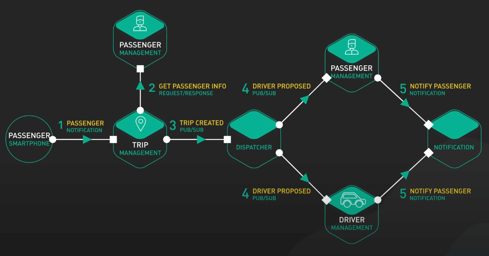{:class="centered-img"}

Message queues rất quan trọng trong việc xây dựng các hệ thống có khả năng mở rộng, liên kết lỏng lẻo và chịu lỗi tốt. Chúng đảm bảo giao tiếp tin cậy, xử lý các tác vụ bất đồng bộ và xử lý luồng dữ liệu có thông lượng cao. Việc tách biệt thành phần gửi và nhận cho phép các hệ thống có thể mở rộng một cách độc lập và xử lý các lỗi một cách linh hoạt.

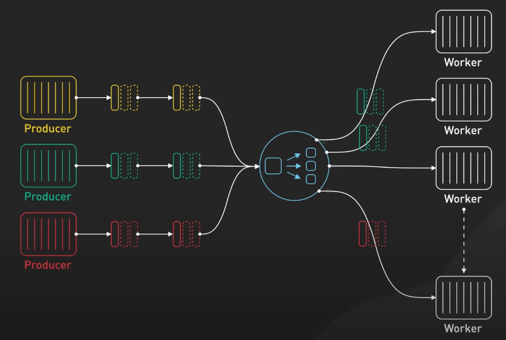{:class="centered-img"}

Hãy lấy Uber làm ví dụ. Khi một hành khách gọi xe, yêu cầu đó được đưa vào một hàng đợi. Sau đó, tài xế sẽ được ghép với các yêu cầu này. Thiết lập này tách biệt yêu cầu của hành khách khỏi sự sẵn sàng của tài xế, cho phép xử lý hiệu quả nhiều yêu cầu trong thời gian thực.

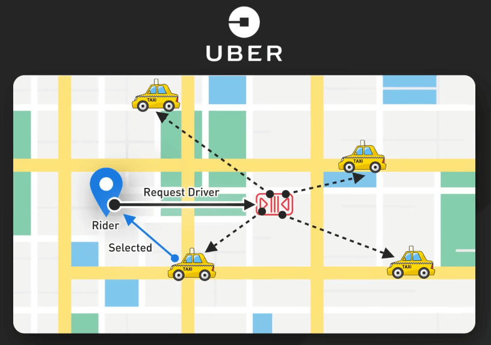{:class="centered-img"}

## Các message queue phổ biến

### IBM MQ

IBM MQ, ra mắt vào năm 1993, đã tiên phong trong lĩnh vực messaging ở quy mô doanh nghiệp. Nó cung cấp giao tiếp tin cậy, bảo mật và hỗ trợ transaction cho các ứng dụng quan trọng trong tài chính và y tế. Các ngân hàng lớn sử dụng IBM MQ để xử lý các giao dịch tài chính một cách đáng tin cậy, ngay cả khi có sự cố phần cứng. 

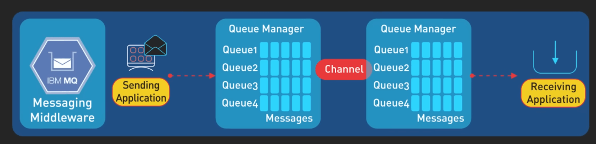{:class="centered-img"}

IBM MQ hỗ trợ tin nhắn lưu trữ và không lưu trữ, đảm bảo rằng các tin nhắn quan trọng không bị mất trong các sự cố hệ thống. Nó cung cấp hỗ trợ giao dịch mạnh mẽ cho phép nhiều tin nhắn được gộp lại thành một đơn vị công việc, có thể được commit hoặc rollback. IBM MQ chạy trên nhiều nền tảng, giúp nó trở nên linh hoạt cho các môi trường doanh nghiệp khác nhau.

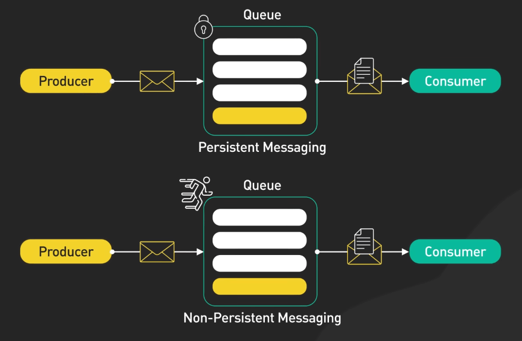{:class="centered-img"}

### RabbitMQ

RabbitMQ, được phát hành vào năm 2007, giới thiệu một mô hình nhắn tin linh hoạt và năng động. Nó hỗ trợ nhiều giao thức, bao gồm AMQP, MQTT và STOMP, và cung cấp các tính năng như định tuyến tin nhắn, hàng đợi và nhắn tin pub-sub. 

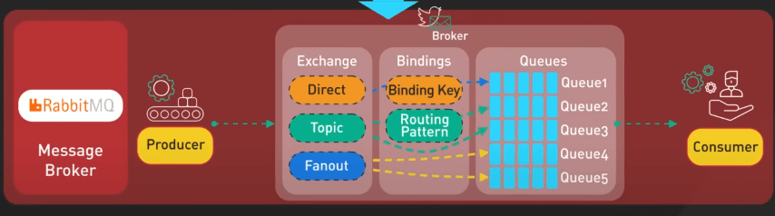{:class="centered-img"}

Các nền tảng thương mại điện tử thường sử dụng RabbitMQ cho các tác vụ như xử lý đơn hàng và cập nhật kho hàng, cải thiện khả năng phản hồi và mở rộng của hệ thống. Hệ thống plugin của RabbitMQ cho phép người dùng mở rộng chức năng. Nó hỗ trợ cụm để phân phối tải và cấu hình khả dụng cao. RabbitMQ cung cấp quyền kiểm soát chi tiết đối với xác nhận tin nhắn, đảm bảo xử lý tin nhắn một cách đáng tin cậy.

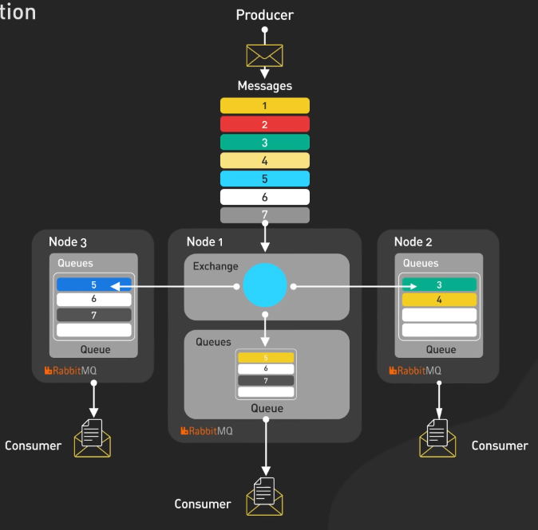{:class="centered-img"}

### Apache Kafka

Apache Kafka, ra mắt vào năm 2011, đã cách mạng hóa message queue. Được thiết kế cho luồng dữ liệu có thông lượng cao, thời gian thực, Kafka cung cấp một nền tảng có khả năng mở rộng và chịu lỗi để xử lý khối lượng dữ liệu lớn. Kiến trúc độc đáo của nó, dựa trên một commit log phân tán, cho phép event sourcing, xử lý luồng và phân tích thời gian thực. LinkedIn sử dụng Kafka để xử lý hàng tỷ sự kiện mỗi ngày, cho phép thông báo và phân tích dữ liệu thời gian thực. Kiến trúc log phân vùng của Kafka cho phép mở rộng ngang trên nhiều broker. Nó đảm bảo độ bền của dữ liệu và khả dụng cao thông qua cấu hình replication. Kafka hỗ trợ consumer group để đọc phối hợp từ cùng một chủ đề bởi nhiều consumer. Nó cung cấp tùy chọn deliver đúng một lần để ngăn ngừa mất hoặc trùng lặp tin nhắn.

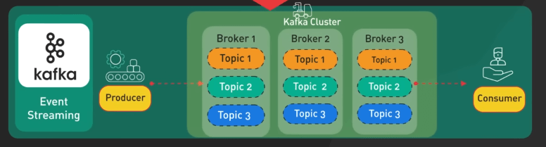{:class="centered-img"}

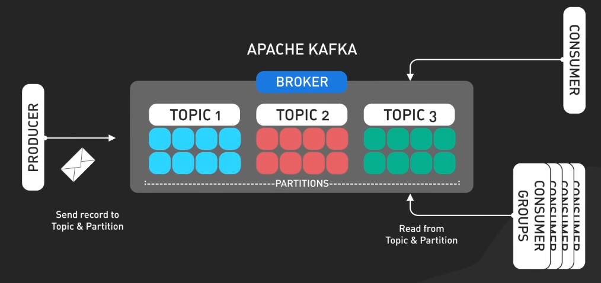{:class="centered-img"}

### Apache Pulsar

Gần đây, Apache Pulsar, được phát triển bởi Yahoo, đã đưa kiến trúc message queue tiến xa hơn. 

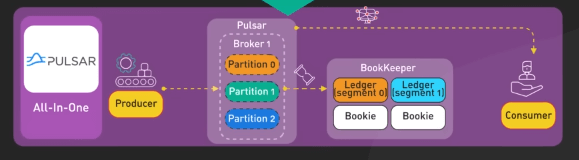{:class="centered-img"}

Pulsar kết hợp khả năng mở rộng và hiệu suất của Kafka với tính linh hoạt và các tính năng phong phú của các message queue truyền thống. Kiến trúc cloud native của nó hỗ trợ đa khách hàng và lưu trữ theo tầng hoạt động tốt trong các môi trường điện toán phân tán hiện đại.

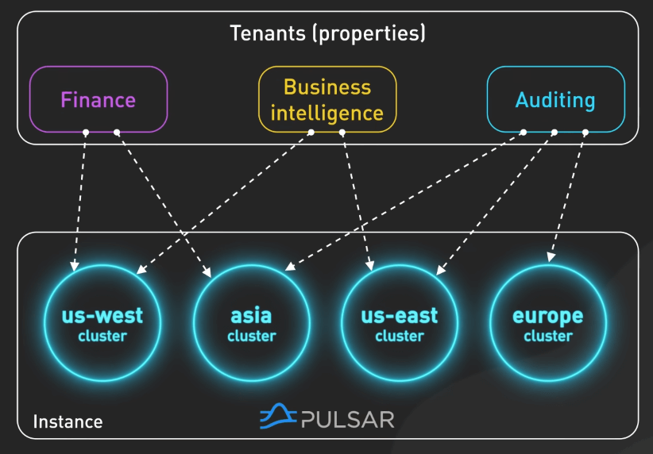{:class="centered-img"}

Pulsar được thiết kế cho đa khách hàng, cho phép nhiều khách hàng chia sẻ cùng một cụm trong khi vẫn duy trì sự cách ly và bảo mật. Nó hỗ trợ sao chép địa lý, cho phép sao chép dữ liệu giữa nhiều trung tâm dữ liệu để khôi phục và định vị dữ liệu. Ý tưởng lưu trữ theo tầng của Pulsar cho phép dữ liệu cũ được chuyển sang các giải pháp lưu trữ rẻ hơn như Amazon S3, giảm chi phí trong khi vẫn duy trì quyền truy cập vào dữ liệu lịch sử. 

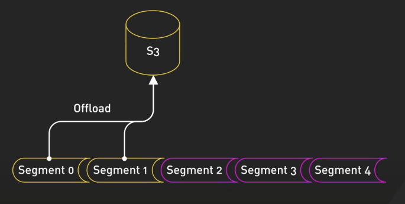{:class="centered-img"}

Pulsar Functions cung cấp khả năng tính toán nhẹ để xử lý luồng, và các Pulsar IO connectors giúp tích hợp dễ dàng với các hệ thống bên ngoài.

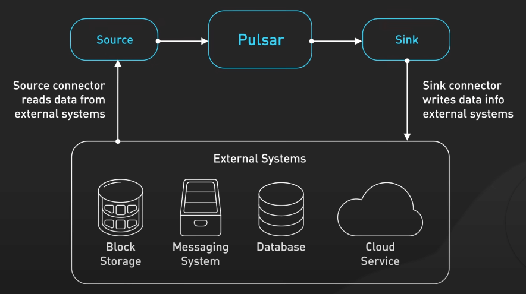{:class="centered-img"}
