# 5 use case phổ biến của Apache Kafka

## Nguồn

 [System Design: Why is Kafka so Popular?](https://www.youtube.com/watch?v=yIAcHMJzqJc)

 [Top Kafka Use Cases You Should Know](https://www.youtube.com/watch?v=Ajz6dBp_EB4)

## Giới thiệu

Kafka ban đầu là một công cụ xử lý log của LinkedIn. Từ đó, nó tiến hóa để trở thành một nền tảng xử lý dòng sự kiện trong hệ thống phân tán.

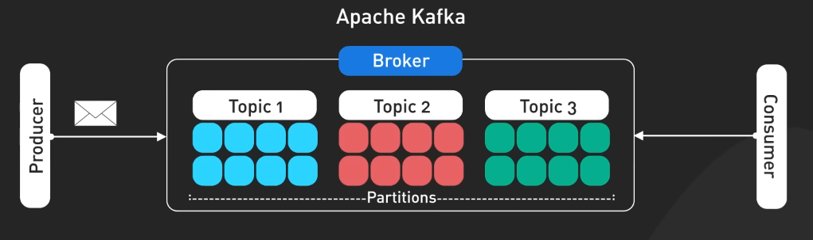{:class="centered-img"}

Thiết kế của Kafka tận dụng các append-only log với cấu trúc dữ liệu cố định và các cơ chế lưu trữ có thể cấu hình được. Những điều này khiến cho Kafka trở thành một lựa chọn tuyệt với cho nhiều ứng dụng vượt qua cả thiết kế ban đầu.

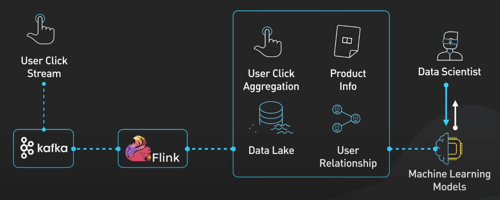{:class="centered-img"}

## Xử lý và phân tích log

Phân tích log giờ đây không còn chỉ là về xử lý log nữa, mà đã trở thành việc tập trung và phân tích log từ hệ thống phân tán phức tạp trong thời gian thực. Kafka tỏa sáng vì nó có thể tiêu thụ log từ nhiều nguồn khác nhau một cách đồng thời, ví dụ như các ứng dụng, microservice, cloud service, và hệ thống cơ sở dữ liệu. Nó có khả năng xử lý lượng lớn log mà vẫn giữ độ trễ ở mức thấp.

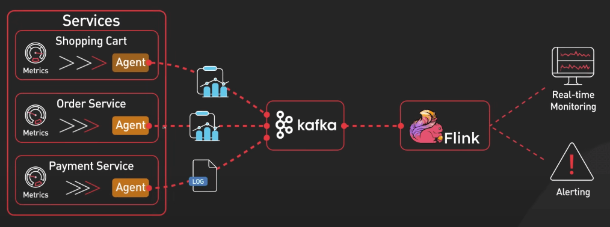{:class="centered-img"}

Điều giúp việc phân tích log ngày nay trở nên mạnh mẽ là nhờ việc Kafka tích hợp thêm các công cụ như ElasticSearch, Logstash, và Kibana. Bộ ba này được gọi là ELK stack. Logstash sẽ kéo log từ Kafka về, xử lý chúng và gửi cho ElasticSearch. Kibana sẽ cho phép dev team trực quan hóa và phân tích các log này theo thời gian thực.

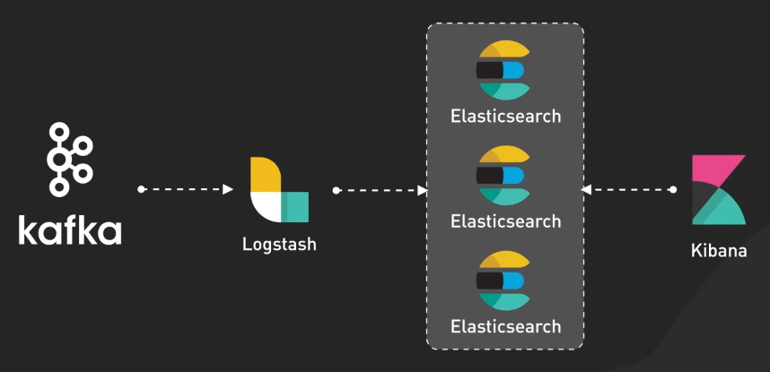{:class="centered-img"}

## Pipeline cho Machine Learning theo thời gian thực

Các hệ thống Machine Learning hiện đại cần xử lý rất nhiều dữ liệu một cách nhanh chóng và liên tục. Khả năng xử lý dữ liệu streaming của Kafka giúp nó trở thành một công cụ lý tưởng cho việc xây dựng pipeline cho Machine Learning theo thời gian thực. Kafka đóng vai trò then chốt trong pipeline này, nó tiêu thụ dữ liệu từ nhiều nguồn như tương tác người dùng, các thiết bị IoT hay các giao dịch tài chính. Dữ liệu này sau đó được chuyển đến các model Machine Learning trong thời gian thực.

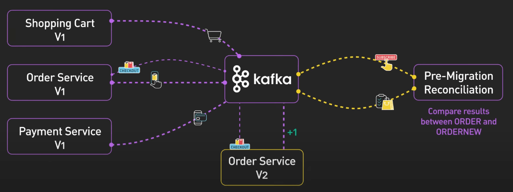{:class="centered-img"}

Ví dụ, trong một hệ thống phát hiện gian lận tài chính, Kafka sẽ stream dữ liệu giao dịch đến các model. Các model này sẽ giúp phát hiện các hoạt động đáng ngờ ngay lập tức. Trong bảo trì dự đoán (predictive maintenance), Kafka sẽ stream dữ liệu từ các thiết bị IoT đến các model Machine Learning. Các model này sẽ dự đoán khi nào thiết bị cần bảo trì, giúp giảm thiểu thời gian chết và chi phí bảo trì.

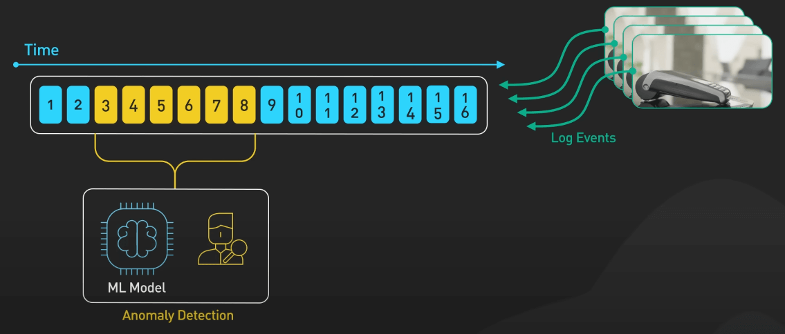{:class="centered-img"}

Kafka có tích hợp được với các framework xử lý stream như Apache Flink hay Spark Streaming. Các công cụ này có thể đọc dữ liệu từ Kafka, sau đó thực hiện các tính toán phức tạp và cuối cùng gửi kết quả về lại Kafka hoặc sang một hệ thống khác.

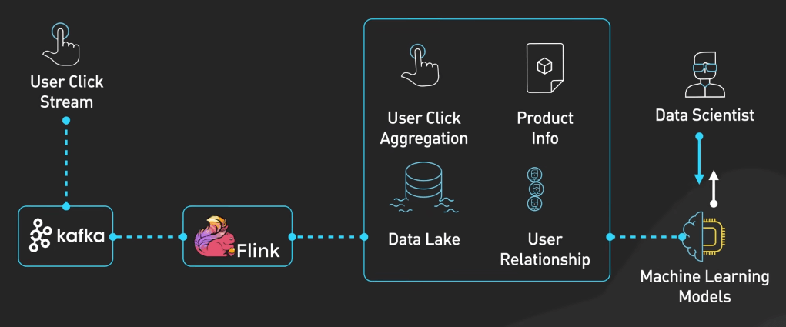{:class="centered-img"}

Ta cũng cần nhắc đến Kafka Stream, một thư viện xử lý stream được xây dựng trên Kafka. Kafka Stream giúp xây dựng các ứng dụng xử lý stream một cách dễ dàng và hiệu quả.

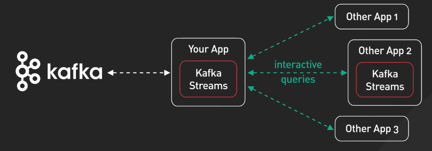{:class="centered-img"}

## Giám sát và cảnh báo hệ thống

Với sự phức tạp ngày càng tăng của các hệ thống, việc phát hiện và giải quyết vấn đề một cách chủ động là điều rất cần thiết. Kafka tiếp nhận các metric và sự kiện từ nhiều service khác nhau. Cái khác biệt ở đây là việc xử lý các metric này theo thời gian thực. Từ Kafka, các công cụ xử lý stream như Flink có thể phân tích dữ liệu liên tục, như tính toán các giá trị tổng hợp, phát hiện bất thường, hay kích hoạt cảnh báo, tất cả trong thời gian thực.

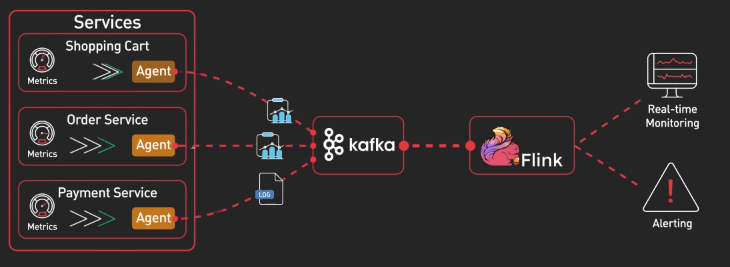{:class="centered-img"}

Kafka PubSub rất phù hợp ở đây, vì nó cho phép nhiều consumer xử lý cùng một stream metric mà không ảnh hưởng đến nhau. Các consumer có thể bao gồm: 1 cái để cập nhật dashboard, 1 cái quản lý cảnh báo, và một cái có thể gửi dữ liệu cho một cái model Machine Learning.

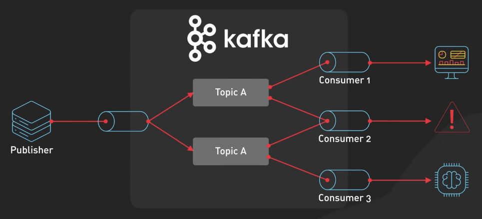{:class="centered-img"}

Ngoài ra, ta có thể debug với Kafka vì ta có thể tái tạo lại các sự kiện đã xảy ra, nghĩa là tạo lại y hệt stream metric mà ta muốn debug.

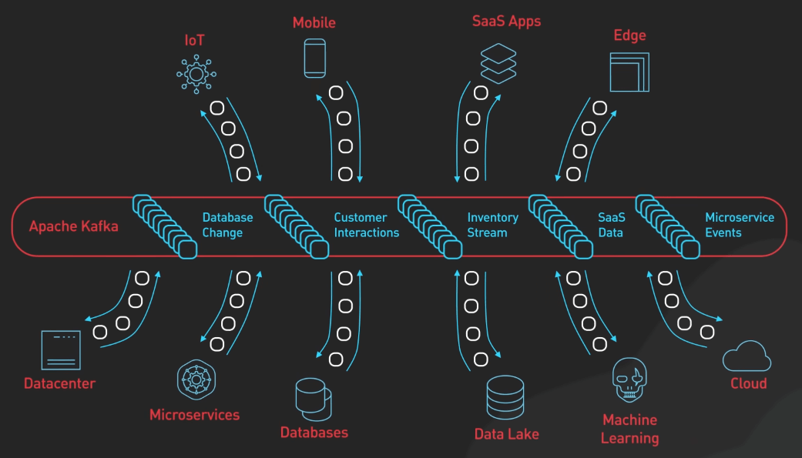{:class="centered-img"}

## Change Data Capture (CDC)

CDC là phương pháp được dùng để theo dõi và ghi lại các thay đổi trong cơ sở dữ liệu, cho phép sao chép các thay đổi này đến các hệ thống khác trong thời gian thực. Trong kiến trúc này, Kafka đóng vai trò trung tâm giúp chuyển thay đổi trong cơ sở dữ liệu nguồn đến các hệ thống khác một cách đồng bộ và nhất quán.

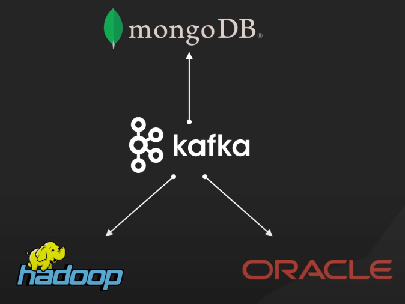{:class="centered-img"}

Quá trình bắt đầu với cơ sở dữ liệu nguồn, đây là các cơ sở dữ liệu chính nơi các thay đổi xảy ra. Các database này sẽ tạo ra các transaction log, lưu giữ toàn bộ các thay đổi dữ liệu, như chèn, cập nhật hay xóa theo thứ tự thời gian. Các log này sẽ được đưa vào Kafka.

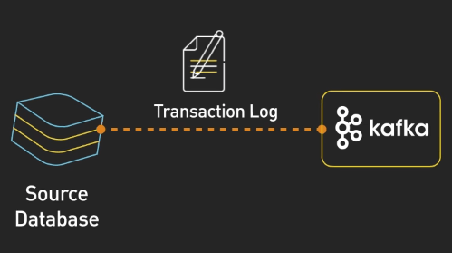{:class="centered-img"}

Kafka lưu các sự kiện thay đổi này theo các topic, cho phép nhiều consumer đọc dữ liệu từ các topic này.

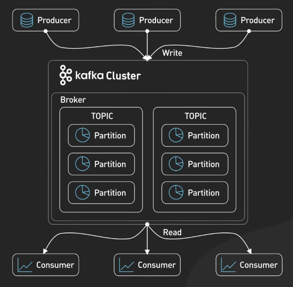{:class="centered-img"}

Để di chuyển dữ liệu từ Kafka đến các hệ thống khác, ta cần sử dụng Kafka Connect. Framework này cho phép ta build và chạy nhiều connector. Ví dụ, ta có thể có ElasticSearch Connector để chuyển dữ liệu từ Kafka đến ElasticSearch, hoặc Redis Connector để chuyển dữ liệu từ Kafka đến Redis.

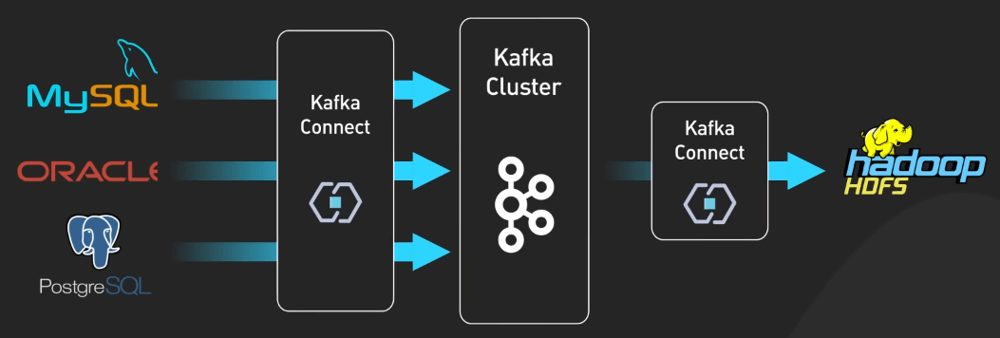{:class="centered-img"}

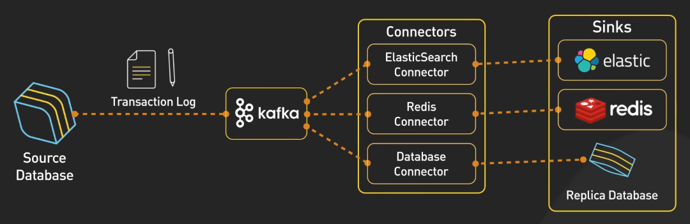{:class="centered-img"}

## Di chuyển hệ thống

Kafka có thể đóng vai trò như một buffer giữa hệ thống cũ và mới, cho phép dữ liệu chuyển đổi một cách mượt mà và an toàn.

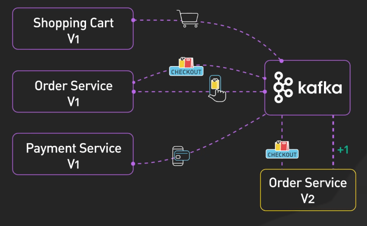{:class="centered-img"}

Kafka cho phép dev triển khai nhiều cách di chuyển hệ thống phức tạp.

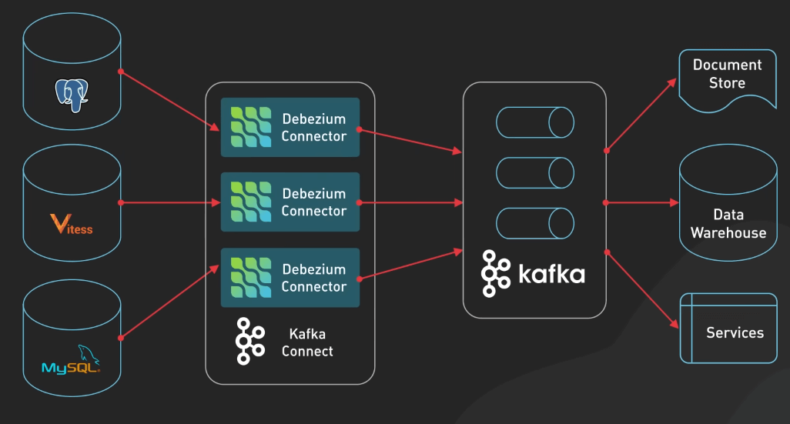{:class="centered-img"}

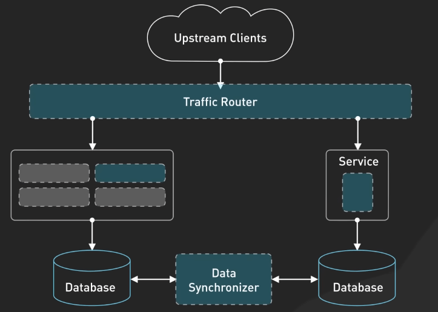{:class="centered-img"}

Kafka có thể gửi lại các message tại bất cứ thời điểm cụ thể nào, giúp dev team kiểm tra tính nhất quán giữa hệ thống cũ và mới. Ta thậm chí có thể sử dụng cả hai phiên bản hệ thống cùng một lúc, cho phép so sánh kết quả giữa chúng và rollback nếu cần.

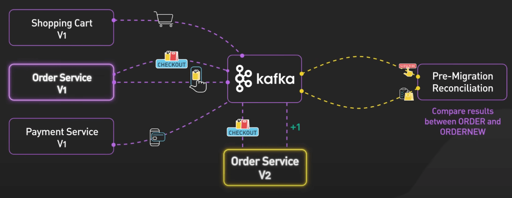{:class="centered-img"}

