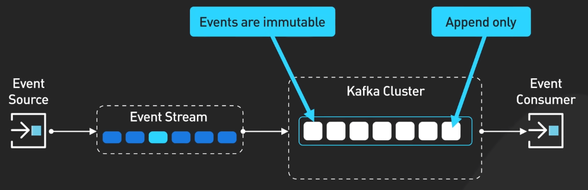
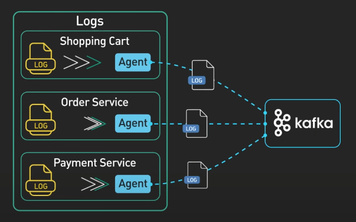
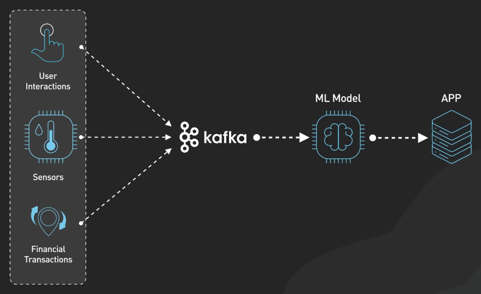

# 5 use case phổ biến của Apache Kafka

## Nguồn

 [System Design: Why is Kafka so Popular?](https://www.youtube.com/watch?v=yIAcHMJzqJc)

## Xử lý và phân tích log

Khả năng của Kafka trong việc xử lý lượng log lớn biến nó trở thành lựa chọn lý tưởng cho use case này. Hãy tưởng tượng bạn có một kiến trúc microservice phức tạp, trong đó nhiều service khác nhau như Shopping Cart, Order Service, và Payment Service tạo ra một lượng log lớn. Kafka hoạt động như một hệ thống tổng hợp log trung tâm, tiếp nhận và lưu trữ các log này ở quy mô lớn. Nó cung cấp một lớp lưu trữ bền vững ngắn hạn cho log, giữ log trong một khoảng thời gian lưu trữ có thể cấu hình được, thường là trong vài ngày. Điều này cho phép các công ty tập trung hệ thống log của mình. Kafka tích hợp một cách mạnh mẽ với ELK stack, cung cấp khả năng phân tích và trực quan hóa log một cách tối ưu.

{:class="centered-img"}

## Streaming dữ liệu cho hệ thống gợi ý

Tưởng tượng một thế giới nơi mà các gợi ý (như gợi ý mua sắm, gợi ý video mới) như là chỉ dành cho bạn. Kafka hiện thực hóa điều này bằng cách cung cấp các pipeline streaming dữ liệu thời gian thực cho các hệ thống gợi ý. Nó xử lý dữ liệu click của người dùng và tổng hợp dữ liệu trong Data Lake để phân tích sâu. Flink, một framework xử lý streaming mạnh mẽ, có thể được sử dụng với Kafka để thực hiện phân tích thời gian thực và machine learning trên dữ liệu streaming. Điều này cho phép cải thiện liên tục độ chính xác của gợi ý dựa trên hành vi mới nhất của người dùng. Với khả năng streaming thời gian thực của Kafka, người dùng nhận được gợi ý được cá nhân hóa theo thời gian thực nhằm tăng trải nghiệm của họ.

{:class="centered-img"}

## Giám sát và cảnh báo hệ thống

Với sự phức tạp ngày càng tăng của các hệ thống, việc phát hiện và giải quyết vấn đề một cách chủ động là điều rất cần thiết. Kafka tiếp nhận các metrics và sự kiện từ nhiều service khác nhau, giúp phát hiện sớm các sự cố hoặc sự kiện quan trọng. Các công ty có thể sử dụng các công cụ xử lý streaming như Flink để định nghĩa quy tắc cảnh báo và ngưỡng dựa trên dữ liệu thời gian thực. Khi phát hiện vấn đề, cảnh báo sẽ được kích hoạt và gửi đến các team liên quan, giúp hành động kịp thời và giải quyết nhanh chóng. Khả năng xử lý dữ liệu streaming với tốc độ cao của Kafka tạo nên một nền tảng tuyệt vời để xây dựng hệ thống giám sát và cảnh báo thời gian thực.

{:class="centered-img"}

## Change Data Capture (CDC)

Hãy tưởng tượng khi phải đồng bộ dữ liệu giữa nhiều database và ứng dụng khác nhau. Kafka giúp giải quyết vấn đề này bằng cách capture các thay đổi được thực hiện trên database nguồn, như transaction logs, theo thời gian thực. Với sự trợ giúp của Connectors như ElasticSearch Connector và Redis Connector, Kafka truyền dữ liệu này đến hệ thống đích một cách đáng tin cậy. CDC đảm bảo tính nhất quán và đồng bộ hóa dữ liệu, giảm thiểu sự không nhất quán và cho phép tích hợp dữ liệu thời gian thực. Sự linh hoạt của Kafka hỗ trợ nhiều database khác nhau, làm cho nó trở thành công cụ tuyệt vời để triển khai CDC.

{:class="centered-img"}

## Di chuyển hệ thống

Khi nâng cấp hoặc di chuyển hệ thống, Kafka hoạt động như một cầu nối dữ liệu giữa phiên bản cũ và mới của service. Kafka giúp đảm bảo tính nhất quán và khả dụng của dữ liệu giữa hai phiên bản trong suốt quá trình chuyển đổi, nhằm tránh mất dữ liệu hoặc gián đoạn hệ thống. Khả năng tách biệt hệ thống của Kafka cho phép tiếp cận dữ liệu từ cả hai phiên bản, giúp dễ dàng so sánh và kiểm tra tính nhất quán. Việc so sánh kết quả từ phiên bản cũ và mới giúp đảm bảo tính chính xác của dữ liệu. Kafka cung cấp một cách tiếp cận phân mảnh cho việc di chuyển hệ thống, giảm thiểu rủi ro và giảm thiểu thời gian chết trong quá trình chuyển đổi.

{:class="centered-img"}
