# 8 cấu trúc dữ liệu quan trọng trong các hệ thống cơ sở dữ liệu hiện đại

## Nguồn

 [8 Key Data Structures That Power Modern Databases](https://www.youtube.com/watch?v=W_v05d_2RTo)

## Skip List

Skip List là một cấu trúc dữ liệu xác suất được sử dụng để cài đặt một map hoặc set được sắp xếp. 

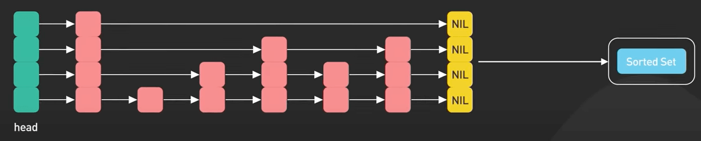{:class="centered-img"}

Nó là lựa chọn thay thế cho cây cân bằng. Skip list cho phép tìm kiếm, chèn và xóa một cách hiệu quả.

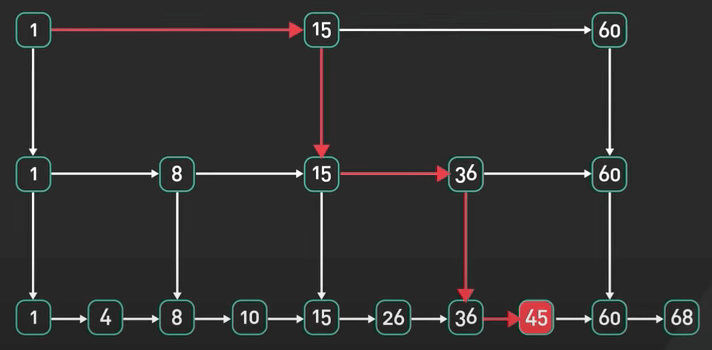{:class="centered-img"}

Trong các database in-memory như Redis, Skip List được sử dụng để triển khai các cấu trúc dữ liệu được sắp xếp như Sorted Sets và Sorted Lists. Nó cho phép tìm kiếm nhanh, truy vấn đoạn và các truy vấn khác nữa.

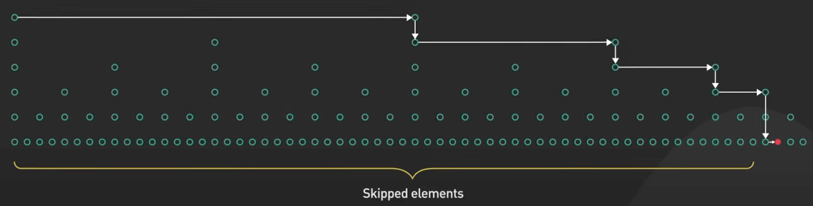{:class="centered-img"}

## Hash Index

Hash index, hay còn được biết đến là hash table (hay bảng băm) được dùng để ánh xạ các key tới các value một cách hiệu quả bằng cách sử dụng hàm hash để tạo ra giá trị hash cho mỗi key. Giá trị hash được sử dụng để nhanh chóng tìm thấy value trong bảng, cho phép tìm kiếm, chèn và xóa nhanh chóng. 

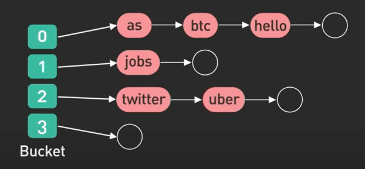{:class="centered-img"}

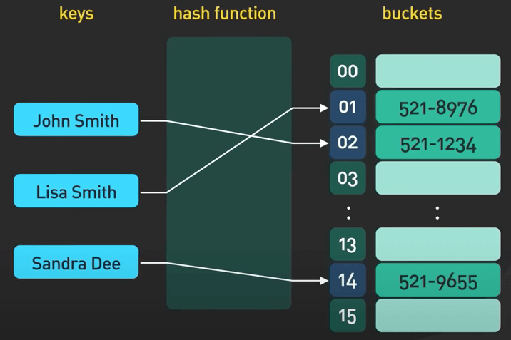{:class="centered-img"}

Hash index là một cấu trúc dữ liệu phổ biến. Nó được sử dụng để triển khai các cấu trúc dữ liệu dạng hash table như Hashes trong Redis, nhưng cũng được sử dụng rộng rãi trong tất cả các loại database.

## SSTable và LSM Tree

SSTable và cây LSM đi đôi với nhau. SSTable (Sorted Strings Table hay bảng lưu các xâu đã sắp xếp) được dùng để lưu dữ liệu trên đĩa theo thứ tự sắp xếp. Nó là một cấu trúc dữ liệu dựa trên file được dùng để lưu trữ lượng lớn dữ liệu một cách hiệu quả và gọn nhẹ nhất. 

SSTable là một thành phần cốt lõi của cây LSM. Thành phần còn lại là MemTable. Memtable là một cấu trúc dữ liệu in-memory lưu trữ các lần ghi gần đây. SSTable và Memtable làm việc cùng nhau để xử lý lượng lớn các thao tác ghi. Về cây LSM thì trên trang cũng đã có một bài riêng rồi, bạn hãy tìm đọc trên thanh tìm kiếm nhé. Cây LSM là thành phần quan trọng của các database NoSQL phổ biến như Apache Cassandra, RocksDB và LevelDB.

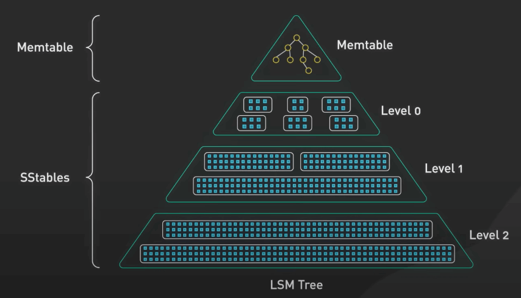{:class="centered-img"}

## B-Tree

Tiếp theo là họ cây B-tree. Cây B+tree cũng nằm trong lớp này. Họ cây B-tree được dùng để lưu trữ và truy xuất lượng lớn dữ liệu trên đĩa một cách hiệu quả. Cây B-tree là một cây cân bằng, mỗi node có thể có nhiều con và lưu dữ liệu được sắp xếp. 

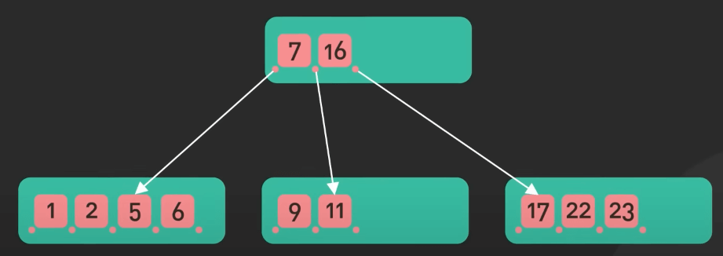{:class="centered-img"}

Cây B+tree là một loại của cây B-tree, trong đó tất cả dữ liệu được lưu trữ trong các node lá và các node còn lại chỉ lưu key.

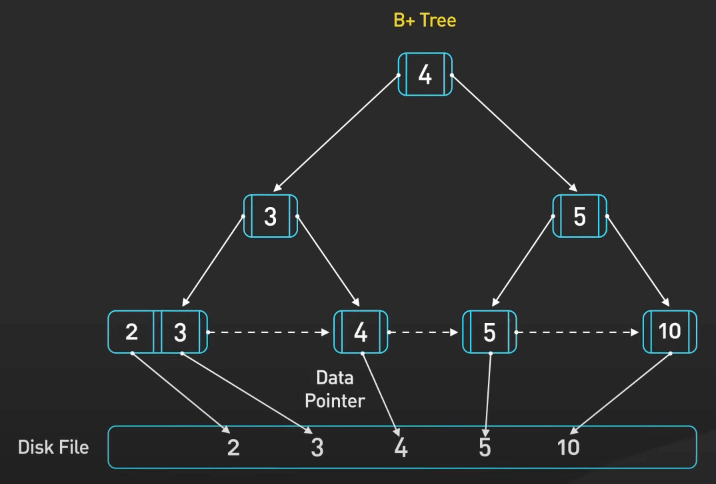{:class="centered-img"}

Họ cây B-tree được sử dụng rộng rãi trong các database như MySQL, Postgres và Oracle để xử lý lượng lớn dữ liệu trên đĩa.

## Inverted Index

Inverted Index được dùng để tìm kiếm và truy xuất dữ liệu từ một tập hợp lớn các tài liệu văn bản. Nó tạo ra một ánh xạ từ các từ tới các tài liệu chứa chúng. Index này được "inverted" (đảo) vì nó ánh xạ từ các từ tới các tài liệu, chứ không phải ngược lại. Inverted index được sử dụng rộng rãi trong các search engine như ElasticSearch.

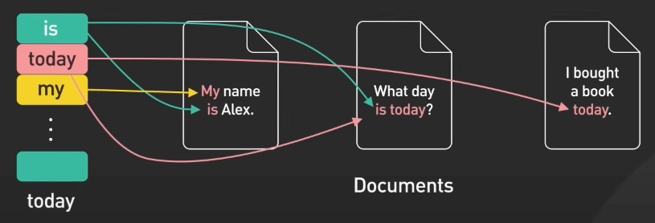{:class="centered-img"}

## Suffix Tree

Suffix tree (cây hậu tố) được dùng trong các database để tăng tốc tìm kiếm văn bản. Nó có thể tìm tất cả những chỗ xuất hiện của từ cần tìm trong một tập lớn các tài liệu một cách nhanh chóng.

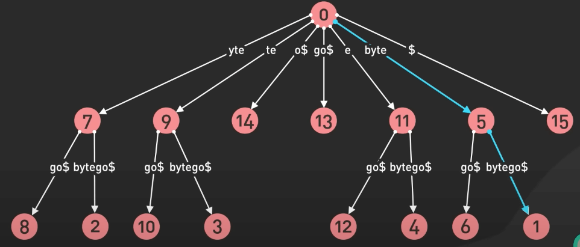{:class="centered-img"}

## R-Tree

R-Tree là một cấu trúc dữ liệu chỉ số không gian được dùng để lưu trữ và truy xuất dữ liệu không gian như các hình chữ nhật hoặc đa giác. Nó được dùng để tìm kiếm dữ liệu không gian một cách hiệu quả. R-Tree được sử dụng rộng rãi trong các database không gian như PostGIS, MongoDB và Elasticsearch.

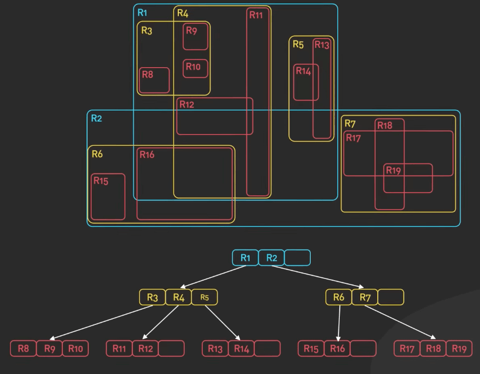{:class="centered-img"}
