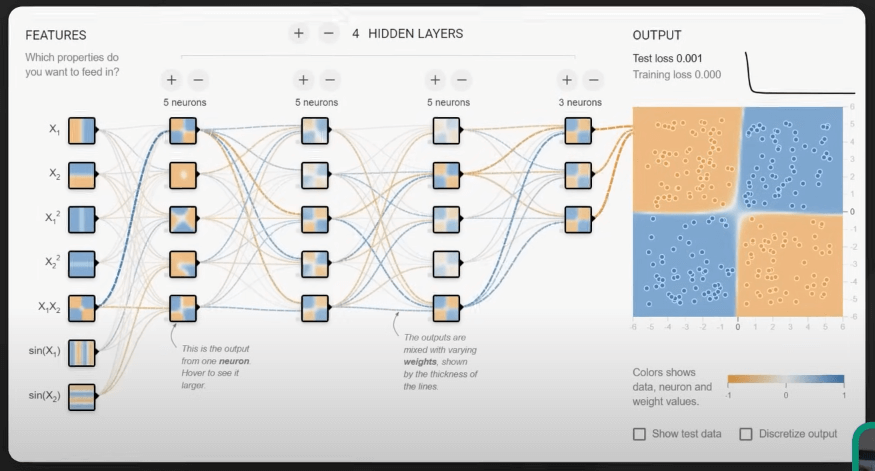

# 10 cấu trúc dữ liệu mà chúng ta dùng mỗi ngày

## Nguồn

 [10 Key Data Structures We Use Every Day](https://www.youtube.com/watch?v=ouipSd_5ivQ)

## Danh sách (List)

Danh sách (List) là một cấu trúc dữ liệu linh hoạt và quan trọng trong phát triển phần mềm. Danh sách được dùng để lưu trữ và thao tác với dữ liệu có thứ tự. Nó được sử dụng trong nhiều ứng dụng khác nhau như quản lý tác vụ, feed trên mạng xã hội, quản lý sở thích người dùng hay giỏ hàng mua sắm.

{:class="centered-img"}

Trong ứng dụng quản lý tác vụ, một danh sách có thể được dùng để lưu và tổ chức các tác vụ cho mỗi người dùng. Các tác vụ có thể được thêm, bớt hoặc sắp xếp lại một cách dễ dàng, và người dùng cũng có thể đánh dấu chúng đã hoàn thành hay chưa.

Danh sách cũng rất hữu ích trong các ứng dụng mạng xã hội như Twitter, nơi chúng có thể lưu trữ và hiển thị feed của người dùng theo thời gian thực, đảm bảo rằng các nội dung mới nhất được hiển thị theo thứ tự chính xác.

## Mảng (Array)

Mảng (Array) là một cấu trúc dữ liệu cơ bản khác. Nó cung cấp một tập các phần tử có kích thước cố định và theo thứ tự. Nó đặc biệt phù hợp cho những tình huống mà kích thước tập đã được biết hoặc không thay đổi thường xuyên. Mảng thường được sử dụng trong các phép toán toán học, lưu trữ tập dữ liệu lớn hoặc khi cần truy cập ngẫu nhiên vào các phần tử.

{:class="centered-img"}

Ví dụ, trong một ứng dụng thời tiết, một mảng có thể được sử dụng để lưu các chỉ số nhiệt độ của một địa điểm cụ thể trong một khoảng thời gian xác định, cho phép dễ dàng tính toán các giá trị trung bình và xu hướng thời tiết. Mảng cũng được sử dụng nhiều trong xử lý ảnh, nơi dữ liệu màu của từng pixel có thể được biểu diễn trong một mảng hai chiều, giúp ta dễ dàng thao tác và biến đổi hình ảnh.

{:class="centered-img"}

## Ngăn xếp (Stack)

Ngăn xếp (Stack) tuân theo nguyên tắc Last-In-First-Out (LIFO). 

{:class="centered-img"}

Ngăn xếp rất phù hợp cho việc hỗ trợ các thao tác undo/redo trong các trình soạn thảo văn bản hoặc quản lý lịch sử duyệt web. Trong một trình soạn thảo văn bản, ngăn xếp có thể được sử dụng để lưu mỗi thay đổi mà người dùng thực hiện với văn bản, giúp quay trở lại trạng thái trước đó một cách dễ dàng với thao tác undo.

{:class="centered-img"}

## Hàng đợi (Queue)

Hàng đợi (Queue) hoạt động theo nguyên tắc First-In-First-Out (FIFO). 

{:class="centered-img"}

Nó được dùng trong quản lý in ấn, gửi các hành động của người chơi trong game, hay xử lý các tin nhắn trong ứng dụng chat. Trong ứng dụng chat, hàng đợi có thể được dùng để lưu các tin nhắn đến theo trình tự được nhận, dảm bảo rằng chúng được hiển thị cho người nhận theo đúng thứ tự.

{:class="centered-img"}

## Heap

Heap được sử dụng cho việc lập lịch tác vụ và quản lý bộ nhớ. Nó đặc biệt hữu ích trong việc triển khai hàng đợi ưu tiên, nơi chúng ta cần truy cập một cách hiệu quả vào phần tử có mức độ ưu tiên cao nhất hoặc thấp nhất.

{:class="centered-img"}

{:class="centered-img"}

## Cây (Tree)

Cây (Tree) tổ chức dữ liệu theo cấu trúc phân cấp. Nó được dùng để biểu diễn dữ liệu có các mối quan hệ tự nhiên hoặc phân cấp. Cây được ứng dụng trong nhiều lĩnh vực, như index trong database, việc ra quyết định của AI, và hệ thống file. 

{:class="centered-img"}

Trong việc ra quyết định của AI, các loại cây như decision tree được dùng trong machine learning để thực hiện các tác vụ phân loại. 

{:class="centered-img"}

Cây cũng được dùng trong index database, nơi nó giúp tăng tốc tìm kiếm, thêm hoặc xóa dữ liệu. Ví dụ, B-tree và B+ tree được dùng nhiều trong cơ sử dữ liệu quan hệ để quản lý và index lượng lớn dữ liệu một cách hiệu quả.

{:class="centered-img"}

## Bảng băm (Hash Table)

Bảng băm (Hash Table) cho phép tra cứu, thêm và xóa dữ liệu một cách hiệu quả. Nó sử dụng hàm băm để ánh xạ các key vào vị trí lưu trữ tương ứng. Nó cho phép truy cập dữ liệu một cách nhanh chóng với thời gian truy cập là hằng số. 

{:class="centered-img"}

Bảng băm được sử dụng rộng rãi trong nhiều ứng dụng, như các công cụ tìm kiếm, hệ thống cache, và trình thông dịch hoặc biên dịch ngôn ngữ lập trình. Trong các công cụ tìm kiếm, bảng băm có thể được dùng để lưu trữ và truy cập nhanh chóng dữ liệu đã được index dựa trên các từ khóa. Điều này giúp cung cấp kết quả tìm kiếm nhanh chóng và chính xác. 

{:class="centered-img"}

Các hệ thống cache cũng dùng bảng băm để lưu và quản lý dữ liệu cache. Điều này cho phép truy cập nhanh chóng đến các tài nguyên được yêu cầu thường xuyên và cải thiện hiệu suất hệ thống. Một ví dụ khác là việc triển khai bảng ký hiệu trong trình thông dịch hoặc biên dịch của ngôn ngữ lập trình. Bảng băm có thể được dùng để quản lý và tra cứu biến, hàm và các ký hiệu khác được định nghĩa trong code.

{:class="centered-img"}

## Cây hậu tố (Suffix Tree)

Cây hậu tố (Suffix Tree) được tối ưu hóa cho việc tìm kiếm chuỗi trong tài liệu. Điều này giúp chúng trở thành lựa chọn số 1 cho các trình soạn thảo văn bản và thuật toán tìm kiếm. Trong các công cụ tìm kiếm, cây hậu tố có thể được dùng để xác định tất cả các vị trí xuất hiện của một từ khóa tìm kiếm trong một nguồn dữ liệu văn bản lớn.

{:class="centered-img"}

## Đồ thị (Graph)

Đồ thị (Graph) là cấu trúc dữ liệu quan trọng trong việc theo dõi mối quan hệ hoặc tìm đường đi. Ứng dụng của đồ thị là trong mạng xã hội, các công cụ gợi ý và các thuật toán tìm đường đi. Trong mạng xã hội, đồ thị có thể được sử dụng để biểu thị kết nối giữa những người dùng với nhau, giúp cung cấp các tính năng như gợi ý kết bạn hay phân tích xu hướng kết nối.

{:class="centered-img"}

## R-trees

R-tree được dùng nhiều trong việc tìm kiếm các điểm gần nhất, gán với các ứng dụng bản đồ và dịch vụ định vị. Trong ứng dụng bản đồ, R-tree có thể được sử dụng để lưu trữ dữ liệu không gian như các nơi mà người dùng quan tâm, cho phép truy vấn hiệu quả để tìm các địa điểm gần nhất dựa trên vị trí hiện tại của người dùng.

{:class="centered-img"}

## Tính thân thiện của cache và sự liên quan đến các cấu trúc dữ liệu

Cache trong CPU là một bộ nhớ đệm nhỏ và nhanh, nằm giữa RAM và CPU. Nó lưu trữ các dữ liệu và lệnh đã truy cập gần đây để CPU có thể dùng một cách nhanh chóng mà không cần phải truy vấn RAM, chậm hơn cache. Các cấu trúc dữ liệu khác nhau có mức độ thân thiện với bộ nhớ cache khác nhau dựa trên cách các phần tử của chúng được lưu trong bộ nhớ.

Việc lưu trữ trong các ô nhớ liên tiếp, như trong mảng, cho phép tính cục bộ của cách tốt hơn và ít cache miss hơn, qua đó cải thiện hiệu suất. Khi một phần tử của mảng được truy cập, cache có thể tải trước và lưu trữ các phần tử lân cận, dự đoán rằng chúng có thể được truy cập sau này. 

{:class="centered-img"}

Ngược lại, các cấu trúc dữ liệu có lưu trữ không liên tục, như danh sách liên kết, có thể gặp nhiều cache miss và hiệu suất giảm. Trong danh sách liên kết, các phần tử được lưu trong các node phân tán khắp bộ nhớ, và mỗi node chứa một con trỏ đến node tiếp theo trong chuỗi. Điều này làm cho CPU khó dự đoán và tải trước node tiếp theo khi cần.

{:class="centered-img"}

Các cấu trúc dữ liệu khác, như cây, bảng băm và đồ thị, cũng có mức độ thân thiện với cache khác nhau dựa trên cách triển khai và cách sử dụng. Sự chênh lệch về thời gian truy cập này có thể dẫn đến vấn đề hiệu suất trong máy tính hiện đại, đặc biệt trong các tình huống mà cache miss xảy ra thường xuyên. Chúng ta cần chú ý đến điều này khi làm việc với các ứng dụng yêu cầu hiệu suất cao và chọn cấu trúc dữ liệu phù hợp dựa trên yêu cầu và ràng buộc cụ thể của dự án.
