# Các từ viết tắt phổ biến trong thiết kế hệ thống

## Nguồn

 [KISS, SOLID, CAP, BASE: Important Terms You Might Not Know!](https://www.youtube.com/watch?v=cTyZ_hbmbDw)

## CAP

Định lý CAP cho biết trong bất kỳ hệ thống lưu trữ dữ liệu phân tán nào, chúng ta chỉ có thể đảm bảo hai trong ba thuộc tính: tính nhất quán (consistency), tính khả dụng (availability), và khả năng chịu lỗi phân vùng (partition tolerance). 

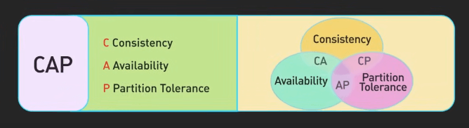{:class="centered-img"}

Tính nhất quán nghĩa là mọi yêu cầu đọc đều nhận được bản ghi mới nhất hoặc trả về lỗi. Tính khả dụng đảm bảo mọi yêu cầu đều nhận được phản hồi, ngay cả khi không phải dữ liệu mới nhất. Khả năng chịu lỗi phân vùng nghĩa là hệ thống vẫn hoạt động ngay cả khi có lỗi mạng.

Ví dụ, hãy tưởng tượng một cơ sở dữ liệu phân tán nơi một số máy chủ không thể giao tiếp với nhau do vấn đề mạng, tình huống được gọi là "lỗi phân vùng mạng." Nếu chúng ta ưu tiên tính nhất quán, một số người dùng có thể nhận được lỗi khi truy cập cơ sở dữ liệu vì không phải tất cả các máy chủ đều có dữ liệu mới nhất. Nhưng nếu chúng ta chọn tính khả dụng, mọi yêu cầu đều nhận được phản hồi, ngay cả khi nó có thể không phản ánh các cập nhật mới nhất.

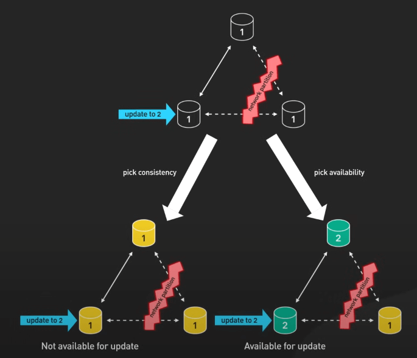{:class="centered-img"}

## PACELC

PACELC mở rộng định lý CAP bằng cách thêm yếu tố độ trễ. Khi có phân vùng mạng (P), bạn phải chọn giữa tính khả dụng (A) và tính nhất quán (C), giống như CAP. Khi không có phân vùng mạng ("Else"), bạn phải chọn giữa độ trễ thấp (L) và tính nhất quán (C). Ví dụ, với một cơ sở dữ liệu NoSQL phân tán như Amazon DynamoDB, PACELC yêu cầu chúng ta quyết định ưu tiên độ trễ thấp hay tính nhất quán mạnh mẽ.

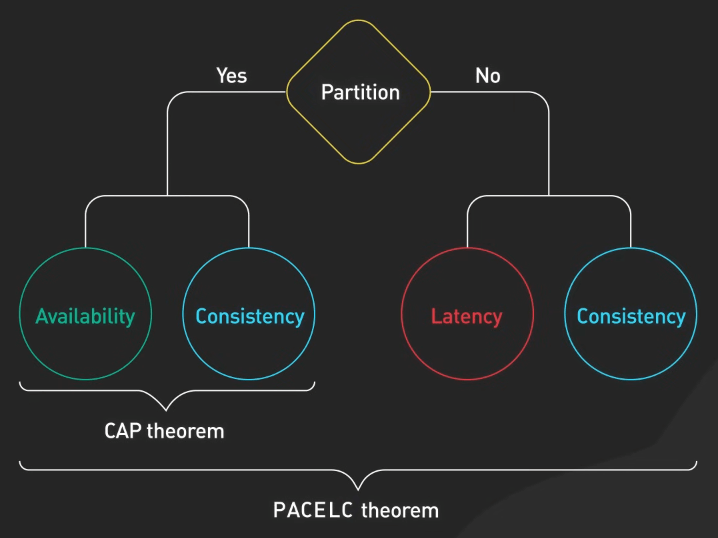{:class="centered-img"}

## BASE

Có thể bạn đã nghe thấy nguyên tắc ACID cho cơ sở dữ liệu quan hệ, nơi dữ liệu cần phải là Atomic, Consistent, Isolated, và Durable. Tuy nhiên, với cơ sở dữ liệu NoSQL, tính nhất quán chặt chẽ không phải lúc nào cũng có, đặc biệt trong các ứng dụng yêu cầu hiệu suất cao. Đó là lúc BASE xuất hiện. BASE viết tắt của Basically Available, Soft State, và Eventual Consistency. 

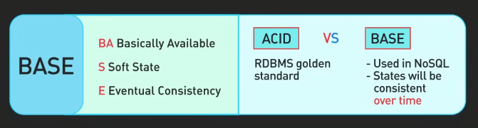{:class="centered-img"}

Basically Available nghĩa là hệ thống luôn có vẻ khả dụng hầu hết thời gian, ngay cả khi một số phần bị lỗi. 

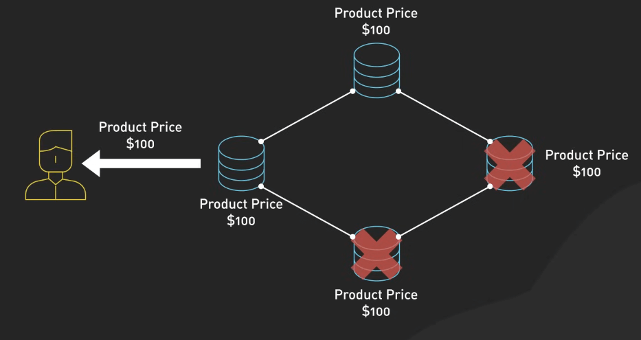{:class="centered-img"}

Soft State ngụ ý rằng dữ liệu có thể thay đổi theo thời gian do mô hình tính nhất quán cuối cùng. Hệ thống không đảm bảo tính nhất quán ngay lập tức nhưng đạt được tính nhất quán theo thời gian. 

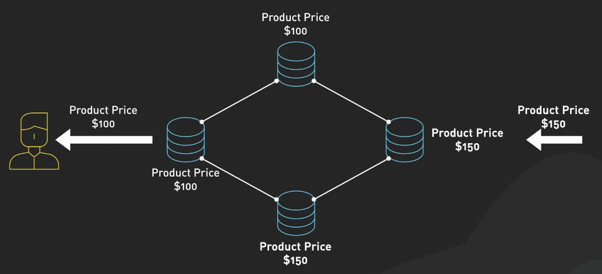{:class="centered-img"}

Eventual consistency nghĩa là cơ sở dữ liệu không đảm bảo rằng tất cả các transaction được thấy bởi tất cả người dùng ngay lập tức, nhưng cuối cùng, tất cả các lần đọc sẽ trả về giá trị mới nhất. 

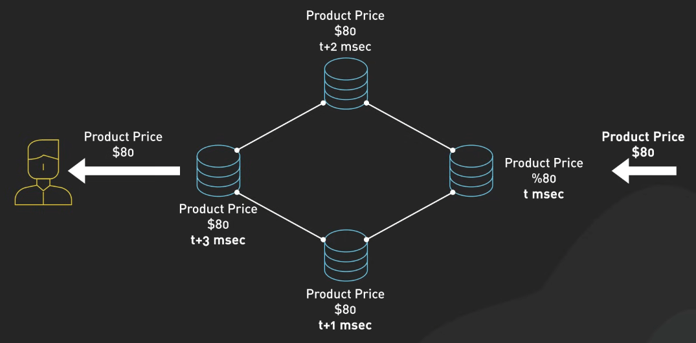{:class="centered-img"}

Điều này cho phép mở rộng và sao chép, hữu ích trong các tình huống mà một sự chậm trễ nhỏ về tính nhất quán là chấp nhận được để có thời gian phản hồi nhanh hơn và khả dụng cao. Amazon DynamoDB là một ví dụ tốt về nguyên tắc BASE. Nó ưu tiên khả dụng và độ trễ thấp. Việc ghi có thể dùng tính nhất quán cuối cùng hoặc tính nhất quán mạnh mẽ, tùy thuộc vào mức độ tính nhất quán cần thiết. 

Trong khi nguyên tắc ACID hữu ích cho các tình huống yêu cầu tính nhất quán mạnh mẽ, như giao dịch tài chính, nguyên tắc BASE tỏa sáng trong các môi trường phân tán lớn nơi khả dụng và khả năng chịu lỗi phân vùng được ưu tiên. Những nguyên tắc này cung cấp sự linh hoạt và độ bền cho các hệ thống phân tán lớn.

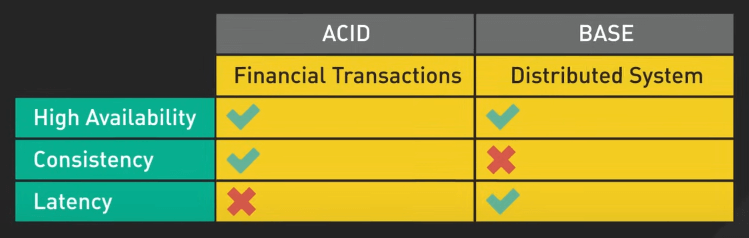{:class="centered-img"}

## SOLID

SOLID giúp viết code sạch hơn, dễ bảo trì hơn.

- **Single Responsibility Principle**: Một class chỉ nên có một lý do để thay đổi. Ví dụ, tách quản lý dữ liệu người dùng và thông báo người dùng để đảm bảo thay đổi ở một cái không ảnh hưởng đến cái kia.

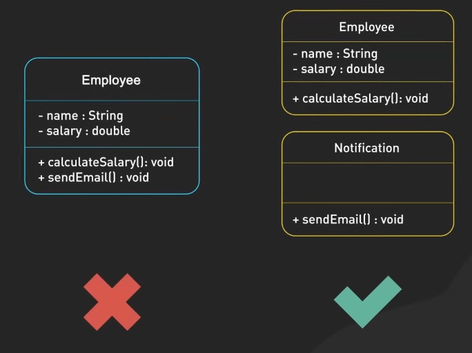{:class="centered-img"}

- **Open/Closed Principle**: Class, module, và function nên mở rộng được nhưng không thay đổi. Chúng ta có thể mở rộng hành vi của một module mà không cần thay đổi code. Điều này giữ cho code ổn định và giảm lỗi. Ví dụ, bằng cách sử dụng interface, một hàm tính diện tích có thể xử lý các hình dạng mới như hình tròn và hình chữ nhật mà không cần thay đổi logic cốt lõi.

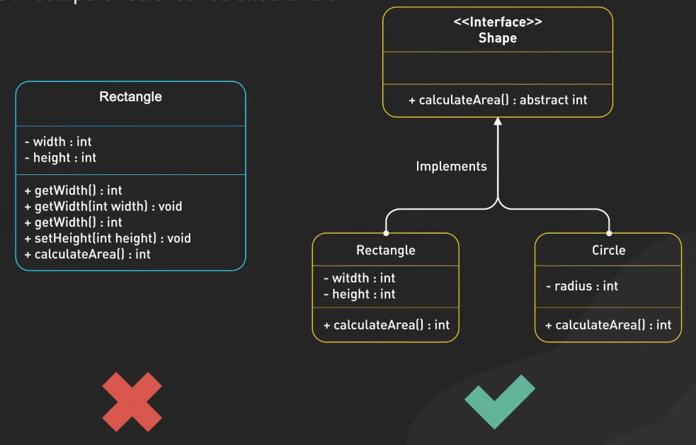{:class="centered-img"}

- **Liskov Substitution Principle**: Đối tượng của một superclass nên thay thế được bằng đối tượng của các subclass mà không ảnh hưởng đến tính đúng đắn của code. Điều này đảm bảo rằng một subclass có thể đứng thay cho superclass. Ví dụ, tách hành vi bay từ một class Bird chung đến một interface để đảm bảo rằng các loài chim không bay như đà điểu không gây lỗi.

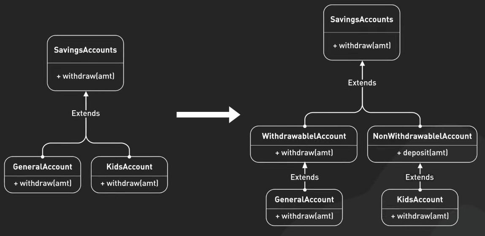{:class="centered-img"}

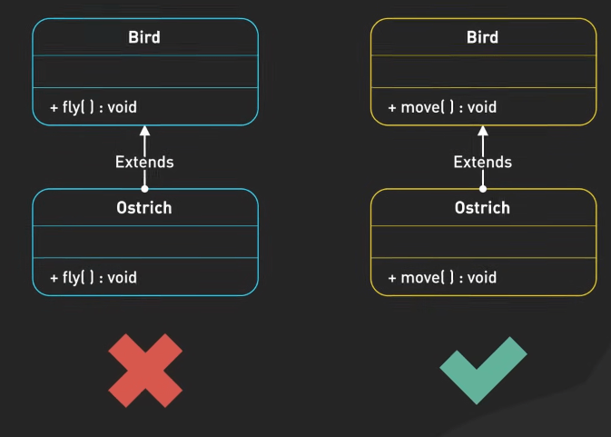{:class="centered-img"}

- **Interface Segregation Principle**: Client không nên bị buộc phải phụ thuộc vào các interface mà nó không sử dụng. Điều này khuyến khích tạo nhiều interface cụ thể hơn một interface chung, ngăn chặn một class bị buộc phải implement các interface không cần thiết, giảm tác động phụ của các thay đổi trong các interface không liên quan. Ví dụ, chia một interface worker thành các interface cụ thể như Workable và Eatable đảm bảo rằng robot worker không bị buộc phải implement các phương thức ăn không cần thiết.

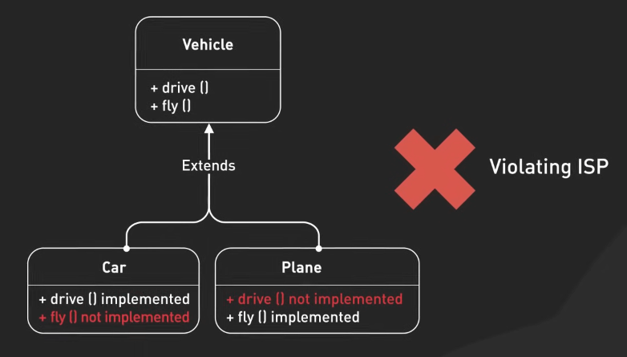{:class="centered-img"}

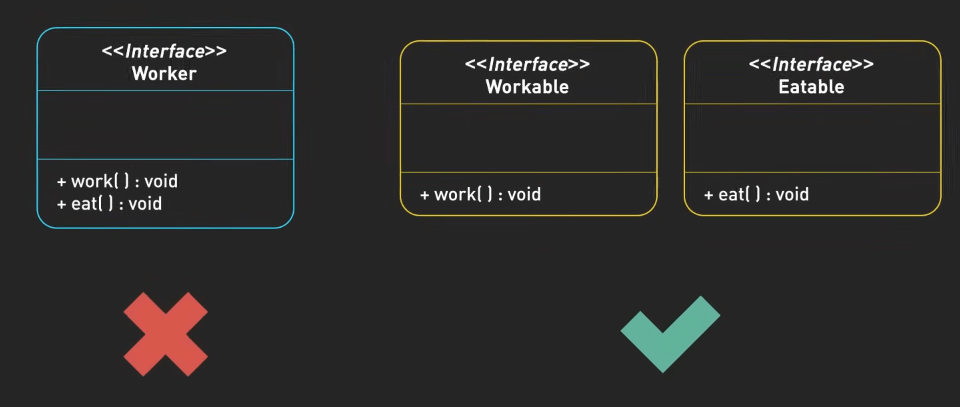{:class="centered-img"}

- **Dependency Inversion Principle**: Module cấp cao không nên phụ thuộc vào module cấp thấp. Cả hai nên phụ thuộc vào abstraction. Nguyên tắc này nhằm giảm sự phụ thuộc trực tiếp giữa các module khác nhau, làm cho hệ thống dễ dàng sửa đổi và mở rộng. Ví dụ, giới thiệu một interface Database cho phép một chương trình làm việc với nhiều cơ sở dữ liệu như MySQL và PostgreSQL mà không bị ràng buộc chặt chẽ với bất kỳ implementation cụ thể nào.

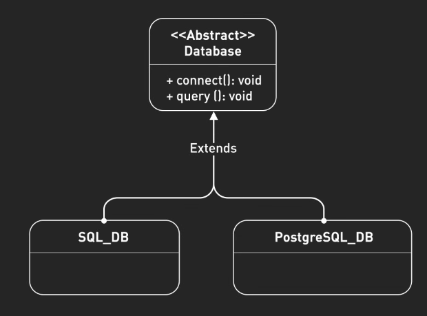{:class="centered-img"}

## KISS

KISS là viết tắt của "Keep it simple, stupid," nhấn mạnh vào thiết kế đơn giản để tối ưu hóa trải nghiệm người dùng. Ví dụ, giao diện Google đơn giản với logo và hộp tìm kiếm, giúp người dùng tập trung vào nhiệm vụ chính là tìm kiếm.

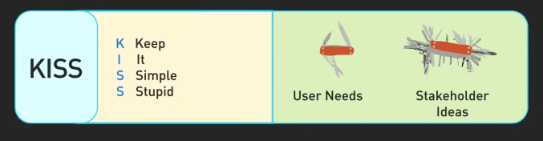{:class="centered-img"}

Những nguyên tắc này nhắc nhở chúng ta rằng giải pháp tốt nhất không phải lúc nào cũng đến từ việc thêm thắt phức tạp, mà từ việc đơn giản hóa thiết kế.
