# Kubernetes là gì?

## Nguồn

 [Why is Kubernetes Popular | What is Kubernetes?](https://www.youtube.com/watch?v=lv0DdVLZuHc)

## Kubernetes là gì?

Kubernetes là một nền tảng mã nguồn mở được thiết kế để tự động hóa việc triển khai, mở rộng và quản lý các ứng dụng được đóng gói trong container. Hãy tưởng tượng Kubernetes như một người chỉ huy cho các ứng dụng, đặc biệt là những ứng dụng được tạo ra từ hàng trăm, thậm chí hàng nghìn thành phần container độc lập.

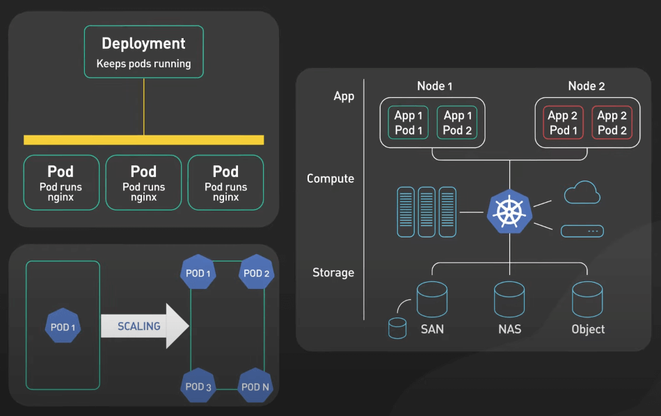{:class="centered-img"}

Kubernetes được tạo ra bởi Google và hiện nay là một giải pháp phổ biến để quản lý các ứng dụng phân tán phức tạp trên nhiều môi trường từ máy vật lý đến máy ảo và từ các môi trường on-premise đến các nền tảng Cloud.

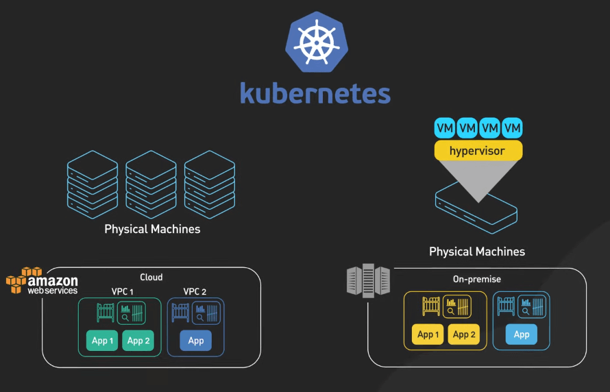{:class="centered-img"}

Tại sao Kubernetes trở nên quan trọng? Điều này đến từ sự gia tăng của kiến trúc microservices. Khi ứng dụng trở nên phức tạp hơn, các dev đã bắt đầu chia nhỏ chúng thành các service độc lập nhau. Những microservices này thường được đóng gói trong container, cung cấp môi trường lý tưởng để chạy chúng. Nhưng đây là điểm quan trọng: khi ứng dụng mở rộng, việc quản lý tất cả các container này bằng tay trở thành một cơn ác mộng. Đó là lúc Kubernetes xuất hiện. Nó cung cấp một cách tiếp cận mạch lạc cho việc triển khai container.

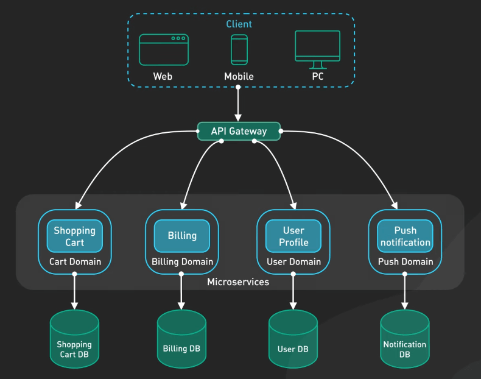{:class="centered-img"}

## Lợi ích của Kubernetes

Đầu tiên, nó có tính sẵn sàng cao. Thời gian chết lấy đi rất nhiều thứ. Kubernetes giúp ứng dụng của chúng ta luôn có thể truy cập với sự gián đoạn tối thiểu. Nó làm điều này bằng cách tự động khởi động lại container bị lỗi, phân phối tải trên nhiều máy và cung cấp khả năng tự sửa chữa.

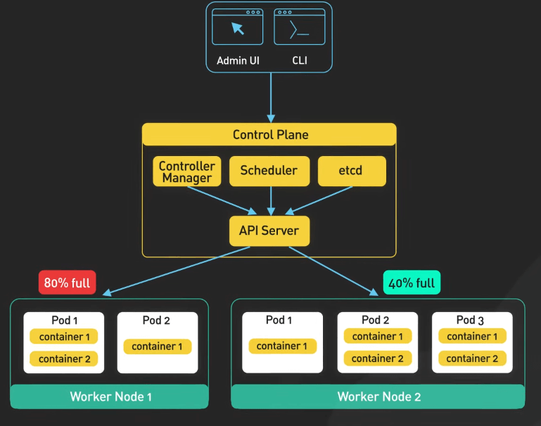{:class="centered-img"}

Tiếp theo, chúng ta có khả năng mở rộng. Khi số người dùng tăng, ứng dụng cần xử lý tải tăng tương ywnsg. Kubernetes giúp việc mở rộng hoặc thu hẹp quy mô ứng dụng một cách dễ dàng để phản ứng với nhu cầu thay đổi. Sự linh hoạt này đảm bảo hiệu suất và sử dụng tài nguyên một cách tối ưu.

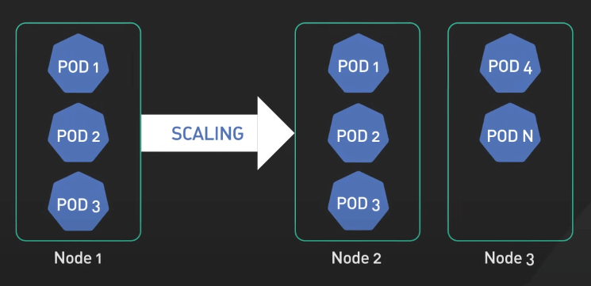{:class="centered-img"}

## Kiến trúc của Kubernetes

Một cụm Kubernetes bao gồm control plane và nhiều worker nodes. Các worker nodes là lao động chính của cụm. Chúng chịu trách nhiệm chạy các container tạo nên ứng dụng của chúng ta. Số lượng container trên mỗi worker node phụ thuộc vào các yếu tố như yêu cầu tài nguyên và phân phối công việc tổng thể.

Mỗi worker node chạy một tiến trình gọi là Kubelet, đóng vai trò là một local agent, cho phép giao tiếp và phối hợp trong cụm. Control plane, ngược lại, là trung tâm điều khiển. Nó quản lý toàn bộ cụm, chạy một số tiến trình quan trọng của Kubernetes.

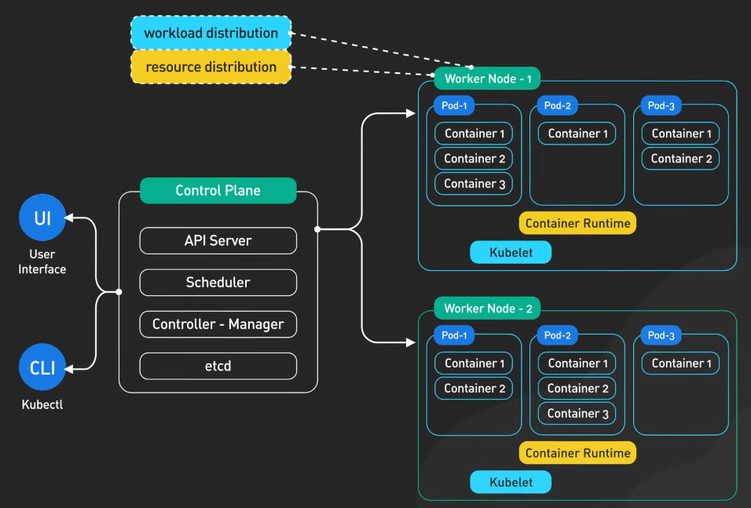{:class="centered-img"}

Đầu tiên, chúng ta có API server. API server là cổng giao tiếp chính của cụm. Nó là entry point cho các client khác nhau, bao gồm các API cho client, API cho tự động hóa và các công cụ dòng lệnh.

Tiếp theo, ta có controller manager. Controller manager duy trì trạng thái mong muốn của cụm. Nó liên tục theo dõi sức khỏe của cụm, xác định bất kỳ sự chênh lệch nào so với trạng thái mong muốn và thực hiện các hành động sửa chữa.

Sau đó, ta có scheduler. Scheduler phân phối các container đến các worker node dựa trên sự sẵn có của tài nguyên và yêu cầu cụ thể.

Cuối cùng, ta có etcd. Etcd là một kho lưu trữ key-value phân tán được sử dụng để lưu trữ trạng thái của cụm. Nó chịu trách nhiệm lưu trữ một cách an toàn các thông tin cấu hình và trạng thái của mỗi node và container trong cụm.

Để đảm bảo giao tiếp mượt mà giữa các thành phần, Kubernetes sử dụng một mô hình mạng ảo, kết nối tất cả các node trong cụm với nhau. Mô hình mạng ảo này ẩn đi cơ sở hạ tầng vật lý và cung cấp một môi trường đồng nhất cho việc triển khai ứng dụng.

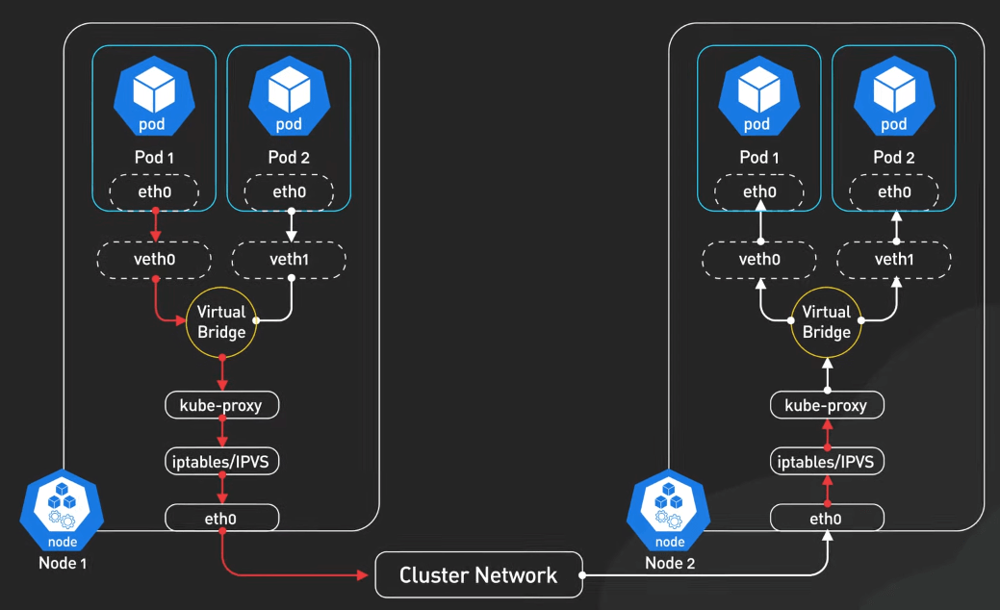{:class="centered-img"}

Về mặt phân bố tài nguyên, worker nodes thường có nhiều CPU, bộ nhớ và lưu trữ hơn so với control plane nodes, bởi chúng chịu trách nhiệm chính cho công việc chạy nhiều container ứng dụng. Control plane nodes, mặc dù chạy ít tiến trình hơn, nhưng lại quan trọng cho hoạt động của cụm. Trong môi trường live, người ta thường triển khai nhiều control plane để đảm bảo dự phòng và khả năng chịu lỗi.

## Ví dụ.

Bây giờ hãy hình dung cách các thành phần này hoạt động cùng nhau bằng một ví dụ thực tế của một ứng dụng web sử dụng cơ sở dữ liệu. Trung tâm của mô hình tài nguyên Kubernetes là pod. Pod là đơn vị triển khai nhỏ nhất trong Kubernetes. Nó là một lớp trừu tượng trên một hoặc nhiều container mà logic của chúng liên quan đến nhau. Trong một ứng dụng web, chúng ta có một pod chứa web server và một pod chứa cơ sở dữ liệu. 

Các pod trong Kubernetes là tạm thời. Nếu một pod bị lỗi, Kubernetes sẽ tạo một pod mới để thay thế nó. Tuy nhiên, pod mới có thể có địa chỉ IP khác, điều này có thể tạo ra thách thức cho việc giao tiếp giữa các ứng dụng.

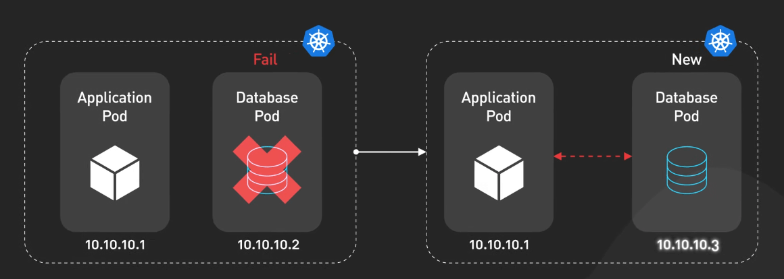{:class="centered-img"}

Để giải quyết vấn đề này, Kubernetes giới thiệu khái niệm services. Một service cung cấp một địa chỉ IP và tên DNS ổn định như một load balancer nội bộ cho một nhóm pod. Ngay cả khi các pod được tạo lại, địa chỉ IP của service vẫn không đổi, đảm bảo giao tiếp ổn định.

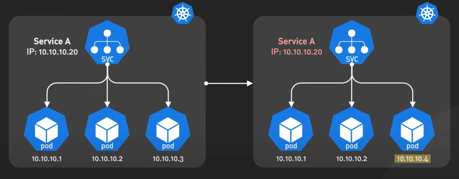{:class="centered-img"}

Để cho phép ứng dụng web của chúng ta có thể truy cập từ bên ngoài cụm, chúng ta cần expose nó ra bên ngoài. Kubernetes cung cấp external services cho mục đích này. Nó mở một cổng cụ thể trên mạng của cụm và định tuyến lưu lượng đến các pod backend.

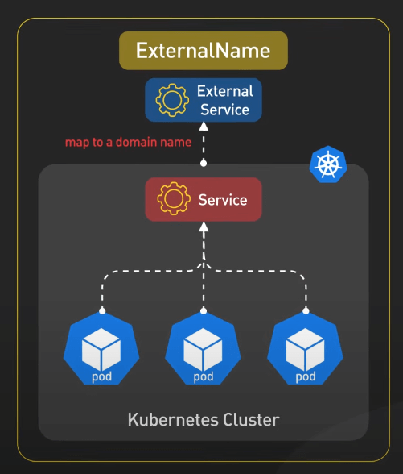{:class="centered-img"}

Tuy nhiên, các URL mặc định mà external services cung cấp có thể phức tạp và không thân thiện với người dùng. Đây là lúc Ingress của Kubernetes xuất hiện. Ingress là một reverse proxy thông minh cho phép bạn định nghĩa quy tắc định tuyến lưu lượng bên ngoài đến các services cụ thể trong cụm dựa trên URL yêu cầu.

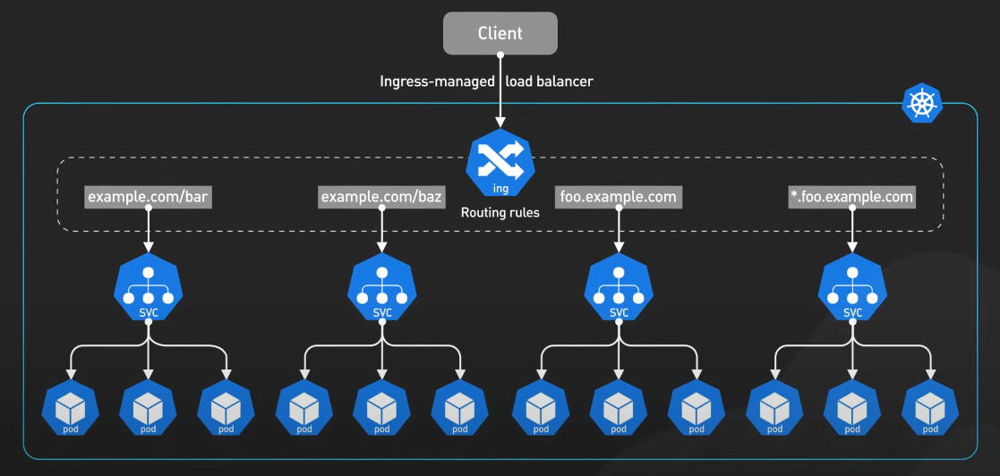{:class="centered-img"}

Kubernetes còn cung cấp cơ chế để quản lý dữ liệu cấu hình. Config Maps lưu trữ dữ liệu cấu hình như URL kết nối cơ sở dữ liệu hoặc API endpoint, trong khi Secret lưu trữ dữ liệu nhạy cảm như mật khẩu và API key.

Để tăng cường sự linh hoạt và sẵn sàng của ứng dụng web, chúng ta có thể tận dụng khả năng của Kubernetes để tạo nhiều bản sao của các pod. Kubernetes cung cấp hai cơ chế chính để quản lý bản sao của các pod: Deployments và StatefulSets.

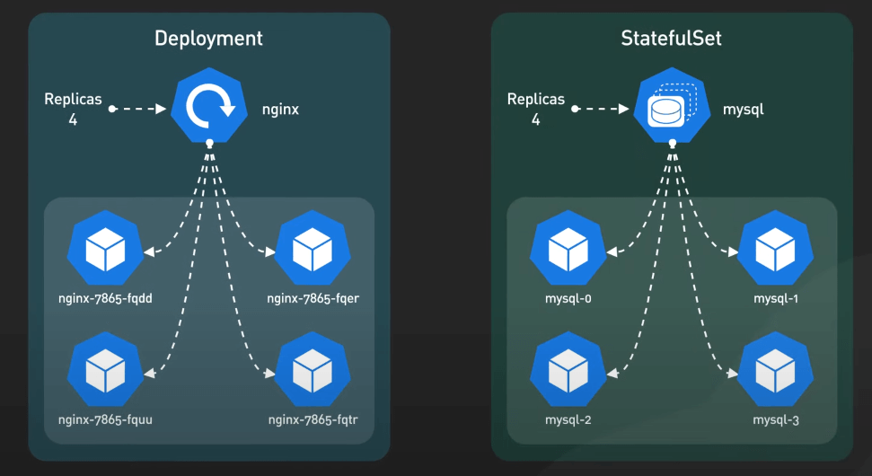{:class="centered-img"}

Deployments lý tưởng cho các ứng dụng stateless như web server, nơi mỗi bản sao có thể thay thế lẫn nhau. Chúng ta có thể định nghĩa một deployment để chỉ định số lượng bản sao mong muốn cho phần ứng dụng của chúng ta và Kubernetes sẽ đảm bảo ta luôn có số lượng đó.

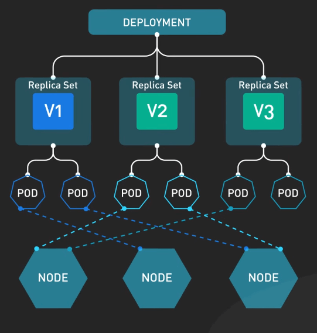{:class="centered-img"}

Giờ hãy nói về việc giữ dữ liệu an toàn trong Kubernetes. Volumes của Kubernetes cung cấp một cơ chế để trừu tượng hóa lưu trữ khỏi vòng đời của pod. Nó cho phép chúng ta gắn lưu trữ ngoại vi trực tiếp vào các pod. Điều này hữu ích cho các trường hợp cần lưu trữ dữ liệu dù pod bị xóa hoặc tạo lại.

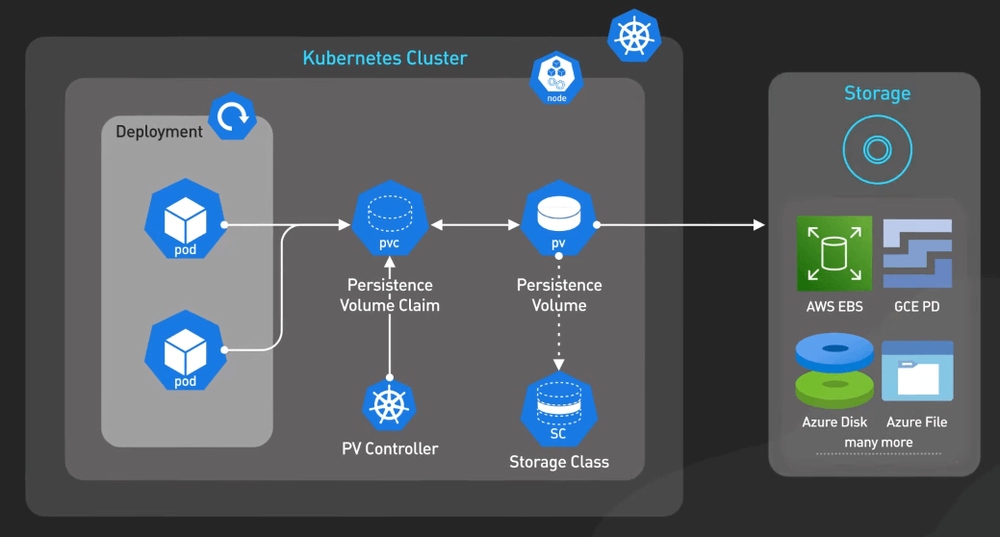{:class="centered-img"}

Với các ứng dụng stateful như cơ sở dữ liệu, Kubernetes cung cấp StatefulSets. StatefulSets xây dựng trên chức năng của Deployments nhưng cung cấp các tính năng bổ sung được tùy chỉnh cho các ứng dụng cần lưu trữ và quản lý dữ liệu nhất quán trên các bản sao một cách cẩn thận.

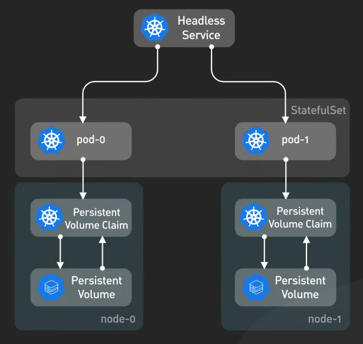{:class="centered-img"}

Trong khi StatefulSets cung cấp một cách để quản lý ứng dụng stateful như cơ sở dữ liệu trong môi trường Kubernetes, việc thiết lập và vận hành cơ sở dữ liệu trong Kubernetes có thể phức tạp và đòi hỏi kiến thức chuyên sâu. Nhiều tổ chức chọn cách kết hợp giữa việc chạy cơ sở dữ liệu ngoài Kubernetes, có thể trên các nền tảng dịch vụ cơ sở dữ liệu chuyên biệt. Họ sau đó kết nối các ứng dụng chạy trong Kubernetes với cơ sở dữ liệu ngoài. 

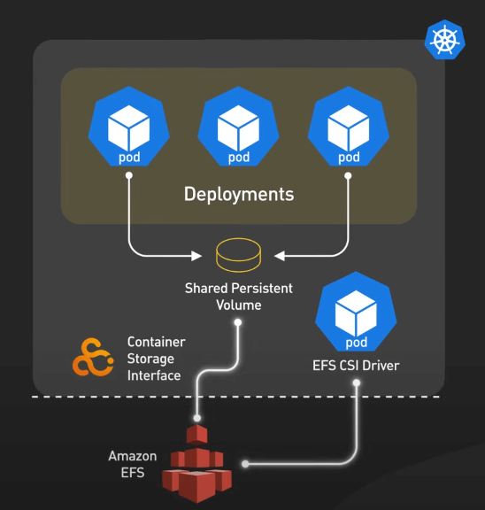{:class="centered-img"}

Cách phối hợp này cân bằng giữa việc tận dụng lợi ích của orchestration cho ứng dụng và tránh sự phức tạp của việc quản lý ứng dụng stateful trong môi trường Kubernetes. Đây là một giải pháp thực tế mà nhiều tổ chức thấy hiệu quả, đặc biệt khi họ có yêu cầu cụ thể về cơ sở dữ liệu.

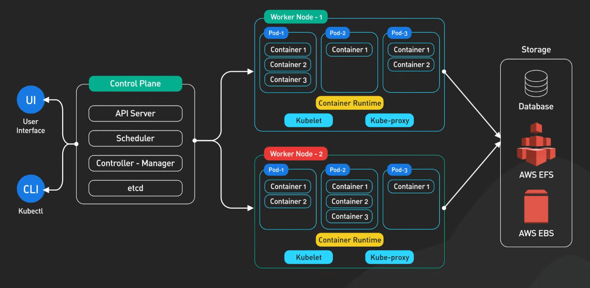{:class="centered-img"}

## Khi nào nên sử dụng Kubernetes?

Trong phát triển phần mềm, ta sẽ luôn có sự đánh đổi.

Về mặt lợi, Kubernetes có khả năng mở rộng và sẵn sàng cao. Nó cung cấp các tính năng như tự phục hồi, tự động rollback và mở rộng theo chiều ngang. Nó giúp dễ dàng mở rộng hoặc thu hẹp quy mô ứng dụng nếu cần, cho phép ta phản ứng nhanh chóng với các thay đổi về nhu cầu. 

Kubernetes cũng có tính di động. Nó giúp ta triển khai và quản lý các ứng dụng một cách nhất quán và đáng tin cậy bất kể cơ sở hạ tầng bên dưới có ra sao. Nó chạy tại chỗ, trên đám mây công cộng, hoặc trong môi trường kết hợp cả hai. Nó cung cấp một cách thức thống nhất để đóng gói, triển khai và quản lý ứng dụng.

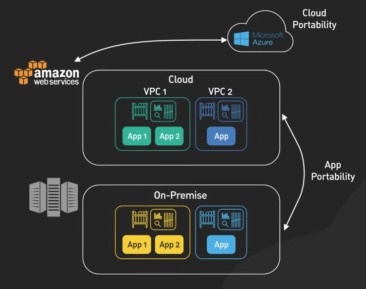{:class="centered-img"}

Về mặt hại, sự phức tạp là điểm yếu lớn nhất của Kubernetes. Kubernetes rất phức tạp để thiết lập và vận hành. Chi phí trả trước cao, đặc biệt với các tổ chức mới sử dụng bộ điều phối container như thế này. Nó đòi hỏi trình độ chuyên môn và nguồn lực cao để thiết lập và quản lý môi trường live Kubernetes. 

Chi phí cũng là một điểm yếu, vì Kubernetes đòi hỏi một mức tài nguyên tối thiểu nhất định để chạy để hỗ trợ tất cả các tính năng của nó, có thể làm cho nó quá khủng đối với nhiều tổ chức nhỏ. 

Một cách cân bằng hợp lý là chuyển việc quản lý control plane cho một dịch vụ Kubernetes quản lý, các nhà cung cấp đám mây đôi khi cũng có thể làm việc này cho bạn. Một số dịch vụ phổ biến là Amazon EKS, Google GKE và Azure AKS. Những dịch vụ này cho phép tổ chức chạy ứng dụng Kubernetes mà không cần lo lắng về cơ sở hạ tầng bên dưới. Dịch vụ này cung cấp các tính năng như cấu hình control plane, mở rộng cụm và cung cấp bảo trì và hỗ trợ liên tục. Điều này có thể là một lựa chọn hợp lý cho các tổ chức vừa và nhỏ, với điều kiện rằng sự phức tạp và yêu cầu tài nguyên của Kubernetes không vượt quá lợi ích mà nó mang lại.

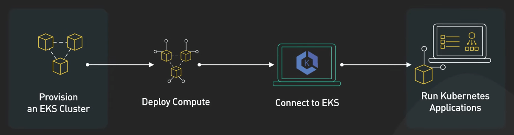{:class="centered-img"}
