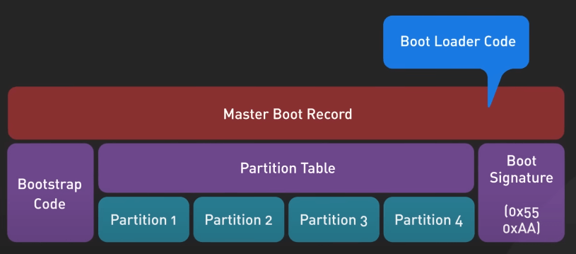
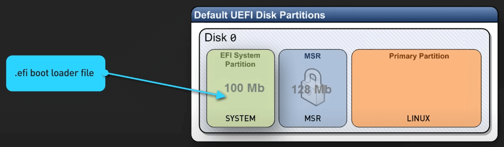
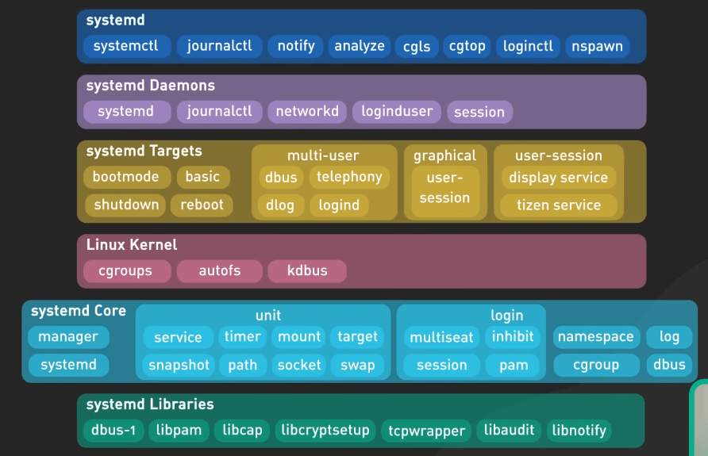
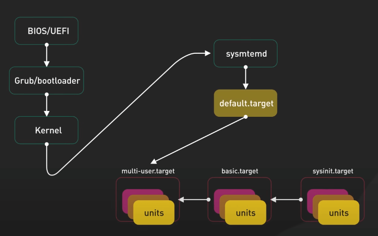
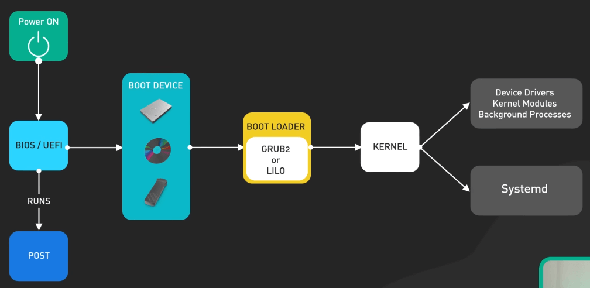

# Linux khởi động như thế nào?

## Nguồn

 [How Does Linux Boot Process Work?](https://www.youtube.com/watch?v=XpFsMB6FoOs)

## Quá trình khởi động Linux

Quá trình bắt đầu khi bạn nhấn nút nguồn để bật máy tính. Đầu tiên, một chương trình gọi là BIOS hoặc UEFI sẽ khởi động. Đây về cơ bản là phần mềm giúp chuẩn bị tất cả các phần chính của máy tính sẵn sàng hoạt động - như bàn phím, màn hình, ổ cứng, v.v. UEFI là phiên bản mới hơn, mang lại thời gian khởi động nhanh hơn và các tính năng bảo mật tốt hơn như Secure Boot, so với BIOS truyền thống.

Một điểm khác biệt chính giữa BIOS và UEFI là cách tiếp cận trong việc lưu trữ đĩa. BIOS gắn liền với hệ thống Master Boot Record (MBR), giới hạn kích thước ổ đĩa ở mức 2TB. Trong khi đó, UEFI sử dụng GUID Partition Table (GPT), loại bỏ các giới hạn kích thước này và cung cấp giải pháp linh hoạt và hiện đại hơn. Ngoài ra, BIOS khởi động chậm hơn và ít an toàn hơn so với UEFI.

Tiếp theo, BIOS hoặc UEFI chạy một cái check gọi là power-on self-test (POST). Check này đảm bảo tất cả các phần cứng hoạt động đúng trước khi bật hoàn toàn hệ thống. Nếu POST phát hiện vấn đề, thường sẽ có một thông báo lỗi hiện lên màn hình.

Cuối cùng, nếu mọi thứ đều ổn, BIOS hoặc UEFI cần tìm và tải phần mềm boot loader. Thứ tự boot thường được đặt để kiểm tra ổ cứng trước, sau đó đến USB hoặc CD nếu không tìm thấy gì trên ổ cứng. Bạn có thể tùy chỉnh thứ tự này trong cài đặt BIOS nếu muốn.

Trên hệ thống BIOS, mã boot loader nằm trong một phần nhỏ của ổ cứng gọi là Master Boot Record. 

{:class="centered-img"}

Còn với UEFI, có một phân vùng riêng lưu trữ các file boot loader như `.efi`. 

{:class="centered-img"}

Nhiệm vụ chính của boot loader là:

- Xác định vị trí kernel của hệ điều hành trên đĩa
- Tải kernel vào bộ nhớ máy tính
- Bắt đầu chạy mã kernel

Một số boot loader phổ biến là LILO và GRUB2. LILO (Linux Loader) đã khá lỗi thời và hiếm được sử dụng trong các Linux distro hiện đại. GRUB2 là boot loader đầy đủ tính năng và được sử dụng rộng rãi nhất hiện nay. Nó có thể khởi động nhiều hệ điều hành, có giao diện đẹp mắt với các menu đồ họa hoặc văn bản, và cung cấp nhiều tùy chọn nâng cao cho người dùng chuyên sâu.

Khi GRUB2 tự tải lên, nó sẽ đưa kernel Linux vào bộ nhớ và chuyển quyền điều khiển cho kernel để hoàn tất quá trình khởi động.

Sau khi boot loader khởi động kernel, kernel tiếp quản các tài nguyên máy tính và bắt đầu khởi tạo tất cả các tiến trình và dịch vụ nền. Đầu tiên, kernel tự giải nén vào bộ nhớ, kiểm tra phần cứng và tải các driver thiết bị cùng các module kernel khác.

Tiếp theo, một tiến trình ban đầu gọi là `init` sẽ khởi động, và trong các hệ thống Linux hiện đại, thường là Systemd. Systemd đã thay thế các hệ thống init cũ như SysVinit và Upstart, và là tiến trình cha của tất cả các tiến trình khác trên Linux. Systemd nhận rất nhiều trách nhiệm để khởi động và chuẩn bị hệ thống sẵn sàng cho người dùng.

Nó kiểm tra xem phần cứng nào cần driver, gắn các hệ thống tệp và đĩa để chúng có thể truy cập, khởi động tất cả các dịch vụ nền như mạng, âm thanh, quản lý năng lượng, xử lý đăng nhập người dùng, và cuối cùng là tải môi trường desktop với các bảng và menu. 

{:class="centered-img"}

Systemd sử dụng các file cấu hình target để quyết định nên khởi động vào chế độ nào - chẳng hạn như chế độ đa người dùng chỉ văn bản hoặc chế độ đồ họa mà hầu hết chúng ta sử dụng hàng ngày. Đa số bây giờ chỉ cần biết Systemd xử lý việc khởi động tất cả những gì cần chạy sau khi khởi động Linux.

{:class="centered-img"}

{:class="centered-img"}
