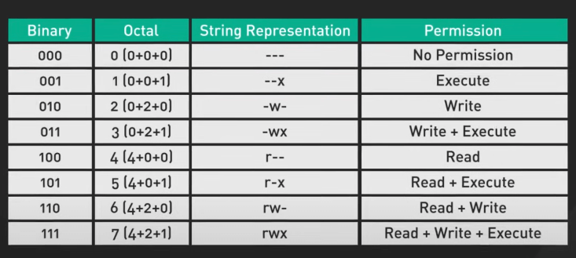
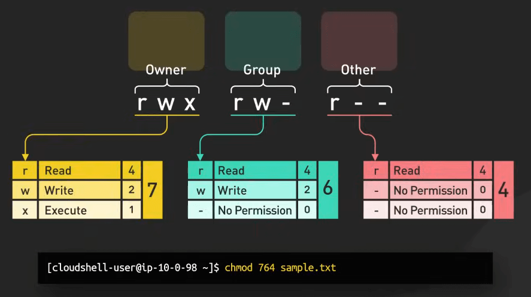
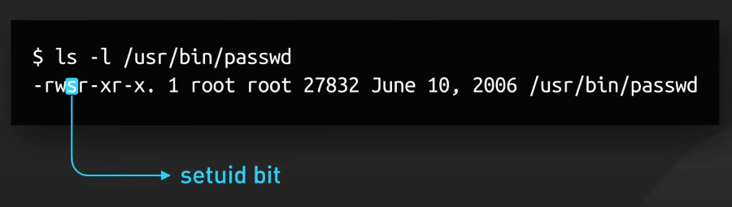
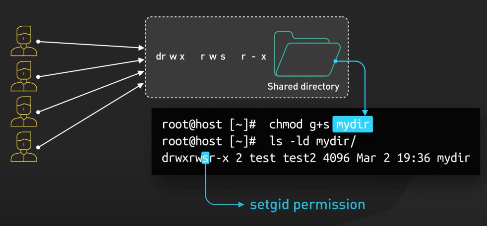
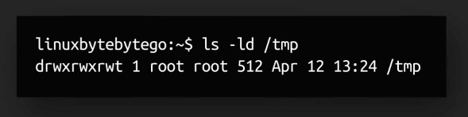
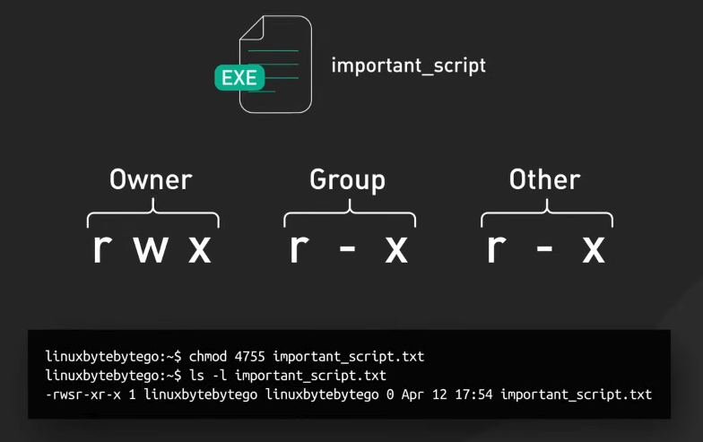
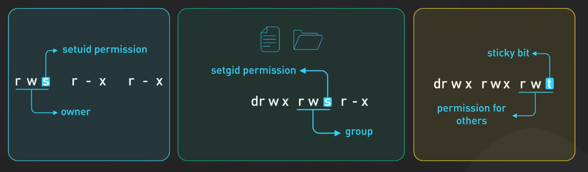

# File Permission trong Linux

## Nguồn

 [Linux Crash Course - Understanding File Permissions](https://www.youtube.com/watch?v=4N4Q576i3zA)

## Ownership là gì?

Trong Linux, mỗi file hay thư mục đều có ba loại chủ sở hữu: User, Group, và Others. User là chủ sở hữu tạo ra file hoặc thư mục. Họ có quyền kiểm soát nhiều nhất. Group bao gồm các user có cùng quyền truy cập file hoặc thư mục. Others là user không phải là chủ sở hữu hoặc thành viên của group. Họ có ít quyền nhất.

## Quyền truy cập

Để quản lý quyền truy cập, Linux sử dụng ba loại quyền: Read, Write, và Execute. Read cho phép user mở và đọc nội dung file. Write cho phép chỉnh sửa hoặc thêm nội dung file. Execute cho phép file chạy như một chương trình. Quyền truy cập được biểu diễn bằng ba cách: Binary, Octal và String. Xét quyền truy cập là `rwx`. Trong Binary, đó là `111`, mỗi bit biểu diễn một quyền: Read là `1`, Write là `1`, và Execute là `1`. Trong Octal, nó được biểu diễn là 7, với Read là 4, Write là 2, và Execute là 1, cộng lại bằng 7. Trong String, nó đơn giản là `rwx`.

{:class="centered-img"}

Xét một ví dụ thực tiễn hơn. Giả sử bạn có một file mà chủ sở hữu có quyền truy cập đầy đủ, tức là `rwx` và biểu diễn bằng 7. Group có thể đọc và viết, tức là `rw-` và biểu diễn bằng 6. Others chỉ có thể đọc, tức là `r--` và biểu diễn bằng 4. Trong Octal, bạn sẽ biểu diễn nó là `764`. Sử dụng lệnh `chmod`, bạn có thể đặt quyền truy cập như sau: `chmod 764 filename`. Chủ sở hữu có thể đọc, viết, và thực thi file, group có thể đọc và viết, và others chỉ có thể đọc. 

{:class="centered-img"}

## Các quyền đặc biệt

Giờ hãy nói về các bit quyền đặc biệt: `setuid`, `setgid`, và sticky bit. Chúng cung cấp kiểm soát bổ sung cho file và thư mục. 

`setuid` bit, khi được đặt trên một file thực thi, cho phép file chạy với quyền của chủ sở hữu file, không phải user chạy file. Điều này hữu ích cho các nhiệm vụ yêu cầu quyền cao. Ví dụ, lệnh `passwd`, thay đổi mật khẩu user, có `setuid` bit. Điều này cho phép user thông thường thay đổi mật khẩu của mình, yêu cầu sửa đổi các file hệ thống nhạy cảm. Khi `setuid` bit được đặt, bit thực thi cho chủ sở hữu sẽ hiển thị là `s`. 

{:class="centered-img"}

`setgid` bit có thể được đặt trên file hoặc thư mục. Trên file thực thi, nó cho phép file chạy với quyền của group sở hữu file. Trên thư mục, nó đảm bảo rằng các file và thư mục con mới được tạo trong thư mục đó sẽ kế thừa quyền sở hữu của thư mục. Điều này hữu ích cho thư mục dự án chia sẻ, đảm bảo tất cả các file được tạo trong đó đều có cùng quyền sở hữu, cho phép thành viên nhóm truy cập cần thiết. Khi `setgid` bit được đặt, bit thực thi cho group sẽ hiển thị là `s`.

{:class="centered-img"}

Sticky bit, khi được đặt trên một thư mục, đảm bảo rằng chỉ chủ sở hữu file, chủ sở hữu thư mục, hoặc user root mới có thể xóa hoặc đổi tên các file trong thư mục đó. Điều này thường được sử dụng trên các thư mục như `/tmp` để ngăn user xóa file của nhau. Khi sticky bit được đặt, bit thực thi cho others sẽ hiển thị là `t`.

{:class="centered-img"}

## Sử dụng

Để đặt các quyền đặc biệt này, bạn có thể sử dụng lệnh `chmod` với các biểu tượng hoặc biểu diễn số. Ví dụ, giả sử bạn muốn đặt `setuid` bit trên một file thực thi có tên là `important_script`, cùng với quyền đọc, viết, và thực thi cho chủ sở hữu, và quyền đọc và thực thi cho group và others. Trong lệnh này, 4 đặt `setuid` bit, 7 cho chủ sở hữu quyền đọc, viết, và thực thi, và 5 cho group và others quyền đọc và thực thi.

{:class="centered-img"}

Hiểu rõ các quyền truy cập và các bit đặc biệt này là cần thiết để quản lý truy cập và đảm bảo an ninh trong môi trường Linux. Đặt quyền truy cập và các bit đặc biệt đúng cách có thể ngăn chặn truy cập trái phép và sửa đổi không cần thiết, bảo vệ dữ liệu và đảm bảo sự hợp tác suôn sẻ.

{:class="centered-img"}
