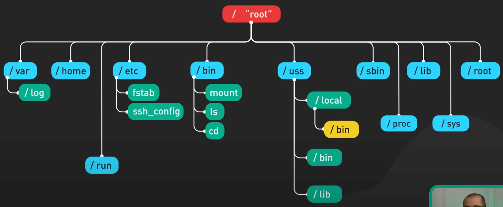
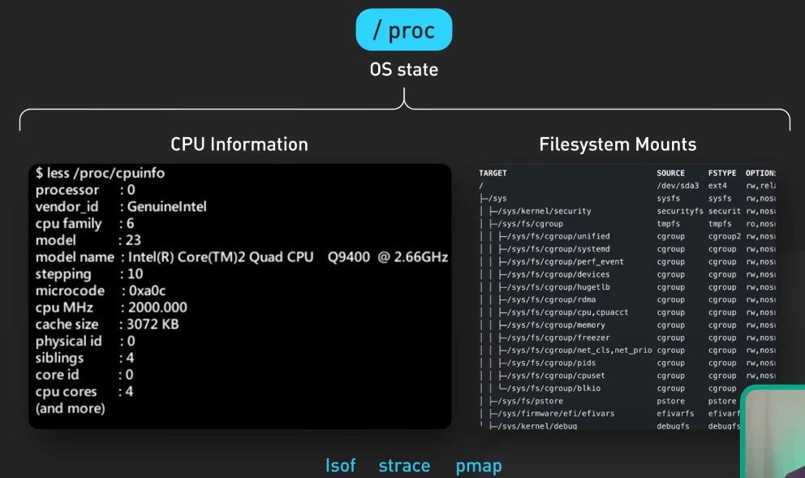
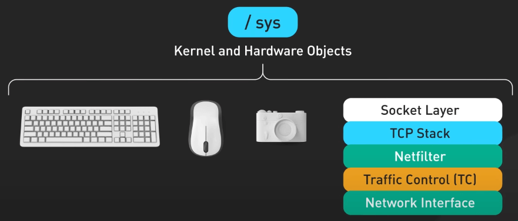

# Linux File System có gì?

## Nguồn

 [Linux File System Explained!](https://www.youtube.com/watch?v=bbmWOjuFmgA)

## Các directory quan trọng

{:class="centered-img"}

Đầu tiên là nơi chưa các file thực thi (executables). Cách bố trí của các thư mục như `/bin`, `/usr/bin`, `/usr/local/bin` và các thư mục `sbin` của chúng tuân theo một quy ước nhất định.

- `/bin` chứa các chương trình cốt lõi của hệ điều hành, những chương trình khả dụng trước khi `/usr` được mount khi khởi động. Ví dụ, các lệnh `mount`, `ls`, `cd` đều nằm ở đây.
- `/usr/bin` là nơi chính cho các file thực thi KHÔNG phải là một phần của hệ điều hành cơ bản. Hầu hết các chương trình của người dùng đều nằm ở đây. Factos: `usr` không phải là user mà là Unix System Resources!
- `/usr/local/bin` chứa các file thực thi được cài đặt bởi admin, thường sau khi biên dịch từ mã nguồn. Điều này giúp giữ cho các bản biên dịch cục bộ tách biệt để tránh ghi đè lên các file hệ thống.
- Các thư mục `sbin` tuân theo quy tắc tương tự nhưng chứa các tiện ích quản trị hệ thống yêu cầu quyền root như `iptables` và `sshd`. Khi có cùng một file thực thi tồn tại trong nhiều thư mục, bạn có thể chỉ định thư mục mặc định bằng cách sắp xếp lại thứ tự ưu tiên của thư mục trong biến `PATH`.

`/lib` chứa các file thư viện chia sẻ cần thiết giúp cho các file thực thi trong `/bin` và `/sbin` hoạt động chính xác. Những thư viện này cần được truy cập sớm trong quá trình khởi động trước khi mount `/usr`. Chúng cung cấp các chức năng cốt lõi như các hàm thư viện C (`glibc`) và runtime của trình biên dịch (`libstdc++`). 

`/usr/lib` chứa các thư viện cho các file thực thi trong `/usr` không quan trọng cho việc khởi động hệ thống. Những thứ này bao gồm các thư viện UI như `GTK` và `Qt` cũng như các runtime như `Python`. Bạn cũng có thể điều chỉnh thứ tự tìm kiếm thư viện thông qua biến `LD_LIBRARY_PATH`.

Với `/etc`, nơi chứa các file cấu hình Linux, các file dạng text ở đây điều khiển mọi thứ từ mạng đến dịch vụ xác thực.

Đối với dữ liệu người dùng, `/home` lưu trữ tài liệu, media, và các project trong khi admin có thư mục riêng là /root. Dữ liệu thay đổi nhanh như log và cache nằm trong `/var`. `/var/log` đặc biệt quan trọng để kiểm tra các sự kiện phần cứng, các vấn đề an ninh, hoặc hiệu suất.

`/run` /run chứa thông tin runtime biến đổi như các chi tiết của `systemd`, session người dùng, và các dịch vụ logging. Các dịch vụ hệ thống sử dụng `/run` để giao tiếp liên tục qua các file socket và lock. Ví dụ, `mysql.sock` có thể rất quan trọng cho việc truy cập cơ sở dữ liệu.

Cuối cùng, ta đến với `/proc` và `/sys`, các hệ thống file ảo dành cho những người dùng Linux chuyên nghiệp. `/proc` mở ra các kênh giao tiếp để kiểm tra trạng thái hệ điều hành tổng thể – ta có thể xem các số liệu cấp cao như `cpuinfo`, kiểm tra filesystem mount, và đi sâu hơn với các công cụ như `lsof`, `strace`, và `pmap`. 

{:class="centered-img"}

`/sys` cung cấp quyền truy cập các đối tượng phần cứng và kernel ở mức low-level hơn, cho phép giám sát và cấu hình chi tiết các thành phần như thiết bị, module, network stack thông qua các file ảo.

{:class="centered-img"}

Kết hợp lại, `/proc` và `/sys` cung cấp khả năng quan sát toàn diện hệ thống, từ các số liệu cấp cao cho đến các tương tác thành phần ở mức low-level. Với `/proc` hướng đến các thống kê process/runtime, và `/sys` cung cấp truy cập phần cứng/thiết bị, đây là những điểm kiểm tra rất hữu ích cho việc tối ưu hóa hiệu suất và kiểm tra lỗi.
