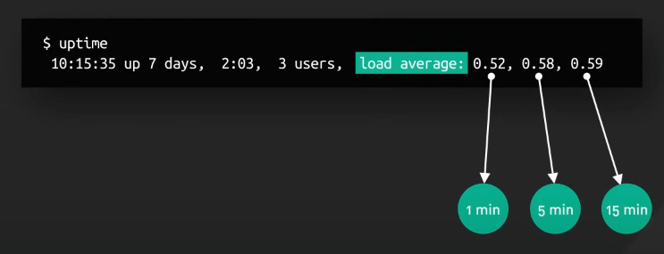
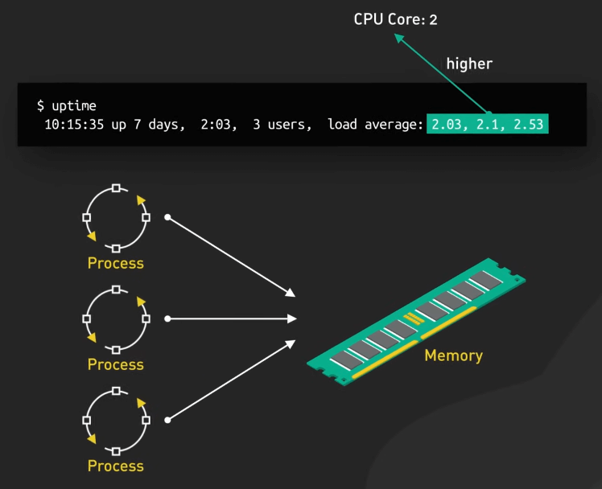
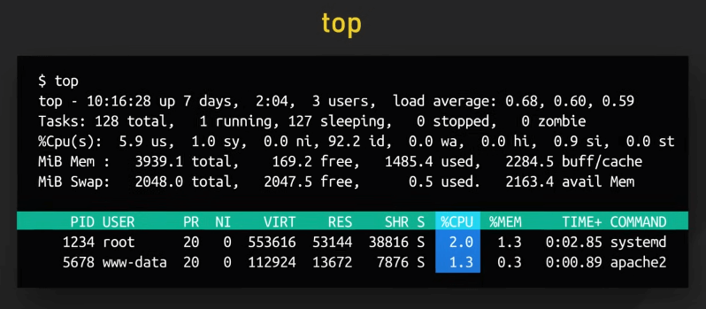
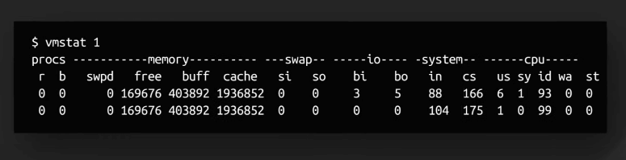
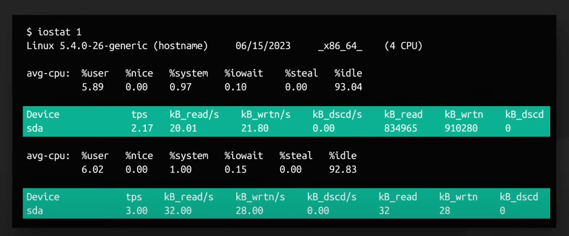
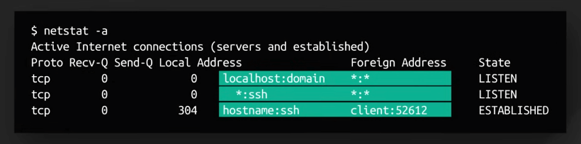
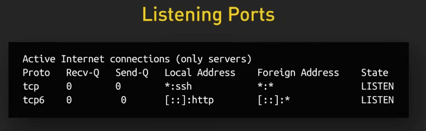
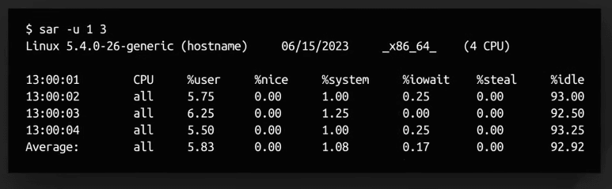
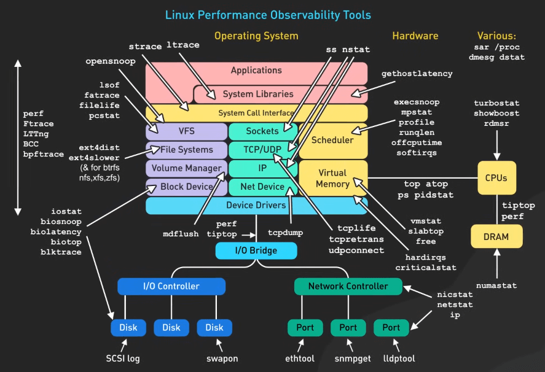

# Các công cụ hiệu suất trong Linux

## Nguồn

 [Linux Performance Tools!](https://www.youtube.com/watch?v=iJ_eIsA5E1U)

## Khi nào thì vấn đề hiệu suất thực sự xảy ra?

Khi có ai đó hỏi về một vấn đề hiệu suất, ta cần một số câu hỏi thăm dò. 

- Cái gì khiến bạn nghĩ ta có vấn đề về hiệu suất? 
- Trước đó hệ thống chạy tốt hơn rồi hả? 
- Những thay đổi nào có thể ảnh hưởng đến hiệu suất gần đây?
- "Chậm" ở đây có nghĩa là gì?
- Vấn đề xảy ra với nhiều người dùng hay chỉ một người dùng?

Các câu hỏi này giúp ta hiểu rõ hơn vấn đề, tạo ra các mốc để so sánh hiệu suất, và đôi khi giúp ta giải quyết vấn đề mà không cần phải điều tra chi tiết.

Một ví dụ thực tế, một dev phàn nàn về việc database bị chậm, truy vấn tốn tới 5 giây. Sau một hồi điều tra thì cái truy vấn này luôn tốn 5 giây. Vấn đề ở đây không phải về hiệu suất mà là về kỳ vọng khác nhau.

Tưởng tượng nếu ta nhảy vào điều tra luôn mà không có các câu hỏi trên, ta sẽ lãng phí thời gian và công sức giải quyết một cái vấn đề có khi không tồn tại. Người ta gọi đây là việc "Sửa súng thần công" (Parts cannon repair), thay thế các bộ phận mà không biết chính xác bộ phận nào bị hỏng. Điều này giải thích vì sao ta cần xác nhận rằng đây là một vấn đề hiệu suất thực sự trước khi đi vào phân tích chi tiết, giúp ta tập trung vào vấn đề thực tế.

## Định nghĩa vấn đề

Sau khi xác nhận rằng đây là một vấn đề hiệu suất, ta cần định nghĩa vấn đề hiện tại thật rõ ràng. Nghĩa là cần thay thế các từ chung chung như "chậm" bằng các số liệu cụ thể.

- Các trang tốn 10 giây để load hay gì?
- Các truy vấn database bị timeout hay gì?

Ta cần xác định các vấn đề này xảy ra khi nào và ở đâu, ta cũng cần xác định quy mô và tầm ảnh hưởng của vấn đề này.

- Nó ảnh hưởng đến tất cả server hay chỉ một server?
- Có bao nhiêu người dùng bị ảnh hưởng?
- Hậu quả về mặt thương mại là gì?

## Điều tra vấn đề

Cuối cùng, ta bắt đầu đi tìm gốc rễ của vấn đề, như tải nhiều đến từ hoạt động của một người dùng, một ứng dụng hay process nào đó, biểu diễn chúng dưới dạng số request trên giây, có bao nhiêu dữ liệu được chuyển và các số liệu này thay đổi như thế nào theo thời gian. Cách làm này tạo ra một cái nhìn tổng quan về hệ thống, giúp ta xác định được vấn đề và tìm ra cách giải quyết. Ta sẽ cần một số công cụ để giúp ta làm điều này.

## Các công cụ hiệu suất

### uptime

Số liệu quan trọng nhất của `uptime` là `load average`, là số lượng process đang chạy hoặc đang chờ tài nguyên trong 1, 5, và 15 phút gần nhất. 

{:class="centered-img"}

Đây là một số liệu phức tạp có thể bị ảnh hưởng bởi nhiều yếu tố. Nếu `load average` duy trì cao hơn số lõi CPU, nó có thể cho thấy rằng các process đang tranh giành tài nguyên, nhưng không phải lúc nào cũng đúng. Tải cao có thể do các tác vụ chiếm nhiều CPU, IO, hay các process có thời gian sống ngắn, hiện ra rồi biến mất.

{:class="centered-img"}

Nhớ rằng `load average` không phải là chỉ số duy nhất để đánh giá hiệu suất, nó chỉ cho thấy ta đang cần điều tra thêm.

### top

`top` cung cấp một view động, liên tục về các process trong hệ thống và các số liệu quan trọng. Nó giống như một bảng điều khiển hiệu suất. Ta có thể chú ý đến số liệu `%CPU`, là phần trăm CPU mà process đó chiếm.

{:class="centered-img"}

`top` cũng cho ta danh sách các process đang chạy, chú ý đến các process chiếm nhiều CPU hay memory. Đây có thể là thủ phạm cho vấn đề hiệu suất của chúng ta. Nhớ rằng `top` chỉ cho ta thấy các số liệu ở thời điểm hiện tại, ta có thể phải dùng đến các công cụ khác để xem các số liệu theo thời gian.

### vmstat

`vmstat` cho ta thấy các thông số của các thành phần hệ thống theo thời gian thực, các thông số cần chú ý là `r` (số lượng process đang chờ tài nguyên CPU), `b` (số lượng process đang chờ tài nguyên I/O), `si` và `so` (số lượng dữ liệu được chuyển giữa RAM và disk - là swap đấy), `wa` (phần trăm thời gian CPU đang chờ I/O).

{:class="centered-img"}

### iostat

Để xem thông số về IO trên đĩa, ta có thể sử dụng `iostat`. Nó cho ta cái nhìn tổng thể theo thời gian thực về đĩa cứng. Các thông số cần chú ý là `r/s` (số lượng request đọc trên giây), `w/s` (số lượng request ghi trên giây), `rkB/s` và `wkB/s` (số lượng dữ liệu đọc và ghi trên giây), `%iowait` (phần trăm thời gian CPU đang chờ I/O).

`iostat` chia các thao tác IO theo thiết bị, giúp ta xác định được đĩa nào đang có vấn đề.

{:class="centered-img"}

### netstat

`netstat` cho ta cái nhìn tổng thể về network trên hệ thống. `netstat` có nhiều tùy chọn khác nhau nên ta chỉ tập trung vào một số tùy chọn hữu ích để phân tích hiệu suất.

- `netstat -a` cho ta danh sách các connection đang hoạt động, từ cả hai huớng, giúp ta xác định các port đang mở và các service đang chạy.

{:class="centered-img"}

- `netstat -l` cho ta danh sách các port đang listen.

{:class="centered-img"}

- `netstat -an | grep -c ':80'` cho ta số lượng connection đến port 80. Nếu ta thấy số lượng connection đến port 80 tăng đột ngột, có thể có vấn đề về hiệu suất.

### sar

`sar` (System Activity Reporter) là một công cụ mạnh mẽ cho việc theo dõi hiệu suất hệ thống. Ta có thể dùng nó để thu thập các thông tin trong quá khứ, không giống như các công cụ khác chỉ cho ta thông tin ở thời điểm hiện tại, như `vmstat` hay `iostat`.

{:class="centered-img"}

Có nhiều bản Linux cấu hình `sar` để thu thập dữ liệu theo ngày, giờ, hay phút. Các thông tin này có thể rất hữu ích. Nếu người dùng báo cáo về một vấn đề nào đó trong quá khứ, ta có thể dùng `sar` để xem xét lại các thông tin này. `sar` sẽ rất tuyệt vời cho các vấn đề hiệu suất dựa trên event, hay theo ngày trong tuần, mà không theo thời gian thực.

{:class="centered-img"}

## Kết luận

Ngoài ra, Linux còn rất nhiều công cụ khác, những thứ ở đây chỉ là bề nổi. Ta có nhiều công cụ từ phần mềm đến phần cứng đến ứng dụng, và các hệ thống con, từ hệ thống file đến mạng mẽo và những thứ khác nữa. Nên nhớ rằng ta có thể phải dùng nhiều công cụ để tìm ra gốc rễ của vấn đề hiệu suất. Ta nên bắt đầu từ những thứ bao quát nhất, như `uptime`, rồi dần dần đi sâu vào từng thành phần hệ thống.

{:class="centered-img"}