# Bí mật đằng sau NoSQL: Cây LSM

## Nguồn

 [The Secret Sauce Behind NoSQL: LSM Tree](https://www.youtube.com/watch?v=I6jB0nM9SKU)

## Mở đầu

Các database NoSQL như Cassandra đã trở nên bùng nổ trong những năm gần đây. Một yếu tố thúc đẩy là nhu cầu lớn để thu tập lượng dữ liệu khổng lồ từ rất rất nhiều nguồn khác nhau và ngày càng tăng lên, như các ứng dụng di động và các thiết bị IoT (Internet of Things). Bí mật ẩn giấu đằng sau các database NoSQL này là một cấu trúc dữ liệu có tên là **cây Log Structured Merge** (viết tắt là **cây LSM**, lược dịch là cây hợp nhất có cấu trúc log).
Cây LSM được tối ưu hoá cho việc ghi dữ liệu nhanh.

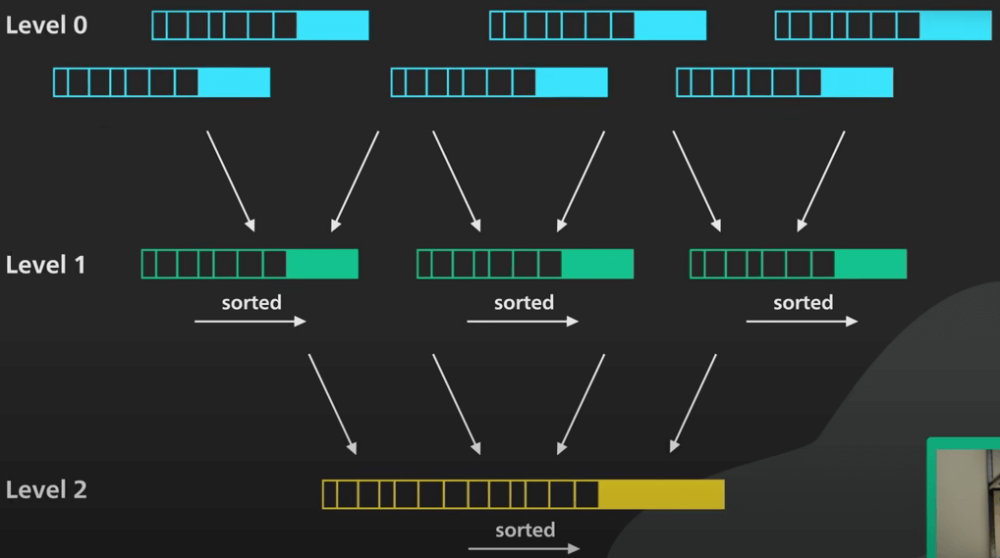{:class="centered-img"}

## B-tree

Để hiểu cây LSM hoạt động như thế nào, ta cùng đi tìm hiểu dữ liệu thường được lưu vào các relational database (cơ sở dữ liệu quan hệ) ra sao. Một relational database thường được hỗ trợ bởi một cấu trúc dữ liệu có tên là **B-tree**. 

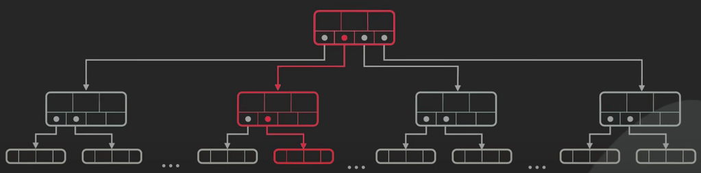{:class="centered-img"}

B-tree được tối ưu cho việc đọc dữ liệu. Cập nhật (thêm, sửa, xoá) B-tree tương đối tốn kém vì nó liên quan đến random I/O và có thể bao gồm việc cập nhật nhiều trang trên đĩa cứng. Điều này làm giới hạn tốc độ ghi dữ liệu của B-tree. 

## Cây LSM

Cây LSM thì khác. Việc ghi dữ liệu được dồn theo đợt trong bộ nhớ trong một cấu trúc gọi là memtable, sau đó gửi đi. Một memtable được sắp xếp theo object key, và thường được triển khai dưới dạng cây nhị phân cân bằng (balanced binary tree). 

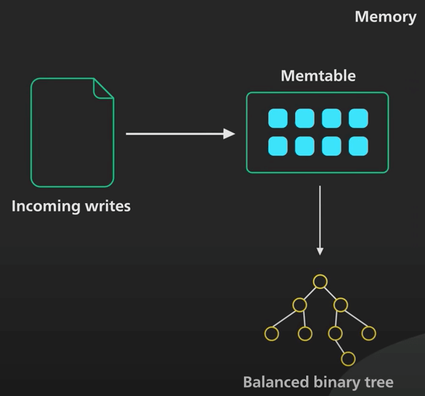{:class="centered-img"}

Khi kích thước memtable đến một giới hạn nào đó, nó sẽ được chuyển vào đĩa cứng dưới dạng **Sorted String Table** bất biến (viết tắt là SSTable, lược dịch là Bảng chứa các xâu được sắp xếp).

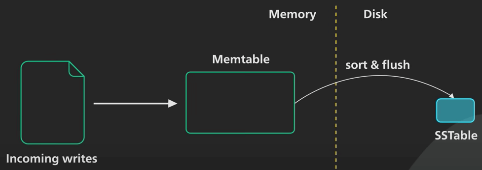{:class="centered-img"}

Một SSTable lưu các cặp key-value theo trình tự được sắp xếp theo key. Tất cả các lần ghi đều là I/O tuần tự, khiến cho việc ghi rất nhanh trên mọi loại đĩa. SSTable mới sẽ trở thành đoạn (hay là thông tin) mới nhất của cây LSM. Khi có nhiều dữ liệu hơn, ngày càng nhiều SSTable bất biến được tạo ra và thêm vào cây LSM, với mỗi SSTable đại diện cho một tập con nhỏ theo trình tự thời gian của các thay đổi mới nhất. 

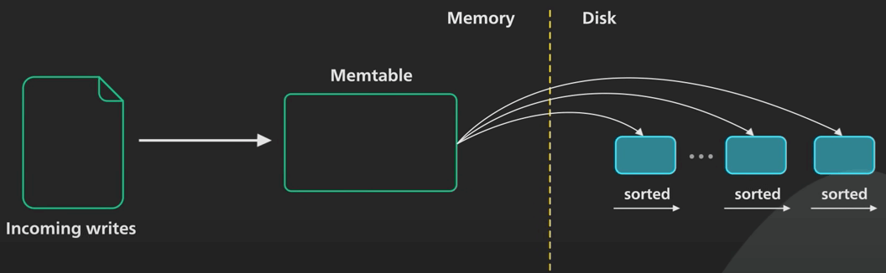{:class="centered-img"}

Vì các SSTable này bất biến, cập nhật cho một key hiện có sẽ không ghi đè lên SSTable chứa key đó. Thay vào đó, một key mới được thêm vào SSTable mới nhất, và nó sẽ thay cho các key trùng nó trong các SSTable cũ.

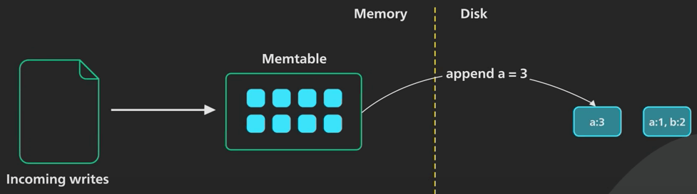{:class="centered-img"}

Việc xoá một object phải xử lý khác đi, vì ta không thể đánh dấu object đã bị xoá trong SSTable cũ được. Để thực hiện xoá, nó thêm một đánh dấu gọi là tombstone (bia mộ) vào SSTable mới nhất cho cái key đó. Khi ta đọc dữ liệu mà thấy tombstone, ta biết rằng object đã bị xoá. Việc xoá ở đây lại tốn thêm không gian dữ liệu, nghe hơi lạ, nhưng là cách tốt nhất có thể làm.

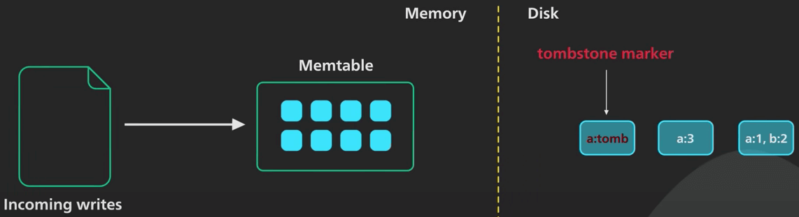{:class="centered-img"}

Khi có request đọc dữ liệu đến, đầu tiên ta tìm key trong memtable, sau đó tìm trong SSTable mới nhất trong cây LSM, xong đến SSTable mới thứ hai, và tiếp tục như thế. SSTable đã được sắp xếp nên việc tìm kiếm có thể được thực hiện hiệu quả.

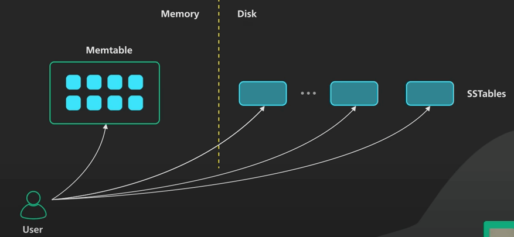{:class="centered-img"}

Việc thêm liên tục các SSTable như vậy nảy sinh hai vấn đề. Thứ nhất, vì số SSTable tăng lên, sẽ ngày càng tốn thời gian hơn để tìm một key. Thứ hai, SSTable liên tục tích luỹ như vậy, sẽ có rất nhiều object cũ do việc sửa và xoá (thêm data mới), điều này sẽ làm tốn không gian lưu trữ. 

Để giải quyết các vấn đề này, ta sẽ đi hợp nhất (merge) và nén (compact) định kỳ. Quá trình này sẽ chạy nền để hợp nhất các SSTable và loại bỏ các giá trị cũ hoặc bị xoá. Điều này giúp tiết kiệm không gian lưu trữ và giới hạn số lượng SSTable mà một lần đọc phải kiểm tra. Vì các SSTable được sắp xếp rồi, nên quá trình hợp nhất và nén này rất đơn giản và hiệu quả. Cách làm cũng tương tự việc merge trong Merge Sort. Tóm lại, đây là cách cây LSM cung cấp khả năng ghi dữ liệu nhanh chóng.

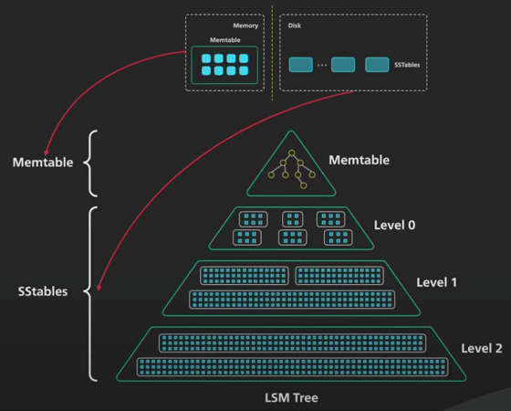{:class="centered-img"}

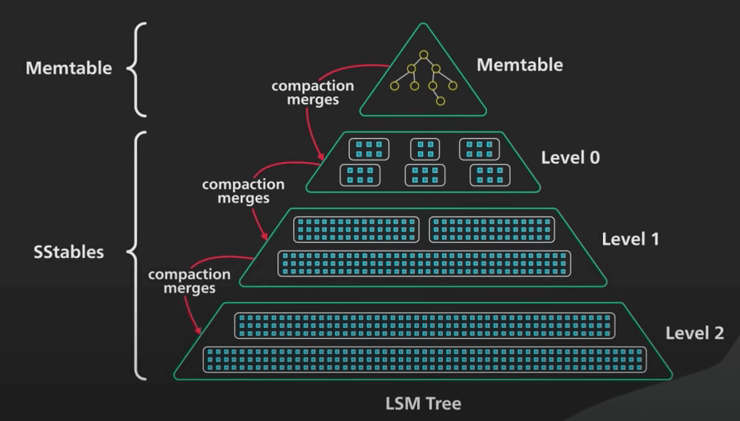{:class="centered-img"}

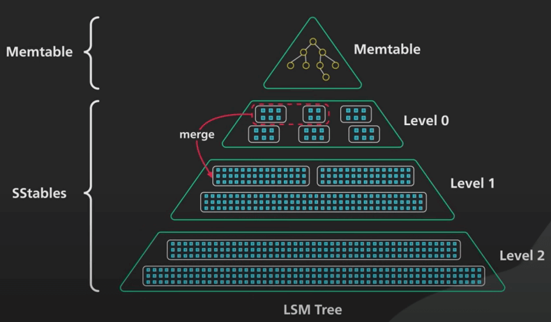{:class="centered-img"}

Ta cùng tóm tắt lại nhé. Cây LSM sẽ ghi dữ liệu vào memtable trước. Khi memtable đầy, ta sắp xếp và đẩy nó vào đĩa cứng dưới dạng SSTable bất biến. Số lượng SSTable tăng lên do càng nhiều memtable data được đẩy vào. Điều này sinh ra vấn đề cho việc đọc, do nó phải tìm kiếm qua các SSTable để thực hiện tra cứu. Để giới hạn số lương SSTable mà nó phải tìm kiếm cho mỗi lần đọc, cây LSM hợp nhất các SSTable và nén (quá trình này được chạy nền).

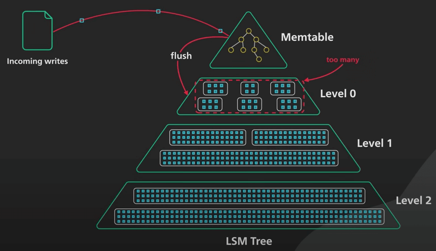{:class="centered-img"}

## Quá trình nén

Ta cùng xem xét sâu hơn về quá trình nén. Khi các SSTable hợp nhất, chúng được tổ chức thành các level. Đây là nơi phần cây của cây LSM xuất hiện. Có một số cách khác nhau để xác định thời điểm và cách thức các SSTable được hợp nhất và nén. Có hai cách tổng quát: **Nén theo kích thước (Size Tiered Compaction)** và **nén theo level (Leveled Compaction)**.

Nén theo kích thước được tối ưu hoá cho việc ghi, còn nén theo level được tối ưu hoá cho việc đọc dữ liệu hơn. Ta sẽ không đi vào chi tiết những cách này hoạt động như thế nào. Nhưng có một vài điểm chính cần nhớ: việc nén giữ cho số lương SSTable nằm trong giới hạn nào đó. Các SSTable được tổ chức thành các level. Mỗi level sẽ lớn hơn theo cấp số nhân khi các SSTable ở level trên được hợp nhất vào nó. Việc nên tốn rất nhiều I/O. Nén sai sẽ có thể làm chậm cả việc đọc và ghi.

## Các cách tối ưu

Cuối cùng, ta cùng xem xét các tối ưu phổ biến cho cây LSM trong thực tế. Có nhiều cách tối ưu hoá cố gắng cung cấp hiệu suất đọc gần với B-tree hơn. Những gì ta sẽ đi vào dưới đây chỉ là những cách phổ biến nhất thôi. Để tra một key, nó thực hiện tìm kiếm trên SSTable ở mọi level. Mặc dù tìm kiếm nhanh trên dữ liệu được sắp xếp, nhưng việc duyệt qua tất cả các SSTable trên đĩa sẽ tốn rất nhiều I/O. Nhiều hệ thống giữ một bảng tóm tắt (summary table) trong bộ nhớ, trong đó chứa min/max của mỗi khối đĩa ở mọi level. Điều này giúp hệ thống bỏ qua tìm kiếm ở những khối đĩa không có key cần tìm, giúp tiết kiệm rất nhiều random I/O.

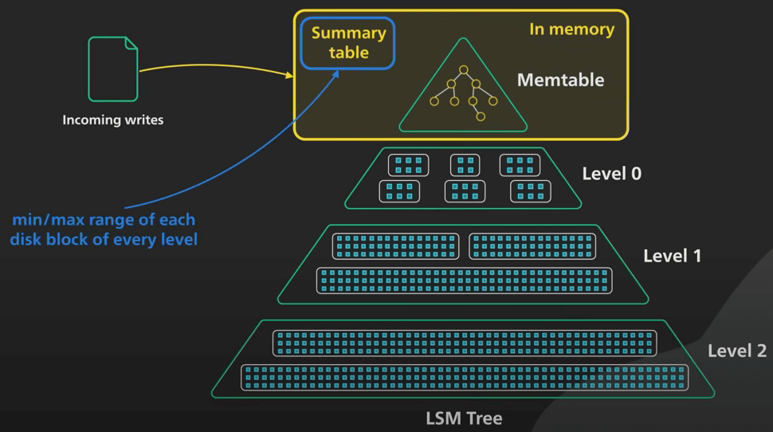{:class="centered-img"}

Một vấn đề nữa có thể tốn kém là việc tìm key không có trong cây LSM. Nó sẽ phải tìm qua tất cả các khối ở mọi level. Hầu hết các hệ thống duy trì một bloom filter ở mỗi level. Một bloom filter là một cấu trúc dữ liệu tiết kiệm không gian, nó sẽ trả về "Không có" nếu key không tồn tại, và "Có thể có" nếu key có thể tồn tại. Điều này giúp hệ thống bỏ qua một level nếu key không có ở đó, giúp giảm mạnh lượng random I/O cần. 

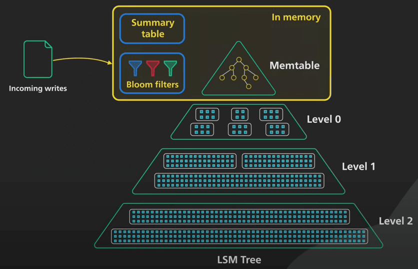{:class="centered-img"}

Kết lại, NoSQL database được hỗ trợ bằng một cây LSM có thể được điều chỉnh để hỗ trợ tốc độ ghi rất cao. Như với bất kỳ database nào, điều chỉnh cần phải phù hợp. Với cây LSM, điều chỉnh việc nén là quan trọng nhất.
