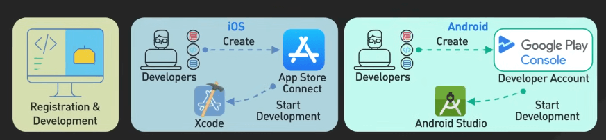
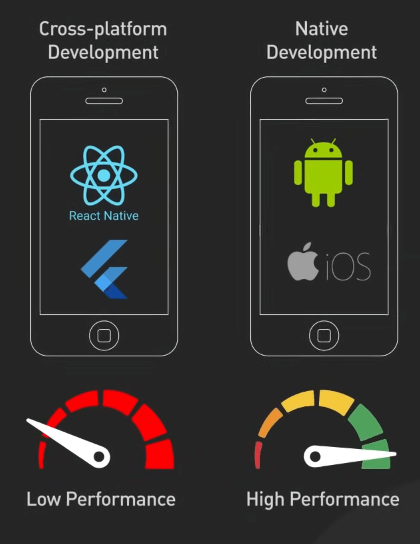
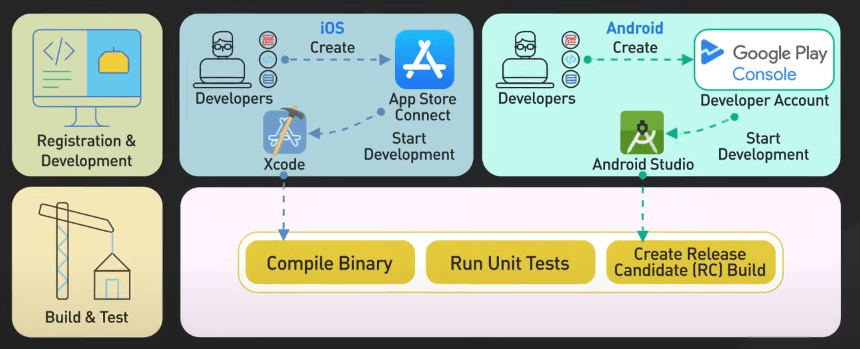
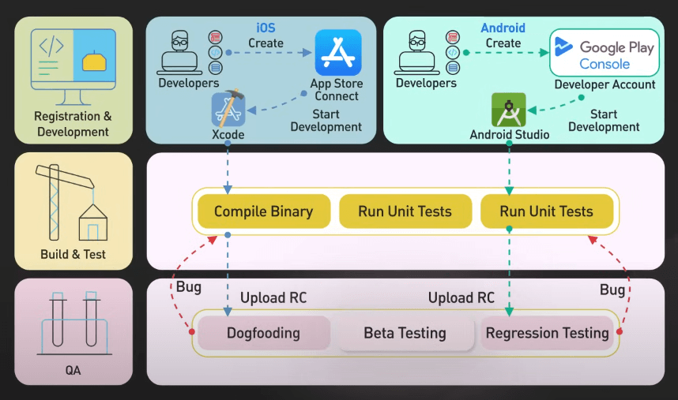
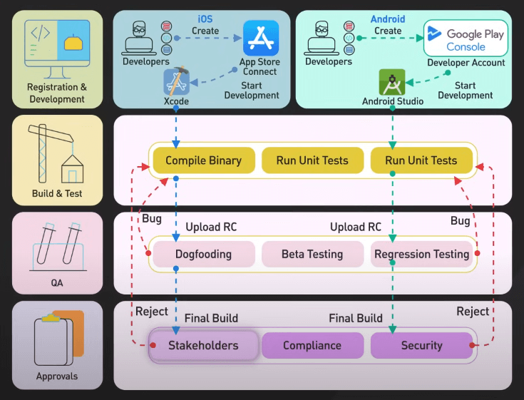
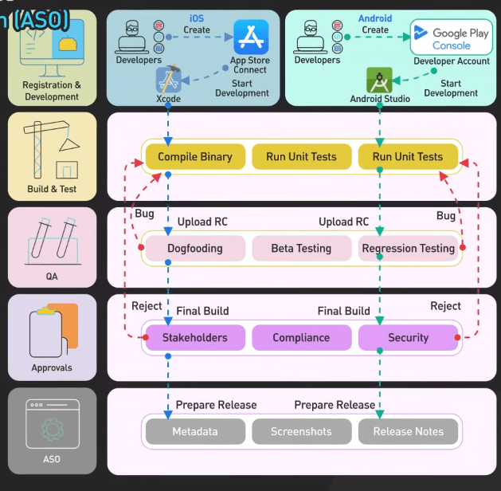
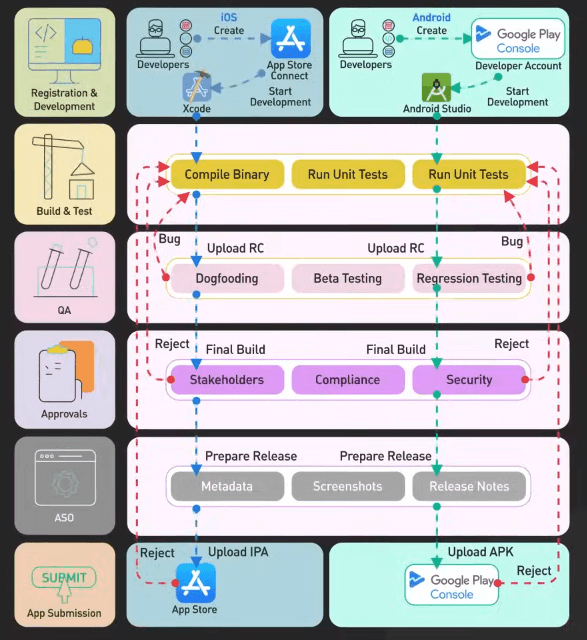
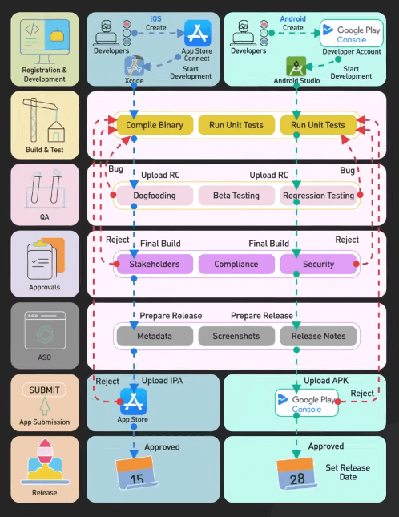

# Các ứng dụng di động được phát hành như thế nào?

## Nguồn

 [Do You Know How Mobile Apps Are Released?](https://www.youtube.com/watch?v=RIX4ufelA58)

## Phát triển

Để bắt đầu xây dựng ứng dụng iOS, trước hết ta cần tham gia Chương trình Nhà phát triển của Apple (Apple's Developer Program), đi kèm với phí hàng năm. Đối với Android, ta đăng ký trên Google Play Console và trả phí đăng ký một lần.

Tiếp theo, chọn ngôn ngữ lập trình: Swift hoặc Objective-C cho iOS, và Java hoặc Kotlin cho Android. Chúng ta phát triển ứng dụng với các công cụ chính như Xcode cho iOS và Android Studio cho Android. 

{:class="centered-img"}

Hoặc, có thể chọn công cụ phát triển đa nền tảng như React Native hoặc Flutter để viết code một lần và triển khai trên cả hai nền tảng. Điều này giúp tăng tốc độ phát triển và giảm chi phí, nhưng có thể không mang lại hiệu suất hoặc quyền truy cập đầy đủ vào các tính năng thiết bị như phát triển trên native (trên chính Android hay iOS).

{:class="centered-img"}

## Build và test

Khi viết xong code, ta sẽ build và test. Ta lấy file thực thi của ứng dụng và thực hiện test với các công cụ như XCTest cho iOS và Espresso cho Android.

Các "device farms" (vườn thiết bị) giúp tự động hóa testing trên hàng trăm cấu hình thiết bị khác nhau, phát hiện các vấn đề có thể ảnh hưởng đến phần cứng hoặc các phiên bản hệ điều hành khác nhau. Quy trình này được tích hợp vào CI/CD để tối ưu hóa quy trình xây dựng và kiểm thử, nhằm cung cấp chất lượng và hiệu suất tốt nhất trên mọi thiết bị, tạo ra bản ứng viên release ổn định sẵn sàng cho giai đoạn tiếp theo. Lưu ý rằng các vườn thiết bị như AWS Device Farm hoặc BrowserStack có thể rất đắt đỏ, nên ta có thể sử dụng chúng vào các giai đoạn phát triển muộn hơn, dựa trên ngân sách và yêu cầu của dự án.

{:class="centered-img"}

## QA

Giai đoạn tiếp theo là QA. Bắt đầu với alpha testing nội bộ để phát hiện lỗi ban đầu, tiếp theo là "dogfooding", nơi team sẽ sử dụng ứng dụng nhiều hơn. Sau đó, chúng ta mời một nhóm người dùng thử nghiệm ứng dụng và cung cấp phản hồi qua các nền tảng kiểm thử beta như TestFlight của Apple và Google Play beta testing. Lưu ý rằng TestFlight giới hạn 10000 người thử nghiệm và Google Play cũng có giới hạn tương tự, nên cần chọn người thử nghiệm bên ngoài một cách cẩn thận để thu thập những phản hồi có giá trị nhất. Các nền tảng này giúp thu thập phản hồi trong điều kiện thực tế, xác định các vấn đề có thể không được phát hiện trong các giai đoạn kiểm thử trước.

{:class="centered-img"}

## Phê duyệt nội bộ

Trước khi gửi ứng dụng lên các cửa hàng, cần có sự phê duyệt nội bộ từ các bên liên quan chính, dựa trên các tiêu chí như tính nhất quán về UX, phù hợp với thương hiệu và các chỉ số hiệu suất kỹ thuật. Đồng thời, đảm bảo ứng dụng đáp ứng các quy định của cửa hàng ứng dụng và tuân thủ các quy định về bảo mật và quyền riêng tư.

{:class="centered-img"}

## Tối ưu hóa cửa hàng ứng dụng

Tối ưu hóa cho cửa hàng ứng dụng nhằm tăng khả năng hiển thị ứng dụng của chúng ta trong các cửa hàng ứng dụng. Điều này bao gồm tối ưu hóa metadata của ứng dụng, như tiêu đề, mô tả và từ khóa, đồng thời bản địa hóa nội dung cho các khu vực khác nhau để tăng xếp hạng tìm kiếm và thu hút người dùng. Thiết kế các ảnh chụp màn hình và biểu tượng nổi bật để giới thiệu các tính năng tốt nhất của ứng dụng. Khi viết ghi chú cập nhật, hãy sáng tạo và nhấn mạnh các cập nhật và cải tiến mới thú vị.

{:class="centered-img"}

## Gửi ứng dụng lên cửa hàng

Đến lúc gửi ứng dụng. Đối với iOS, chúng ta gửi ứng dụng qua App Store Connect, tuân thủ nghiêm ngặt các hướng dẫn của Apple. Đối với Android, chúng ta sử dụng Google Play Console, tuân thủ các chính sách của Google. Hãy chuẩn bị tinh thần cho các khả năng trì hoãn và kiên nhẫn - đặc biệt nếu đây là ứng dụng mới. Đôi khi đội ngũ đánh giá ứng dụng có thể yêu cầu thay đổi hoặc thông tin bổ sung, vì vậy hãy chuẩn bị thêm thời gian cho giai đoạn này để đảm bảo phê duyệt thành công.

{:class="centered-img"}

## Phát hành và duy trì ứng dụng

Cuối cùng, ứng dụng của chúng ta đã sẵn sàng ra mắt! Nếu có thể, hãy lên kế hoạch phát hành đồng thời trên cả hai nền tảng iOS và Android. Đảm bảo các nỗ lực marketing đang hoạt động để tạo sự chú ý và mong đợi cho ngày ra mắt, tối đa hóa tầm nhìn và tác động ngay từ đầu. Tuy nhiên, hành trình không kết thúc ở đó. Khi ứng dụng được phát hành, việc theo dõi phản hồi người dùng và phân tích là rất quan trọng. Chúng ta sử dụng dữ liệu này để cải tiến và cập nhật ứng dụng, sửa lỗi và thêm các tính năng mới dựa trên yêu cầu của người dùng. Đồng thời, tương tác với người dùng qua đánh giá và mạng xã hội giúp xây dựng cộng đồng trung thành xung quanh ứng dụng.

{:class="centered-img"}
