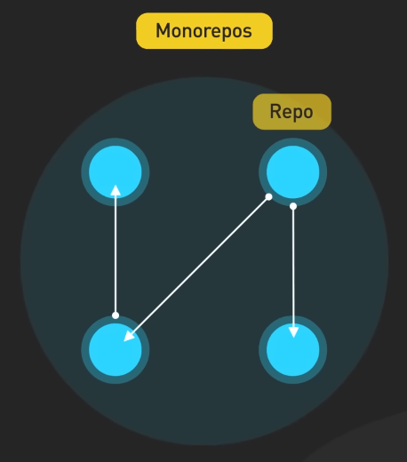
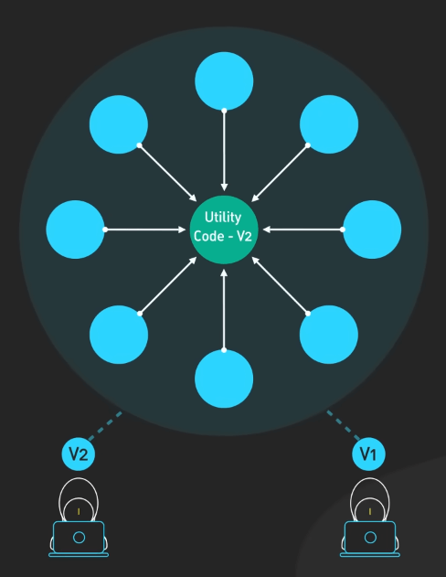
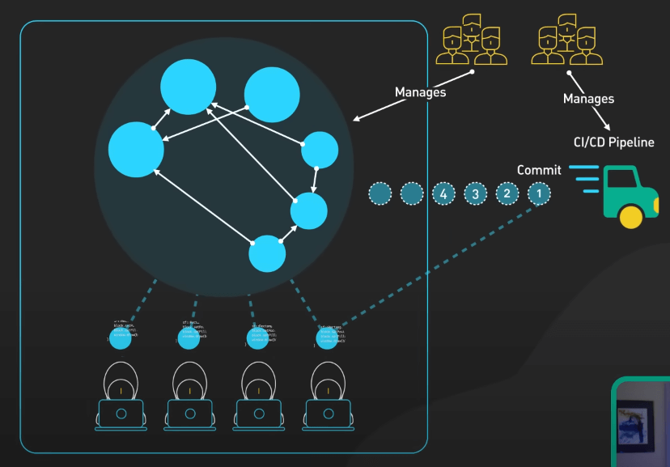
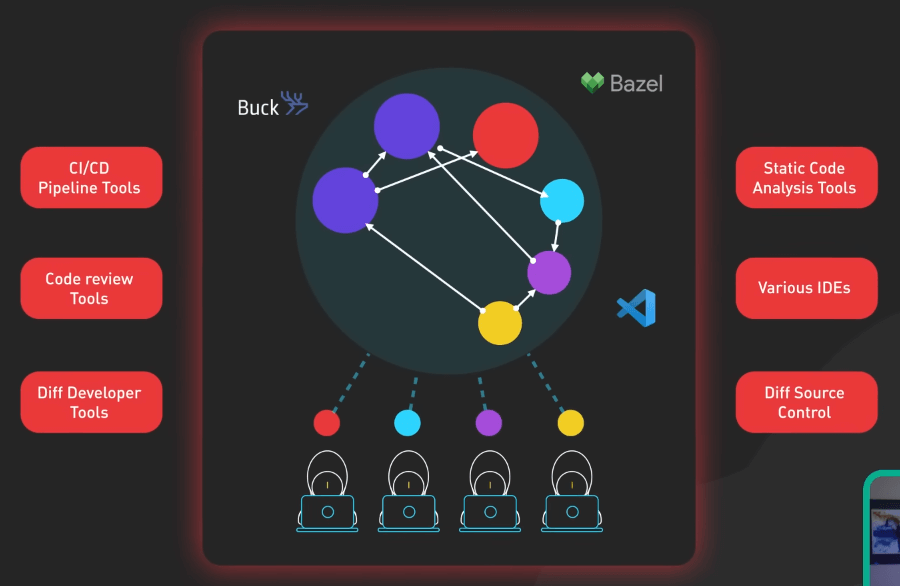
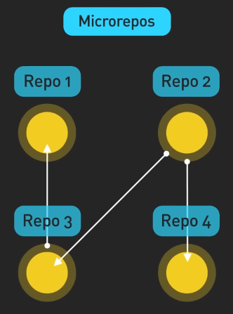
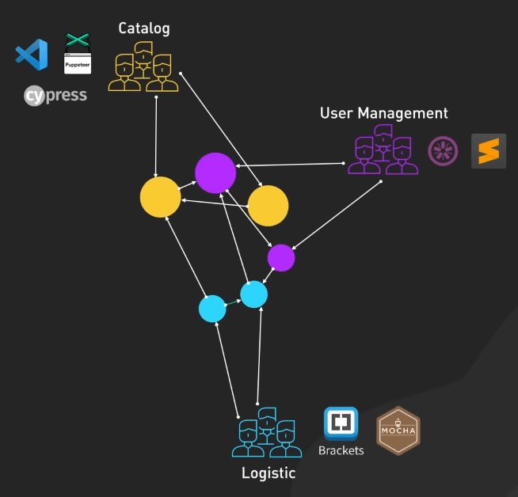
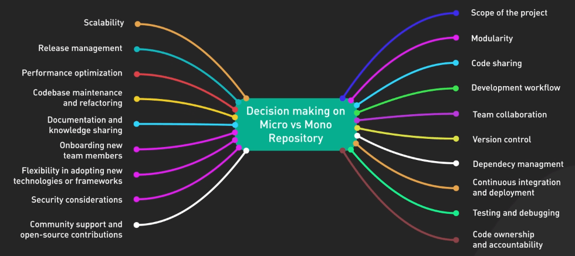
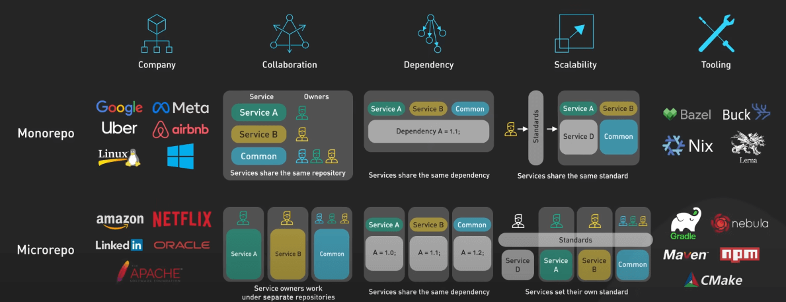

# Vì sao Google và Meta cho cả tỉ dòng code vào một repo lớn?

## Nguồn

 [Why Google and Meta Put Billion Lines of Code In 1 Repository?](https://www.youtube.com/watch?v=x3cANGNPyx0)

## Giới thiệu

Bạn đã bao giờ thắc mắc rằng làm sao những gã khổng lồ công nghệ như Google và Facebook quản lý được đống code khổng lồ của họ không? Hoặc có thể bạn đang cần tìm cách tốt nhất để cấu trúc code cho project của chính mình? Cách ta quản lý code có thể ảnh hưởng lớn đến năng suất team và sự ổn định của sản phẩm. Đó là lý do mà chúng ta sẽ thảo luận về hai cách quản lý code: monorepo và microrepo.

Trước khi đi vào chi tiết, fun fact cho bạn là, monorepo không phải là một khái niệm mới. Cả Linux và Windows đều được tạo ra bằng cách tiếp cận monorepo.

## Monorepo

Với monorepo, tưởng tượng rằng đó như một trung tâm chứa tất cả code của chúng ta. Các công ty như Google, Facebook và Uber đã chọn hướng tiếp cận này. Đó là một thư viện khổng lồ, mọi thứ nằm tại đó. Khá ghê đúng không? Vậy cách tiếp cận này có ưu và nhược điểm gì?

{:class="centered-img"}

### Ưu điểm

Ưu điểm dễ thấy nhất của monorepo là cho phép dễ dàng thay đổi code giữa các project khác nhau. Ví dụ ta có một hàm tiện ích được sử dụng trong 10 service khác nhau, và ta cần thay đổi gì đó trong hàm. Trong monorepo, ta chỉ cần một commit, tại đúng một chỗ.

Tiếp đến, quản lý dependency cũng hưởng lợi. Thay vì phải xử lý nhiều phiên bản của một package trên nhiều repo khác nhau, ta có một cái nhìn tổng thể về các dependency.

{:class="centered-img"}

Tính nhất quán là một ưu điểm lớn khác của monorepo. Code review đôi khi khá thiếu nhất quán, với các quy tắc và tiêu chuẩn khác nhau ở các team khác nhau. Với monorepo, mọi người đều tuân thủ cùng một bộ quy tắc. Và đừng quên việc tái sử dụng code. Bạn cần một chức năng đã được tạo ra cho một cái service khác hả? Xài lại cái code đó thôi. Ta có thể thấy mọi thứ trong monorepo, giúp việc tái sử dụng code trở nên dễ dàng.

### Nhược điểm

Monorepo yêu cầu lên kế hoạch cẩn thận và các công cụ phù hợp. Google đã phải xây dựng một công cụ dành riêng cho việc này, gọi là Bazel và cần một team lớn để hỗ trợ cái codebase siêu to khổng lồ này. Facebook dùng Buck cũng vì lý do đó. Khi repo phình to, nếu không quản lý cẩn thận, CI/CD sẽ chạy chậm như rùa. Vì vậy CI/CD cũng cần một đội ngũ lớn tương đương.

{:class="centered-img"}

Với các dev mới, một repo siêu to sẽ khiến họ bị choáng. Nếu có một codebase được tài liệu hóa tốt và một quá trình onboarding chuẩn, monorepo nào cũng chơi được.

Cuối cùng, dù mỗi team sở hữu một phần monorepo, tùy chỉnh có thể khá khó khăn. Team không thể sử dụng các công cụ hoặc thư viện khác nhau một cách độc lập do có thể xảy ra xung đột, và các thay đổi lớn cần xem xét toàn bộ codebase. Nhưng với việc sử dụng các công cụ như Bazel của Google và duy trì giao tiếp tốt, ta có thể cân bằng được trade-off này, cho phép các team phát triển linh hoạt trong các quy tắc chung.

{:class="centered-img"}

## Microrepo

Hướng tiếp cận này coi mỗi service hoặc thành phần hệ thống như một thực thể độc lập, với repo riêng. Các công ty như Amazon và Netflix đã chọn hướng tiếp cận phân tán này.

{:class="centered-img"}

### Ưu điểm

Rõ ràng là sự độc lập. Mỗi team có thể quản lý và mở rộng repo khi cần. Một ưu điểm khác là cô lập rủi ro. Nếu có vấn đề xảy ra ở một repo, nó sẽ không ảnh hưởng đến các repo khác, giảm thiểu tác động. Hướng tiếp cận này cũng cung cấp sự linh hoạt. Mỗi team có thể chọn công cụ tốt nhất cho repo của mình và tùy chỉnh môi trường theo nhu cầu cụ thể. Thêm nữa, mỗi team sở hữu repo của mình, giúp quản lý trách nhiệm và release dễ dàng hơn.

{:class="centered-img"}

### Nhược điểm

Đồng bộ hóa thay đổi qua nhiều repo có thể gặp khó khăn. Nó yêu cầu sự hợp tác chặt chẽ và có thể cần thêm các công cụ chuyên biệt. Quản lý dependency giữa các repo cũng phức tạp, nhưng có thể sử dụng các công cụ như Nexus hoặc Artifactory để hỗ trợ. 

Khi không có tiêu chuẩn chung, code standard có thể thiếu nhất quán, và đôi khi dẫn đến chất lượng code tệ hại. Để tránh điều này, ta cần thiết lập các quy tắc coding cho toàn bộ tổ chức. 

Thêm nữa, microrepo có thể dẫn đến việc trùng lặp code. Sao chép code giữa các repo làm tăng kích thước codebase và có thể dẫn đến lỗi. Để tránh điều này, người ta thường tạo thư viện chung cho code giống nhau.

## Cái nào ngon hơn?

Câu trả lời là tùy vào hoàn cảnh, hay nói chính xác hơn là tùy vào nhu cầu của team, kích thước công ty, tính chất của project, và văn hóa công ty. 

{:class="centered-img"}

Monorepo mang lại sự nhất quán, làm cho việc thay đổi giữa các project dễ dàng hơn, và khuyến khích tái sử dụng code. Nó phù hợp với các công ty lớn với nhiều team làm việc trên các project liên kết với nhau, nơi yêu cầu sự hợp tác và nhất quán. Tuy nhiên, monorepo yêu cầu việc lên kế hoạch cẩn thận và công cụ phù hợp. Nếu không quản lý tốt, nó có thể ảnh hưởng đến hiệu suất của CI/CD pipelines và giảm bớt sự linh hoạt của mỗi team.

Ngược lại, microrepo mang lại sự linh hoạt, cô lập rủi ro, và trách nhiệm rõ ràng. Nó có thể là lựa chọn tốt cho các công ty ưa chuộng sự tự chủ của team, đặc biệt nếu các team làm việc trên các project khác nhau. Tuy nhiên, nó cũng mang lại những thách thức riêng. Quản lý phức tạp hơn, đặc biệt là khi thực hiện thay đổi giữa các repo, trùng lặp code nữa, đó là những nguy cơ của microrepo nếu bạn không quản lý tốt.

{:class="centered-img"}
