# 8 giao thức mạng thông dụng

## Nguồn

 [Top 8 Most Popular Network Protocols Explained](https://www.youtube.com/watch?v=P6SZLcGE4us)

## HTTP

HTTP là xương sống của ngành phát triển web. HTTP sử dụng mô hình request - response. Các client sẽ gửi request đến server để lấy các tài nguyên như trang web, hình ảnh, hay dữ liệu API. Server sẽ trả về các response với các status code như 200 OK, 404 Not Found, hay 500 Internal Server Error. 

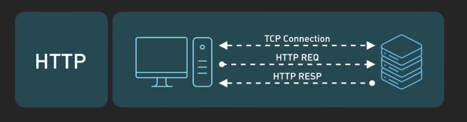{:class="centered-img"}

Dữ liệu được request sẽ được trả về trong phần body của response. 

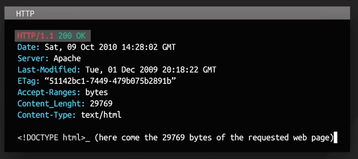{:class="centered-img"}

HTTP định nghĩa các phương thức như GET, POST, PUT, và DELETE để thực hiện các thao tác khác nhau trên server. Ví dụ, GET lấy dữ liệu, POST gửi dữ liệu form, và DELETE xóa tài nguyên.

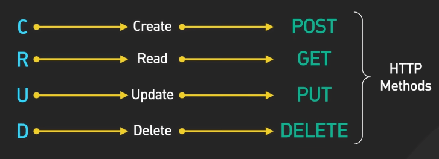{:class="centered-img"}

## HTTPS

HTTPS được xây dựng dựa trên HTTP bằng cách thêm mã hóa thông qua Transport Layer Security, hay TLS. 

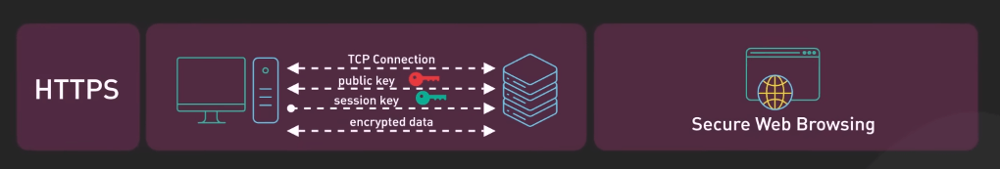{:class="centered-img"}

TLS cho phép browser và server thiết lập một kết nối được mã hóa, giống như hai người thỏa thuận sử dụng một mật mã bí mật. Kết nối được mã hóa này giữ cho dữ liệu được bảo mật khi truyền qua internet. Lưu lượng truy cập sẽ bị xáo trộn để trở nên vô nghĩa đối với bất kỳ ai cố gắng chặn nó. 

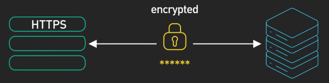{:class="centered-img"}

TLS cũng xác minh danh tính của server, ngăn chặn kẻ gian mạo danh các trang web hợp pháp trong các cuộc tấn công "man-in-the-middle". TLS cung cấp mã hóa, bảo mật và xác thực, là nền tảng cho HTTPS và các trang web an toàn. Hiểu được TLS sẽ giúp cấu hình HTTPS đúng cách để đảm bảo an toàn, điều này rất quan trọng đối với các trường hợp như ngân hàng và mua sắm trực tuyến.

## HTTP/3

HTTP/3 hướng đến việc cải thiện tốc độ và bảo mật, đồng thời khắc phục một số vấn đề hiệu suất khó chịu của các phiên bản trước. HTTP/3 sử dụng QUIC, được xây dựng trên UDP thay vì TCP. Điều này tối ưu hóa hiệu suất mà không có các hạn chế của TCP. 

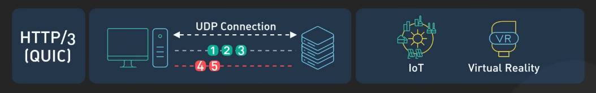{:class="centered-img"}

QUIC giảm thiểu độ trễ khi chuyển đổi mạng trên điện thoại thông minh. Khi rời khỏi nhà hoặc văn phòng, mạng sẽ ít bị chậm hơn. QUIC loại bỏ tình trạng tắc nghẽn do "head-of-line blocking", nơi một gói tin bị mất sẽ làm chậm các luồng phía sau nó, giúp các luồng khác không phải chờ một luồng bị tắc nghẽn. 

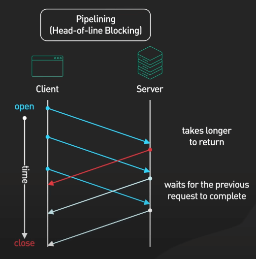{:class="centered-img"}

QUIC cũng tăng tốc quá trình thiết lập kết nối ban đầu bằng cách kết hợp các bước bắt tay mã hóa và truyền tải thành một bước duy nhất. Client có thể bỏ qua các round-trip cho các server đã kết nối trước đó. Việc khôi phục 0-RTT sẽ nhanh hơn nhiều. 

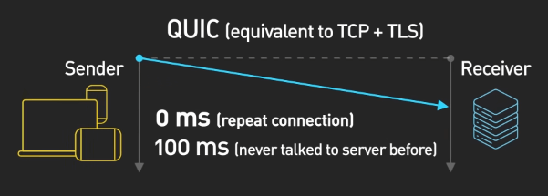{:class="centered-img"}

Ngoài ra, QUIC cung cấp mã hóa mặc định ở tầng giao vận. Tất cả dữ liệu kết nối đều được mã hóa, không chỉ dữ liệu ứng dụng, thậm chí cả các thông tin như số gói cũng được mã hóa. Đối với các ứng dụng hiện đại, mỗi mili giây đều quan trọng. HTTP/3 qua QUIC cho phép truyền dữ liệu nhanh hơn.

## WebSocket

Với giao tiếp thời gian thực, WebSocket là một bước tiến vượt bậc. Không giống như HTTP, WebSocket cung cấp giao tiếp hai chiều toàn diện trên một kết nối TCP duy nhất. WebSocket cho phép kết nối theo thời gian thực và luồng dữ liệu trực tiếp. 

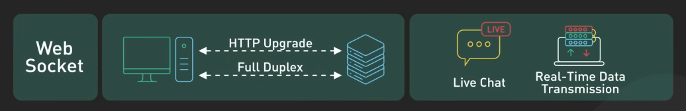{:class="centered-img"}

Bước bắt tay của WebSocket tái sử dụng kết nối TCP hiện có, sau đó các message có thể được truyền tự do theo cả hai hướng với cấu trúc đơn giản nhất.

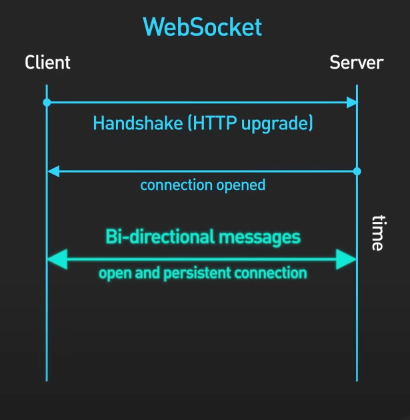{:class="centered-img"}

WebSocket hỗ trợ gửi các message nhỏ ngay lập tức với độ trễ rất thấp, lý tưởng cho các ứng dụng như chat, game hoặc cập nhật thời gian thực. Mã hóa thông qua TLS cũng được hỗ trợ để đảm bảo an toàn.

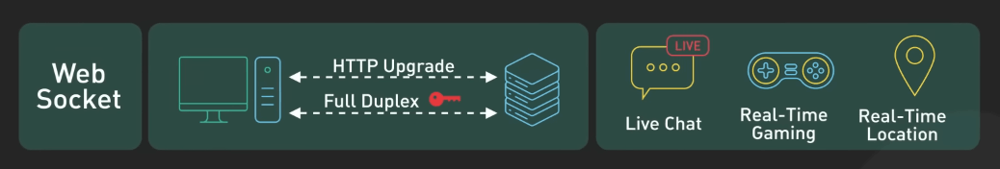{:class="centered-img"}

## TCP và UDP

TCP và UDP cung cấp nền tảng cho tầng giao vận của nhiều giao thức ứng dụng mà ta đã đề cập. 

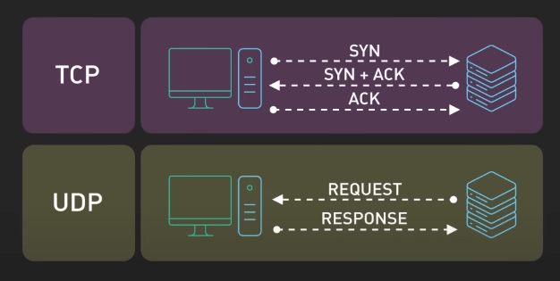{:class="centered-img"}

HTTP và WebSocket được xây dựng trên TCP. Chúng dựa vào khả năng truyền tải tin cậy, sắp xếp thứ tự dữ liệu và kiểm soát tắc nghẽn của TCP để trao đổi tin nhắn một cách trơn tru và duy trì kết nối thời gian thực ổn định. HTTP/3 sử dụng UDP thông qua giao thức QUIC, cho phép tối ưu hóa hiệu suất bằng cách giảm bớt hạn chế của TCP. Tuy nhiên, UDP thiếu tính tin cậy, vì vậy HTTP/3 thêm các kiểm tra để ngăn ngừa lỗi dữ liệu.

Đi sâu hơn một chút, TCP ưu tiên độ tin cậy hơn tốc độ. Các tính năng như kiểm tra lỗi, kiểm soát truyền tải và sắp xếp thứ tự dữ liệu đảm bảo hiệu suất ổn định. TCP điều chỉnh theo điều kiện mạng với việc kiểm soát lưu lượng và truyền lại khi cần. 

Ngược lại, UDP tập trung vào tốc độ hơn là độ tin cậy. Với việc kiểm tra lỗi rất ít và không có bắt tay, UDP giảm thiểu tải trọng cho các use case như trò chơi, điện thoại, Internet of Things và streaming. Tuy nhiên, dữ liệu UDP có thể bị hỏng do các gói tin bị mất. Kết hợp UDP với các bộ kiểm tra tính toàn vẹn ở tầng ứng dụng sẽ cân bằng giữa tốc độ và độ tin cậy.

## SMTP và FTP

Cuối cùng, SMTP và FTP cung cấp các tiêu chuẩn ở tầng ứng dụng cho việc chuyển email và file. SMTP (Simple Mail Transfer Protocol) là tiêu chuẩn để chuyển các email giữa các mail server. Hiểu được SMTP giúp cấu hình dịch vụ mail đúng cách và tránh các vấn đề như denied listing. 

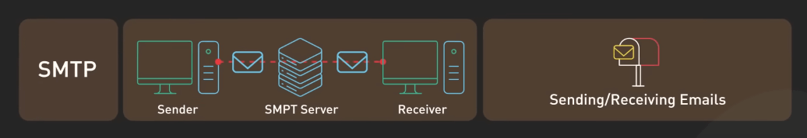{:class="centered-img"}

FTP cho phép tải lên và tải xuống các file giữa các server một cách hiệu quả. Nó vẫn phổ biến trong các quy trình làm việc dựa trên file, đặc biệt là trong các tổ chức tài chính.

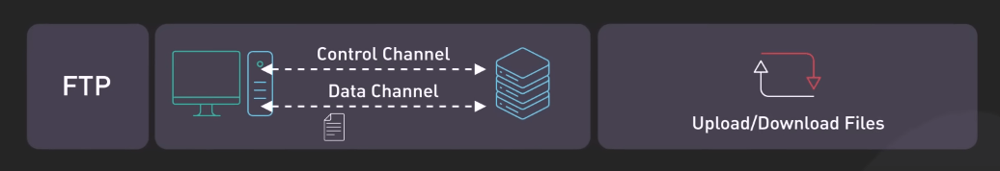{:class="centered-img"}
