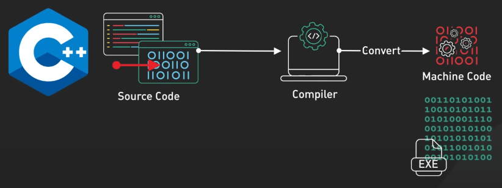
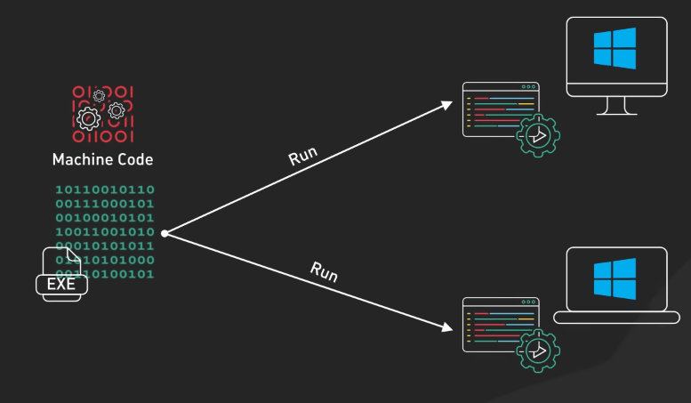
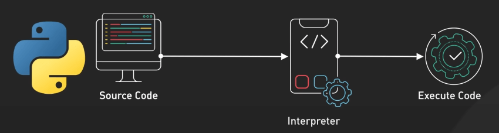
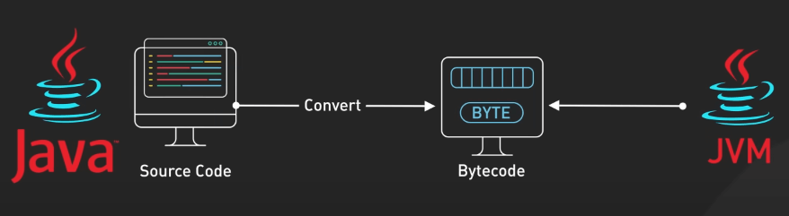
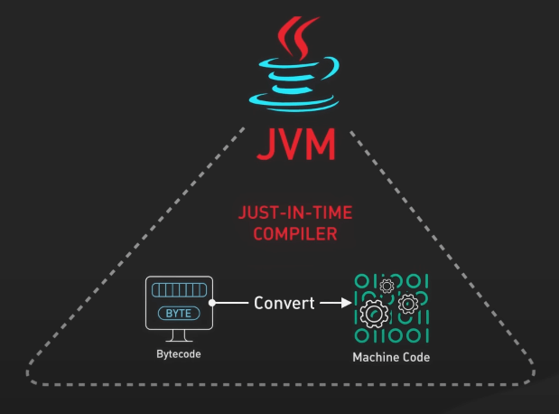
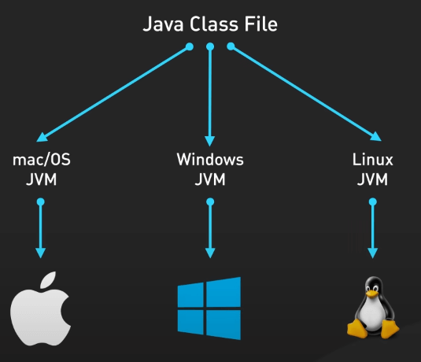

# Python vs. C++ vs. Java

## Nguồn

 [Python Vs C++ Vs Java!](https://www.youtube.com/watch?v=hnlz0YYCpBU)

## C++

C++ là một ngôn ngữ lập trình cần biên dịch. Quá trình bắt đầu khi code được gửi đến một Trình biên dịch (Compiler). Trình biên dịch phân tích tỉ mỉ code và dịch nó thành mã máy - những lệnh CPU đơn giản như add, move và jump. 

{:class="centered-img"}

Sau đó, trình biên dịch tạo ra một file thực thi chứa mã máy. Đây là chương trình độc lập có thể chạy trên bất kỳ máy tính nào tương thích. Điều này làm cho C++ trở thành lựa chọn lý tưởng cho các tác vụ yêu cầu hiệu suất cao, như lập trình game hay lập trình hệ thống.

{:class="centered-img"}

Các ngôn ngữ biên dịch như C++, Go, và Rust mất thời gian biên dịch ban đầu, nhưng khi chạy thì rất nhanh vì CPU không cần phải diễn giải hoặc biên dịch mã ngay lúc chạy.

## Python

Python, ngược lại, là một ngôn ngữ được diễn dịch (interpreted). Thay vì biên dịch, mã nguồn Python được gửi trực tiếp đến Trình diễn dịch (Interpreter), nó sẽ đọc và thực thi code theo thời gian thực. Điều này làm cho Python cực kỳ linh hoạt và dễ sử dụng, phù hợp cho các trường hợp yêu cầu phát triển nhanh và dễ đọc. 

{:class="centered-img"}

Python là lựa chọn ưa thích của các data scientist, data educator, và web dev, với các ứng dụng về phân tích dữ liệu và phát triển web. Tuy nhiên, việc thực thi từng dòng mã làm Python thường chậm hơn so với ngôn ngữ biên dịch. Các ngôn ngữ diễn dịch phổ biến khác bao gồm Javascript, Ruby, và Perl.

## Java

Java sử dụng cách tiếp cận kết hợp (hybrid). Code Java trước hết được biên dịch thành bytecode, sau đó được thực thi bởi Máy ảo Java (JVM). 

{:class="centered-img"}

JVM có Trình biên dịch tức thời (JIT), giúp chuyển đổi bytecode thành mã máy tối ưu ngay trước khi thực thi, làm cho mã Java chạy nhanh hơn so với ngôn ngữ diễn dịch. 

{:class="centered-img"}

Một lợi thế của Java là tính khả chuyển: JVM có mặt trên hầu hết các hệ điều hành, do đó mã Java có thể chạy trên bất kỳ thiết bị nào mà không cần biên dịch lại. 

{:class="centered-img"}

Java cũng được thiết kế cho việc an toàn và bảo mật cho bộ nhớ, với các tính năng như tự động quản lý bộ nhớ, giúp Java phù hợp với các ứng dụng lớn cho doanh nghiệp, yêu cầu sự ổn định, bảo mật và tính mở rộng cao. Các công ty công nghệ hàng đầu sử dụng Java để vận hành các hệ thống quan trọng - ví dụ, ứng dụng Android được phát triển bằng Java, và Netflix sử dụng Java trên toàn bộ cơ sở hạ tầng của mình. C# và Kotlin là một số ví dụ khác trong nhóm ngôn ngữ này.

## Kết luận

Nhờ các tiến bộ như Trình biên dịch tức thời, ranh giới giữa ngôn ngữ diễn dịch và bytecode đang mờ dần. Các trình duyệt JavaScript hiện đại sử dụng JIT để tối ưu hiệu suất. Tuy nhiên, JavaScript vẫn rơi vào loại ngôn ngữ diễn dịch. C++ cung cấp hiệu suất thô, Python linh hoạt và dễ sử dụng, còn Java cân bằng cả hai.
