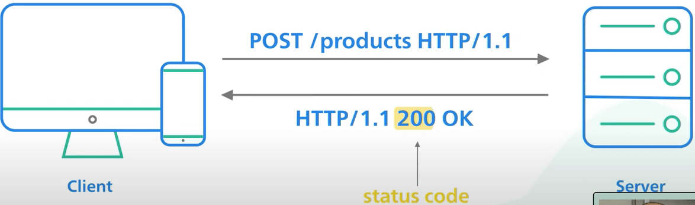

# REST API là gì?

## Nguồn

 [What Is REST API? Examples And How To Use It](https://www.youtube.com/watch?v=-mN3VyJuCjM)

## API là gì?

**API**, hay đầy đủ hơn là **Application Programming Interface**, là một cách để hai máy tính giao tiếp với nhau.

Chuẩn API chung được dùng bởi phần lớn các ứng dụng web và di động để giao tiếp với các server được gọi là **REST**, hay đầy đủ hơn là **REpresentational State Transfer**.

REST nghe có vẻ hàn lâm. Nó không phải là một dạng đặc tả gì cả. Nó là một tập hợp các quy tắc đã trở thành chuẩn chung cho việc xây dựng web API từ đầu những năm 2000. Một API tuân thủ chuẩn REST thì được gọi là một **RESTful API**. Một số ví dụ có thể kể ra là Twilio, Stripe và Google Maps.

{ style="display: block; margin: 0 auto" }

## Cơ bản về REST API

Một RESTful API tổ chức các tài nguyên theo một tập các **URI** duy nhất, hay đầy đủ hơn là **Uniform Resource Identifier**. Các URI này phân biệt các loại tài nguyên khác nhau trên server. Sau đây là vài ví dụ.

{ style="display: block; margin: 0 auto" }

Các tài nguyên nên được nhóm theo danh từ, không nên là động từ. Một API dùng để lấy tất cả products nên dùng `/products` chứ không nên dùng `/getAllProducts`. Client tương tác với tài nguyên bằng cách tạo một request đến endpoint tương ứng với tài nguyên đó thông qua HTTP. Request này có format cụ thể. Nó bao gồm URI của tài nguyên ta muốn truy cập, trước URI là một HTTP verb, thứ sẽ nói cho server biết ta muốn làm gì với tài nguyên đó.

{ style="display: block; margin: 0 auto" }

## CRUD là gì?

Một POST request cho thấy ta muốn tạo (CREATE) một tài nguyên mới. Một GET request cho thấy ta muốn đọc (READ) tài nguyên có sẵn. Một PUT request cho thấy ta muốn cập nhật (UPDATE) một tài nguyên hiện có. Một DELETE request cho thấy ta muốn xoá (DELETE) một tài nguyên hiện có. Bạn có thể đã nghe qua từ viêt tắt CRUD, 4 thứ trên kết hợp lại chính là nó.

Body của request có thể có HTTP request body chứa data, thường là mã hoá theo JSON. 

{ style="display: block; margin: 0 auto" }

Server nhận request, xử lý nó, sau đó format kết quả thành một response. Dòng đầu tiên của response chứa HTTP status code để nói cho client biết chuyện gì đã xảy ra với request.

Một RESTful API được cài đặt tốt sẽ trả về đúng HTTP status code. Code 2xx nghĩa là request đã thực hiện thành công. Code 4xx nghĩa là đã có lỗi gì đó xảy ra với request, ví dụ như request không đúng định dạng. Code 5xx nghĩa là có vấn đề với server khi thực hiện request, như việc server sập.

{ style="display: block; margin: 0 auto" }

Client có thể chọn để thử lại request 5xx vừa rồi. Ta nói "có thể thử lại" vì một số request không idempotent, và các request đó cần được chú ý nhiều hơn khi thử lại. Một API gọi là idempotent nghĩa là khi gọi cùng một request nhiều lần thì ảnh hưởng đến tài nguyên sẽ như khi chỉ gọi một lần. Các POST request thường không idempotent vì chùng thường được dùng để tạo tài nguyên mới.

Response body có thể có hoặc không, và có thể chứa data, thường được mã hoá theo JSON.

{ style="display: block; margin: 0 auto" }

Cài đặt REST nên theo hướng stateless, nghĩa là cả 2 phía server và client đều không lưu thông tin của nhau và mọi vòng request response (chu kì) đều độc lập với nhau. Điều này khiến cho các ứng dụng web dễ dàng scale up hơn.

Nếu một endpoint trả về lượng thông tin lớn, cần dùng pagination (phân trang). Chuẩn pagination thường được dùng là với các tham số "offset" và "limit". Ví dụ `/products?offset=50&limit=25` nghĩa là ta lấy 25 product từ product thứ 50 trở đi. Nếu các tham số trên không được truyền vào, ta cần dùng các tham số mặc định của chúng.

Cuối cùng, versioning API rất quan trọng. Versioning cho phép kĩ sư có thể tiếp tục cung cấp các phiên bản trước của các API mà không phải xoá hoàn toàn chúng đi. Điều này giúp client có đủ thời gian để chuyển qua API version mới. Có nhiều cách versioning, phổ biến nhất là đặt tiền tố `/v1/`, `/v2/` trước tài nguyên trên URI, ví dụ `/v1/products`, `/v2/products`.
