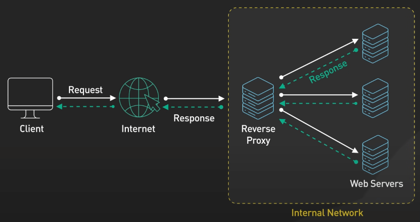
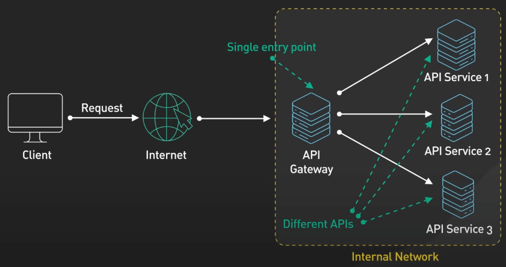
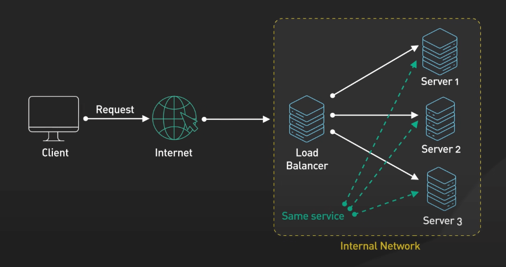
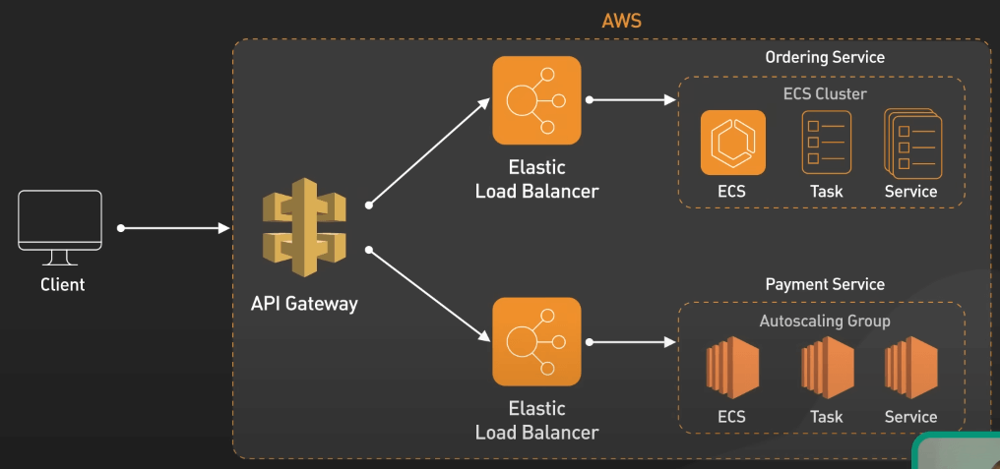
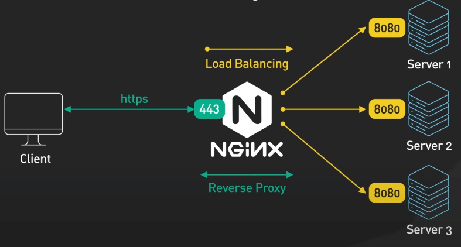

# Reserve Proxy vs. API Gateway vs. Load Balancer

## Nguồn

 [Reverse Proxy vs API Gateway vs Load Balancer](https://www.youtube.com/watch?v=RqfaTIWc3LQ)

## Reverse Proxy

Reverse Proxy là thành phần nằm trung gian giữa client và một hoặc nhiều server. Nó chuyển tiếp các request từ client đến server thích hợp và trả response từ server về lại client. Các lợi ích của Reverse Proxy bao gồm:

- Tăng tính bảo mật: Giấu thông tin của các server nằm phía sau Reverse Proxy.
- Phân phối tải: Reverse Proxy có thể phân phối tải giữa các server.
- Ngắt SSL: Reverse Proxy có thể giải mã SSL và chuyển tiếp request không mã hóa đến server.
- Nén dữ liệu: Reverse Proxy có thể nén dữ liệu trước khi chuyển tiếp đến client.
- Cache: Reverse Proxy có thể cache response từ server để giảm thời gian phản hồi.

Reverse Proxy cũng có lợi ngay cả khi phía sau nó chỉ có một server, giúp giấu danh tính của chính server đó, đồng thời quản lý các request một cách hiệu quả.

{:class="centered-img"}

## API Gateway

API Gateway đóng vai trò là một cổng thông tin giữa client và các dịch vụ backend. Nó xử lý các nhiệm vụ như: định tuyến request, xác thực, ủy quyền, rate limiting và monitoring. API Gateway có vai trò quan trọng trong kiến trúc microservice, nó cung cấp một cách tiếp cận đồng nhất để quản lý sự phức tạp của các dịch vụ backend đứng sau, và đảm bảo tính an toàn và hiệu quả của các giao tiếp giữa client và server.

{:class="centered-img"}

## Load Balancer

Load Balancer phân phối các request đến một tập các server backend. Nó đảm bảo tính khả dụng và độ tin cậy cao cho hệ thống, bằng cách điều hướng các request đến các server hoạt động tốt. Nó cũng có thể linh động thêm hoặc bớt các server backend khi cần thiết, giúp tối ưu hóa hiệu suất hệ thống.

Load Balancer dùng nhiều chiến lược phân phối tải khác nhau, bao gồm: Round Robin, Least Connections, IP Hashing, ... để phân phối request và tải đều giữa các server.

{:class="centered-img"}

## Ví dụ

Các công nghệ này tuy riêng biệt nhau nhưng thường được kết hợp với nhau để tạo ra một ứng dụng web có tính mở rộng cao. 

Ví dụ, các ứng dụng chạy trên AWS thường sử dụng Amazon API Gateway và Elastic Load Balancer với nhau. Amazon API Gateway cung cấp interface đồng nhất cho client để gửi các request dựa trên route đến các dịch vụ backend khác nhau, mỗi dịch vụ này có Elastic Load Balancer để phân phối tải giữa các server.

{:class="centered-img"}

Một ví dụ khác là nginx, vừa đóng vai trò Load Balancer, mà cũng vừa là Reverse Proxy. Thông thường, nginx sẽ nằm trước các server backend để phân phối tải dựa trên các configured rule. Về phần Reverse Proxy, nó có thể cache response từ server, ngắt SSL cùng các tính năng bảo mật khác.

{:class="centered-img"}
