# Scalability là gì?

## Nguồn

 [Scalability Simply Explained in 10 Minutes](https://www.youtube.com/watch?v=EWS_CIxttVw)

## Scalability là gì?

Nhìn chung, một hệ thống được gọi là scalable (có thể mở rộng quy mô) khi nó có thể xử lý tải tăng bằng cách thêm tài nguyên mà không ảnh hưởng đến hiệu suất. Nhưng còn một khía cạnh khác nữa ở đây. Scalability không chỉ là về việc xử lý nhiều hơn mà còn là về việc xử lý một cách hiệu quả hơn. Nó liên quan đến việc áp dụng một chiến lược chi phí hiệu quả để mở rộng khả năng của hệ thống. Điều này chuyển sự tập trung từ việc chỉ đơn giản là chịu đựng tải tăng sang việc tối ưu hóa cách ta mở rộng hệ thống. Điều này đặt ra một số câu hỏi quan trọng. Nếu ta thêm nhiều bộ xử lý hoặc server, làm thế nào ta phối hợp công việc giữa chúng? Với chi phí phối hợp này, nó có ảnh hưởng đến hiệu suất mà ta đang hướng tới không? Việc xem xét những yếu tố này rất quan trọng để đảm bảo việc thêm tài nguyên thực sự mang lại những lợi ích mà ta mong đợi.

Khi nói về scalability, sẽ tốt hơn nếu ta so sánh các hệ thống hơn là đánh giá chúng dựa trên việc có thể mở rộng hay không. Một cách hiệu quả để làm điều này là phân tích đường cong response so với request. Hãy tưởng tượng ta có một biểu đồ, trục x biểu thị request và trục y biểu thị thời gian response. Một hệ thống mở rộng tốt sẽ có một đường cong ít dốc hơn khi request tăng lên. So sánh hình ảnh giúp ta đánh giá một cách khách quan khả năng mở rộng của các hệ thống khác nhau.

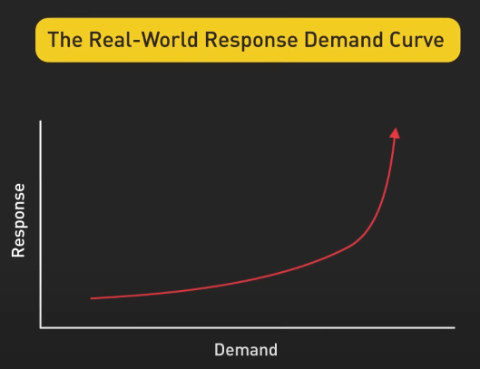{:class="centered-img"}

Nhưng ta cũng cần nhớ rằng không có hệ thống nào có thể mở rộng vô hạn. Mọi hệ thống đều có giới hạn của nó và cuối cùng, nhu cầu sẽ vượt quá khả năng tài nguyên. Điểm chuyển này thường xuất hiện như một điểm gọi là knee trong đường cong response so với request, nơi hiệu suất bắt đầu giảm mạnh. Mục tiêu của chúng ta trong thiết kế hệ thống là đẩy điểm knee này sang phải càng xa càng tốt, trì hoãn việc hiệu suất giảm đi cho đến khi không thể trì hoãn được nữa.

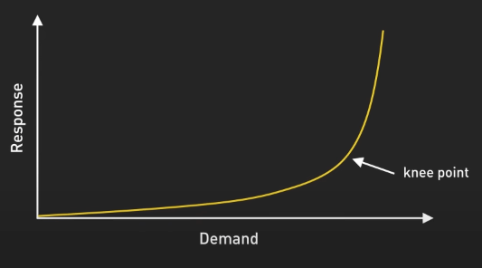{:class="centered-img"}

## Trở ngại của scalability

Vậy điều gì gây nên các trở ngại cho scaling? Có hai điểm chính, các thành phần tập trung và các hoạt động có độ trễ cao. 

Một thành phần tập trung như một server cơ sở dữ liệu duy nhất xử lý tất cả các transaction tạo ra một giới hạn cứng về số lượng request mà hệ thống của chúng ta có thể xử lý một cách đồng thời. 

Các hoạt động có độ trễ cao như các tác vụ xử lý dữ liệu tốn thời gian có thể kéo dài thời gian response tổng thể dù ta có thêm bao nhiêu tài nguyên đi chăng nữa. 

Tuy nhiên, đôi khi các thành phần tập trung cũng cần thiết do ràng buộc kinh doanh hoặc kỹ thuật. Trong những trường hợp như vậy, ta cần tìm cách giảm thiểu ảnh hưởng như tối ưu hiệu suất, triển khai chiến lược caching hoặc sử dụng replication để phân phối tải.

## Cách xây dựng hệ thống scalable

Vậy làm thế nào để xây dựng hệ thống có thể mở rộng tốt? Hãy tập trung vào ba nguyên tắc chính: statelessness, loose coupling và asynchronous processing.

Statelessness nghĩa là server không giữ dữ liệu cụ thể của client giữa các request. Bằng cách giữ server stateless, ta dễ dàng mở rộng theo chiều ngang vì bất kỳ server nào cũng có thể xử lý bất kỳ request nào và nó cũng tăng khả năng chịu lỗi vì không có trạng thái quan trọng có thể mất nếu server bị down. 

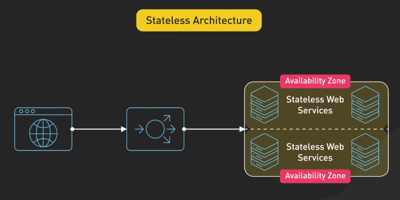{:class="centered-img"}

Tuy nhiên, cần lưu ý rằng một số ứng dụng yêu cầu duy trì trạng thái như phiên người dùng trong ứng dụng web, trong những trường hợp như vậy, ta có thể đưa các trạng thái ra ngoài bằng cách sử dụng cache phân tán hoặc cơ sở dữ liệu. Điều này cho phép các web server vẫn stateless trong khi trạng thái được bảo toàn.

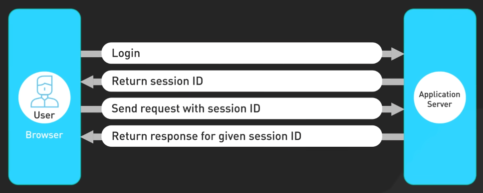{:class="centered-img"}

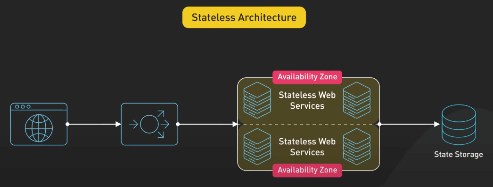{:class="centered-img"}

Loose coupling là việc thiết kế các thành phần hệ thống có thể hoạt động độc lập với ít phụ thuộc nhất có thể vào nhau bằng cách sử dụng interface hoặc API được định nghĩa rõ ràng để giao tiếp. 

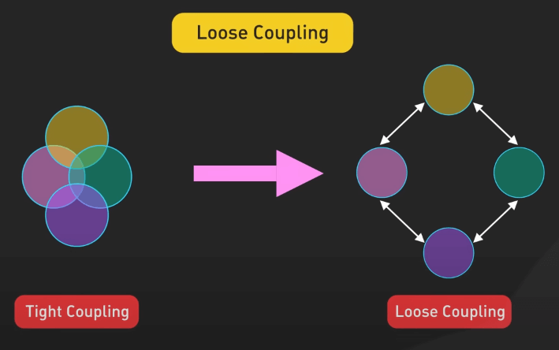{:class="centered-img"}

Ta có thể sửa đổi hoặc thay thế các thành phần riêng lẻ mà không gây ra ripple effects trong toàn bộ hệ thống. Sự mô đun hóa này rất quan trọng cho việc mở rộng vì nó cho phép ta mở rộng các phần cụ thể của hệ thống dựa trên nhu cầu của từng thành phần. Ví dụ, nếu một microservice trở thành một điểm nghẽn, ta có thể mở rộng chỉ mình service đó mà không ảnh hưởng đến phần còn lại của hệ thống.

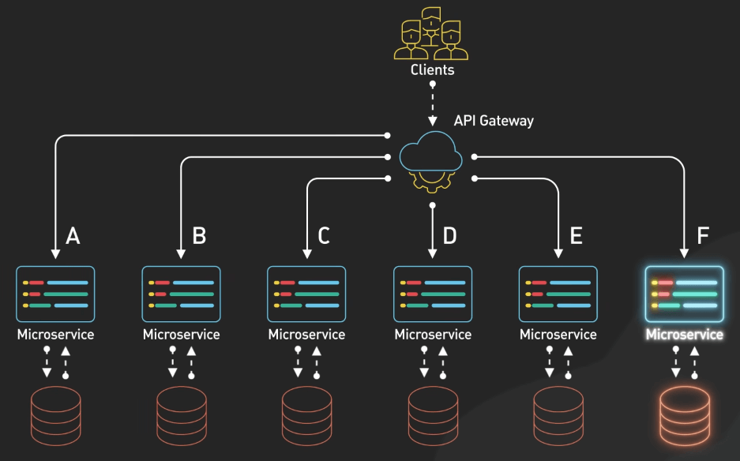{:class="centered-img"}

Cuối cùng, asynchronous processing thay vì cho phép các service gọi nhau trực tiếp và chờ đợi response, ta có thể sử dụng kiến trúc dựa trên sự kiện để giao tiếp bằng cách phát ra và lắng nghe sự kiện, cho phép thực hiện không đồng bộ và tương tác linh hoạt hơn. Cách này giúp giảm sự phụ thuộc giữa các service và giảm rủi ro của lỗi lan rộng trong các hệ thống phức tạp. Tuy nhiên, xử lý không đồng bộ có thể tạo ra sự phức tạp trong việc xử lý lỗi, gỡ lỗi và duy trì tính nhất quán dữ liệu, vì vậy ta phải thiết kế các hệ thống này thật cẩn thận.

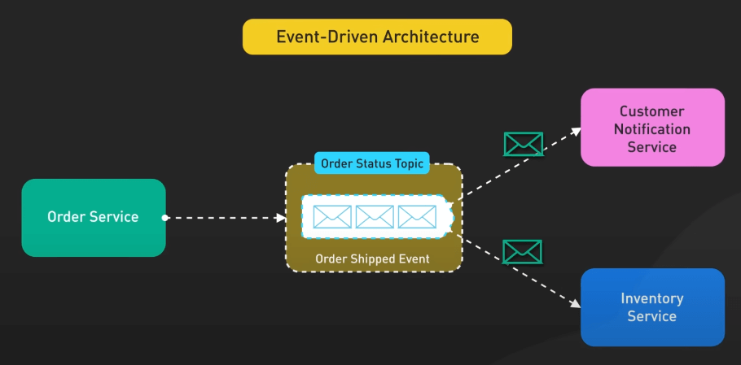{:class="centered-img"}

## Chiến lược mở rộng

Về các chiến lược mở rộng, ta có hai cách: vertical scaling và horizontal scaling.

Vertical scaling hay scaling up bao gồm việc tăng khả năng của một máy duy nhất. Điều này có thể bao gồm nâng cấp lên một server lớn hơn với nhiều CPU, RAM hoặc bộ nhớ. Nó đơn giản và có thể hiệu quả cho các ứng dụng có yêu cầu cụ thể hoặc khi ta ưu tiên sự đơn giản. Ví dụ, vertical scaling có thể ưu tiên cho hệ thống cơ sở dữ liệu khó phân tán theo chiều ngang do ràng buộc về tính nhất quán. Tuy nhiên, vertical scaling có những hạn chế về mặt vật lý và kinh tế, ta chỉ có thể làm cho một máy mạnh đến mức nào đó thôi và giá cả tăng vọt khi ta tiến đến giới hạn của phần cứng.

Horizontal scaling hay scaling out bao gồm việc thêm nhiều máy tính để chia sẻ công việc thay vì một máy mạnh. Ta sẽ có nhiều server làm việc song song. Cách tiếp cận này đặc biệt hiệu quả cho các ứng dụng cloud native và cung cấp khả năng chịu lỗi tốt hơn. Nó thường hiệu quả hơn cho các hệ thống quy mô lớn vì ta có thể thêm hoặc giảm tài nguyên dựa trên nhu cầu hiện tại. Tuy nhiên, horizontal scaling đưa ra những thách thức như tính nhất quán dữ liệu, tăng chi phí mạng và sự phức tạp trong việc quản lý hệ thống phân tán.

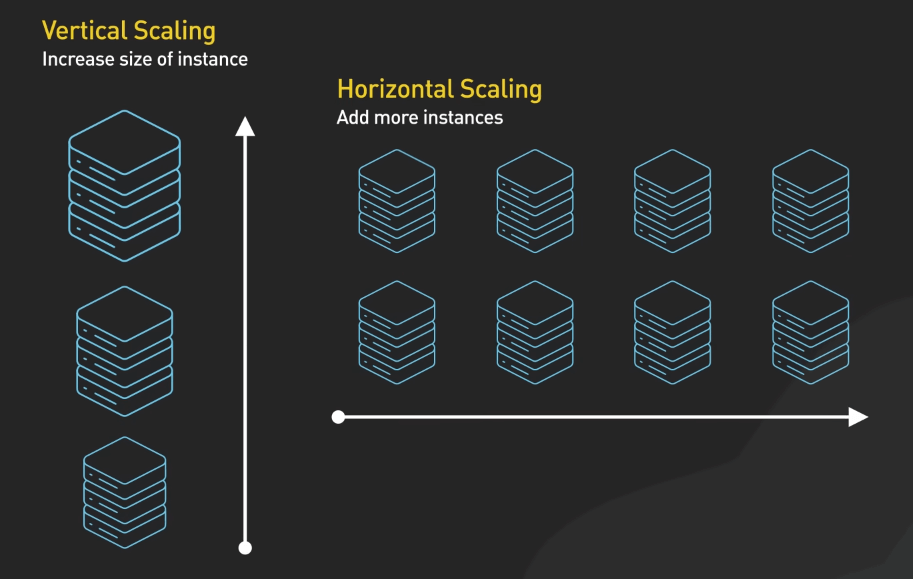{:class="centered-img"}

## Các kỹ thuật xây dựng hệ thống scalable

Giờ ta đến với các kỹ thuật xây dựng hệ thống scalable. Đầu tiên, load balancing. Hãy tưởng tượng load balancer như là người hướng dẫn giao thông của hệ thống, định hướng các request đến server phù hợp nhất để xử lý chúng. Nếu không có load balancer, ta có thể gặp tình trạng một server bị quá tải trong khi các server khác không làm gì cả. 

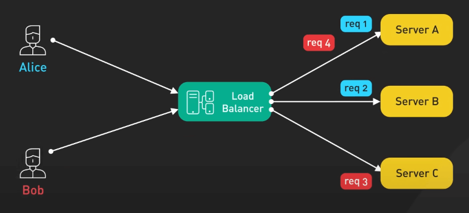{:class="centered-img"}

Load balancer có thể sử dụng các thuật toán như round robin, least connections hoặc dựa trên hiệu suất để phân phối traffic một cách hiệu quả.

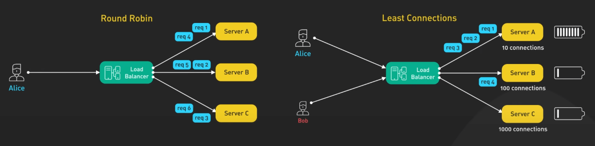{:class="centered-img"}

Tiếp theo là caching. Caching giống như việc cung cấp cho hệ thống một bộ nhớ ngắn hạn bằng cách lưu trữ dữ liệu được truy cập thường xuyên gần nơi cần nó nhất, dù đó là ở phía client, phía server hoặc trong một cache phân tán. Ta có thể giảm đáng kể thời gian trễ và giảm tải cho hệ thống backend.

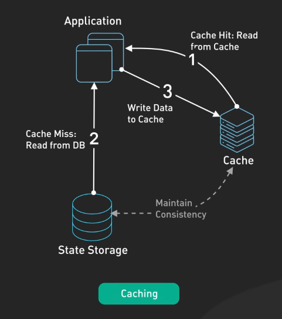{:class="centered-img"}

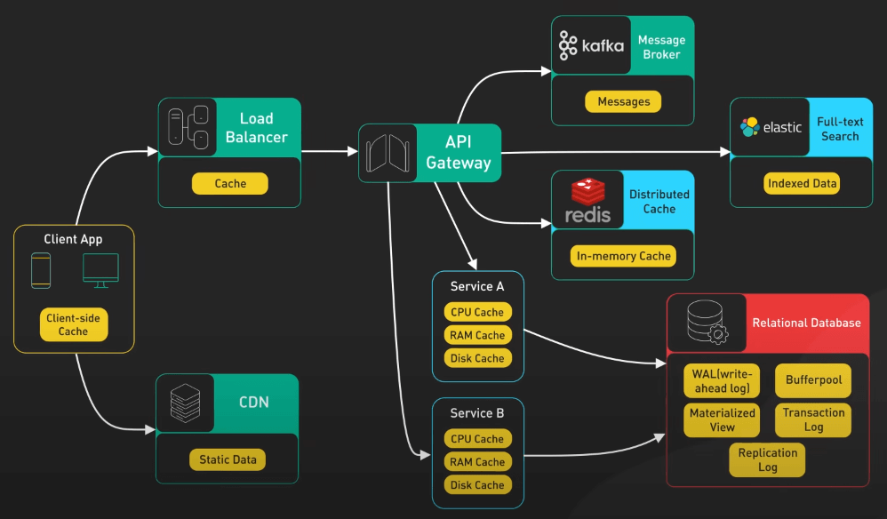{:class="centered-img"}

Triển khai Content Delivery Network (CDN) cũng có thể giảm tải và cải thiện thời gian response cho người dùng trên toàn cầu khi dữ liệu của chúng ta tăng lên.

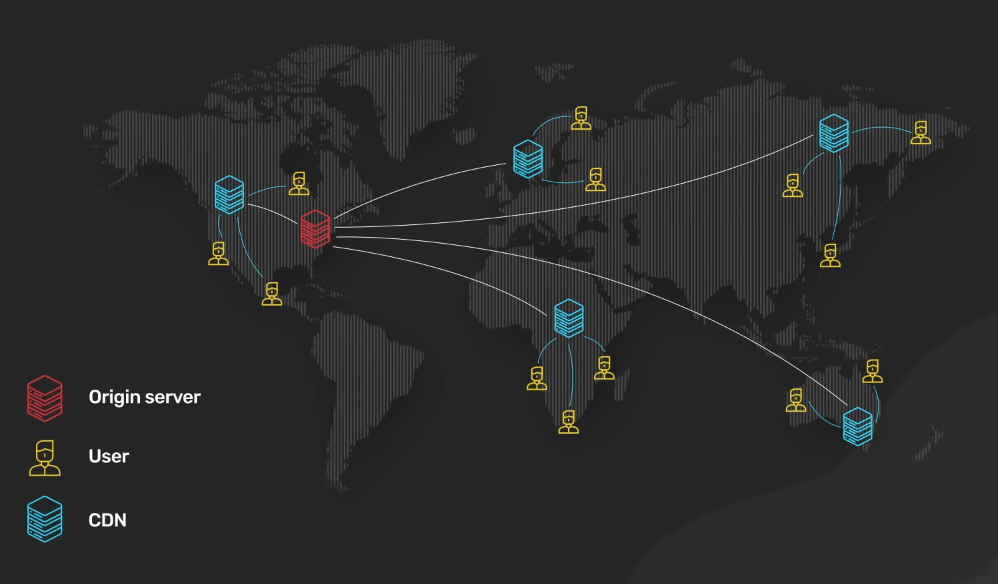{:class="centered-img"}

Sharding cũng rất quan trọng, nó bao gồm việc chia các tập dữ liệu lớn thành các phần nhỏ hơn dễ quản lý hơn, mỗi phần được lưu trữ trên các server khác nhau. Điều này cho phép xử lý dữ liệu song song và phân phối công việc trên nhiều máy tính.

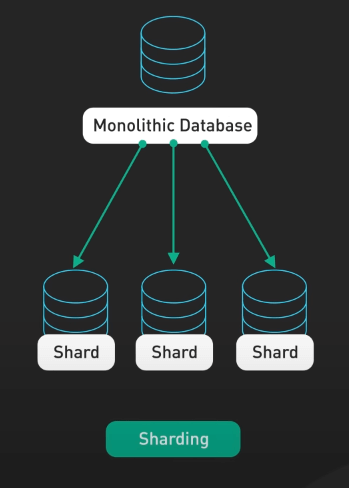{:class="centered-img"}

Mấu chốt là cần chọn một chiến lược sharding và các key dựa trên các pattern truy cập dữ liệu, để đảm bảo phân phối đều và giảm thiểu các truy vấn chéo. Chọn key cẩn thận sẽ giúp tránh tình trạng hotspots, nơi một số key trở nên quá tải trong khi các key khác không được sử dụng đến.

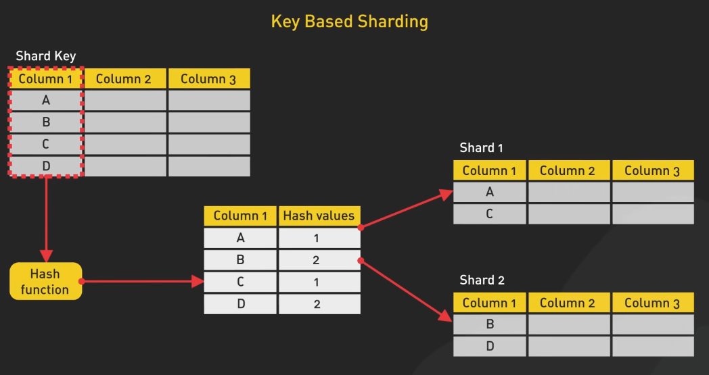{:class="centered-img"}

Nguyên tắc vàng trong scalability là tránh tài nguyên tập trung mỗi khi có thể. Các thành phần tập trung trở thành điểm nghẽn khi tải cao. Thay vào đó, hãy nghĩ về các thành phần phân tán. Nếu cần một hàng đợi, hãy xem xét việc sử dụng nhiều hàng đợi để phân phối công việc. 

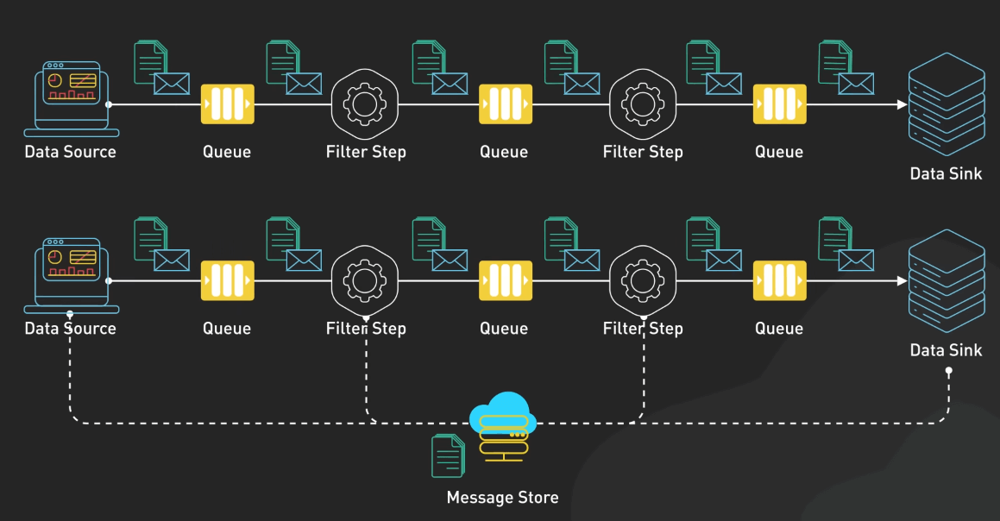{:class="centered-img"}

Đối với các tác vụ chạy lâu, chia nhỏ chúng thành các tác vụ độc lập nhỏ hơn có thể xử lý song song sẽ giúp phân phối công việc hiệu quả hơn. 

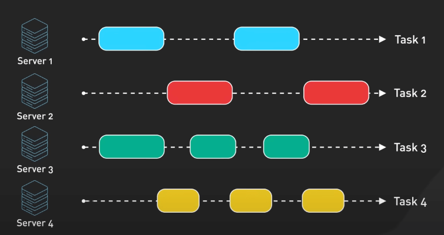{:class="centered-img"}

Các pattern thiết kế như fan out, pipes và filters có thể giúp phân phối công việc hiệu quả trên hệ thống.

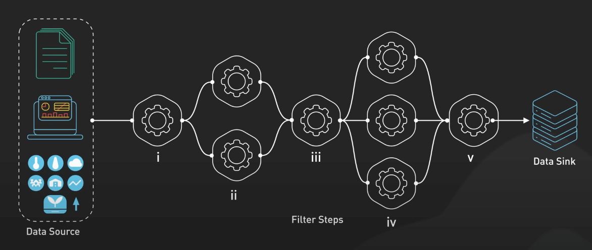{:class="centered-img"}

Cuối cùng, mô hình hóa hệ thống thành các mô-đun độc lập kết hợp thông qua giao diện hoặc API được định nghĩa rõ ràng sẽ tăng cường cả khả năng mở rộng và dễ bảo trì. Mô hình modular này giúp tránh những rủi ro của kiến trúc Monolithic, nơi thay đổi ở một khu vực có thể có hậu quả không mong muốn ở nơi khác. Trong hệ thống modular, ta có thể mở rộng, sửa đổi hoặc thay thế các thành phần riêng lẻ mà không ảnh hưởng đến toàn bộ ứng dụng.

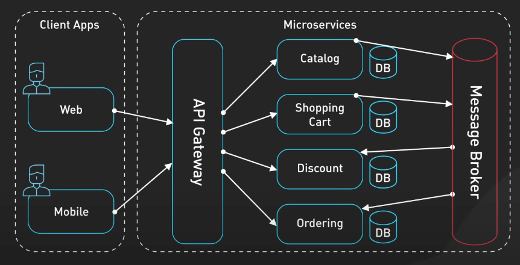{:class="centered-img"}

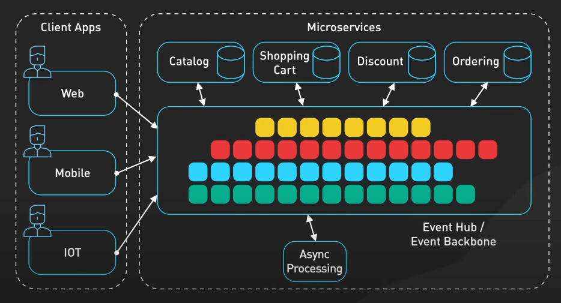{:class="centered-img"}

## Kết luận

Xây dựng một hệ thống scalable không phải là việc làm đó rồi thôi. Nó là một quá trình lâu dài, kết hợp việc theo dõi, phân tích và tối ưu hóa. Chú ý đến cac metric như mức tiêu thụ CPU, tiêu thụ bộ nhớ, băng thông mạng, thời gian response, thông lương. Các metric này rất giá trị khi ta muốn tìm điểm nghẽn và ra các quyết định scale khi nào và như thế nào vì các ứng dụng cũng phát triển theo thời gian với các yêu cầu về scale. Ta cần linh hoạt và sẵn sàng điều chỉnh kiến trúc khi cần thiết. Những gì hoạt động hôm nay có thể không đủ vào ngày mai. Ta cần liên tục đánh giá các quyết định thiết kế và sẵn sàng áp dụng các kỹ thuật mở rộng mới khi nhu cầu thay đổi.
