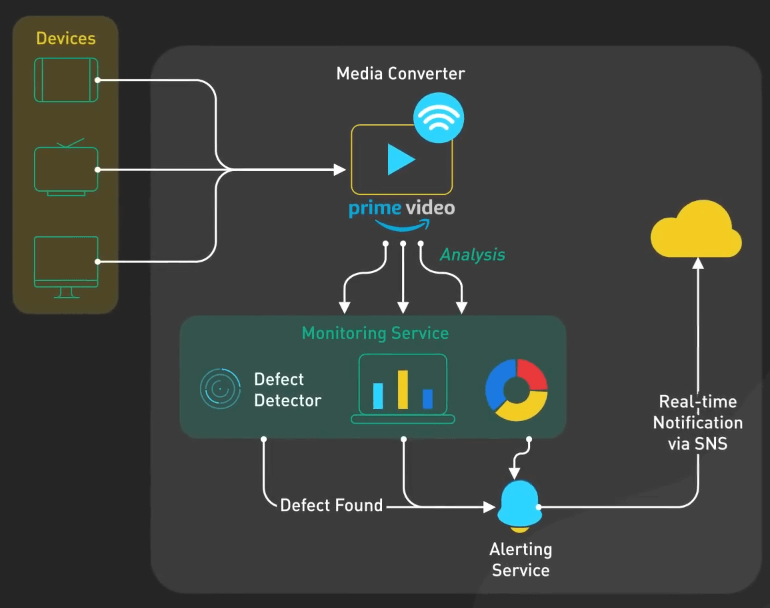
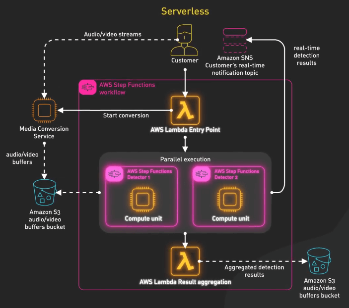
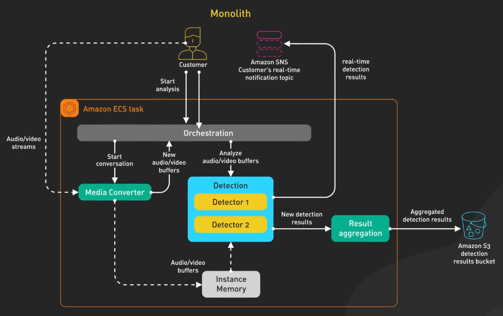
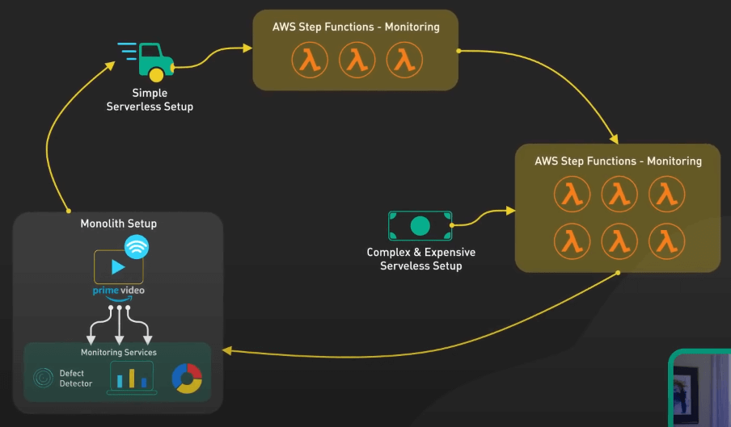
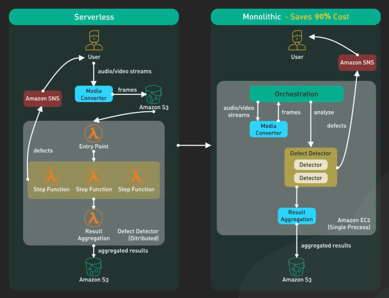

# Amazon Prime Video từ bỏ AWS Serverless, tiết kiệm 90% chi phí

## Nguồn

 [Amazon Prime Video Ditches AWS Serverless, Saves 90%](https://www.youtube.com/watch?v=JTp0TY_2hXM)

## Giới thiệu

Trong bài viết này, ta sẽ thảo luận một case study khá thú vị trong kiến trúc phần mềm. Gần đây, Amazon Prime Video gây tranh cãi khi chia sẻ trải nghiệm chuyển service giám sát từ kiến trúc serverless sang kiến trúc monolithic, giúp giảm tới 90% chi phí. Hãy cùng tìm hiểu xem nhé.

## Chi tiết

### Serverless

Dịch vụ Prime Video cần giám sát chất lượng hàng ngàn live stream theo thời gian thực. Công cụ giám sát này nhận diện các sự cố về chất lượng như block corruption, video freeze, và các vấn đề về đồng bộ. Quá trình này gồm ba bước: bộ chuyển đổi media, bộ phát hiện lỗi, và thông báo theo thời gian thực.

{:class="centered-img"}

Phiên bản ban đầu của dịch vụ này sử dụng một hệ thống phân tán với AWS Step Functions và Lambda, giúp họ xây dựng dịch vụ nhanh chóng. Tuy nhiên, kiến trúc này dẫn đến chi phí cao và các vấn đề về mở rộng.

Có hai thao tác tốn kém trong thiết kế này. Đầu tiên là quá trình điều phối (orchestration). AWS Step Functions tính phí người dùng dựa trên các lần chuyển trạng thái (state transitions), và quy trình điều phối thực hiện nhiều lần chuyển trạng thái mỗi giây. Thứ hai là việc truyền dữ liệu giữa các thành phần phân tán. Dữ liệu trung gian được lưu trữ trong Amazon S3, và việc truyền dữ liệu sẽ càng tốn kém khi thực hiện ở quy mô lớn.

{:class="centered-img"}

### Monolithic

Để giải quyết vấn đề chi phí, Prime Video đã áp dụng kiến trúc monolithic. Bộ chuyển đổi media và bộ phát hiện lỗi được triển khai trong cùng một process, giúp loại bỏ nhu cầu sử dụng S3 làm kho lưu trữ trung gian, giảm chi phí truyền dữ liệu và đơn giản hóa logic điều phối. Thay đổi này giúp tiết kiệm chi phí lên tới 90%.

{:class="centered-img"}

## Tranh cãi

Điều quan trọng cần lưu ý là case study này chỉ ra một trường hợp cụ thể mà kiến trúc monolithic có lợi. Anh em mạng xã hội đã dậy sóng với nhiều ý kiến khác nhau. Tuy nhiên, điểm cính là Amazon Prime Video đã tuân theo tôn chỉ "Serverless trước", để họ thử nghiệm nhanh chóng và mở rộng khi cần. Amazon bắt đầu nhanh với một nguyên mẫu sử dụng các thành phần serverless, sau đó chuyển sang một giải pháp hiệu quá và có khả năng mở rộng khi cần. Đây là một cách tiếp cận thông minh trong phát triển phần mềm.

Quá trình chuyển đổi là một bước tái cấu trúc (refactoring), không phải là việc thay đổi hoàn toàn toàn bộ hệ thống. CTO của Amazon, Werner Vogels, nhấn mạnh tầm quan trọng của việc phát triển các hệ thống phần mềm có thể tiến hóa và giữ tâm thế cởi mở khi xem xét lại kiến trúc: "Xây dựng các hệ thống phần mềm có khả năng tiến hóa là một chiến lược, không phải là một cái đức tin nào đó mà ta phải tuân theo. Việc xem xét lại các kiến trúc với tâm thế cởi mở là điều bắt buộc." Cựu Phó Chủ tịch của Amazon, Adrian Cockcroft, giải thích phương pháp "Serverless trước" mà đội ngũ Prime Video theo đuổi và giải thích thêm rằng ông không ủng hộ việc chỉ dùng serverless, cần có các cách tiếp cận linh hoạt.

Nghiên cứu điển hình này cho thấy rằng microservices không phải lúc nào cũng là lựa chọn tốt nhất, và chúng ta nên cởi mở hơn trong việc thảo luận về việc phát triển các kiến trúc dựa trên những trường hợp cụ thể. Việc phân tách các thành phần thành các microservices phân tán có thể kèm theo chi phí lớn, và cần phải cân nhắc kỹ lưỡng giữa cái lợi và cái hại trước khi đưa ra quyết định.

{:class="centered-img"}

Đây là minh chứng cho thấy tầm quan trọng của việc xem xét từng trường hợp khi lựa chọn kiến trúc hệ thống. Nó chứng tỏ rằng không có giải pháp nào là phù hợp cho tất cả trong kiến trúc phần mềm. Bạn cần phải giữ một cái nhìn khách quan và không có trường hợp nào giống nhau cả.

{:class="centered-img"}
