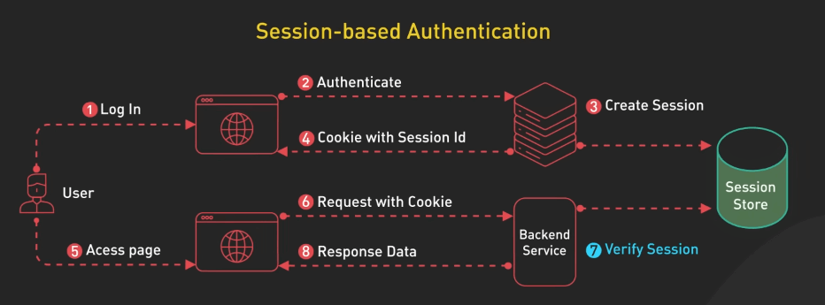
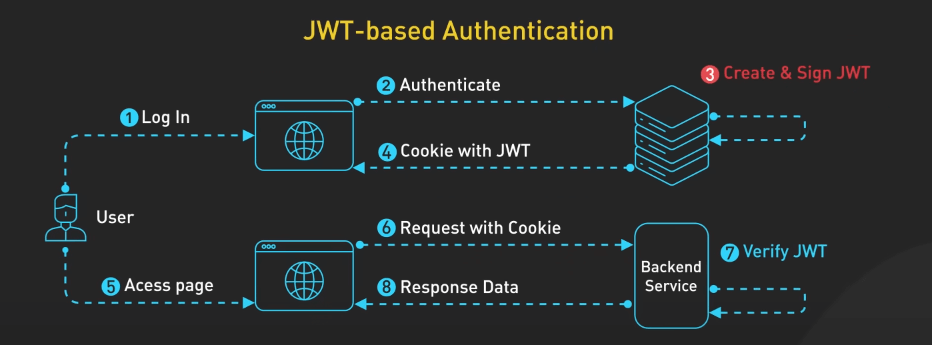
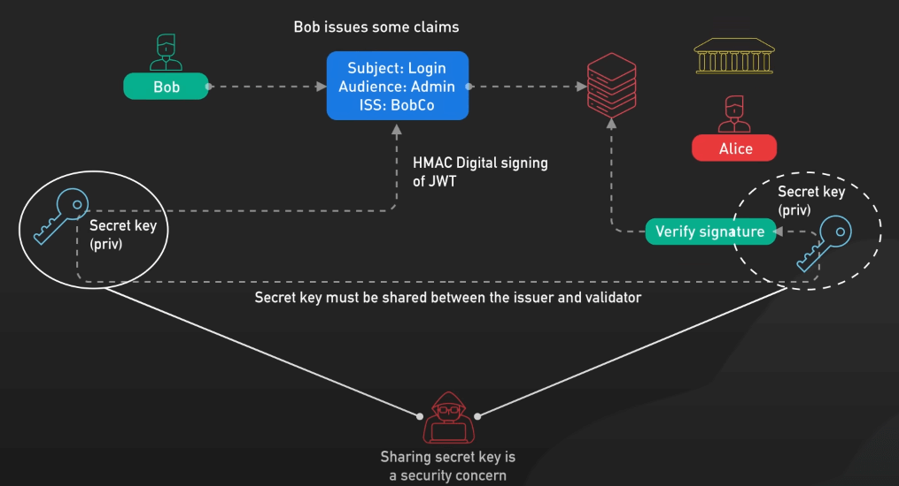
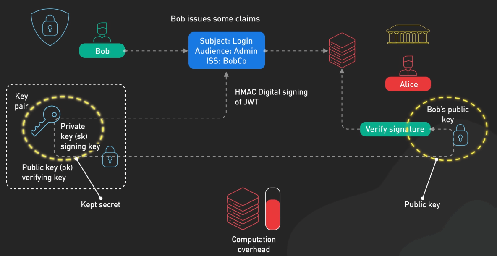
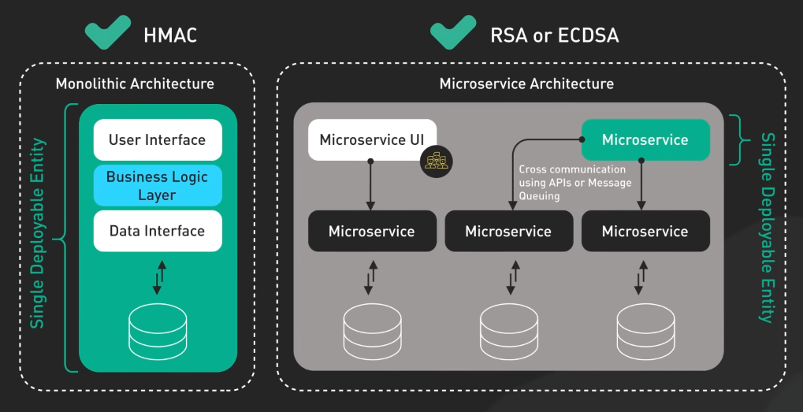
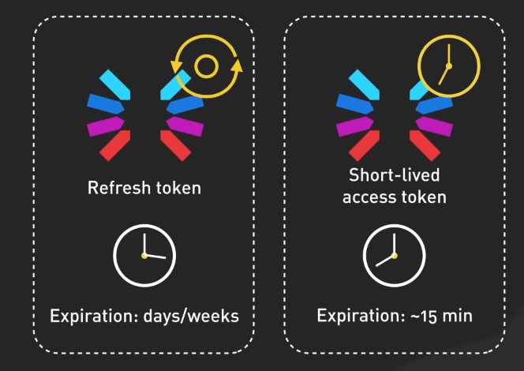
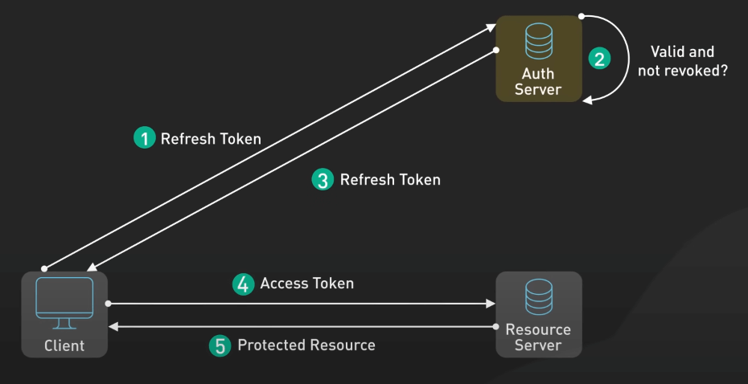
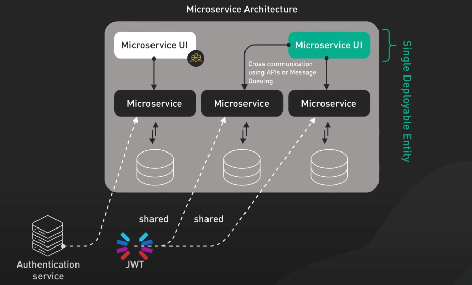
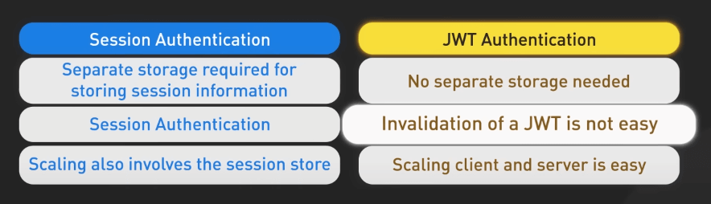

# Session vs. JWT

## Nguồn

 [Session Vs JWT: The Differences You May Not Know!](https://www.youtube.com/watch?v=fyTxwIa-1U0)

## Xác thực dựa trên session (Session-Based Authentication)

Quy trình bắt đầu khi người dùng gửi thông tin đăng nhập của họ tới server. Server xác minh thông tin đó, và nếu hợp lệ, nó sẽ tạo một session mới. Server lưu trữ dữ liệu session này, thường trong một cơ sở dữ liệu hoặc cache như Redis. Dữ liệu này có thể bao gồm ID người dùng, thời gian hết hạn session, và các metadata khác. Server phản hồi lại với một ID session (session ID) duy nhất, thường dưới dạng cookie.

Trong các request sau đó, client tự động gửi session ID cookie cùng với mỗi request. Server sử dụng session ID, tra cứu dữ liệu session tương ứng trong kho lưu trữ và sử dụng dữ liệu đó để xác thực và xử lý request.

{:class="centered-img"}

Điểm mấu chốt là với xác thực session, server chịu trách nhiệm tạo và lưu trữ dữ liệu session. Nó sử dụng session ID như một key để lấy dữ liệu này cho các request trong tương lai. Một lợi thế của session là có thể thu hồi session một cách dễ dàng; khi dữ liệu session được lưu trên server, server có thể xóa hoặc vô hiệu hóa session bất kỳ lúc nào. 

Tuy nhiên, trong một hệ thống phân tán nơi ứng dụng chạy trên nhiều server, tất cả các server cần truy cập vào cùng một dữ liệu session. Điều này thường được thực hiện bằng cách sử dụng một kho lưu trữ session tập trung mà tất cả các server có thể truy cập, như Redis hoặc một cơ sở dữ liệu SQL phân tán. Mặc dù cái này không xấu, nhưng nó làm tăng độ phức tạp và có thể tạo ra độ trễ cho mỗi request, do server phải truy xuất dữ liệu từ kho lưu trữ session.

## Xác thực dựa trên JWT (JWT-Based Authentication)

Đầu tiên, người dùng gửi thông tin đăng nhập tới server. Server xác minh thông tin và nếu hợp lệ, nó tạo một JWT và ký token bằng một khóa bí mật. Chữ ký này đảm bảo tính toàn vẹn của token, ngăn chặn hành vi chỉnh sửa. Sau đó, server trả lại JWT cho phía client, thường trong nội dung phản hồi. Client lưu trữ JWT, thường là trong local storage hoặc cookie.

Trong các request tiếp theo, khách hàng gửi JWT trong request headers. Server xác minh chữ ký của JWT. Nếu hợp lệ, server tin tưởng vào dữ liệu trong token và sử dụng nó cho xác thực và phân quyền.

{:class="centered-img"}

Sự khác biệt quan trọng ở đây là với JWT, server không lưu trữ trạng thái session. Tất cả dữ liệu cần thiết đều nằm trong token, được lưu trữ phía client. Điều này làm cho JWT là một phương pháp không trạng thái (stateless). 

Khi ký JWT, có nhiều thuật toán, với HMAC, RSA và ECDSA là những phương pháp phổ biến nhất. HMAC là phương pháp ký đối xứng, tức là sử dụng cùng một khóa bí mật để ký và xác minh token. Điều này đơn giản và hiệu quả hơn, nhưng đòi hỏi phải chia sẻ khóa bí mật với mọi dịch vụ cần xác minh token, có thể gây rủi ro về bảo mật. 

{:class="centered-img"}

Ngược lại, RSA và ECDSA là các phương pháp ký bất đối xứng. Chúng sử dụng một khóa riêng để ký và một khóa công khai để xác minh, cho phép một kiến trúc an toàn hơn khi chỉ giữ bí mật khóa riêng để ký, trong khi bất kỳ dịch vụ nào cũng có thể xác minh token bằng khóa công khai. Tuy nhiên, ký bất đối xứng phức tạp và tốn nhiều tài nguyên hơn so với HMAC. 

{:class="centered-img"}

Lựa chọn thuật toán ký phụ thuộc vào yêu cầu bảo mật và kiến trúc hệ thống của bạn. Nếu bạn có một ứng dụng monolithic hoặc tin tưởng vào tất cả các dịch vụ trong hệ thống của bạn, bạn có thể dùng HMAC là được. Nhưng nếu bạn có một kiến trúc microservice hoặc cần chia sẻ JWT với các dịch vụ bên ngoài không tin cậy, RSA hoặc ECDSA cung cấp một giải pháp an toàn hơn.

{:class="centered-img"}

Một thách thức với JWT là xử lý thời hạn hiệu lực của token. Nếu token bị đánh cắp, nó có thể bị sử dụng cho đến khi hết hạn. Để giảm thiểu rủi ro này, bạn có thể sử dụng refresh tokens kết hợp với các access token ngắn hạn. Access token là JWT được sử dụng để xác thực cho mỗi request và có thời gian hết hạn ngắn, thường khoảng 15 phút. Refresh token, ngược lại, có thời gian tồn tại lâu hơn, có thể là vài ngày hoặc vài tuần. 

{:class="centered-img"}

Khi access token hết hạn, thay vì yêu cầu người dùng đăng nhập lại, client có thể gửi refresh token tới một endpoint đặc biệt của server. Server kiểm tra refresh token xem có hợp lệ và chưa bị thu hồi hay không. Nếu mọi thứ đều hợp lệ, server cấp một access token mới. Quá trình này diễn ra ngầm, không yêu cầu người dùng phải tương tác. 

{:class="centered-img"}

Phương pháp này cân bằng giữa bảo mật và trải nghiệm người dùng. Access token ngắn hạn giới hạn khả năng dùng sai mục đích nếu token bị đánh cắp, trong khi refresh token cho phép người dùng duy trì xác thực trong một khoảng thời gian dài mà không cần đăng nhập lại liên tục. Chú ý là refresh token chỉ được gửi khi access token hết hạn, không phải trên mỗi request. Access token được gửi trên mỗi request yêu cầu xác thực.

## Khi nào nên sử dụng xác thực dựa trên session, khi nào nên sử dụng JWT?

Xác thực dựa trên session là một lựa chọn tốt khi bạn cần khả năng thu hồi session ngay lập tức. Nếu người dùng báo cáo tài khoản của họ bị xâm phạm, bạn có thể vô hiệu hóa ngay lập tức session của họ từ phía server. Xác thực session cũng là lựa chọn phù hợp nếu bạn đã có sẵn kho lưu trữ dữ liệu tập trung cho các mục đích khác, vì khi đó, bạn có thể tận dụng cơ sở hạ tầng sẵn có cho lưu trữ session. Tuy nhiên, cần lưu ý rằng việc sử dụng kho lưu trữ session tập trung có thể thêm độ trễ cho mỗi request, vì server cần truy xuất dữ liệu session từ kho lưu trữ. Cuối cùng, session giữ dữ liệu nhạy cảm trên server, đây là một lợi thế về bảo mật.

Ngược lại, JWT là một lựa chọn tuyệt vời khi bạn cần một kiến trúc không trạng thái. Do JWT chứa tất cả dữ liệu cần thiết trong token, server không cần theo dõi session trong bộ nhớ hoặc cơ sở dữ liệu, giúp dễ dàng mở rộng ứng dụng theo chiều ngang trên nhiều server. JWT cũng hữu ích khi bạn cần chia sẻ dữ liệu xác thực với các dịch vụ khác. Ví dụ, trong một kiến trúc microservices, một JWT được tạo bởi dịch vụ xác thực có thể được xác minh và tin tưởng bởi các dịch vụ khác mà không cần phải liên hệ với dịch vụ xác thực trong mỗi request.

{:class="centered-img"}

Nếu bạn chọn JWT, hãy cân nhắc việc triển khai refresh token để cân bằng giữa bảo mật và trải nghiệm người dùng. Refresh token cho phép sử dụng các access token ngắn hạn để giới hạn khả năng lạm dụng nếu token bị đánh cắp, đồng thời vẫn cho phép người dùng duy trì đăng nhập trong một thời gian dài mà không cần đăng nhập lại thường xuyên. Cuối cùng, lựa chọn phụ thuộc vào nhu cầu cụ thể và kiến trúc của ứng dụng của bạn.

{:class="centered-img"}
