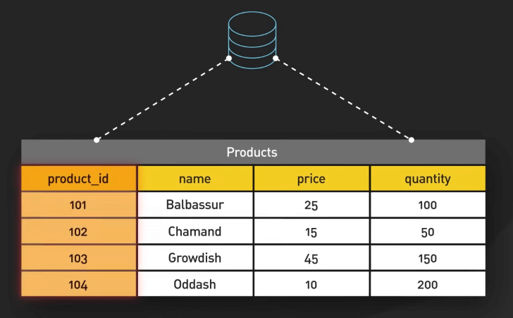
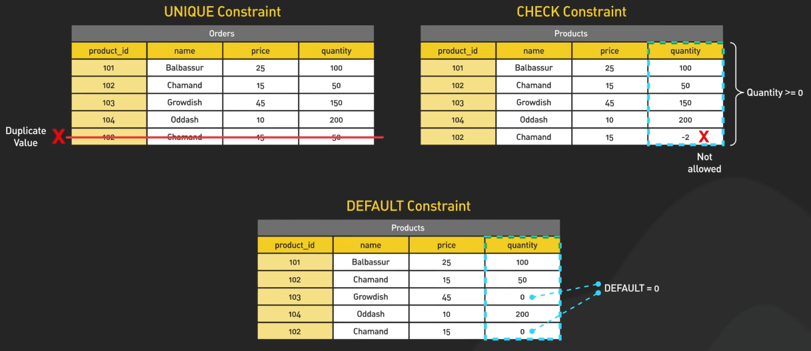

# Roadmap học SQL

## Nguồn

 [Roadmap for Learning SQL](https://www.youtube.com/watch?v=yMqldbY2AAg)

## Giới thiệu

SQL, hay Structured Query Language, là ngôn ngữ tiêu chuẩn để tương tác với cơ sở dữ liệu quan hệ. Sự linh hoạt của nó khiến nó trở thành một công cụ thiết yếu trong nhiều lĩnh vực. Ví dụ, một công ty thương mại điện tử có thể sử dụng SQL để phân tích dữ liệu bán hàng, xác định xu hướng và đưa ra quyết định dựa trên dữ liệu để tối ưu hóa chiến lược kinh doanh của mình. Các hệ thống quản lý cơ sở dữ liệu quan hệ phổ biến sử dụng SQL bao gồm MySQL, PostgreSQL, Oracle và SQL Server. Chúng ta sẽ khám phá các khái niệm và kỹ thuật quan trọng mà bạn cần biết để làm việc hiệu quả với SQL.

{:class="centered-img"}

## Cấu trúc

Cốt lõi của SQL là cơ sở dữ liệu, nơi lưu trữ và tổ chức dữ liệu. Trong cơ sở dữ liệu, dữ liệu được tổ chức thành các bảng, với các cột xác định các trường dữ liệu và các hàng đại diện cho các bản ghi. 

{:class="centered-img"}

Thiết kế cơ sở dữ liệu hiệu quả bao gồm chuẩn hóa, quá trình tổ chức dữ liệu để giảm thiểu sự trùng lặp và phụ thuộc. 

{:class="centered-img"}

Để duy trì tính toàn vẹn dữ liệu, các bảng sử dụng các ràng buộc. Khóa chính định danh duy nhất cho mỗi hàng, trong khi khóa ngoại thiết lập mối quan hệ giữa các bảng. 

{:class="centered-img"}

Ví dụ, một bảng `products` có thể có khóa chính `product_id`, và một bảng `orders` có thể sử dụng `product_id` làm khóa ngoại để liên kết mỗi đơn hàng với một sản phẩm cụ thể.

{:class="centered-img"}

Các ràng buộc khác bao gồm UNIQUE, đảm bảo không có giá trị trùng lặp; CHECK, áp dụng điều kiện cho dữ liệu; và DEFAULT, xác định giá trị mặc định cho một cột.

{:class="centered-img"}

## Các câu lệnh

SQL cung cấp một loạt các thao tác để tương tác với dữ liệu. 

Câu lệnh SELECT truy xuất dữ liệu từ một hoặc nhiều bảng, cho phép lọc, sắp xếp và kết hợp. 

{:class="centered-img"}

Các thao tác JOIN kết hợp dữ liệu từ các bảng liên quan, với các loại khác nhau như INNER JOIN, LEFT JOIN, RIGHT JOIN và FULL OUTER JOIN. Ví dụ, một INNER JOIN giữa các bảng `customers` và `orders` sẽ trả về tất cả khách hàng với các đơn hàng tương ứng của họ, loại trừ khách hàng không có đơn hàng và đơn hàng không có khách hàng.

{:class="centered-img"}

Để sửa đổi dữ liệu, ta dùng INSERT để thêm bản ghi mới, UPDATE để sửa đổi dữ liệu hiện có và DELETE để xóa bản ghi. 

{:class="centered-img"}

{:class="centered-img"}

{:class="centered-img"}

Các thao tác này có thể kết hợp với các câu lệnh con, là các truy vấn lồng nhau trong một câu lệnh SQL khác. Ví dụ, bạn có thể sử dụng một câu lệnh con trong một câu lệnh UPDATE để thay đổi giá trị dựa trên điều kiện từ một bảng khác.

{:class="centered-img"}

## Toán tử và hàm

SQL hỗ trợ nhiều toán tử và hàm để lọc và chuyển đổi dữ liệu. Toán tử logic (AND, OR, NOT) cho phép kết hợp điều kiện lọc, trong khi toán tử số học xử lý các phép tính. Toán tử chuỗi cho phép so khớp mẫu và nối chuỗi. 

{:class="centered-img"}

Hàm cung cấp khả năng phân tích và biến đổi dữ liệu mạnh mẽ. Hàm số học thực hiện tính toán như SUM, AVG và ROUND. 

{:class="centered-img"}

Hàm chuỗi thao tác với văn bản, như CONCAT để kết hợp chuỗi hoặc SUBSTRING để trích xuất ký tự. 

{:class="centered-img"}

Hàm ngày thời gian xử lý thời gian, như GETDATE cho ngày/giờ hiện tại hoặc DATEADD để sửa đổi ngày. 

{:class="centered-img"}

Hàm tổng hợp (COUNT, MIN, MAX, v.v.) tổng hợp dữ liệu qua nhiều hàng. Chúng thường được sử dụng với các mệnh đề GROUP BY và HAVING để phân tích nâng cao. Ví dụ, bạn có thể sử dụng COUNT và GROUP BY để lấy số lượng đơn hàng mỗi khách hàng và HAVING để lọc chỉ khách hàng có hơn 10 đơn hàng.

{:class="centered-img"}

## Kiểu dữ liệu và index

Khi tạo bảng, các cột được định nghĩa với các kiểu dữ liệu cụ thể để tối ưu hóa lưu trữ và hiệu suất. Các kiểu chính bao gồm số (INT, DECIMAL), chuỗi (VARCHAR, TEXT), ngày/giờ (DATE, TIMESTAMP) và boolean (BIT). 

Index đóng vai trò quan trọng để tối ưu hiệu suất truy vấn, đặc biệt trên các bảng lớn. Index cho phép truy vấn nhanh hơn bằng cách tạo ra một cấu trúc có thể tìm kiếm, tương tự như một chỉ mục trong một cuốn sách. Tuy nhiên, chúng cũng tạo ra chi phí cho các thao tác INSERT, UPDATE và DELETE.

{:class="centered-img"}

## Các ngôn ngữ phụ trợ SQL

Ngoài việc thao tác dữ liệu (DML), SQL bao gồm các ngôn ngữ phụ trợ cho các nhiệm vụ khác. 

Ngôn ngữ định nghĩa dữ liệu (DDL) xử lý cấu trúc bảng với các câu lệnh như CREATE TABLE và ALTER TABLE.

{:class="centered-img"}

Ngôn ngữ kiểm soát dữ liệu (DCL) quản lý quyền truy cập bằng GRANT và REVOKE. 

{:class="centered-img"}

Ngôn ngữ kiểm soát transaction (TCL) quản lý transaction với COMMIT, ROLLBACK và SAVEPOINT, đảm bảo tính toàn vẹn dữ liệu qua các thuộc tính ACID.

{:class="centered-img"}

## Kết luận

SQL là một ngôn ngữ mạnh mẽ để làm việc với cơ sở dữ liệu quan hệ. Cách tốt nhất để học là thực hành với các tập dữ liệu thực tế. Khám phá các hướng dẫn SQL và các nền tảng thực hành trực tuyến, và thử nghiệm với các cơ sở dữ liệu mẫu. Khi bạn tiến bộ, khám phá các chủ đề như tối ưu hóa truy vấn, chuẩn hóa cơ sở dữ liệu và quản lý transaction. Với SQL trong bộ công cụ của bạn, bạn sẽ sẵn sàng giải quyết những thách thức dữ liệu phức tạp và thúc đẩy quyết định dựa trên dữ liệu trong dự án của mình.
