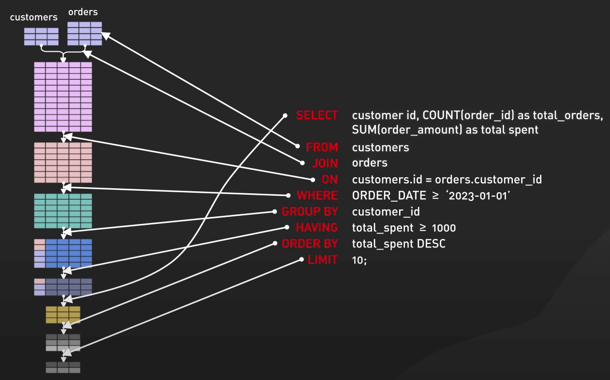
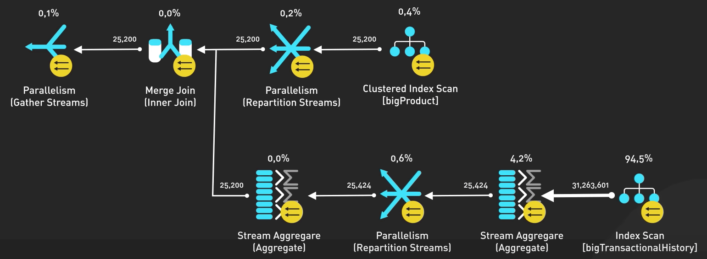
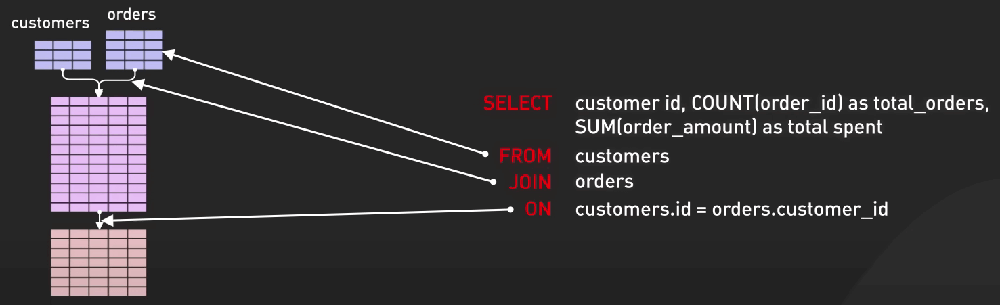
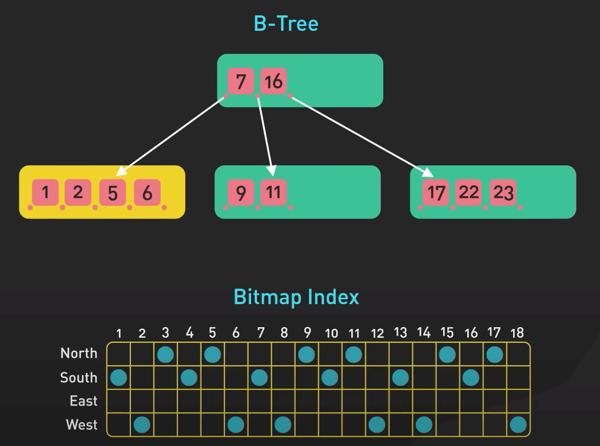
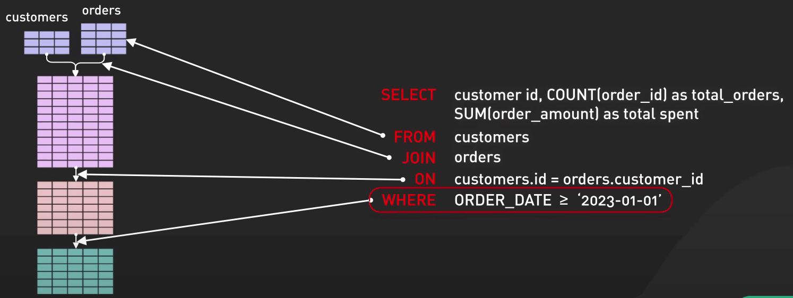
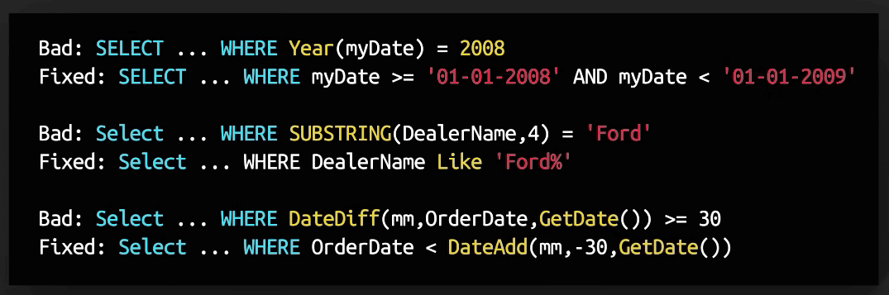
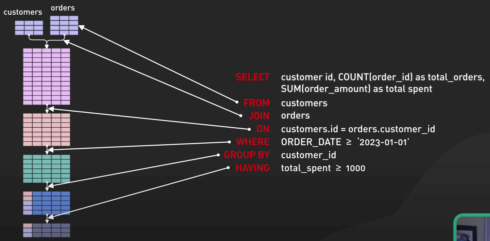
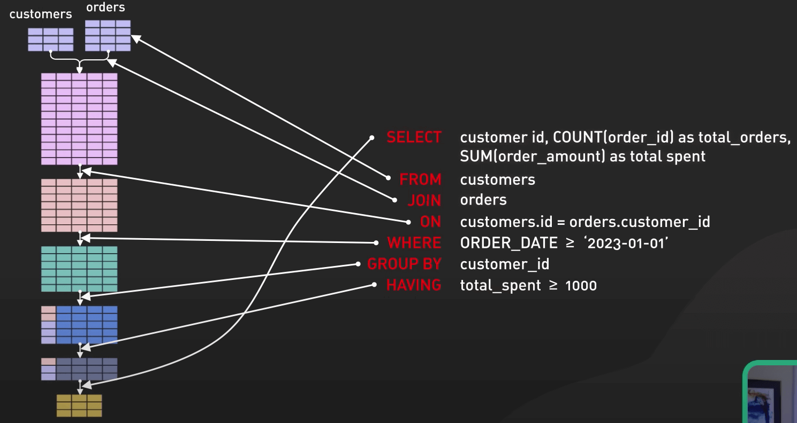

# Thứ tự thực thi truy vấn SQL

## Nguồn

 [Secret To Optimizing SQL Queries - Understand The SQL Execution Order](https://www.youtube.com/watch?v=BHwzDmr6d7s)

## Giới thiệu

Trong bài này, ta sẽ nói về việc thực thi truy vấn SQL. Ta sẽ đi qua quá trình thực thi của một truy vấn SQL, các kỹ thuật tối ưu và những cách sử dụng tốt nhất.

## Câu lệnh SQL mẫu

Dưới đây sẽ là truy vấn mà ta sẽ dùng:

{:class="centered-img"}

Trong truy vấn này, ta tìm top 10 khách hàng (`customers`) chi tiêu ít nhất 1000 đô (`total_spent`) cho các đơn hàng kể từ ngày 01/01/2023 bằng cách join 2 bảng `customers` và `orders`, nhóm theo ``customer_id``. Ta hiển thị tổng số đơn hàng (`total_orders`) và tổng số tiền đã chi (`total_spent`) của mỗi khách hàng, sắp xếp theo tổng số tiền đã chi giảm dần.

## Kế hoạch thực thi truy vấn

Trước khi phân tích truy vấn ở trên, ta sẽ cùng thảo luận về kế hoạch thực thi (execution plan) truy vấn SQL.

Các hệ thống database tạo ra các plan này để tối ưu hoá truy vấn, cũng như khiến nó dùng ít tài nguyên nhất có thể. Hiểu được plan sẽ giúp bạn tối ưu được truy vấn của mình, làm tăng hiệu suất truy vấn.

Các execution plan cung cấp các thông tin như chi phí ước tính của truy vấn, các thuật toán join được chọn và danh sách các thao tác thực thi.

{:class="centered-img"}

## Mệnh đề FROM và JOIN

Đây là nơi ta sẽ chọn các bảng để sử dụng và chỉ định cách để join chúng.

Trong truy vấn ở trên, ta dùng bảng `customers` và join nó với bảng `orders` với một cái ID chung và tuỳ chỉnh các cột để hiển thị. Dùng index cho các cột dùng để join sẽ tăng hiệu suất join lên đáng kể. Nhớ đặt index thích hợp cho các bảng trước khi join nhé.

{:class="centered-img"}

Các kiểu index như B-Tree hay Bitmap Index có thể ảnh hưởng đến hiệu suất truy vấn dựa trên việc phân phối dữ liệu (data distribution) và loại truy vấn (query type).

{:class="centered-img"}

## Mệnh đề WHERE

Mệnh đề WHERE lọc dữ liệu bằng cách cho nó qua một điều kiện nào đó. Trong trường hợp này, nó sẽ lọc các đơn hàng từ ngày 01/01/2023. Điều quan trọng cần nhớ là phải viết được một truy vấn **sargable** để tận dụng được index một cách hiệu quả.

{:class="centered-img"}

**Sargable** ở đây là **Search ARGument ABLE**. Ở đây nó nói đến các truy vấn có thể tận dụng được index để thực thi nhanh hơn. Ta cùng đi sâu vào xem nó như thế nào nhé.

Khi bạn nói một truy vấn là sargable, nó có nghĩa là truy vấn có thể sử dụng index một cách hiệu quả để tăng tốc thực thi. Nói cách khác, nó có thể sử dụng index để lọc dữ liệu nhanh hơn. 

{:class="centered-img"}

Viết ra được truy vấn sargable rất là quan trọng trong việc tối ưu hiệu suất database. Trong một truy vấn sargable (như trong ví dụ của chúng ta), ta trực tiếp so sánh cột `order_date` với một ngày tháng cụ thể, điều này giúp database engine có thể sử dụng index trên cột đó, nhằm nhanh chóng lọc dữ liệu theo điều kiện ta đặt ra.

Trái lại, nếu ta viết mệnh đề `WHERE` là `WHERE YEAR(order_date) >= 2023` thì database engine không thể tận dụng được index trên cột `order_date`, bởi vì hàm `YEAR()` sẽ phải được gọi trên mỗi dòng dữ liệu, điều này sẽ làm chậm truy vấn đi rất nhiều, ngay cả khi có index trên cột. Nó chậm do phải quét qua nhiều dòng hơn. Những mệnh đề như vậy sẽ làm truy vấn của chúng ta trở thành truy vấn **non-sargable**.

Để viết được truy vấn sargable, ta cần:

1. Tránh dùng các hàm hoặc tính toán trên các cột đã index trong mệnh đề `WHERE`.
2. So sánh trực tiếp nếu có thể, thay vì dùng hàm trên cột.
3. Nếu thực sự phải dùng một hàm trên cột, bạn có thể tạo một cột mới đã tính toán sẵn, hoặc dùng index dựa trên hàm, nếu database hỗ trợ.

## Mệnh đề GROUP BY và HAVING

Ta nhóm các bản ghi theo `customer_id` và lọc các nhóm theo điều kiện `total_spent >= 1000`. Truy vấn này tìm các khách hàng chi tiêu ít nhất 1000 đô.

{:class="centered-img"}

## Mệnh đề SELECT

Giờ ta mới `SELECT` nó ra đây. Nó chỉ định các cột ta muốn trong kết quả. Trong trường hợp này, ta chọn `customer_id`, `total_orders` và `total_spent`. Mặc dù `SELECT` thường được ghi ra đầu tiên trong truy vấn, nó được thực thi rất xa trong thứ tự thực thi truy vấn.

{:class="centered-img"}

Để tối ưu mệnh đề `SELECT`, bạn nên index một số cột trước đó, đặc biệt là các cột được sử dụng trong mệnh đề `SELECT`, `WHERE` và `JOIN`. Điều này giúp database engine lấy được dữ liệu trực tiếp từ index, giúp giảm chi phí truy vấn, thay vì phải quét qua nhiều dòng dữ liệu.

## Mệnh đề ORDER BY và LIMIT

Để tối ưu 2 mệnh đề `ORDER BY` và `LIMIT`, bạn nên sử dụng một tập kết quả nhỏ hơn để sắp xếp và giới hạn số lượng kết quả trả về. Điều này giúp giảm chi phí sắp xếp và giới hạn số lượng kết quả trả về.

Với tập lớn, tránh sắp xếp cả tập, gây tăng bộ nhớ cần sử dụng và tăng thời gian thực thi. Dùng các index thích hợp để tăng tốc sắp xếp và giảm số lượng dữ liệu cần sắp xếp trong bộ nhớ.

{:class="centered-img"}
