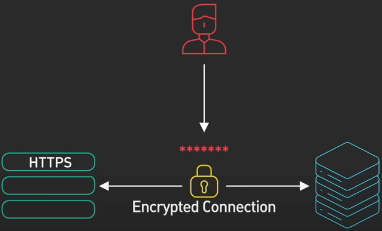
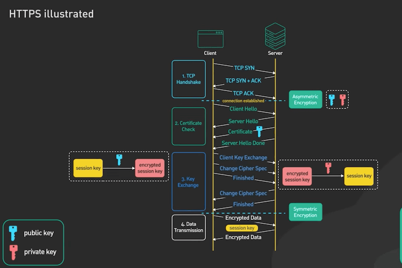

# SSL, TLS và HTTPS

## Nguồn

 [SSL, TLS, HTTPS Explained](https://www.youtube.com/watch?v=j9QmMEWmcfo)

## HTTPS

Với giao thức HTTP thông thường, giao tiếp giữa trình duyệt và máy chủ sẽ ở dưới dạng plain text (nghĩa là văn bản mà con người có thể đọc được). Điều này đồng nghĩa với việc mật khẩu hay số thẻ ngân hàng của người dùng có thể được đọc bởi bất cứ ai có thể chen vào giao tiếp này.

**HTTPS** được tạo ra để giải quyết vấn đề này. Nó giúp thông tin truyền đi trên internet sẽ không bị hiểu được trừ người gửi và người nhận.

HTTPS là bản mở rộng của giao thức HTTP. Với HTTPS, thông tin được truyền đi dưới dạng mã hoá với một thứ được gọi là **TLS** (Transport Layer Security). Nếu thông tin mã hoá này lọt vào tay hacker, hắn cũng không thể đọc được nội dung thực sự trong đó.

{ style="display: block; margin: 0 auto" }

## SSL/TLS

Bắt tay TLS bao gồm một số bước như sau:

Đầu tiên, giống như HTTP, trình duyệt sẽ tiến hành thiết lập một kết nối TCP với server thông qua bắt tay 3 bước TCP.

Bắt tay TLS bắt đầu ở bước 2, nó sẽ bắt đầu với việc client gửi một tin nhắn hello lên server. Trong tin nhắn hello này, trình duyệt sẽ cho server biết một số thứ như sau:

1. Trình duyệt hỗ trợ phiên bản TLS nào, có thể là TLS 1.2 hay 1.3 gì đó.
2. Trình duyệt hỗ trợ cyber suite nào. **Cyber suite** là một tập các thuật toán mã hoá mà trình duyệt có thể dùng để mã hoá thông tin.

Sau khi nhận tin hello, server có thể chọn cyber suite và phiên bản TLS để dùng dựa vào thông tin trong tin nhắn hello, sau đó nó sẽ gửi lại một tin hello trả về cho client để nói cho client biết là server sẽ dùng các công cụ gì trong việc giao tiếp với client. Tiếp đó server gửi một certificate cho client. Certificate chứa khá nhiều thứ nhưng trong đó **public key** rất quan trọng. Client dùng public key này để mã hoá thông tin cần gửi lên server, server sẽ giải mã bằng **private key** ở sẵn trên server, và chỉ có thể được giải mã bởi private key mà thôi. Đây là mã hoá bất đối xứng, public key và private key là một cặp đi đôi với nhau. Bước cuối của bước 2 là khi server gửi một request hello done về phía client. Đến đây thì client đã nhận được server certificate và cả hai đồng ý về phiên bản TLS, cũng như cyber suite sẽ dùng để giao tiếp với nhau.

Ở bước 3, client và server sẽ tạo ra một key mã hoá dùng chung với nhau để mã hoá thông tin. Toàn bộ request trong bước này gửi từ client lên server sẽ được mã hoá bởi public key mà client đã nhận trong bước trước đó. Client sẽ tạo ra một key mã hoá khác được gọi là **session key**, sau đó dùng public key để mã hoá key này, rồi gửi key đã mã hoá này lên cho server, server giải mã cái key đã được mã hoá này (bằng private key) để lấy session key gốc.

Giờ cả hai đều đã có session key, client và server đã có thể trao đổi thông tin (có mã hoá) trong bước 4. Ở đây ta dùng mã hoá đối xứng, dùng session key. Lý do vì sao hai bên có thể mã hoá và giải mã thì dựa vào cyber suite mà chúng đã trao đổi trước đó.

{ style="display: block; margin: 0 auto" }

Đến đây bạn có thể có một câu hỏi, rằng sao không dùng mã hoá bất đối xứng luôn đi, lại còn đổi qua đối xứng làm gì? Lý do là bởi mã hoá bất đối xứng tốn nhiều tài nguyên (thời gian, bộ nhớ,...). Nó không thực sự phù hợp với việc truyền tải thông tin lớn.

## Mở rộng

Có hai vấn đề cần bàn ở đây.

Thứ nhất, TLS bản mới nhất là 1.3 và được hỗ trợ bởi tất cả các trình duyệt tên tuổi, sao lại nói về TLS 1.2? (Ở trên là tiến trình của TLS 1.2). Ta có thể thấy rằng TLS 1.2 cần 2 network round-trip trong khi TLS 1.3 chỉ cần 1 round-trip. Nói về TLS 1.2 sẽ dễ hiểu hơn là nói về TLS 1.3 vì 1.3 là phiên bản 1.2 được tối ưu. Concept của TLS 1.2 vẫn là concept chính của TLS 1.3.

Thứ hai, ở ví dụ trên, ta dùng RSA để mô phỏng mã hoá bất đối xứng để truyền session key lên server. RSA được chọn vì nó dễ hiểu hơn đa số các thuật toán mã hoá bất đối xứng khác. Tuy vậy mã hoá bất đối xứng không phải cách duy nhất để truyền session key giữa client và server. Trong TLS 1.3, RSA không còn được hỗ trợ. **Diffie-Hellman** là lựa chọn thông dụng hơn. Diffie–Hellman phức tạp hơn nhưng đại khái thì nó áp dụng toán học nâng cao với các số nguyên tố lớn để lấy được session key mà không cần gửi public key qua internet.
