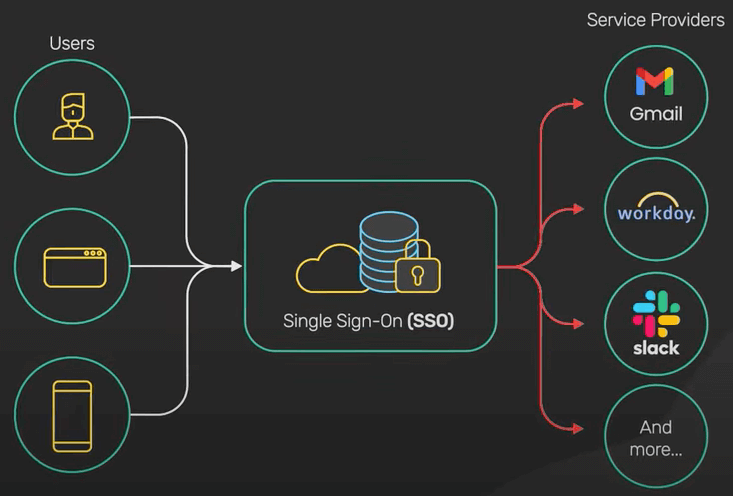
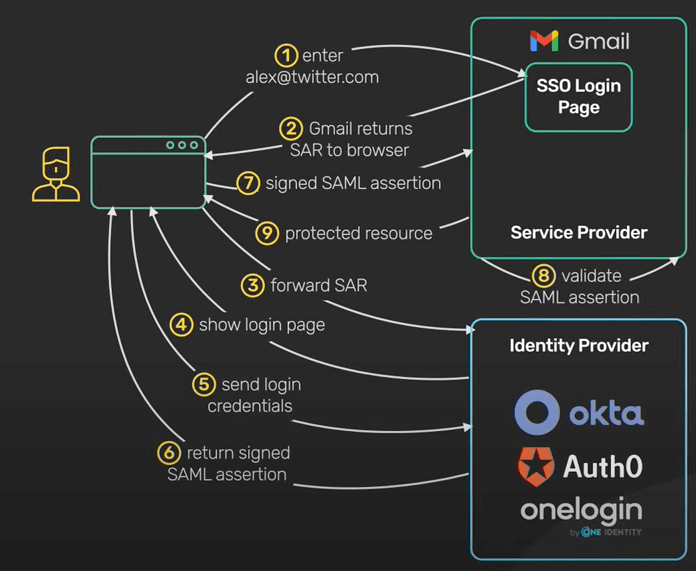
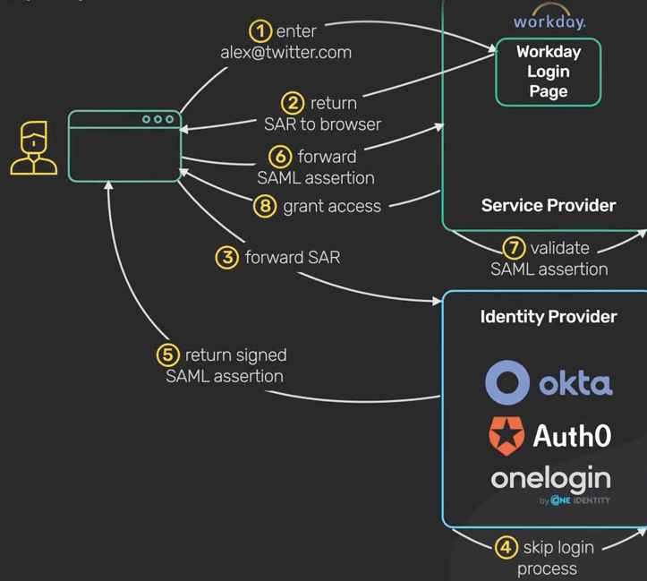
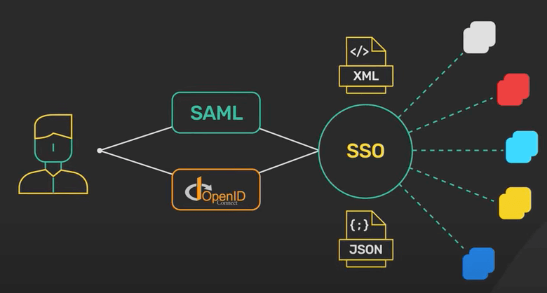

# Single Sign-on (SSO) là gì?

## Nguồn

 [What Is Single Sign-on (SSO)? How It Works](https://www.youtube.com/watch?v=O1cRJWYF-g4)

## Đăng nhập một lần (Single Sign-on - SSO) là gì?

**SSO (hay Single Sign-on, Đăng nhập một lần)** là một sơ đồ xác thực. Nó cho phép người dùng truy cập an toàn vào nhiều ứng dụng và dịch vụ với một ID duy nhất. 

{:class="centered-img"}

Khi SSO được tích hợp vào các ứng dụng như Gmail, Workday hay Slack, nó cung cấp một cửa sổ hay trang đăng nhập cho cùng một bộ thông tin xác thực. Với SSO, người dùng có thể truy cập nhiều ứng dụng mà không phải đăng nhập mỗi lần.

{:class="centered-img"}

SSO được xây dựng trên một khái niệm gọi là danh tính liên kết (federated identity). Nó cho phép chia sẻ thông tin nhận dạng trên các hệ thống đáng tin cậy nhưng độc lập. 

{:class="centered-img"}

Có hai giao thức phổ biến cho quá trình xác thực này.

**SAML, hay ngôn ngữ đánh dấu xác nhận bảo mật (Security assertion markup language)**, là một tiêu chuẩn mở dựa trên XML để trao đổi thông tin nhân dạng giữa các dịch vụ. Ta thường thấy nó trong môi trường làm việc, công sở. 

Một giao thức khác là **OpenID Connect**. Có lẽ ai cũng biết cái này rồi. Khi ta dùng tài khoản Google cá nhân để đăng nhập vào các ứng dụng như YouTuble, ta đang dùng OpenID Connect. Nó dùng JWT (JSON Web Token) để chia sẻ thông tin nhân dạng giữa các dịch vụ.

## Quy trình SSO

Ta sẽ tập trung vào SAML.

(1) Một nhân viên văn phòng truy cập một ứng dụng như Gmail. Theo SAML, Gmail trong trường hợp này là một nhà cung cấp dịch vụ (Service Provider). 

(2) Máy chủ Gmail phát hiện ra người dùng này đến từ một work domain (nghĩa là không phải từ `@gmail.com`, có thể đến từ `@sea.com` chẳng hạn), và trả về một yêu cầu xác thực SAML (SAML Authentication Request - SAR) về cho trình duyệt. 

(3) Trình duyệt chuyển hướng người dùng đến nhà cung cấp danh tính (Identity Provider) cho công ty được chỉ định trong yêu cầu xác thực SAML. Okta, Auth0 và OneLogin là một số ví dụ về nhà cung cấp danh tính thương mại. 

(4) + (5) Nhà cung cấp danh tính hiển thị trang đăng nhập để người dùng đăng nhập vào. 

(6) Sau khi được xác thực, nhà cung cấp danh tính tạo SAML response và trả về cho trình duyệt. Đây được gọi là xác nhận SAML (SAML Assertion). Xác nhận SAML là một tài liệu XML được ký bằng khoá có chứa thông tin về người dùng và những gì người dùng có thể truy cập với nhà cung cấp dịch vụ.

(7) Trình duyệt chuyển tiếp xác nhận SAML đã ký tới nhà cung cấp dịch vụ.

(8) Nhà cung cấp dịch vụ xác thực rằng xác nhận SAML đã được ký bởi bên cung cấp danh tính. Quá trình xác thực này thường được thực hiện bởi mã hoá khoá công khai. 

(9) Nhà cung cấp dịch vụ trả lại tài nguyên được bảo vệ cho trình duyệt dựa trên những gì người dùng được phép truy cập như được chỉ định trong xác nhận SAML. 

Vậy là xong quy trình đăng nhập SSO cơ bản.

{:class="centered-img"}

Giờ ta cùng xem điều gì sẽ xảy ra khi người dùng điều hướng đến một ứng dụng tích hợp SSO khác, như Workday. 

(1) Người dùng truy cập Workday.

(2) Máy chủ Workday, như trong ví dụ với Gmail, phát hiện work domain và gửi yêu cầu xác thực SAML về trình duyệt. 

(3) Trình duyệt lại chuyển hướng người dùng đến Nhà cung cấp danh tính. 

(4) Vì người dùng đã đăng nhập bằng Nhà cung cấp danh tính nên người dùng sẽ bỏ qua quy trình đăng nhập và thay vào đó, nó sẽ tạo một xác nhận SAML cho Workday, nêu chi tiết những gì người dùng có thể truy cập ở đó. 

(5) + (6) Xác nhận SAML được trả về trình duyệt và chuyển tiếp đến Workday. 

(7) + (8) Workday xác thực xác nhận đã ký và cấp cho người dùng quyền truy cập tương ứng.

{:class="centered-img"}

Trước đó ta cũng đã đề cập đến OpenID Connect. Quy trình của OpenID Connect tương tự như SAML, nhưng thay vì chuyển tài liệu XML đã ký, OpenID Connect chuyển với JWT. JWT là một tài liệu JSON đã ký.

{:class="centered-img"}

Chi tiết triển khai hơi khác một chút, nhưng khái niệm tổng thể thì tương tự nhau. 

## Vậy chúng ta nên sử dụng phương pháp SSO nào?

Cả hai cách triển khai đều an toàn. Đối với môi trường doanh nghiệp, nơi thường chuyển việc quản lý danh tính cho một nền tảng danh tính thương mại (như Microsoft, Okta, Thales, JumpCloud, Duo, PingIdentity, RSA, OneLogin, SecureAuth), thì các nền tảng này hỗ trợ mạnh mẽ cho cả hai. 

Quyết định sau đó sẽ phụ thuộc vào ứng dụng được tích hợp và giao thức nào dễ tích hợp hơn. Nếu viết một ứng dụng web mới, việc tích hợp với một số nền tảng OpenID Connect phổ biến hơn như Google, Facebook và Github có lẽ là một lựa chọn an toàn.
