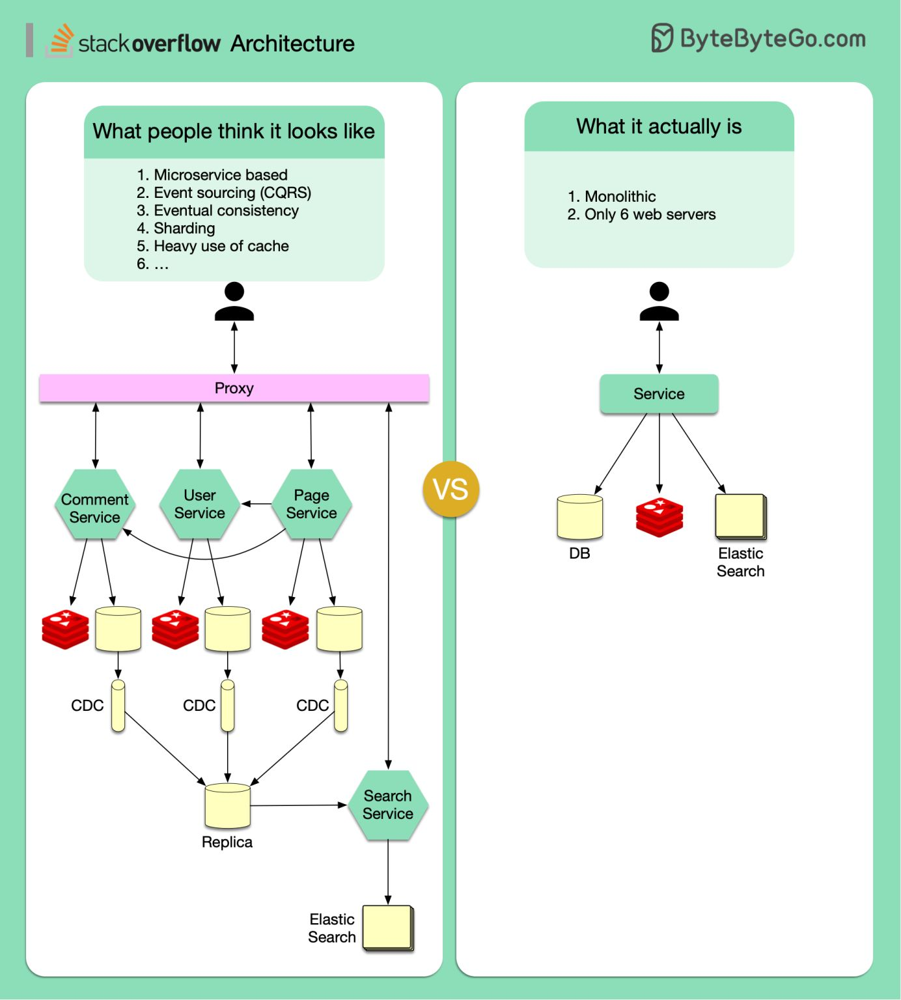

# Hệ thống của Stack Overflow có gì hay?

## Nguồn

 [Uncovering Stack Overflow's Shocking Architecture](https://www.youtube.com/watch?v=fKc050dvNIE)

## Trong phim

Hãy tưởng tượng rằng bạn được giao cho việc thiết kế lại trang Stack Overflow (nếu bạn chưa biết nó là gì thì hãy ghé thăm tại [đây](https://stackoverflow.com/)). Bạn trả lời rằng bạn sẽ thiết kế một số server tại chỗ trong một ứng dụng nguyên khối (monolith), chỉ để nhận về sự ngạc nhiên của đồng nghiệp. Thực ra thì, đó lại chính xác là điều mà Stack Overflow đã làm.

Có lẽ bạn đã mong rằng một nền tảng khổng lồ như Stack Overflow sẽ đi theo những xu hướng thiết kế hệ thống thịnh hành vào thời điểm này. Một công ty công nghệ lớn sẽ phác thảo hệ thống với các microservice để chia hệ thống ra thành từng phần nhỏ, mỗi cái đều có database riêng. Nó sẽ dùng cache rất nhiều và giao tiếp bất đồng bộ qua message queue gì đó. Một số có thể theo CQRS cùng event sourcing. Thêm nữa thì ai lại chẳng muốn nắm bắt cơ hội để thêm thắt tí concept về hệ thống phân tán như eventual consistency hay định lý CAP. Khá là ấn tượng phải không. 

## Ngoài đời

Nhưng những thứ trên không hề tồn tại trong thiết kế hiện tại của Stack Overflow đâu nhé. Trong một thế giới phủ đầy microservice, Kubernetes và các giải pháp đám mây, Stack Overflow lại đi một mình một ngựa. Thay vì chạy theo xu hướng, Stack Overflow kiên định với kiến trúc mà họ cho là tốt nhất cho hoàn cảnh của họ.

{:class="centered-img"}

Đó là một ứng dụng nguyên khối để xử lý trang hỏi đáp chính với chỉ 9 web server tại chỗ (hình trên ghi 6 nhưng đúng là 9 nhé). Họ không dùng giải pháp đám mây hay microservice gì cả nhưng vẫn có thể xử lý lượng truy cập cực lớn với cách tiếp cận độc đáo. Thay vì chuẩn bị cho việc thay đổi liên tục, họ đã thiết kế một hệ thống tối ưu cho độ trễ tải và phân phối bộ nhớ. Các server này chạy chỉ tốn tầm 5-10% sức chứa, nên có rất nhiều chỗ để phát triển. Dù 80% lượng truy cập là không đăng nhập (ẩn danh), trang web này vẫn cho thấy hiệu suất đáng kinh ngạc. Ngay cả trang được truy cập nhiều nhất là trang danh sách câu hỏi cũng không được cache mà vẫn có thể được render trong 20 ms.

Hiệu suất kinh dị này được tiếp sức bởi 1.5 Terabyte RAM trong SQL Server của họ, để truy cập nhanh 33% cả database lớn trong bộ nhớ. Điều này chứng tỏ những concept mới nhất, thịnh hành nhất không phải lúc nào cũng là tốt nhất. Hiểu biết sâu về một hướng khó nào đó có thể có lợi hơn nhiều việc chạy theo xu hướng.

## Kết

Câu chuyện của Stack Overflow là một case study điển hình để nhắc ta nhớ rằng công nghệ không phải mảng mà có một giải pháp cho tất cả các vấn đề. Thứ hoạt động được trong một trường hợp lại có thể không hoạt động trong một trường hợp khác. Việc nhấn mạnh sự cần thiết phải liên kết kiến trúc hệ thống với business và yêu cầu kỹ thuật cụ thể thay vì theo xu hướng một cách mù quáng trong ngành thực sự rất quan trọng.
