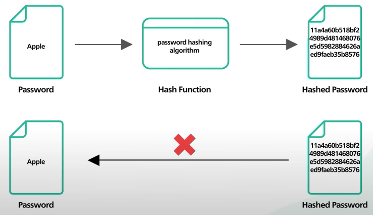
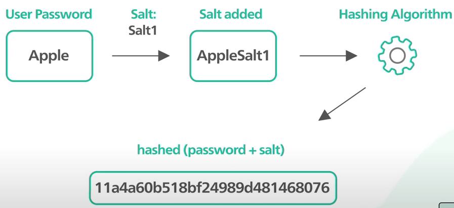
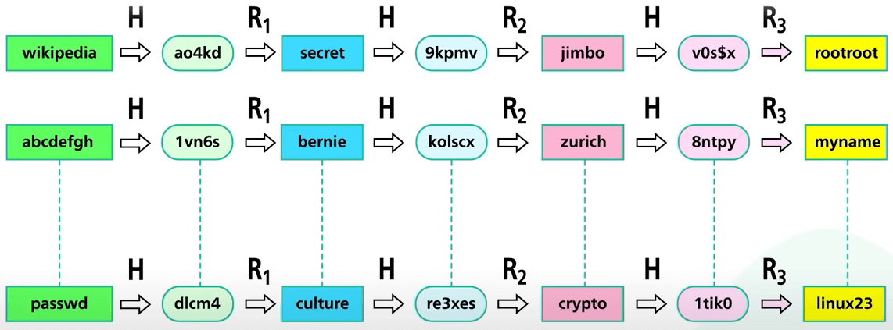
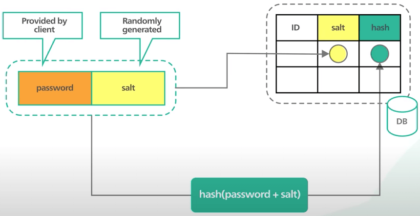
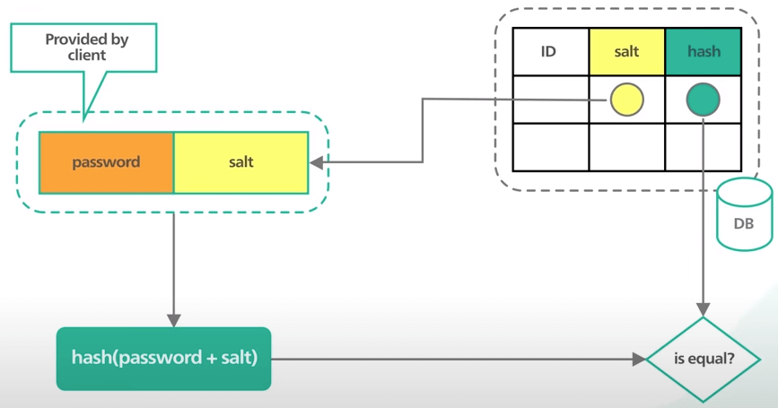

# Lưu mật khẩu vào database như thế nào cho đúng?

## Nguồn

 [System Design: How to store passwords in the database?](https://www.youtube.com/watch?v=zt8Cocdy15c)

## Lưu mật khẩu trong database

Khi thiết kế ứng dụng có người dùng, một trong những điều tối quan trọng chính là lưu mật khẩu người dùng theo cách nào đó mà các hacker không thể lấy được mật khẩu gốc khi database gặp vấn đề bảo mật. Đầu tiên là điều cần tránh: **Không lưu mật khẩu dưới dạng tường minh**

Bất cứ ai có quyền truy cập nội bộ vào database đều có thể thấy các mật khẩu. Nếu database bị hack, kẻ tấn công sẽ dễ dàng lấy được tất cả các mật khẩu.

Vậy ta cần làm gì để lưu mật khẩu một cách an toàn trong database? Open Web Application Security Project (OWASP) cung cấp cho chúng ta một số hướng dẫn làm sao để lưu mật khẩu. Một số cách như sau:

### Dùng một thuật toán hash hiện đại

Hash là hàm một chiều. Nghĩa là bạn sẽ không thể giải mã một hash để ra giá trị gốc. Nếu kẻ tấn công lấy được mật khẩu đã hash, hắn không thể dùng cái hash đó để lấy quyền truy cập vào ứng dụng. 

{:class="centered-img"}

Quan trọng là phải dùng một hàm hash hiện đại được thiết kế cho việc lưu mật khẩu. Các hàm này thường "chậm" (ví dụ như `bcrypt`) vì cần nhiều tài nguyên hơn để tính giá trị hash. Điều đó làm cho việc tấn công khó khăn hơn. 

Lưu ý rằng một số hàm hash cũ như `MD5` hay `SHA-1` là các hàm "nhanh". Chúng ít an toàn hơn và không nên được sử dụng.

### Salt mật khẩu

Theo hướng dẫn của OWASP, salt là một xâu duy nhất được tạo ngẫu nhiên và nó sẽ được thêm vào mỗi mật khẩu trong quá trình hash.

{:class="centered-img"}
  
Tại sao cần phải salt mật khẩu? Lưu mật khẩu theo dạng hash là điều kiện cần, nhưng chưa phải điều kiện đủ. Kẻ tấn công có thể bẻ được hash một chiều với các giá trị tính trước (ví dụ hash của `abc` là `xyz`, và sẽ có rât nhiều mapping như thế, khi kẻ tấn công thấy một hash `xyz` chẳng hạn, hắn sẽ so sánh với mapping và thấy xâu gốc là `abc`, vậy là hắn biết mật khẩu là `abc`). Một số kiểu tấn công phổ biến là rainbow table và lookup dựa trên database. Kẻ tấn công có thể dùng các kỹ thuật này để tìm ra mật khẩu trong vài giây.

{:class="centered-img"}

Thêm salt vào sẽ giúp hash có giá trị duy nhất cho mỗi mật khẩu. Kĩ thuật đơn giản này làm cho việc tính trước giá trị hash kém hiệu quả hơn.

Lưu mật khẩu với salt vào database kiểu gì? Đầu tiên thêm salt vào sau mật khẩu đã nhập. Sau đó tính hash của xâu kết quả với một hàm hash nào đó. Cái hash này sẽ được lưu vào database cùng với salt. Lưu ý rằng salt được dùng để tạo hash duy nhất. Nó không phải là xâu bí mật gì cả và có thể lưu dưới dạng tường minh trong database.

{:class="centered-img"}

## Xác nhận một mật khẩu trong database

Giờ khi user bấm nút Đăng nhập, làm sao ta có thể xác nhận mật khẩu đó đúng là mật khẩu của user?

Đầu tiên, ta lấy salt của user từ database. Sau đó ta thêm salt vào sau mật khẩu mà user nhập vào, sau đó hash xâu kết quả. So sánh kết quả này với hash lưu trong database. Nếu giống nhau thì mật khẩu nhập vào là chính xác.

{:class="centered-img"}
