# 8 concept thiết kế hệ thống phổ biến

## Nguồn

 [8 Most Important System Design Concepts You Should Know](https://www.youtube.com/watch?v=BTjxUS_PylA)

## Dùng caching để đọc nhanh hơn

Mọi ứng dụng thành công đều sẽ gặp vấn đề với việc xử lý lượng đọc dữ liệu lớn. Ví dụ, ta có một trang web tin tức với hàng triệu người đọc các bài báo, nhưng chỉ có một nhóm ít ỏi các biên tập viên xuất bản nội dung mới. Sự không cân xứng giữa đọc và ghi dữ liệu tạo ra một bài toán mở rộng quy mô khá là thú vị.

Giải pháp là sử dụng **caching**. Bằng cách triển khai một lớp cache nhanh, hệ thống sẽ kiểm tra dữ liệu trong cache trước khi truy cập vào database, vốn sẽ chậm hơn cache. 

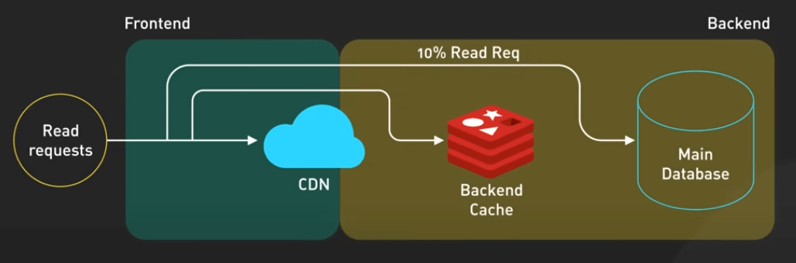{:class="centered-img"}

Mặc dù điều này giảm tải đáng kể cho database, caching cũng có những vấn đề riêng: giữ cho cache đồng bộ với database và quản lý thời gian hết hạn của cache. Các giải pháp như TTL (Time-To-Live, hay thời gian sống) trên các key hoặc caching theo phương pháp write-through có thể giúp duy trì tính nhất quán. Các công cụ như Redis hoặc Memcached giúp dễ dàng triển khai mô hình này. Caching đặc biệt hiệu quả cho dữ liệu nặng về đọc, ít thay đổi, như các trang tĩnh hoặc danh sách sản phẩm.

## Dùng ghi bất đồng bộ hay LSM-Tree database

Một số hệ thống khác thì gặp vấn đề ngược lại - xử lý lượng ghi dữ liệu lớn. Ví dụ, ta có một hệ thống ghi log, xử lý hàng triệu sự kiện mỗi giây, hay một nền tảng mạng xã hội quản lý tương tác người dùng theo thời gian thực. Những hệ thống này cần các chiến lược tối ưu hoá khác.

Ta có hai hướng tiếp cận. Một là, ghi bất đồng bộ với message queue và các worker process. Thay vì xử lý ghi ngay lập tức, hệ thống sẽ xếp chúng vào queue để xử lý trong background. Điều này cho phép người dùng nhận phản hồi ngay lập tức trong khi việc xử lý sẽ diễn ra sau đó. 

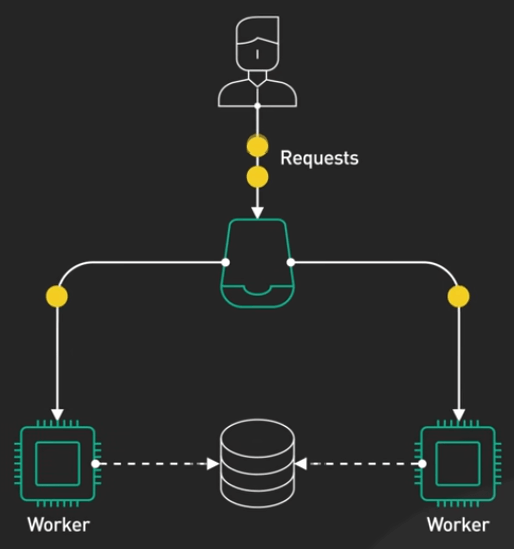{:class="centered-img"}

Hai là, sử dụng các database dựa trên LSM-Tree như Cassandra. Những database này thu thập các lần ghi trong bộ nhớ và định kỳ đẩy chúng vào đĩa dưới dạng các file đã được sắp xếp. Để duy trì hiệu suất, chúng thực hiện compaction: hợp nhất các file để giảm số lần tra cứu cần thiết trong quá trình đọc. Điều này làm cho việc ghi rất nhanh nhưng đọc có thể chậm hơn vì có thể cần kiểm tra nhiều file.

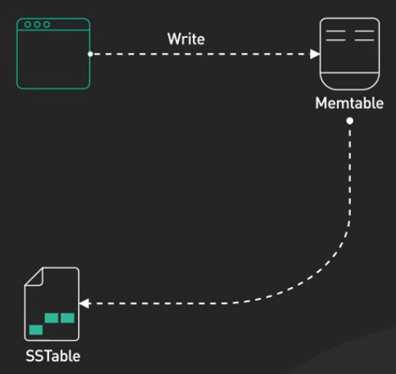{:class="centered-img"}

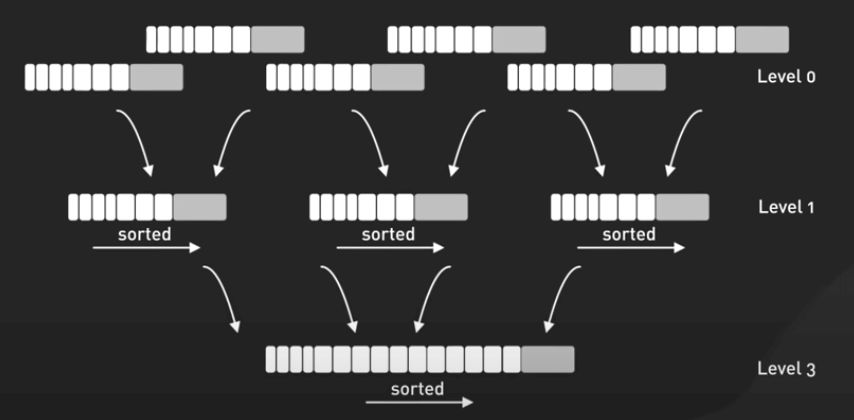{:class="centered-img"}

## Dự phòng và sao lưu

Hệ thống nhanh nhất cũng sẽ trở nên vô dụng nếu nó sập. Một nền tảng thương mại điện tử với một máy chủ database đơn lẻ sẽ dừng hoàn toàn khi nó gặp sự cố - không tìm kiếm, không mua sắm thì sẽ không có tiền.

Chúng ta giải quyết vấn đề này thông qua việc **dự phòng và sao lưu (redundancy and failover)**. Việc triển khai sao chép database với các phiên bản chính và phụ giúp tăng tính khả dụng. Mặc dù điều này làm tăng tính khả dụng, nó cũng làm tăng độ phức tạp trong việc quản lý tính nhất quán. Ta có thể chọn sao chép đồng bộ để ngăn mất dữ liệu và chấp nhận độ trễ cao hơn, hoặc chọn sao chép không đồng bộ để có hiệu suất tốt hơn nhưng có nguy cơ nhỏ sẽ mất dữ liệu trong trường hợp gặp sự cố. Một số hệ thống thậm chí sử dụng sao chép theo quorum để cân bằng giữa tính nhất quán và khả dụng.

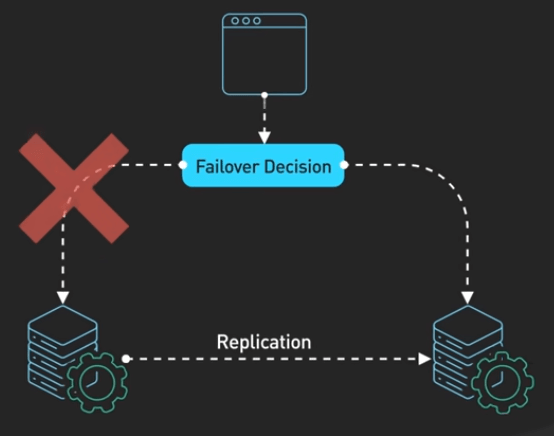{:class="centered-img"}

## Cân bằng tải và sao chép dữ liệu

Một số service quan trọng như hệ thống thanh toán cần tính khả dụng rất cao. Điều này yêu cầu sự kết hợp giữa **cân bằng tải (load balancing) và sao chép dữ liệu (replication)**. Cân bằng tải phân phối lưu lượng truy cập giữa các cụm máy chủ và chuyển hướng lưu lượng khi có sự cố. Đối với database, ta cần một thiết lập chính-phụ (primary-replica): máy chủ chính (primary) xử lý ghi trong khi nhiều máy chủ phụ (replica) xử lý đọc, và failover đảm bảo rằng một replica có thể thay thế primary nếu nó gặp sự cố. 

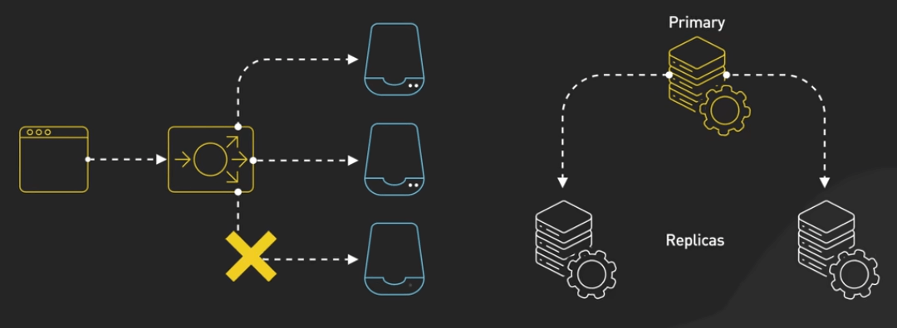{:class="centered-img"}

Sao chép nhiều máy chủ (multi-primary replication) chính là một lựa chọn khác để phân phối ghi theo vị trí địa lý, mặc dù nó đi kèm với những đánh đổi phức tạp hơn về tính nhất quán.

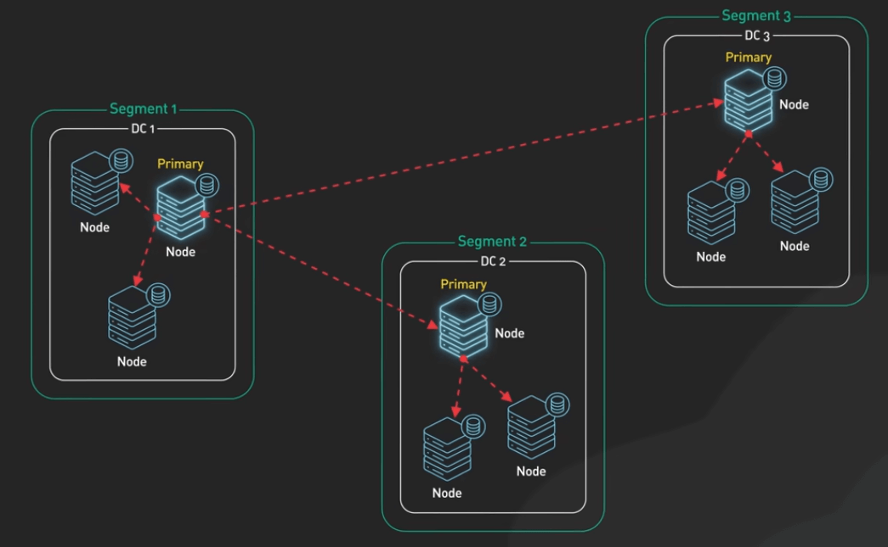{:class="centered-img"}

## Dùng CDN để giảm độ trễ

Hiệu suất sẽ trở nên quan trọng hơn khi phục vụ người dùng toàn cầu. Người dùng ở Australia không nhất thiết phải chờ đợi nội dung tải từ máy chủ ở châu Âu. CDN (Content Delivery Network) giải quyết vấn đề này bằng cách lưu trữ nội dung gần với người dùng, giảm đáng kể độ trễ. Nội dung tĩnh, như video và hình ảnh, hoạt động hoàn hảo với CDN. Đối với nội dung động, các giải pháp như edge computing có thể bổ sung cho việc cache của CDN. Các loại nội dung khác nhau cần các tiêu đề cache-control khác nhau - được set dài hơn cho các file media, ngắn hơn cho profile người dùng.

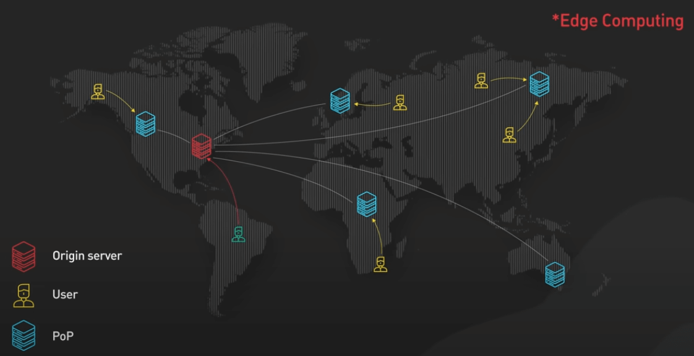{:class="centered-img"}

## Dùng block storage và object storage

Việc quản lý lượng lớn dữ liệu cũng có những thách thức riêng. Các nền tảng hiện đại sử dụng hai loại lưu trữ: **lưu trữ khối (block storage)** và **lưu trữ đối tượng (object storage)**. Lưu trữ khối với độ trễ thấp và IOPS cao phù hợp cho các database và các file nhỏ được truy cập thường xuyên. Trong khi đó, lưu trữ đối tượng có chi phí thấp hơn và được thiết kế để xử lý các file lớn, tĩnh như video và sao lưu ở quy mô lớn. Hầu hết các nền tảng kết hợp cả hai: dữ liệu người dùng vào lưu trữ khối, trong khi các file media được lưu trữ trong lưu trữ đối tượng.

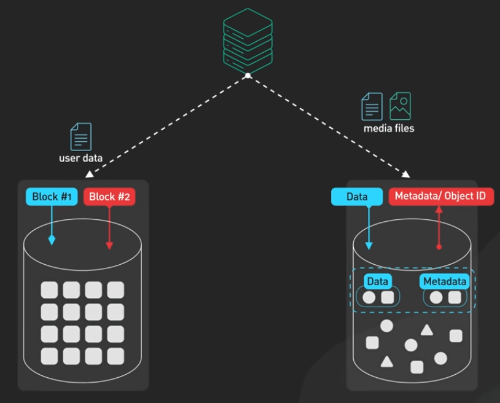{:class="centered-img"}

## Sử dụng các giải pháp logging tập trung

Với các hệ thống này, ta cần cái gì đó để theo dõi hiệu suất của chúng. Các công cụ giám sát hiện đại như Prometheus thu thập log và số liệu, trong khi Grafana cung cấp khả năng trực quan hoá. Các công cụ theo dõi phân tán như OpenTelemetry giúp debug các vấn đề hiệu suất trên các thành phần khác nhau của hệ thống. Khi mở rộng quy mô, việc quản lý lượng dữ liệu này là một thách thức lớn. Mấu chốt là lấy mẫu các sự kiện thường xuyên, giữ log chi tiết cho các hoạt động quan trọng và thiết lập cảnh báo chỉ khi thực sự có vấn đề.

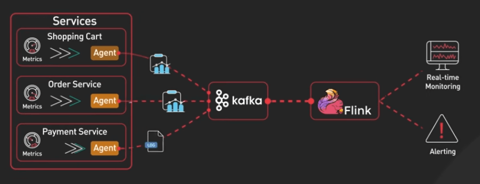{:class="centered-img"}

## Dùng index và sharding hợp lý

Một trong những rắc rối phổ biến nhất mà việc giám sát phát hiện ra là các truy vấn database chậm. Index là hàng rào phòng thủ đầu tiên. Nếu không có index, database sẽ quét từng record để tìm. Với index, nó có thể nhanh chóng tìm đến dữ liệu đúng. Các composite index, cho các truy vấn nhiều cột, có thể tối ưu hoá hiệu suất hơn nữa. Nhưng mỗi index làm chậm việc ghi một chút vì chúng cần được cập nhật khi dữ liệu thay đổi.

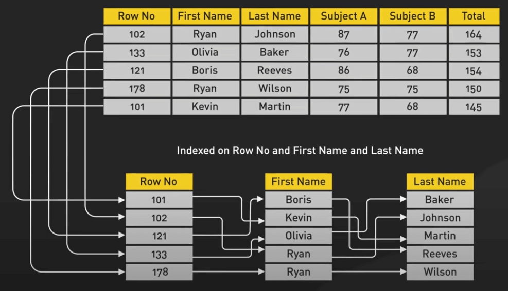{:class="centered-img"}

Đôi khi mỗi index thôi là không đủ. Ta còn cần phải sharding - chia database ra cho nhiều máy khác nhau, sử dụng các chiến lược phân phối dựa trên phạm vi (range-based) hoặc băm (hash-based). Mặc dù sharding có thể mở rộng hệ thống ra đáng kể, nó cũng làm tăng độ phức tạp và có thể khó đảo ngược.

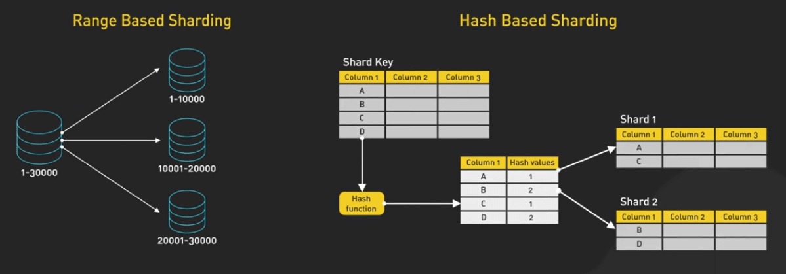{:class="centered-img"}
