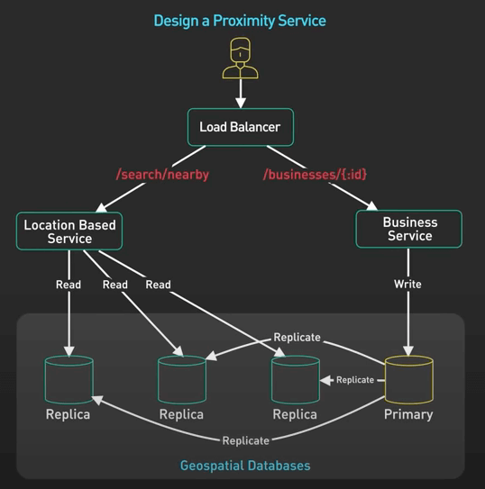
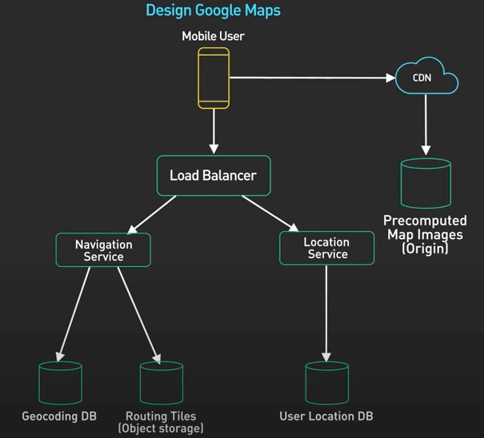

# Hướng dẫn từng bước phỏng vấn System Design

## Nguồn

 [System Design Interview: A Step-By-Step Guide](https://www.youtube.com/watch?v=i7twT3x5yv8)

## Giới thiệu

Trong bài này, ta sẽ nói về khuôn mẫu phỏng vấn System Design (thiết kế hệ thống) mà chúng tôi đã sử dụng trong sách của mình (System Design Interview - An Insider's Guide - Alex Xu, sách này đã có Volume 2).

Mà vì sao lại cần một cái khuôn mẫu như thế nhỉ? Phỏng vấn là một quá trình căng thẳng. Ta có rất ít thời gian để thể hiện những gì mình có thể làm được. Nếu không có sườn, dàn ý, khuôn mẫu hay một cấu trúc nào để theo, ta có thể sẽ lãng phí thời gian quý báu vào những vấn đề hệ thống không quan trọng. Phỏng vấn không có cấu trúc làm cho người phỏng vấn bạn gặp khó để theo dõi.

## Các bước phỏng vấn

Khuôn mẫu của chúng tôi là một cấu trúc đã được chứng minh hiệu quả trong thời gian dài. Nó đơn giản và mạnh mẽ. Nó giúp ta hỏi đúng câu hỏi và tập trung vào đúng thứ cần thiết trong phỏng vấn. Dưới đây là 4 bước trong khuôn mẫu này.

1. Hiểu vấn đề và xác định phạm vi thiết kế hệ thống.
2. Đề xuất thiết kế tổng quan cho hệ thống.
3. Thiết kế chi tiết.
4. Kết thúc.

Cấu trúc này hiệu quả trong một cuộc phỏng vấn System Design dài 45 đến 60 phút. Thông thường, **5 phút đầu là cho phần giới thiệu** và **5 phút cuối là cho phần hỏi đáp**. Phần chính của cuộc phỏng vấn chỉ khoảng 35 đến 45 phút.

Chúng tôi đề xuất dành khoảng **5 phút cho bước 1**, **20 phút cho bước 2**, **15 phút cho bước 3** và **5 phút cho bước 4**. Bạn có thể điều chỉnh thời gian mỗi phần theo ý thích, không nhất thiết phải theo chính xác như vậy, miễn là bạn đủ thời gian.

Cùng đi vào từng bước nhé.

## Bước 1 - Hiểu vấn đề và xác định phạm vi thiết kế hệ thống

Câu hỏi thiết kế hệ thường là câu hỏi mở. Đôi khi câu hỏi được trình bày một cách khá mơ hồ. Điều này giúp kiểm tra khả năng tổ chức suy nghĩ và tập trung vào những gì quan trọng.

Nhiệm vụ của ta là hỏi càng nhiều câu hỏi càng tốt để hiểu rõ câu hỏi. Nếu ta đi ngay vào giải pháp mà không hiểu rõ vấn đề, người phỏng vấn sẽ không đánh giá tốt bạn và sẽ loại bạn gần như ngay lập tức.

Mà nên hỏi những câu nào nhỉ? Mục tiêu của ta là làm rõ đề bài. Ta muốn hiểu tại sao ta xây dựng cái hệ thống này, người dùng là ai và cần xây dựng những tính năng nào (**yêu cầu chức năng - functional requirements**).

Ví dụ, nếu đề bài là thiết kế một ứng dụng chat, bạn cần phải thấy rằng có nhiều loại ứng dụng chat khác nhau trên thị trường. Có ứng dụng chat nhóm riêng tư và nhóm nhỏ như WhatsApp, ứng dụng chat văn phòng như Slack hoặc ứng dụng chat nhóm lớn như Discord. Mỗi loại đều có những khó khăn và ràng buộc thiết kế riêng. Đích đến là hiểu rõ các tính năng ta đang xây dựng theo thứ tự ưu tiên. Ta nên tập trung vào một số tính năng quan trọng nhất thôi. Bạn cần thảo luận và nhận sự đồng ý của người phỏng vấn về danh sách các tính năng.

Ngoài các tính năng cần xây dựng (**functional requirements**), bạn cũng cần hỏi người phỏng vấn để làm rõ các yêu cầu phi chức năng (**non-functional requirements**). Với phỏng vấn System Design, ta nên tập trung vào **quy mô (scale) và hiệu suất (performance)**. Các yêu cầu phi chức năng này làm cho thiết kế trở nên độc đáo và thách thức hơn. Ví dụ, thiết kế một ứng dụng nhái Twitter dành cho vài trăm người dùng thì dễ hơn là thiết kế nó cho hàng triệu người dùng với một số tài khoản phổ biến có hàng triệu người theo dõi. Thế mới độc và khó. Kinh nghiệm mà công việc mới yêu cầu càng nhiều thì bạn càng cần phải chứng tỏ năng lực xử lý các yêu cầu phi chức năng này.

Để có được cái nhìn tổng quan về quy mô của hệ thống cùng những khó khăn có thể xảy ra khi thiết kế, ta có thể thực hiện một số tính toán về hệ thống. Nên nhớ là đến đây ta vẫn chưa thiết kế gì cả, cho nên tính toán ở đây chỉ ước chừng thôi. Mục tiêu là có được cái nhìn tổng quan về quy mô hệ thống.

Toàn bộ bước 1 này cần khoảng 5 phút. Cuối cùng, ta sẽ có một danh sách ngắn các tính năng để thiết kế, cùng với một số yêu cầu phi chức năng cần phải thoả mãn.

## Bước 2 - Đề xuất thiết kế tổng quan cho hệ thống

Trong bước này, mục tiêu là đề xuất một thiết kế tổng quan và nhận sự đồng thuận của người phỏng vấn.

### Thiết kế API

Với phần lớn các đề bài, ta sẽ theo cách tiếp cận từ trên xuống và **bắt đầu với các API**. Các API tạo nên một thoả thuận giữa người dùng cuối và backend. Sau khi thu thập các yêu cầu, ta sẽ biết được những API nào cần thiết. Trừ khi có chỉ định khác, ta nên tuân theo quy ước RESTful. Định nghĩa cẩn thận các tham số request và response của mỗi API. Nhớ dành thời gian để xem xét kỹ các API, xác minh rằng chúng đáp ứng các yêu cầu chức năng. Một điều quan trọng cần nhớ là không tạo ra các API không liên quan gì đến các yêu cầu chức năng.

Thêm nữa, một số đề bài có thể yêu cầu giao tiếp hai chiều giữa client và server. WebSocket là một lựa chọn tốt, nhưng nhớ rằng socket service như websocket thì stateful, nó khá khó để vận hành ở quy mô lớn. Nếu phải thiết kế ở quy mô lớn, nên chuẩn bị một cách thiết kế WebSocket trong phần Thiết kế chi tiết.

### Vẽ biểu đồ thiết kế tổng quan

Sau khi xong phần API giữa client và server, phần tiếp theo là **vẽ biểu đồ thiết kế tổng quan**. Biểu đồ là bản thiết kế tổng quan mà ta có thể tham khảo. Ta dùng nó để xác minh rằng thiết kế đáp ứng tất cả các yêu cầu chức năng. Ví dụ như hình dưới.

{ style="display: block; margin: 0 auto" }

Với nhiều đề bài, mọi thứ thường bắt đầu với một **load balancer** hoặc một **API gateway**. Sau đó là các service đáp ứng các yêu cầu chức năng. Nhiều service cần một số hình thức lưu trữ. Đây là nơi ta sẽ hoàn thiện thiết kế bằng các giới thiệu lớp lưu trữ dữ liệu.

Thường thì ta chưa cần phải nói ra ta sẽ dùng database gì ở đây, cái này sẽ nói trong phần Thiết kế chi tiết nếu cần, và chỉ sau khi ta đã ra được data schema. Ví dụ, với một service bản đồ như Google Maps, client thường cần gửi các cập nhật vị trí GPS thường xuyên đến server. Ta sẽ thêm vào thiết kế một cái data store vị trí, service cập nhật vị trí sẽ cho data vào đó.

{ style="display: block; margin: 0 auto" }

Lặp lại các bước trên và hoàn thiện biểu đồ thiết kế tổng quan cho tất cả các tính năng chính. Một mẹo nhỏ này, trong bước thiết kế tổng quan, **hãy chuẩn bị các điểm cần thảo luận cho phần sau**, tránh sa vào chi tiết thiết kế quá sớm. Cuối cùng, ta sẽ có một biểu đồ thiết kế tổng quan hoàn chỉnh.

### Thiết kế data model và schema

Phần cuối cùng trong thiết kế tổng quan là **thiết kế ra data model và schema**. Ở đây ta nên thảo luận về những **khuôn mẫu truy cập dữ liệu** và **tỷ lệ đọc/ghi dữ liệu**. Khi ở quy mô lớn, mô hình dữ liệu có thể ảnh hưởng đáng kể đến hiệu suất của thiết kế. Nếu nó đơn giản, ta cũng có thể thảo luận về các database và các tùy chọn indexing.

Ở đây ta cần quyết định một số thứ. Nếu mô hình dữ liệu là phần quan trọng của thiết kế để đáp ứng các yêu cầu phi chức năng, ta có thể hoãn phần thảo luận này cho phần thiết kế chi tiết.

Sau khi xong phần tổng quan rồi, hãy review lại thiết kế. Hãy đảm bảo rằng mỗi tính năng xong từ đầu tới cuối về cơ bản.

## Bước 3 - Thiết kế chi tiết

Mục tiêu của bước này là để chứng minh rằng ta có thể xác định các vấn đề tiềm tàng và đưa ra các giải pháp và thảo luận về các trade-off. Ta nên làm việc cùng với người phỏng vấn để quyết định những gì nên được thảo luận sâu hơn. 

Bước này là nơi các yêu cầu phi chức năng lên ngôi. Level càng cao thì bước này càng quan trọng. Nên nhớ là không có một cách tiếp cận nào phù hợp với tất cả các trường hợp.

Trực giác của bạn sẽ có tác dụng ở đây. Đôi khi ngôn ngữ cơ thể của người phỏng vấn sẽ là gợi ý cho bạn rằng họ không hài lòng với một số phần của thiết kế. Quan trọng là phải nhận ra những gợi ý này và đảm bảo các vấn đề được giải quyết. 

Một cách mà ta có thể áp dụng là hỏi. Ta có thể liệt kê các lý do để chọn một giải pháp cụ thể và hỏi xem họ có thắc mắc gì không. Khi ta đã chọn ra một hoặc hai vấn đề để thảo luận sâu hơn, ta nên đưa ra nhiều giải pháp và thảo luận về các trade-off của mỗi lựa chọn.

Có một số mẹo như sau:

1. Ta nên nêu rõ vấn đề. Ví dụ, đối với thiết kế Google Maps, việc ghi QPS ở mức 1 triệu / giây vào database thì quá cao so với khả năng xử lý của một database. 
2. Ta nên đưa ra ít nhất hai giải pháp. Tiếp tục với ví dụ trên, ta có thể đề xuất giảm tần suất cập nhật vị trí cho mỗi người dùng, hoặc chọn một database NoSQL có thể xử lý được tốc độ ghi. 
3. Ta nên thảo luận về các trade-off của các giải pháp. Nhớ sử dụng các con số để chứng minh lựa chọn của mình.
4. Cuối cùng, ta chọn một giải pháp và thảo luận với người phỏng vấn. Lặp lại các bước này cho các vấn đề khác.

Trung bình trong một cuộc phỏng vấn, ta chỉ có thời gian để thảo luận sâu hơn vào 2 hoặc 3 vấn đề. 

## Bước 4 - Kết thúc

Ta nên dành vài phút để tóm tắt thiết kế. Ở đây ta nên tập trung vào những phần độc đáo thôi, và làm nhanh thôi nhé. Nên để lại đủ thời gian ở cuối cuộc phỏng vấn để hỏi người phỏng vấn các câu hỏi về công ty.
