# Top 5 ứng dụng của Redis

## Nguồn

 [Top 5 Redis Use Cases](https://www.youtube.com/watch?v=a4yX7RUgTxI)

## Redis là gì?

**Redis** là một dạng cơ sở dữ liệu lưu trữ data trong bộ nhớ. Nó thường được sử dụng như là cache. Nó hỗ trợ nhiều dạng cấu trúc dữ liệu khác nhau, như string, hash, list, set và sorted set.

Redis nổi tiếng vì tốc độ cực cao. Và vì sao lại như vậy thì đã có một [bài viết](./why_redis_fast.md) nói về điều này rồi.

## Cache

Ứng dụng đầu tiên của Redis dĩ nhiên là lưu tạm data để làm cho ứng dụng web nhanh hơn. Với ứng dụng này, Redis lưu trữ các data được request thường xuyên trong bộ nhớ. Nó cho phép web server trả về các data này một cách nhanh chóng. Điều này làm giảm tải lên database và cải thiện thời gian trả về của ứng dụng.

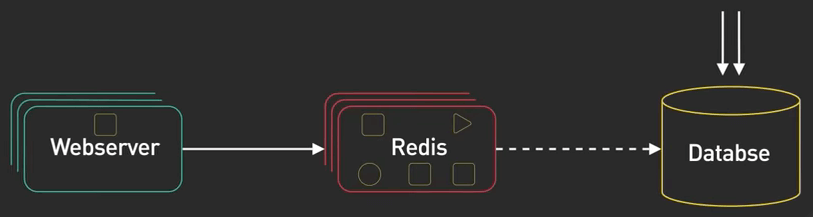{:class="centered-img"}

Với quy mô lớn hơn, cache được phân phối trong một cụm các Redis server. Sharding là một kĩ thuật phổ biến để phân phối tải đều cho các server trong cụm.

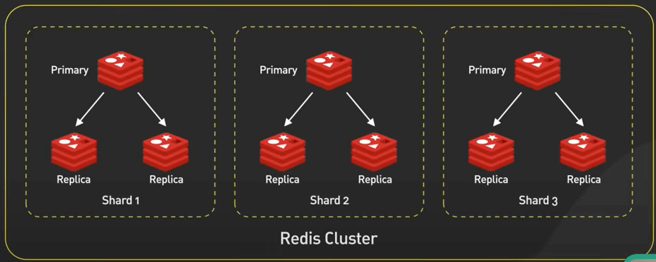{:class="centered-img"}

Một số ứng dụng nhỏ khác khi dùng distributed Redis cache có việc set TTL (Time-To-Live - thời gian sống) và xử lý thundering herd ([Thundering herd](https://en.wikipedia.org/wiki/Thundering_herd_problem) xảy ra khi có một lượng lớn process hay thread đợi một event nào đó nhưng chỉ có một process được xử lý event đó thôi. Khi các process được bật, chúng sẽ giành nhau để xử lý event. Các process này sẽ tranh nhau tài nguyên, có thể làm treo máy).

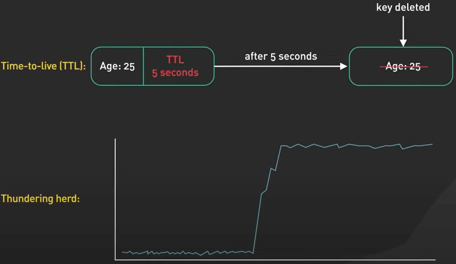{:class="centered-img"}

## Session Data

Ứng dụng tiếp theo là khi dùng Redis như một nơi chứa session. Nó cho phép chia sẻ session data giữa các stateless server. Khi một user đăng nhập vào một ứng dụng web, session data sẽ được lưu vào Redis, cùng với session ID duy nhất được trả về cho client dưới dạng cookie. Khi user gửi request lên cho ứng dụng, session ID sẽ được lồng vào request, và server sẽ lấy session data từ Redis với ID này. Lưu ý rằng Redis là in-memory database, nên session data lưu trong Redis sẽ bị mất nếu Redis server khởi động lại.

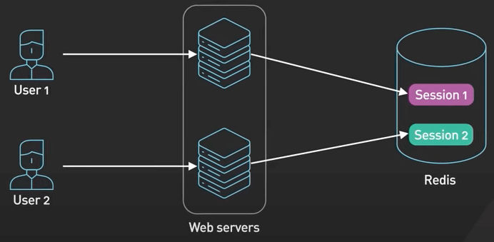{:class="centered-img"}

## Replication

Mặc dù Redis cung cấp tính lâu dài cho dữ liệu được lưu với các lựa chọn như snapshot và AOF (Append-Only File), thứ có thể giúp ta lưu session data vào ổ cứng và reload lại nó vào memory nếu khởi động lại server, các lựa chọn này thường mất rất nhiều thời gian để đưa dữ liệu từ ổ cứng vào memory để có thể sử dụng trong thực tế. Trong nhiều trường hợp, replication thường được sử dụng hơn. Data sẽ được sao chép vào một bản sao Redis. Trong trường hợp Redis chính bị crash, bản sao sẽ được đưa vào thay thế bản gốc để tiếp tục công việc.

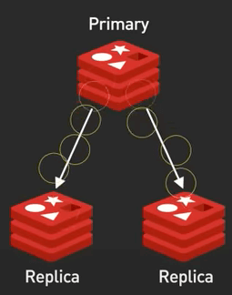{:class="centered-img"}

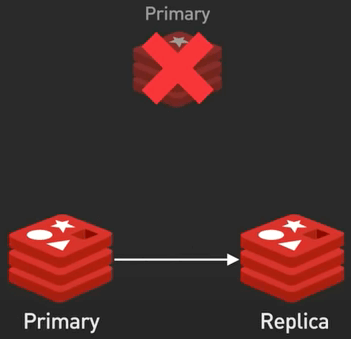{:class="centered-img"}

## Distributed Lock

**Distributed Lock** (khoá) được sử dụng khi nhiều node trong ứng dụng cần truy cập vào một số tài nguyên được chia sẻ. 

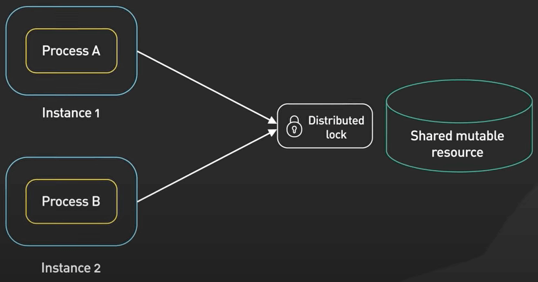{:class="centered-img"}

Redis được dùng làm distributed lock với các lệnh có tính atomic như `SETNX` (`SET if Not eXists`). Nó cho phép người gọi set một key chỉ khi key đó chưa tồn tại trong Redis.

Nó hoạt động như sau: 

- Client 1 thử lấy lock bằng cách set key với một giá trị duy nhất nào đó và thời gian sống với lệnh `SETNX` (`SETNX lock 1234abcd EX 3`). 
- Nếu key không tồn tại trong Redis, `SETNX` sẽ trả về 1, cho biết rằng lock đã được lấy bởi client 1. Client 1 xong việc và thả lock ra bằng cách xoá cái key đó. 
- Nếu key vẫn còn đang tồn tại trong Redis, `SETNX` trả về 0, cho biết là lock đã được lấy bởi một client khác. Trong trường hợp này, client 1 đợi và thử `SETNX` lại cho đến khi lock được thả bởi client kia đó.

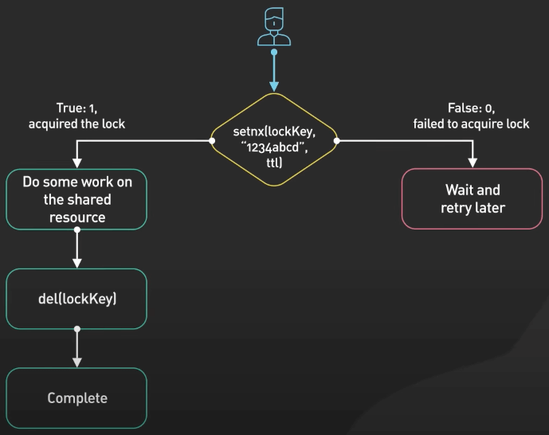{:class="centered-img"}

Lưu ý rằng phần cài đặt này có thể đủ tốt với nhiều use case, nhưng vẫn sinh ra lỗi. Trong thực tế, có rất nhiều thư viện Redis cung cấp cho chúng ta nhiều kiểu cài đặt distributed lock chất lượng cao như sau:

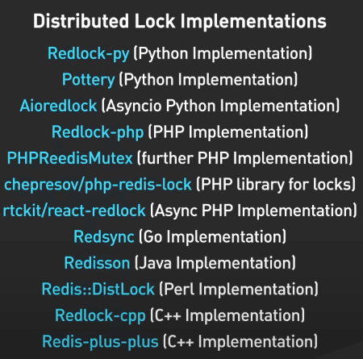{:class="centered-img"}

## Rate Limiter

Rate Limiter là một công cụ để kiểm soát số lượng request đến với server trong một khoảng thời gian. Redis có thể được dùng như một rate limiter bằng cách sử dụng các lệnh tăng bộ đếm và thiết lập thời gian sống cho các bộ đếm đó.

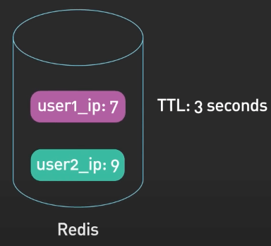{:class="centered-img"}

Một thuật toán rate limiter đơn giản hoạt động như sau: Với một request đến server, IP của request hay user ID được dùng làm key. Số request của cái key đó được tăng lên nhờ lệnh `INCR` trong Redis. Biến đếm hiện tại được so với giới hạn (rate limit). Nếu vẫn trong giới hạn, request được cho tiếp tục xử lý, còn nếu không thì request bị từ chối.

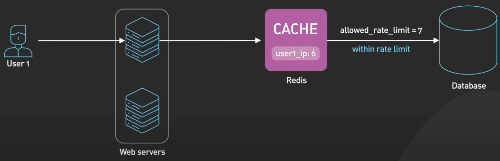{:class="centered-img"}

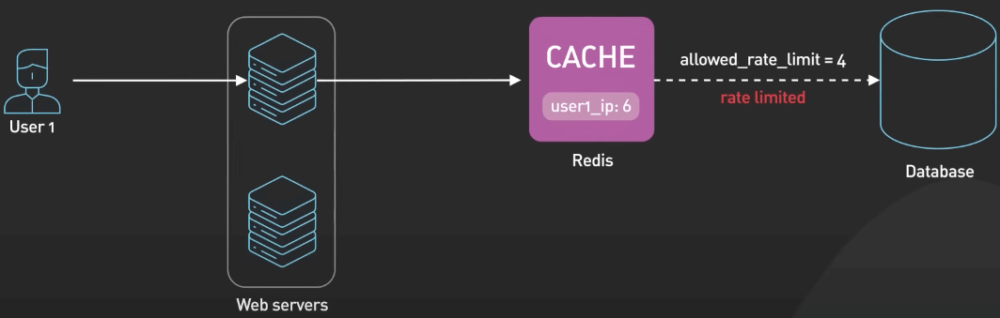{:class="centered-img"}

Các key được set để hết hạn sau một khoảng thời gian, ví dụ như một phút, để reset biến đếm cho khoảng thời gian tiếp theo. 

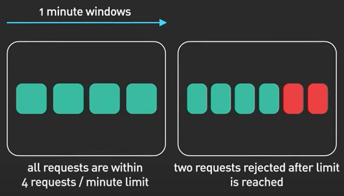{:class="centered-img"}

Một số thuật toán rate limiter phức tạp hơn như Leaky Bucket cũng có thể được cài đặt bằng Redis.

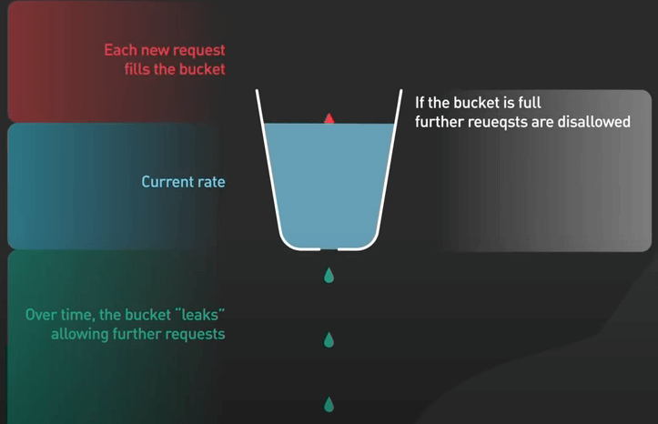{:class="centered-img"}

## Gaming Leaderboard

Với một số game vừa và nhỏ, Redis cung cấp khả năng để các lập trình viên tạo ra nhiều loại bảng xếp hạng khác nhau. Sorted Set là một dạng cấu trúc dữ liệu có thể làm được điều này. Sorted Set là một tập các phần tử khác nhau đôi một, với một trọng số được gán cho mỗi phần tử. Các phần tử được sắp xếp theo trọng số này. Điều này cho phép việc lấy nhanh các phần tử bằng trọng số trong thời gian $log$.

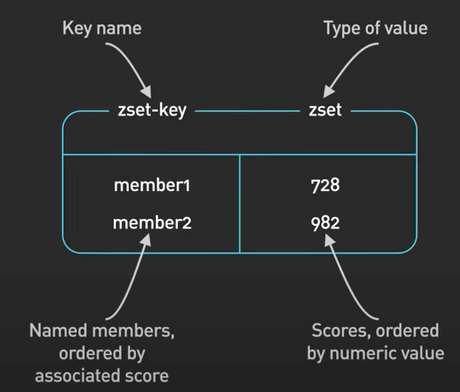{:class="centered-img"}

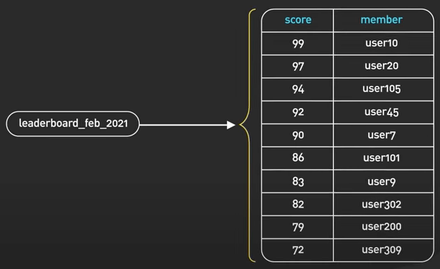{:class="centered-img"}
