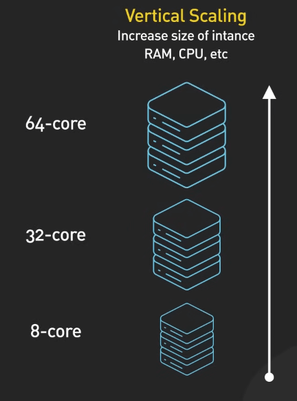
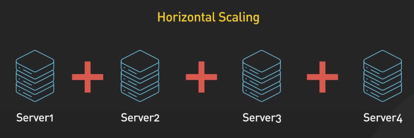

# Vertical vs. Horizontal Scaling

## Nguồn

 [Vertical Vs Horizontal Scaling: Key Differences You Should Know](https://www.youtube.com/watch?v=dvRFHG2-uYs)

## Vertical Scaling (nâng cấp - scaling theo chiều dọc)

Scaling dọc (vertical scaling) có nghĩa là thêm sức mạnh vào server hiện tại, có thể bao gồm việc tăng thêm CPU, RAM, ổ cứng, hoặc băng thông mạng. Ví dụ, nếu cơ sở dữ liệu đám mây của bạn đạt đến giới hạn dung lượng trên một server 8-core ban đầu, bạn có thể nâng cấp lên một server 32-core với ổ SSD nhanh hơn, 96GB RAM và mạng 10 gigabit. Giờ nó có thể chịu tải tốt hơn.

{:class="centered-img"}

Ưu điểm:

- Đơn giản để thực hiện: Nâng cấp phần cứng hiện có dễ hơn so với việc thiết lập server mới.
- Tiết kiệm chi phí ngắn hạn: Bạn chỉ trả tiền cho các tài nguyên bổ sung cần thiết.
- Tất cả chạy trên một máy, giúp bảo trì và nâng cấp dễ dàng hơn.

Nhược điểm:

- Single point of failure: Nếu server gặp sự cố, mọi thứ đều bị ngưng trệ.
- Giới hạn mở rộng: Có giới hạn vật lý về việc một server có thể mạnh đến đâu.
- Chi phí cao khi quy mô lớn: Nâng cấp phần cứng cao cấp có thể rất đắt đỏ.

## Horizontal Scaling (mở rộng - scaling theo chiều ngang)

Scaling ngang (horizontal scaling) là thêm nhiều server vào hạ tầng và phân phối khối lượng công việc giữa chúng, còn được gọi là "scale out". Thay vì dồn tất cả vào một máy mạnh, bạn có thể trải rộng khả năng trên ba máy 8-core. Với sự phổ biến của dịch vụ đám mây có auto-scaling và serverless computing, cách tiếp cận này đã đơn giản hóa việc mở rộng cho một số khối lượng công việc.

{:class="centered-img"}

Ưu điểm:

- Tính sẵn sàng cao: Hệ thống phân tán cung cấp khả năng dự phòng với các server thay thế và cơ chế chuyển đổi dự phòng.
- Dự đoán trước khả năng mở rộng: Bạn có thể thêm nhiều server khi cần, mở rộng khả năng theo nhu cầu.
- Cải thiện hiệu suất: Phân phối khối lượng công việc giúp cải thiện hiệu suất tổng thể.
- Tiết kiệm chi phí dài hạn: Phân phối công việc trên nhiều máy chủ hiệu quả hơn có thể rẻ hơn so với việc nâng cấp phần cứng cao cấp.

Nhược điểm:

- Phức tạp hơn: Thiết lập và quản lý hệ thống phân tán phức tạp hơn quản lý một máy chủ đơn lẻ, đặc biệt là đối với các hệ thống lưu trữ trạng thái như cơ sở dữ liệu.
- Chi phí ban đầu cao hơn: Việc phân mảnh cơ sở dữ liệu hoặc ứng dụng để phân phối công việc có thể phức tạp và yêu cầu nỗ lực phát triển đáng kể. Đảm bảo tính nhất quán dữ liệu giữa các máy chủ cần cơ chế sao chép dữ liệu, tăng thêm gánh nặng và chi phí vận hành. Việc phân phối lưu lượng truy cập hiệu quả trên nhiều máy chủ yêu cầu một giải pháp cân bằng tải mạnh mẽ, có thể tăng thêm chi phí phần cứng hoặc phần mềm cho hệ thống của bạn.

## Vậy chọn cái nào?

Vậy nên chọn scaling dọc hay scaling ngang? Câu trả lời tùy thuộc vào nhiều yếu tố:

- Ngân sách: Scaling dọc thường rẻ hơn trong ngắn hạn, nhưng scaling ngang có thể hiệu quả hơn về chi phí trong dài hạn.
- Khối lượng công việc: Nếu khối lượng công việc của bạn không ổn định hoặc tăng đột biến, scaling ngang có thể giúp bạn xử lý nhu cầu đỉnh điểm.
- Yêu cầu hiệu suất: Nếu ứng dụng của bạn yêu cầu hiệu suất cao, scaling ngang có thể giúp phân phối tải và cải thiện khả năng phản hồi.

Một yếu tố quan trọng khác là chi phí phát triển và vận hành bổ sung nếu ứng dụng của bạn yêu cầu các cơ chế phức tạp như sharding.

Dù chọn phương pháp nào, hãy nhớ rằng mở rộng hạ tầng là cả một hành trình, không phải là đích đến. Nhu cầu hạ tầng của bạn sẽ thay đổi theo thời gian khi doanh nghiệp phát triển, vì vậy hãy sẵn sàng điều chỉnh và thay đổi chiến lược mở rộng của mình.
