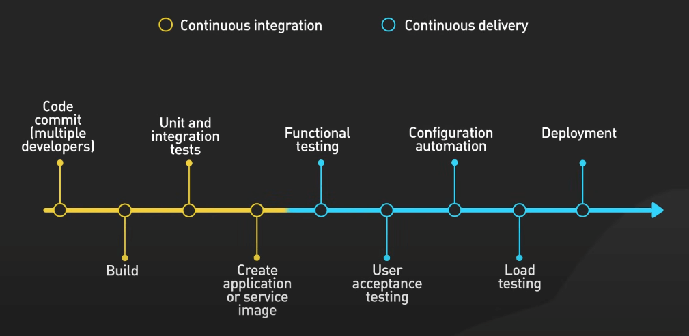
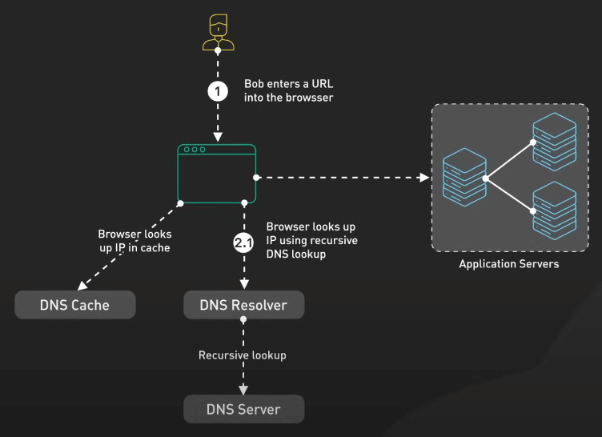
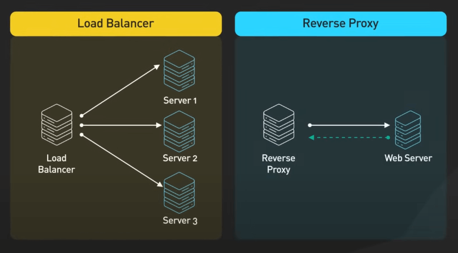
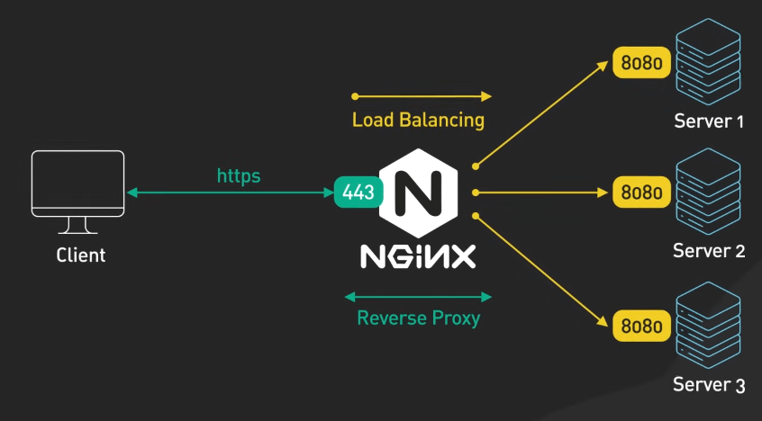
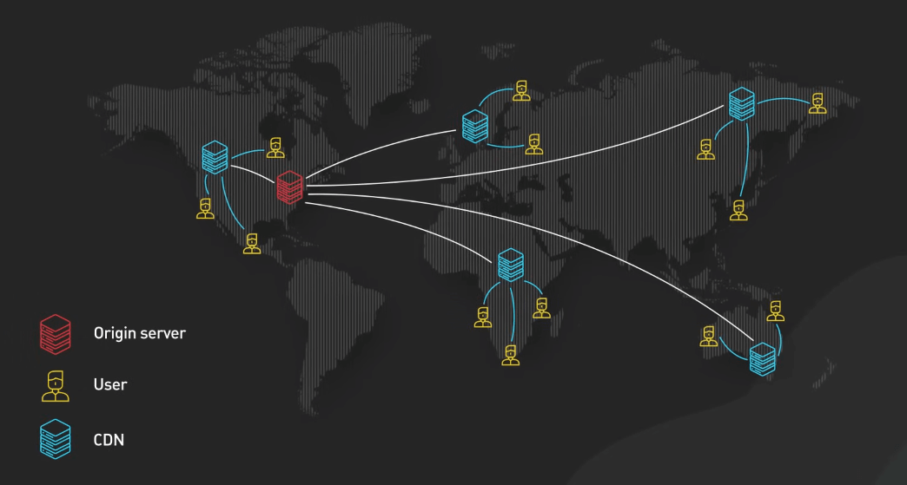
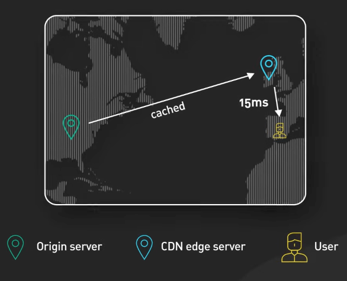
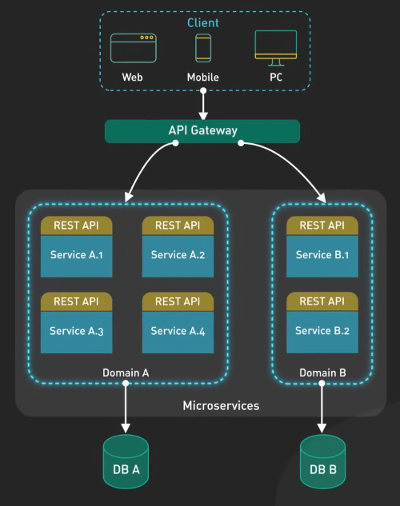
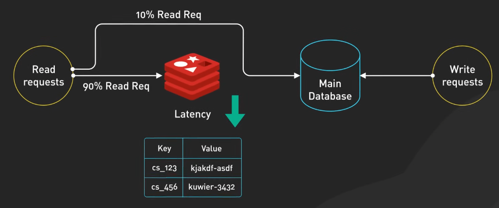
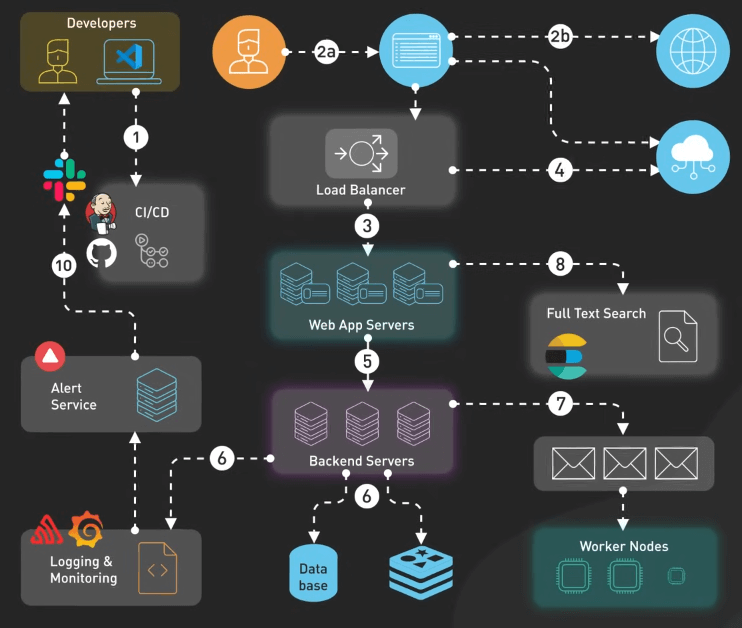

# Các ứng dụng web có gì?

## Nguồn

 [Everything You NEED to KNOW About Web Applications](https://www.youtube.com/watch?v=_higfXfhjdo)

## CI/CD

CI/CD là viết tắt của Continuous Integration/Continuous Deployment. CI/CD là xương sống của mô hình phát triển phần mềm hiện đại. Các công cụ như GitHub Actions tự động hóa việc test, build và deploy. Với CI/CD, mọi thay đổi trong code đều được kiểm tra tự động trước khi đến với môi trường live. Không còn cảnh tự mình phải build và ứng dụng của bạn sẽ có ít lỗi hơn.

{:class="centered-img"}

## Load Balancer và Reverse Proxy

Cùng theo chân một request từ client đến server. Request sẽ bắt đầu từ trình duyệt, sau khi truy vấn DNS thì request hướng đến các web server. 

{:class="centered-img"}

Nhưng trước đó thì nó phải gặp hai thành phần quan trọng: Load Balancer và Reverse Proxy. Chúng giống như người hướng dẫn giao thông, giúp phân phối tải và bảo vệ server khỏi các cuộc tấn công.

{:class="centered-img"}

Các công cụ như nginx phân phối request đến các server khác nhau, giúp cân bằng tải và tránh việc một server bất kỳ bị quá tải.

{:class="centered-img"}

## CDN

CDN là viết tắt của Content Delivery Network. CDN được phân bố trên toàn thế giới, giúp phục vụ các file tĩnh như ảnh, video, và file CSS nhanh hơn. CDN giúp giảm thời gian tải trang, giảm tải cho hệ thống của bạn và tăng trải nghiệm người dùng.

{:class="centered-img"}

{:class="centered-img"}

## API

Giờ request đã đến được web server, web server sẽ xử lý nó, nhưng thường web server sẽ phải giao tiếp với các hệ thống khác, đây là lúc API lên tiếng. API sẽ kết nối ứng dụng với các service backend, xử lý các logic phức tạp, giao tiếp với các hệ thống bên thứ ba hay xử lý chuyển đổi dữ liệu. Cách tiếp cận dựa vào API này giúp giữ tính module cho hệ thống và dễ dàng mở rộng.

{:class="centered-img"}

## Database và Cache

Tiếp theo ta có database và cache. Database sẽ lưu trữ dữ liệu của ứng dụng, cache sẽ giữ dữ liệu tạm thời để giảm thời gian truy cập dữ liệu từ database. Cả hai đều quan trọng, và cần được thiết kế sao cho phù hợp với ứng dụng của bạn.

{:class="centered-img"}

## Job Queue và Search Engine

Với các tác vụ phức tạp hơn, không thể thực hiện ngay lập tức thì job queue sẽ là lựa chọn phù hợp. Các tác vụ này sẽ được chuyển cho các worker node để xử lý, giúp giảm tải cho server chính và tăng hiệu suất.

Nếu ứng dụng cần chức năng tìm kiếm thì các service như ElasticSearch sẽ giúp bạn xây dựng một hệ thống tìm kiếm mạnh mẽ, nhanh chóng và dễ dàng mở rộng.

## Giám sát

Với các thành phần như trên, ta cần một hệ thống giám sát hiệu quả. Các công cụ như Prometheus và Grafana giúp bạn theo dõi hiệu suất của hệ thống, phát hiện sớm các vấn đề và giúp cải thiện hiệu suất.

## Hệ thống cảnh báo

Nếu có gì đó sai sai xảy ra, ta cần một hệ thống cảnh báo tới team dev. Các platform như PagerDuty sẽ giúp bạn cảnh báo ngay lập tức khi có vấn đề xảy ra.

{:class="centered-img"}
