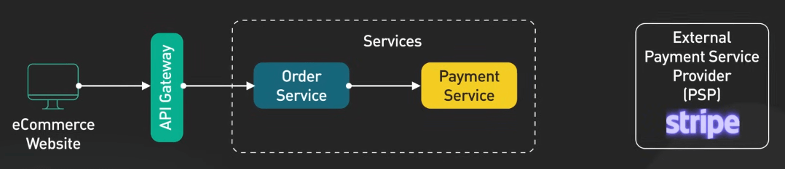
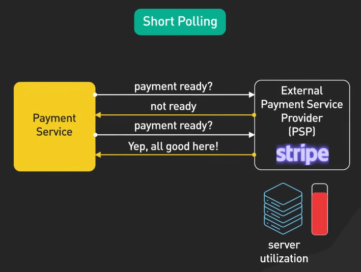
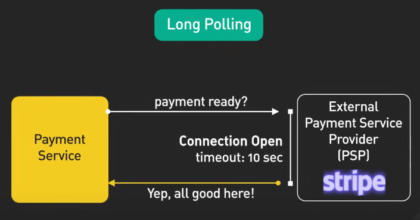
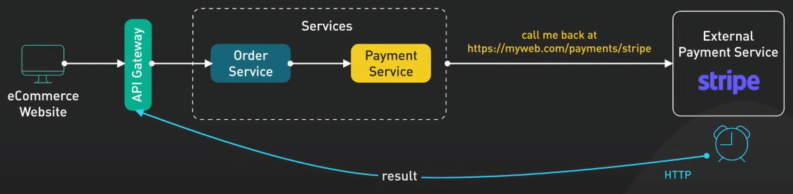
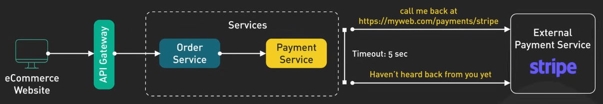
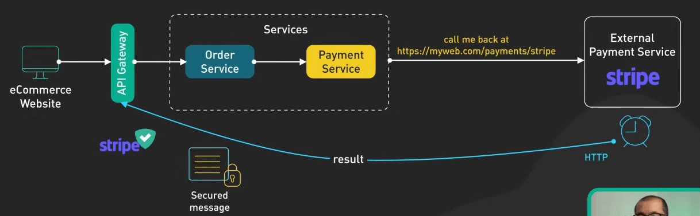
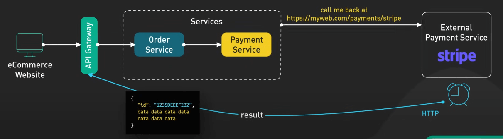
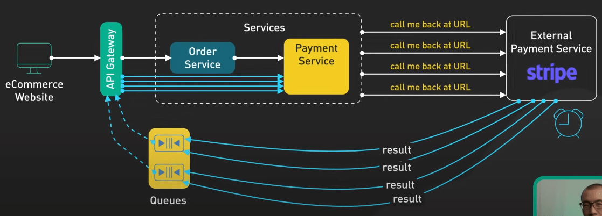
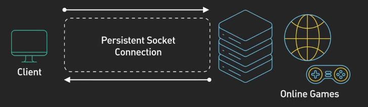

# Những điều cần biết về Webhook

## Nguồn

 [Top 3 Things You Should Know About Webhooks!](https://www.youtube.com/watch?v=x_jjhcDrISk)

## Tình huống

Hãy tưởng tượng bạn có một website thương mại điện tử. Khách của bạn hào hứng mua sẵm trên trang, thêm đồ vào giỏ hàng, bấm đặt hàng. Các request này được gửi qua API gateway đến Order Service, sau đó chuyển đến Payment Service để xử lý giao dịch. Đây là lúc Payment Service Provider (PSP) bên ngoài, như Stripe, bắt đầu tham gia.

{:class="centered-img"}

Vậy làm sao Stripe giao tiếp với website của bạn để xác nhận thanh toán? Trước đây, phương pháp phổ biến là **short polling**. Nó giống như việc liên tục hỏi: "Xong chưa? Giờ sao?". Payment Service sẽ kiểm tra với Stripe liên tục cho đến khi nhận được xác nhận. Tuy nhiên, short polling tiêu tốn tài nguyên vì phải gửi request liên tục.

{:class="centered-img"}

**Long polling** là phiên bản kiên nhẫn hơn của short polling. Thay vì hỏi liên tục, server giữ yêu cầu mở và chỉ phản hồi khi có thông tin mới. Mặc dù hiệu quả hơn, nhưng vẫn tốn tài nguyên vì server phải duy trì kết nối chờ.

{:class="centered-img"}

Giờ đến webhooks. Thay vì yêu cầu Stripe liên tục, bạn chỉ cần nói: "Gửi kết quả qua cái URL này cho tôi khi có nhé". Khi thanh toán hoàn tất, Stripe sẽ tự động gửi cập nhật đến URL của bạn. Không còn lãng phí tài nguyên nữa.

{:class="centered-img"}

Một số mẹo hay khi sử dụng webhooks:

- Cơ chế dự phòng bằng polling. Trong trường hợp server webhook không phản hồi, sử dụng polling định kỳ để đảm bảo không bỏ lỡ các cập nhật quan trọng.

{:class="centered-img"}

- Bảo mật với secret và tokens. Chỉ cho phép các request có xác thực truy cập vào endpoint webhook của bạn để tránh việc bị giả mạo.

{:class="centered-img"}

- Tính idempotent. Webhook có thể được gửi nhiều lần, vì vậy hãy đảm bảo việc nhận nhiều request không gây lỗi bằng cách xử lý chỉ một lần duy nhất. Thêm một ID vào mỗi request để phân biệt.

{:class="centered-img"}

- Xử lý lưu lượng lớn. Nếu trang web của bạn có lượng truy cập cao, hãy chuẩn bị sẵn hạ tầng để đối phó với đợt tăng đột biến lưu lượng webhook, sử dụng queue để tách biệt việc nhận và xử lý sự kiện.

{:class="centered-img"}

Cuối cùng, nếu bạn cần dữ liệu thời gian thực với độ trễ cực thấp, có thể xem xét kết nối socket thay vì webhooks. Socket giúp tối ưu hiệu suất hơn nhưng khó thiết lập và duy trì hơn.

{:class="centered-img"}

Webhooks mang lại hiệu quả lớn khi được áp dụng đúng cách, giúp tối ưu hóa tài nguyên và giảm thiểu chi phí.

