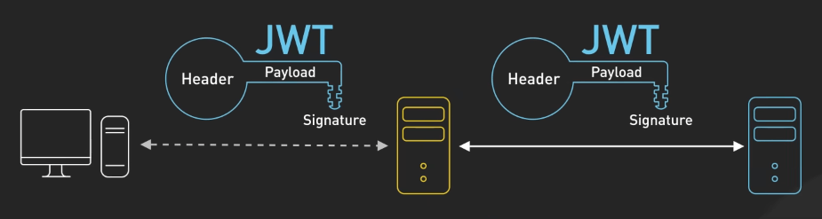
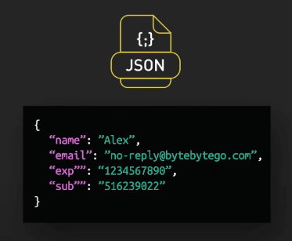
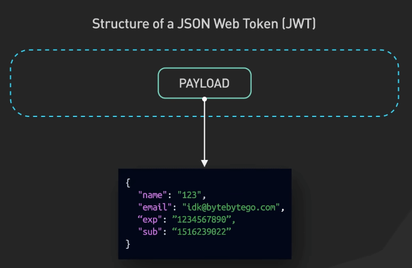
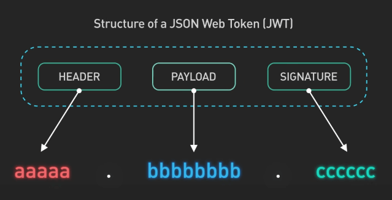
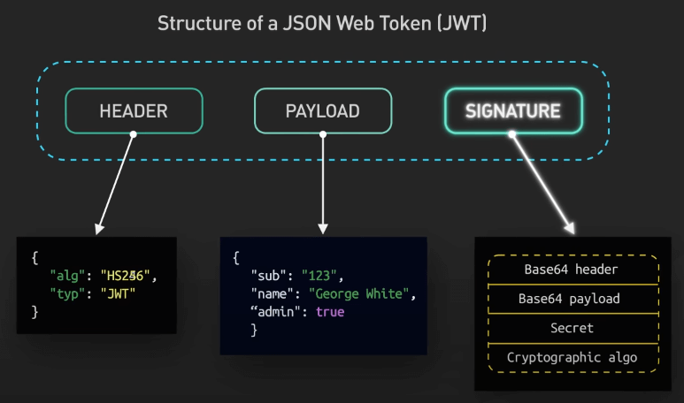
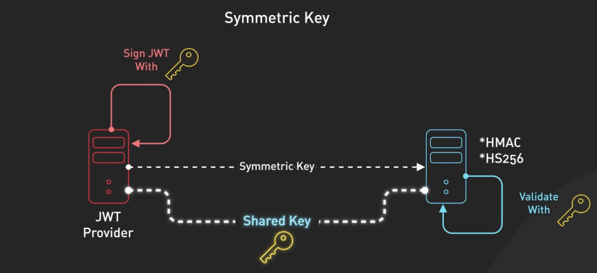
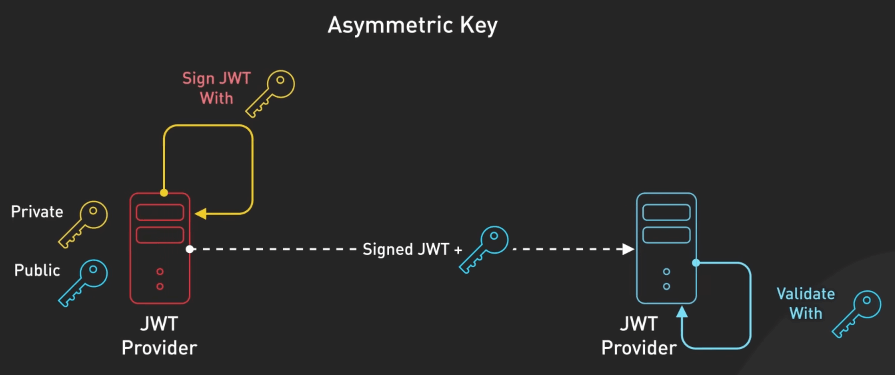
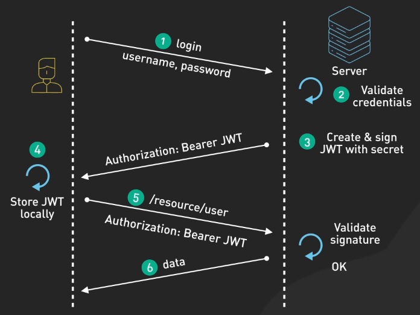

# Tại sao JSON Web Token (JWT) phổ biến?

## Nguồn

 [Why is JWT popular?](https://www.youtube.com/watch?v=P2CPd9ynFLg)

## JWT là gì?

JSON Web Tokens, hay còn được biết đến với cái tên viết tắt JWT, là một phương pháp mạnh mẽ để truyền tải thông tin một cách an toàn giữa các bên, dưới dạng đối tượng JSON.

{:class="centered-img"}

JWT đã trở thành nền tảng của bảo mật web vì nhiều lý do. Trước tiên, nói về JSON, đây là một định dạng trao đổi dữ liệu nhẹ, dễ đọc và ghi cho con người hiểu được, và đủ đơn giản để máy móc có thể parse và sinh ra. 

{:class="centered-img"}

JSON là cốt lõi của JWT vì nó đại diện cho phần payload, nơi bạn lưu trữ dữ liệu cần truyền tải.

{:class="centered-img"}

## Cấu trúc của JWT

JWT có cấu trúc gồm ba phần: header, payload và signature. Mỗi phần được mã hóa base64 và phân tách bằng dấu chấm. 

{:class="centered-img"}

Header thường bao gồm loại token (JWT) và thuật toán được sử dụng, như HMAC SHA256 hoặc RSA. Payload là nơi chứa các claim (yêu cầu). Claim là các tuyên bố về một thực thể (entity), thường là người dùng, kèm theo một số dữ liệu bổ sung. Có ba loại claim: đã đăng ký, công khai và riêng tư. Claim đã đăng ký là những yêu cầu được định nghĩa sẵn, như thông tin về người phát hành, thời gian hết hạn và đối tượng.

Mặc dù JWT payload có thể được mã hóa bằng JSON Web Encryption (JWE), hầu hết các cài đặt chỉ sử dụng chữ ký điện tử mà không mã hóa payload. Điều này có nghĩa là dữ liệu được encode nhưng không được mã hóa an toàn và có thể bị đọc nếu bị chặn. Vì vậy, không nên gửi thông tin nhạy cảm qua JWT trừ khi nó đã được mã hóa.

{:class="centered-img"}

Thế còn việc ký (sign) vào các token thì sao. Ký giống như đóng dấu một phong bì bằng con dấu sáp để đảm bảo nó không bị giả mạo. Có hai loại thuật toán ký chính: Thuật toán đối xứng, như HMAC SHA256, sử dụng cùng một khóa bí mật để ký và xác minh. 

{:class="centered-img"}

Thuật toán bất đối xứng, như RSA, sử dụng cặp khóa công khai/bí mật, trong đó khóa bí mật ký token và khóa công khai xác minh nó. 

{:class="centered-img"}

Khi chọn thuật toán, bạn nên cân nhắc nhu cầu của mình. Khóa đối xứng nhanh và đơn giản, nhưng khóa bí mật phải được chia sẻ trước giữa các bên. Khóa bất đối xứng cho phép xác minh người tạo mà không cần chia sẻ khóa riêng tư, nhưng chậm hơn.

## Sử dụng JWT

JWT đã ký sẽ cung cấp tính xác thực, ủy quyền và trao đổi thông tin an toàn. Sau khi đăng nhập, server tạo một JWT đã ký chứa thông tin người dùng và gửi lại cho client. Client sử dụng token này để truy cập các tài nguyên được bảo vệ bằng cách gửi nó trong HTTP header. JWT thường được sử dụng trong các tiêu chuẩn như OAuth2 và OpenID Connect để xác thực và ủy quyền.

{:class="centered-img"}

Tuy nhiên, cần hiểu khi nào không nên sử dụng JWT. Vì payload mặc định không được mã hóa, nó không nên chứa thông tin nhạy cảm. Ngoài ra, JWT không lý tưởng để quản lý session của người dùng vì chúng không lưu trạng thái (stateless). Việc thu hồi quyền truy cập của JWT có thể khó khăn.

Một số lỗ hổng phổ biến cần lưu ý bao gồm: đánh cắp token, khi kẻ tấn công lấy trộm JWT hợp lệ để mạo danh người dùng; JWT cũng có thể bị tấn công nếu sử dụng các thuật toán hash yếu; các cuộc tấn công brute force tự động có thể cố gắng bẻ khóa chữ ký của token.

Để giảm thiểu rủi ro khi sử dụng JWT, một số phương pháp tốt nhất là: giữ cho payload nhỏ gọn, chỉ chứa các claim cần thiết; sử dụng thời gian hết hạn ngắn cho token khi có thể; lưu trữ token một cách an toàn và vô hiệu hóa bất kỳ token nào bị lộ; và sử dụng các thuật toán chữ ký mạnh mẽ.

Ưu điểm của JWT rất rõ ràng: JWT chứa đầy đủ thông tin, dễ di chuyển và không cần lưu trữ trên server. Tuy nhiên, chúng cũng dễ bị đánh cắp, và nếu bị đánh cắp thật, nó có thể cung cấp quyền truy cập tài nguyên của bạn cho người khác. Payload cũng có thể to ra nếu chứa quá nhiều thông tin, ảnh hưởng đến hiệu suất.

Tóm lại, JWT cung cấp một phương pháp dễ mở rộng để xử lý xác thực, ủy quyền và trao đổi thông tin nếu được triển khai cẩn thận.
