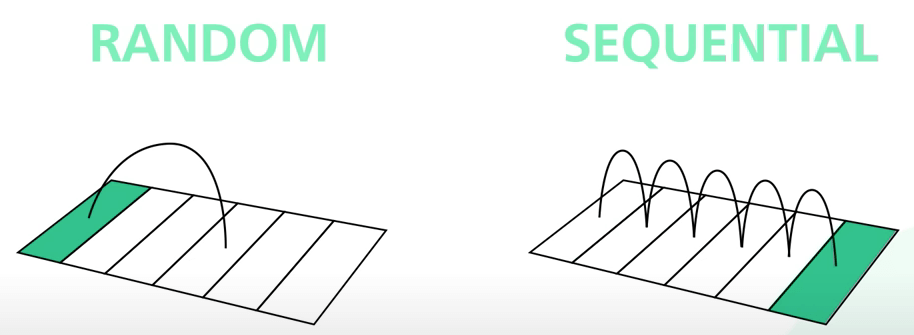

# Tại sao Kafka lại nhanh như vậy?

## Nguồn

 [System Design: Why is Kafka fast?](https://www.youtube.com/watch?v=UNUz1-msbOM)

## Nhanh là nhanh như thế nào?

**Kafka** được tối ưu hoá cho thông lượng lớn. Nó được thiết kế để di chuyển một số lượng bản ghi lớn trong một khoảng thời gian ngắn. Có thể tưởng tượng một đường ống cực lớn có nước chảy qua. Đường kính ống càng lớn thì thể tích nước có thể đi qua cũng lớn theo.

Vì vậy, nói Kafka nhanh là đề cập đến khả năng vận chuyển nhiều dữ liệu một cách hiệu quả của Kafka.

## Thiết kế của Kafka

Hiệu suất của Kafka được đóng góp lớn bởi thiết kế đặc biệt của nó. Ta sẽ tập trung vào hai tính chất của thiết kế này.

**Tính chất đầu tiên** là sự phụ thuộc của Kafka vào I/O tuần tự. Mà I/O tuần tự (sequential I/O) là cái gì? Ta sẽ cùng nhau tìm hiểu.

Có một quan niện sai lầm phổ biến là truy cập vào ổ đĩa thì chậm hơn truy cập vào bộ nhớ, nhưng thực ra thì điều này phần nhiều phụ thuộc vào các kiểu truy cập dữ liệu. Có hai kiểu như vậy: ngẫu nhiên (random) và tuần tự (sequential).

Đối với ổ cứng, nó cần thời gian để điều chỉnh con chạy (arm), theo nghĩa đen, đến các vị trí khác nhau trên đĩa từ. Đây là nguyên nhân khiến truy cập ngẫu nhiên bị chậm. Tuy nhiên, đối với truy cập tuần tự, con chạy không cần chạy nhiều như thế, nên việc đọc và ghi từng khối dữ liệu một sẽ nhanh hơn nhiều.

{:class="centered-img"}

Kafka tận dụng lợi thế này bằng cách sử dụng log chỉ thêm vào sau (append-only log) là cấu trúc dữ liệu chính của nó. Append-only log chỉ thêm dữ liệu mới vào cuối file. Kiểu truy cập này là tuần tự.

{:class="centered-img"}

Giờ thêm một chút thống kê nhé. Với phần cứng hiện đại, giả sử ta có một loạt các ổ cứng như thế, tốc độ ghi tuần tự đạt hàng trăm MB mỗi giây, trong khi tốc độ ghi ngẫu nhiên chỉ được vài trăm KB trên giây. **Truy cập tuần tự rõ ràng là nhanh hơn.** Sử dụng ổ cứng cũng có lợi thế về chi phí. So với SSD, HDD có giá chỉ bằng một phần ba nhưng dung lượng thì gấp khoảng ba lần. 

{:class="centered-img"}

{:class="centered-img"}

Cung cấp cho Kafka một lượng lớn dung lượng giá rẻ mà không phải đánh đổi về mặt hiệu năng nghĩa là Kafka có thể lưu giữ thông tin một cách hiệu quả về mặt chi phí trong thời gian dài. Trước Kafka thì hầu như ít người dám nghĩ tới điều này.

**Tính chất thứ hai** của thiết kế Kafka đó là việc tập trung vào hiệu quả. Kafka di chuyển rất nhiều dữ liệu từ mạng sang ổ đĩa, và từ ổ đĩa lên mạng. Điều quan trọng ở đây là phải bỏ đi những bản copy thừa khi di chuyển giữa các trang (trong ổ đĩa) và các trang dữ liệu giữa ổ đĩa và mạng.

Đây là lúc nguyên tắc không sao chép (zero-copy principle) được áp dụng. Các hệ điều hành unix hiện đại được tối ưu hoá cao để truyền dữ liệu từ đĩa lên mạng mà không phải sao chép dữ liệu quá nhiều. Trước tiên ta hãy xem cách Kafka gửi một trang dữ liệu từ đĩa đến consumer khi zero-copy không được sử dụng. Dữ liệu sẽ được load từ đĩa lên cache của hệ điều hành.

Tiếp theo, dữ liệu được sao chép từ cache hệ điều hành đến ứng dụng Kafka. Sau đó dữ liệu được sao chép từ Kafka vào bộ đệm socket. Rồi dữ liệu lại được sao chép từ bộ đệm socket đến bộ đệm NIC (network interface card). Cuối cùng thì dữ liệu được gửi lên mạng đến consumer.

Rõ ràng là như vậy không ổn. Có 4 bản sao dữ liệu và 2 system call. Giờ so với zero-copy xem. Bước 1 giữ nghuyên, dữ liệu sẽ được load từ đĩa lên cache của hệ điều hành.

Với zero-copy, ứng dụng Kafka dùng một system call gọi là `sendfile()` để nói cho hệ điều hành sao chép thẳng dữ liệu từ cache hệ điều hành sang bộ đệm NIC. Với cách này, bản sao duy nhất là từ cache hệ điều hành sang bộ đệm NIC. Với một network card hiện đại, sao chép được thực hiện bởi DMA (direct memory access - truy cập bộ nhớ trực tiếp). Khi dùng DMA, CPU không tham gia vào nhiệm vụ này, khiến cho nó còn hiệu quả hơn.

{:class="centered-img"}

Tóm lại, I/O tuần tự và nguyên tắc không sao chép là nền tảng cho hiệu suất cao của Kafka. Kafka sử dụng các kĩ thuật khác để tối đa hoá hiệu quả từ phần cứng, nhưng hai tính chất này vẫn là quan trọng nhất.
