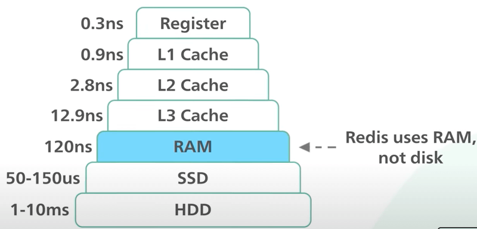
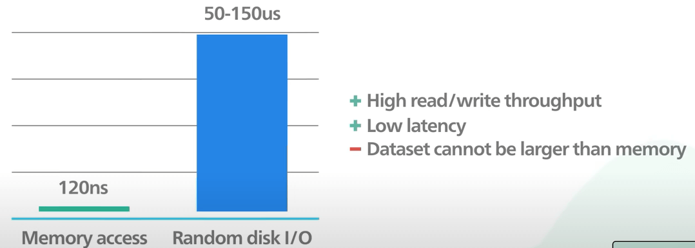
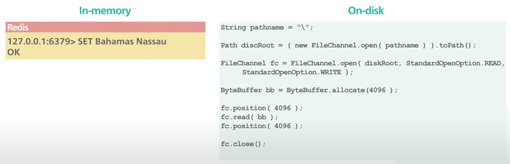
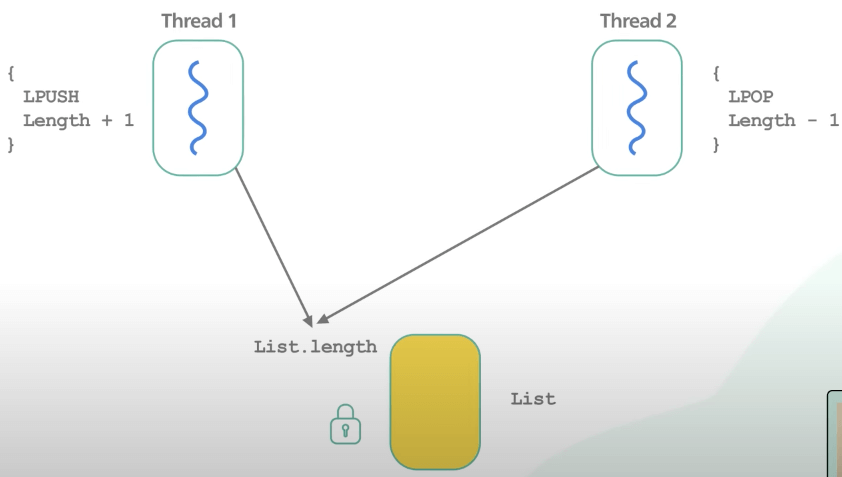
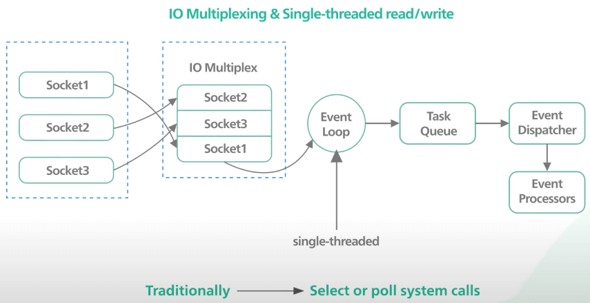
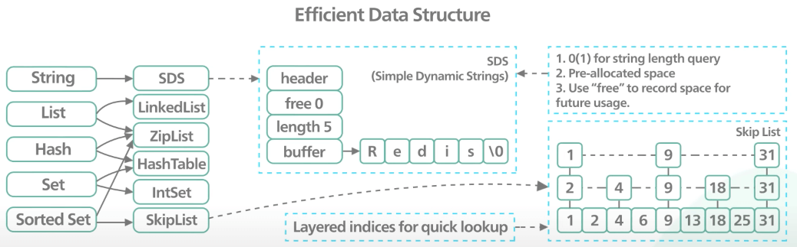

# Vì sao Redis lại nhanh?

## Nguồn

 [System Design: Why is single-threaded Redis so fast?](https://www.youtube.com/watch?v=5TRFpFBccQM)

## Redis là gì?

**Redis** là một dạng cơ sở dữ liệu lưu trữ data trong bộ nhớ. Nó thường được sử dụng như là cache. Nó hỗ trợ nhiều dạng cấu trúc dữ liệu khác nhau, như string, hash, list, set và sorted set. Redis rất chắc chắn, dễ sử dụng và có tốc độ rất tốt. Các yếu tố này lý giải vì sao nó là một trong những loại cơ sở dữ liệu được yêu thích nhất, theo khảo sát thường niên trên Stack Overflow.

## Cơ sở dữ liệu in-memory

Lý do đầu tiên mà Redis nhanh là vì nó là một cơ sở dữ liệu in-memory, tức là dùng RAM, chứ không phải ổ cứng. 

{:class="centered-img"}

Truy cập vào bộ nhớ nhanh hơn rất rất nhiều lần so với truy cập ngẫu nhiên trên đĩa. Việc truy cập vào bộ nhớ mang lại thông lượng đọc và ghi cao cùng với độ trễ thấp. Đổi lại thì dữ liệu không thể lớn hơn bộ nhớ.

{:class="centered-img"}

Về mặt cài đặt, các cấu trúc dữ liệu trong bộ nhớ dễ cài đặt hơn nhiều so với cài trên đĩa. Điều này giúp code đơn giản và góp phần vào sự ổn định vững chắc của Redis.

{:class="centered-img"}

## Đơn luồng

Redis chủ yếu là đơn luồng. Vì sao một thiết kế đơn luồng lại cho ta hiệu suất cao như vậy? Tận dụng hết các core trong CPU với đa luồng không phải nhanh hơn sao?

Các ứng dụng đa luồng yêu cầu lock hoặc các cơ chế đồng bộ hoá khác. Chúng nổi tiếng là khó giải thích. Trong nhiều ứng dụng, thêm phức tạp chỉ tổ gây thêm lỗi và mất đi sự ổn định, gây khó khăn cho việc duy trì hiệu suất cao.

{:class="centered-img"}

Trong trường hợp của Redis, code đơn luồng rất dễ hiểu. Nhưng mà làm thế nào để code đơn luồng này có thể xử lý hàng ngàn request và response cùng lúc? Luồng không bị block để xử lý từng request một à? Đây là lúc **I/O multiplexing** phát huy tác dụng. Với I/O multiplexing, hệ điều hành cho phép một luồng có thể đợi cùng lúc trên nhiều kết nối socket. Thông thường thì điều này được thực hiện bởi các system call như `select` hay `poll`. Các system call này không hiệu quả lắm khi có hàng ngàn kết nối.

{:class="centered-img"}

Trên linux, `epoll` là một biến thể hiệu quả của I/O multiplexing giúp hỗ trợ hàng ngàn kết nối cùng lúc. Một nhược điểm của thiết kế đơn luồng là nó không tận dụng được tất cả các core của CPU trong phần cứng ngày nay. Không hiếm các trường hợp có nhiều instance Redis chạy trên cùng một máy chủ để tận dụng nhiều core CPU hơn.

## Các cấu trúc dữ liệu hiệu quả

Vì Redis là cơ sở dữ liệu in-memory, nó có thể tận dụng một số cấu trúc dữ liệu bậc thấp hiệu quả mà không phải lo lắng làm sao để lưu chúng vào đĩa một cách hiệu quả. Danh sách liên kết, skip list, hash table là một số ví dụ.

{:class="centered-img"}

## Kết

Ngày nay thì ta có thể thấy một số ứng dụng cài đặt tương thích với Redis để đạt được hiệu suất còn cao hơn nữa từ một máy chủ. Với tính dễ sử dụng, tính ổn định vững chắc và hiệu suất cao của Redis, nó vẫn cung cấp một giải pháp mạnh mẽ về mặt hiệu suất và độ ổn định cho thị trường.
