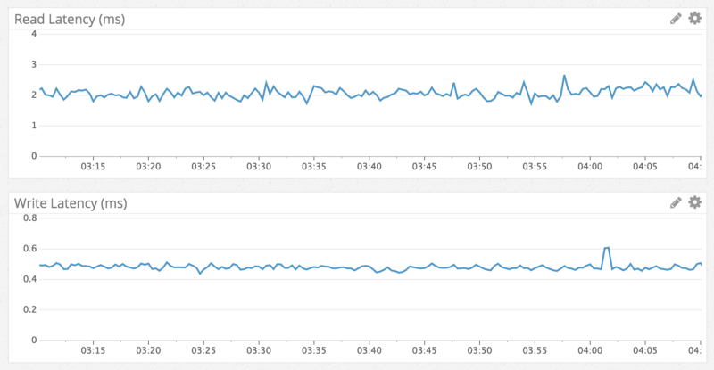

# Discord lưu hàng tỉ tin nhắn như thế nào?

## Nguồn

 [How Discord stores billions of messages - Stanislav Vishnevskiy](https://discord.com/blog/how-discord-stores-billions-of-messages)

## Lời tựa

Discord tiếp tục phát triển nhanh hơn những gì chúng tôi nghĩ và nội dung do người dùng tạo ra cũng phát triển hơn cả kỳ vọng. Với nhiều người dùng hơn thì sẽ có nhiều tin nhắn hơn. Vào tháng 7 (năm 2016), [chúng tôi đạt mốc 40 triệu tin nhắn một ngày](https://blog.discordapp.com/11-million-players-in-one-year/), tháng 12 (năm 2016), [chúng tôi đạt mốc 100 triệu tin nhắn](http://venturebeat.com/2016/12/08/discord-hits-25-million-users-and-releases-gamebridge-sdk-for-its-voice-chat/), và đến thời điểm này thì chúng tôi đã vượt mốc 120 triệu tin nhắn. Chúng tôi sớm đã quyết định sẽ lưu tất cả tin nhắn của người dùng mãi mãi để người dùng có thể quay lại xem bất cứ lúc nào họ muốn, và có sẵn dữ liệu trên bất kỳ thiết bị nào. Đây thực sự là một lượng dữ liệu phát triển cực lớn về cả kích thước, tốc độ tăng, và phải luôn có sẵn. *Chúng tôi đạt được điều đó như thế nào? Cassandra!*

## Những thứ chúng tôi đã làm

Phiên bản đầu tiên của Discord được tạo ra trong chỉ hai tháng đầu năm 2015. Có thể nói rằng, một trong những database tốt nhất để duyệt nhanh là MongoDB. Mọi thứ trên Discord được lưu trữ trong một replica set MongoDB duy nhất và điều này là có chủ ý, nhưng chúng tôi cũng đã lên kế hoạch đầy đủ để di chuyển sang một database khác (chúng tôi biết mình sẽ không dùng MongoDB sharding vì dùng nó khá phức tạp và cái đó cũng không nổi tiếng về tính ổn định). Đây thực sự là một phần của văn hoá công ty chúng tôi: xây dựng nhanh chóng để chứng minh một tính năng của sản phẩm, nhưng luôn hướng đến giải pháp mạnh mẽ hơn.

Tin nhắn được lưu trên một MongoDB collection với một index ghép duy nhất trên `channel_id` và `created_at`. Vào khoảng tháng 11 năm 2015, chúng tôi đạt 100 triệu tin nhắn được lưu trữ và tại thời điểm đó, chúng tôi bắt đầu thấy xuất hiện một số vấn đề: dữ liệu và index không còn có thể nằm trong RAM và độ trễ bắt đầu trở nên khó đoán hơn. Đã đến lúc di cư sang một database mới phù hợp hơn rồi.

## Chọn ra Database phù hợp

Trước khi chọn database mới, chúng tôi cần hiểu pattern đọc/ghi của mình và lý do tại sao kiến trúc hiện tại lại có vấn đề.

- Rõ ràng là các lần đọc dữ liệu là cực kỳ ngẫu nhiên và tỉ lệ đọc/ghi là khoảng 50/50.
- Các Discord server thiên về voice chat hầu như không có tin nhắn nào. Điều này có nghĩa là những người trong các server này gửi 1 đến 2 tin nhắn mỗi vài ngày. Trong một năm, loại server này khó có thể đạt 1000 tin nhắn. Vấn đề là mặc dù các server này chứa ít tin nhắn, điều này lại gây khó khăn cho việc lấy dữ liệu gửi về cho người dùng. Chỉ trả về 50 tin nhắn cho 1 người dùng có thể dẫn đến nhiều lần random seek trên đĩa, gây nên việc trục xuất dữ liệu trong cache (cache eviction).
- Các Discord server thiên về chat gửi khá nhiều tin nhắn, tầm khoảng 100 nghìn đến 1 triệu tin nhắn một năm. Dữ liệu cần thường là các tin nhắn rất gần đây. Vấn đề là, do các server này thường chỉ có dưới 100 thành viên nên mật độ request dữ liệu này cũng thấp, và không có khả năng nằm trong disk cache.
- Các Discord server công cộng lớn gửi rất nhiều tin nhắn. Chúng có hàng nghìn thành viên gửi tầm 1000 tin nhắn một ngày và dễ dàng đạt hàng triệu tin nhắn một năm. Các server này gần như luôn request tin nhắn trong vòng 1 giờ trước và request khá thường xuyên. Do đó, dữ liệu thường nằm trong disk cache.
- Chúng tôi biết rằng trong năm tới, chúng tôi sẽ bổ sung nhiều cách hơn nữa để giúp người dùng giải quyết vụ đọc random, như là khả năng xem các tin nhắn bị tag trong 30 ngày, rồi nhảy đến tin nhắn đó, xem các tin nhắn được ghim, và tìm kiếm tin nhắn theo một đoạn text nào đó. *Mấy cái này còn gây ra nhiều lần đọc random nữa!!*

Sau đó chúng tôi định ra các yêu cầu như sau:

- **Khả năng mở rộng tuyến tính** - Chúng tôi không muốn xem xét lại giải pháp sau này hoặc shard lại dữ liệu một cách thủ công.
- **Tự động failover** - Chúng tôi thực sự muốn được ngủ vào ban đêm và xây dựng Discord để tự hồi phục càng nhiều càng tốt.
- **Ít phải bảo trì** - Nó nên hoạt động tốt sau khi setup. Chúng tôi chỉ phải thêm nhiều node hơn khi dữ liệu tăng lên.
- **Hiệu quả đã được chứng minh** - Chúng tôi thích thử các công nghệ mới, nhưng không quá mới.
- **Hiệu suất có thể dự đoán được** - Chúng tôi có cảnh báo khi p95 thời gian response hơn 80ms. Chúng tôi cũng không muốn cache tin nhắn trên Redis hoặc Memcached.
- **Không phải là một cái blob store** - Việc viết hàng nghìn tin nhắn một giây sẽ không hiệu quả nếu ta liên tục phải deserialize mấy cái blob và thêm tin nhắn vào sau blob.
- **Mã nguồn mở** - Chúng tôi tin vào việc kiểm soát vận mệnh của chính mình mà không phải phụ thuộc vào bên thứ ba nào hết.

Cassandra là database duy nhất đáp ứng tất cả các yêu cầu của chúng tôi. Chúng tôi chỉ cần thêm node để mở rộng quy mô và nó có thể chịu được việc mất các node mà không có tác động nào vào ứng dụng. Các công ty lớn như Netflix và Apple có hàng nghìn node Cassandra. Dữ liệu liên quan được lưu trữ liên tục trên đĩa để có ít lần disk seek nhất và phân phối dễ dàng quanh cluster. Nó được hỗ trợ bởi DataStax, nhưng vẫn là mã nguồn mở và có công đồng giúp đỡ.

Sau khi chọn, chúng tôi cần phải chứng minh rằng nó thực sự hiệu quả.

## Mô hình dữ liệu

Cách tốt nhất để mô tả Cassandra cho một người không biết gì về nó chính là, Cassandra là một KKV store. Hai chữ K đầu tiên biểu thị khoá chính. Chữ K đầu tiên là khoá phân vùng (partition key) và được dùng để xác định node nào chứa dữ liệu và nơi tìm thấy dữ liệu trên đĩa. Phân vùng chứa nhiều row trong nó và một row trong một phần vùng được xác định bằng chữ K thứ hai, là khoá cluster (clustering key). Khoá cluster đóng vai trò vừa là khoá chính trong phân vùng, vừa là các các row được sắp xếp. Bạn có thể tưởng tượng một phân vùng như là một từ điển có thứ tự. Các thuộc tính này được kết hợp cho phép tạo ra mô hình dữ liệu rất mạnh mẽ.

Lưu ý rằng các tin nhắn dược index trong MongoDB với `channel_id` và `created_at`. `channel_id` đã trở thành khoá phân vùng vì tất cả các truy vấn đều hoạt động trên một channel, nhưng `created_at` không phải là một khoá cluster tốt vì hai tin nhắn có thể có cùng thời gian được tạo ra. May thay, mọi ID trên Discord là [Snowflake](https://blog.twitter.com/2010/announcing-snowflake) (có thể sắp xếp theo thứ tự thời gian), vì vậy chúng tôi có thể sử dụng chúng để thay thế. Khoá chính trở thành `(channel_id, message_id)`, trong đó `message_id` là Snowflake. Điều này có nghĩa là khi load một channel, ta có thể cho Cassandra biết chính xác phạm vi cần để quét các tin nhắn.

Đây là một schema đã được đơn giản hoá cho bảng `messages` của chúng tôi (bỏ qua khoảng 10 cột):

```sql
CREATE TABLE messages (
  channel_id bigint,
  message_id bigint,
  author_id bigint,
  content text,
  PRIMARY KEY (channel_id, message_id)
) WITH CLUSTERING ORDER BY (message_id DESC);
```

Mặc dù Cassandra có các schema trông không khác mấy so với các cơ sử dữ liệu quan hệ, chúng lại tốn ít chi phí hơn để thay đổi và không có bất kỳ tác động hiệu suất tạm thời nào. Chúng tôi tận dụng hết blob store và relational store.

Khi bắt đầu chuyển tin nhắn vào Cassandra, chúng tôi ngay lập tức thấy các cảnh bào trong log rằng các phân vùng bắt đầu vượt quá 100MB. *Ủa alo? Cassandra quảng cáo rằng nó hỗ trợ phân vùng đến 2GB cơ mà?* Rõ ràng, làm được điều đó không có nghĩa là nên làm. Các phân vùng lớn gây rất nhiều áp lực garbage collection cho Cassandra trong quá trình nén, mở rộng cluster... Có một phân vùng lớn cũng có nghĩa là dữ liệu trong đó không thể được phân phối quanh cluster. Rõ ràng là chúng tôi phải giới hạn kích thước của các phân vùng bằng một cách nào đó vì một channel Discord duy nhất có thể tồn tại nhiều năm và không ngừng tăng kích thước.

Chúng tôi quyết định sắp xếp các tin nhắn của mình theo thời gian. Chúng tôi đã xem xét các channel to nhất trên Discord và xác định xem liệu có lưu trữ tin nhắn trong khoảng 10 ngày trong một bucket mà có thể thoải mái duy trì dưới 100MB hay không. Các bucket phải lấy được từ `message_id` hoặc một timestamp.

```python
DISCORD_EPOCH = 1420070400000
BUCKET_SIZE = 1000 * 60 * 60 * 24 * 10


def make_bucket(snowflake):
    if snowflake is None:
        timestamp = int(time.time() * 1000) - DISCORD_EPOCH
    else:
        # When a Snowflake is created it contains the number of
        # seconds since the DISCORD_EPOCH.
        timestamp = snowflake_id >> 22
    return int(timestamp / BUCKET_SIZE)


def make_buckets(start_id, end_id=None):
    return range(make_bucket(start_id), make_bucket(end_id) + 1)
```

Các khoá phân vùng Cassandra có thể được gộp lại, vì vậy khóa chính mới đã thành ra `((channel_id, bucket), message_id)`.

```sql
CREATE TABLE messages (
   channel_id bigint,
   bucket int,
   message_id bigint,
   author_id bigint,
   content text,
   PRIMARY KEY ((channel_id, bucket), message_id)
) WITH CLUSTERING ORDER BY (message_id DESC);
```

Để truy vấn các tin nhắn gần đây, chúng tôi sinh một phạm vi bucket từ thời gian hiện tại đến `channel_id` (nó cũng là Snowflake và phải cũ hơn tin nhắn đầu tiên). Sau đó chúng tôi truy vấn tuần tự các phân vùng đến khi đã lấy đủ các tin nhắn. Nhược điểm của phương pháp này là các server Discord ít hoạt động sẽ phải truy vấn nhiều bucket để lấy đủ tin nhắn theo thời gian. Trong thực tế, điều này đã được chứng minh là ổn vì với các server Discord hoạt động sôi nổi thì các tin nhắn thường sẽ nằm trong phân vùng đầu tiên và chúng chiếm đa số.

Quá trình import tin nhắn vào Cassandra không gặp trở ngại nào và chúng tôi đã sẵn sàng thử trong môi trường live.

## Dark Launch

Việc đưa một hệ thống mới vào môi trường live luôn là điều đáng sợ, do vậy bạn nên test nó mà không ảnh hưởng đến người dùng. Chúng tôi chỉnh code để đọc/ghi vào cả MongoDB và Cassandra.

Ngay sau khi khởi chạy, chúng tôi bắt đầu gặp lỗi `author_id` bị `null`. *`null` là `null` kiểu gì? Nó là trường bắt buộc mà sao `null`?*

## Eventual Consistency

Cassandra là một [AP](https://en.wikipedia.org/wiki/CAP_theorem) database (theo định lý CAP), nghĩa là nó đánh đổi strong consistency để có được tính khả dụng, đây là điều chúng tôi muốn. Nó là một kiểu chống đọc trước khi ghi (việc đọc tốn chi phí hơn) trong Cassandra và vì vậy mọi thứ mà Cassandra làm về cơ bản là upsert (update khi có dữ liệu và insert khi không có) ngay cả khi bạn chỉ cung cấp một số cột nhất định. Bạn cũng có thể ghi vào bất kỳ node nào và nó sẽ tự động giải quyết conflict bằng cách cho lần ghi cuối cùng vào database trên cơ sở mỗi cột. *Cái này thì gây nên vấn đề quái gì nhỉ?*

{:class="centered-img"}

Trong trường hợp một người dùng chỉnh sửa một tin nhắn cùng lúc với một người dùng khác xóa cái tin nhắn đó, sẽ xảy ra vấn đề là cái row đó bị mất hết thông tin trừ khoá chỉnh và văn bản vì tất cả các lần ghi của Cassandra đều là upsert. Có hai giải pháp khả thi để xử lý vấn đề này:

1. Viết lại toàn bộ tin nhắn khi chỉnh sửa. Điều này có khả năng phục hồi các tin nhắn bị xoá nhưng lại thêm nhiều khả năng conflict với các lần ghi đồng thời vào các cột khác.
2. Phát hiện rằng message bị hỏng và xoá nó ra khỏi database.

Chúng tôi chọn cách 2 bằng cách chọn một cột bắt buộc (trong trường hợp này là `author_id`) và xoá tin nhắn nếu nó `null`.

Trong khi giải quyết vấn đề này, chúng tôi nhận thấy rằng chúng tôi ghi dữ liệu rất kém hiệu quả. Cassandra là kiểu eventual consistency nên nó không thể xóa dữ liệu ngay lập tức. Nó phải sao chép các thao tác xóa sang các node khác và thực hiện ngay cả khi các node khác tạm thời không khả dụng. Cassandra thực hiện điều này bằng cách coi các lần xóa là một dạng ghi dữ liệu được gọi là "tombstone". Khi đọc dữ liệu, nó bỏ qua các tombstone mà nó thấy. Tombstore tồn tại trong một khoảng thời gian có thể chỉnh được (mặc định là 10 ngày) và bị xóa vĩnh viễn trong quá trình nén khi hết thời gian đó.

Xóa một cột và viết `null` vào một cột về cơ bản là giống nhau. Cả hai đều tạo ra một tombstone. Vì tất cả các lần ghi dữ liệu trong Cassandra đều là upsert, nên bạn sẽ tạo một tombstone ngay cả khi ghi `null` lần đầu. Trong thực tế, schema tin nhắn của chúng tôi chứa 16 cột, nhưng tin nhắn trung bình chỉ có 4 giá trị được đặt. Chúng tôi đã ghi 12 tombstone cho Cassandra hầu hết thời gian mà không có lý do. Giải pháp cho vấn đề này rất đơn giản: chỉ ghi các giá trị khác `null` cho Cassandra.

## Hiệu suất

Cassandra nổi tiếng là có tốc độ ghi nhanh hơn đọc và chúng tôi thấy điều đó chính xác trong thực tế. Thời gian ghi là dưới 1ms và thời gian đọc dưới 5ms. Điều này đã được kiểm nghiệm bất kể dữ liệu nào đang được truy cập và hiệu suất vẫn nhất quán trong suốt một tuần thử nghiệm. Không có gì bất ngờ cả, chúng tôi nhận được thứ mà mình mong đợi.

{:class="centered-img"}

Để phù hợp với hiệu suất đọc nhanh, nhất quán, đây là ví dụ về việc chuyển đến một tin nhắn từ hơn một năm trước trong một channel có hàng triệu tin nhắn:

{:class="centered-img"}

## Sự bất ngờ lớn

Mọi thứ diễn ra suôn sẻ, nên chúng tôi triển khai nó làm database chính của mình và loại bỏ dần MongoDB trong vòng một tuần. Nó tiếp tục hoạt động tốt trong khoảng 6 tháng cho đến một ngày mà Cassandra không phản hồi.

Chúng tôi nhận ra Cassandra liên tục chạy GC "stop-the-world" trong 10 giây nhưng không biết tại sao. Chúng tôi bắt đầu tìm hiểu và tìm thấy một channel Discord tốn 20 giây để tải. Máy chủ Discord công khai của **Subreddit Puzzles & Dragons** là thủ phạm. Vì nó công khai nên chúng tôi đã tham gia để kiểm tra. Cái channel này chỉ có 1 tin nhắn, quá sức tưởng tượng. Vào thời điểm đó, rõ ràng là họ đã xóa hàng triệu tin nhắn bằng API của chúng tôi, chỉ để lại 1 tin nhắn trong channel.

Nếu bạn để ý, Cassandra xử lý việc xóa bằng cách sử dụng tombstone (trong mục **Eventual Consistency**). Khi người dùng tải channel này, dù chỉ có 1 tin nhắn, Cassandra phải quét hiệu quả hàng triệu tombstone tin nhắn (tạo rác nhanh hơn sức dọn của JVM).

Chúng tôi đã giải quyết vấn đề này như sau:

- Chúng tôi đã giảm thời gian tồn tại của các tombstone từ 10 ngày xuống còn 2 ngày vì chúng tôi chạy **trình sửa chữa Cassandra** (một quy trình anti-entropy) mỗi đêm trên cluster tin nhắn.
- Chúng tôi đã thay đổi code truy vấn để theo dõi các bucket trống và tránh chúng trong tương lai cho một channel. Điều này có nghĩa là nếu người dùng thực hiện lại truy vấn này thì tệ nhất là Cassandra sẽ chỉ quét trong bucket gần đây nhất.

## Tương lai

Chúng tôi hiện đang chạy một cluster gồm 12 node với hệ số replica là 3 và sẽ tiếp tục thêm các node Cassandra mới nếu cần. Chúng tôi tin rằng giải pháp này sẽ tiếp tục hoạt động trong một thời gian dài. Tuy nhiên, Discord phải tiếp tục phát triển, sẽ có một tương lai xa nơi chúng tôi sẽ lưu trữ hàng tỷ tin nhắn mỗi ngày. Netflix và Apple chạy các cluster gồm hàng trăm node nên chúng tôi hiểu rằng mình có thể tạm dừng suy nghĩ quá nhiều về vụ lưu tin nhắn này một thời gian. Có điều, tương lai như vậy rồi sẽ đến và chúng tôi cần chuẩn bị một số thứ.

### Ngắn hạn

- Nâng cấp cluster tin nhắn từ Cassandra 2 lên Cassandra 3. Cassandra 3 có [định dạng lưu trữ mới](http://www.datastax.com/2015/12/storage-engine-30) có thể giảm hơn 50% kích thước lưu trữ.
- Các phiên bản mới hơn của Cassandra hoạt động tốt hơn trong việc xử lý nhiều dữ liệu hơn trên một node. Chúng tôi hiện lưu trữ gần 1TB dữ liệu nén trên mỗi node. Chúng tôi tin rằng chúng tôi có thể giảm số lượng node trong cluster một cách an toàn bằng cách tăng mức này lên 2TB.

### Dài hạn

- Khám phá [ScyllaDB](http://www.scylladb.com/), database tương thích với Cassandra được viết bằng C++. Bình thường thì các node Cassandra của chúng tôi thực sự không sử dụng quá nhiều CPU, tuy nhiên, vào những giờ không cao điểm khi chúng tôi chạy trình sửa chữa (một quy trình anti-entropy), chúng trở nên khá ràng buộc với CPU và thời lượng tăng lên cùng với lượng dữ liệu được ghi kể từ lần sửa chữa cuối cùng. ScyllaDB quảng cáo rằng thời gian sửa chữa sẽ thấp hơn đáng kể.
- Xây dựng hệ thống lưu trữ các channel không sử dụng thành file phẳng trên Google Cloud Storage và tải lại chúng theo yêu cầu. Chúng tôi muốn tránh làm điều này và cũng không nghĩ rằng sẽ phải làm.

## Kết luận

Đã hơn một năm kể từ khi chúng tôi thực hiện di chuyển dữ liệu và mặc dù là gặp "bất ngờ lớn", quá trình này vẫn diễn ra suôn sẻ. Chúng tôi đã tăng được số tin nhắn từ tổng số hơn 100 triệu tin nhắn lên hơn 120 triệu tin nhắn mỗi ngày, với hiệu suất và độ ổn định luôn nhất quán.

Nhờ sự thành công của dự án này, chúng tôi đã chuyển phần còn lại của dữ liệu trên live trực tiếp sang Cassandra và cũng thành công.
