# Box Model

Ta sẽ tìm hiểu Box Model qua ví dụ sau:

```html
<!DOCTYPE html>
<html lang="en">
<head>
    <title>Document</title>
    <style>
        p {
            margin: 24px;
            padding: 10px;
            border: 2px solid black;
            background-color: lightblue;
        }
    </style>
</head>
<body>
    <p>I'm a paragraph!</p>
    <p>I'm <em>another</em> paragraph!</p>
</body>
</html>
```
<apprun-play style="height:300px"></apprun-play>

Ta có 2 paragraph, một cái bình thường và một cái có thẻ `<em>` bên trong. Cả hai sẽ được bọc trong một khung đen, có màu nền là xanh, các giá trị margin và padding lần lượt là 24px và 10px. Ta thấy có khoảng cách giữa hai paragraph này.

Bật inspect lên và ta sẽ thấy cấu trúc của Box Model, ví dụ với thẻ `<p>` đầu tiên

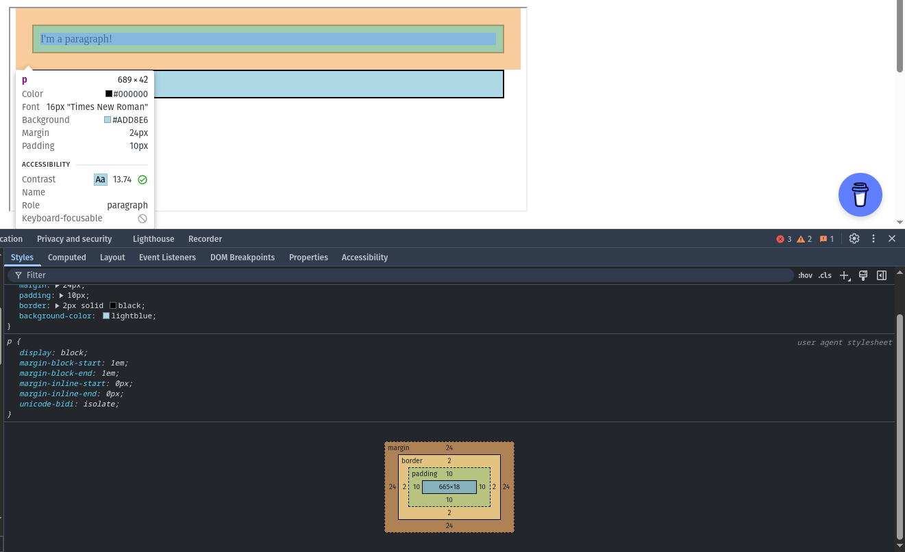{:class="centered-img"}

Trong cùng sẽ là nội dung của thẻ `<p>`. Vì đây là một block-level element, nó sẽ chiếm toàn bộ chiều rộng của thẻ cha (ở đây là `<body>`).

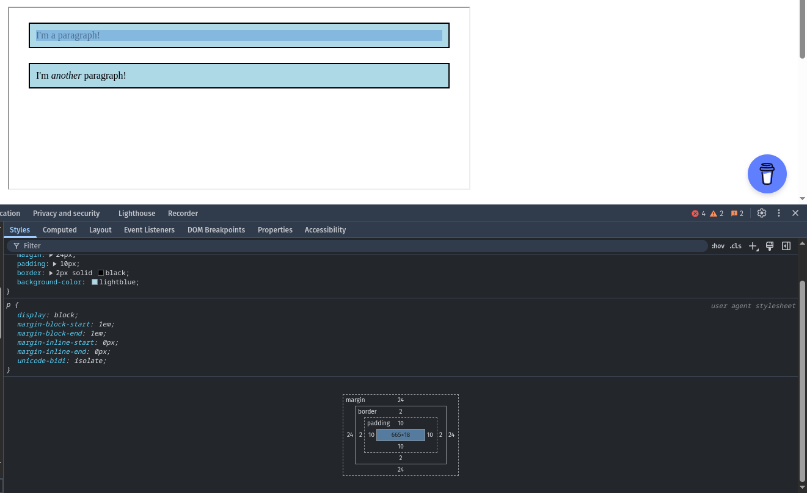{:class="centered-img"}

Tiếp đến là padding, như ta đã set, 10px. Đây là khoảng cách giữa nội dung và border. Nó vẫn được áp dụng màu nền.

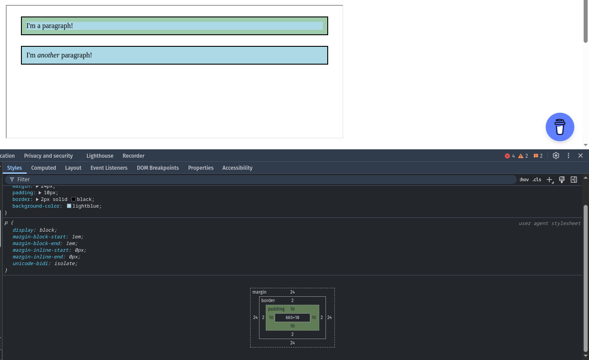{:class="centered-img"}

Tiếp đến là border, ta set nó dày 2px, ở đây hiện đúng 2px.

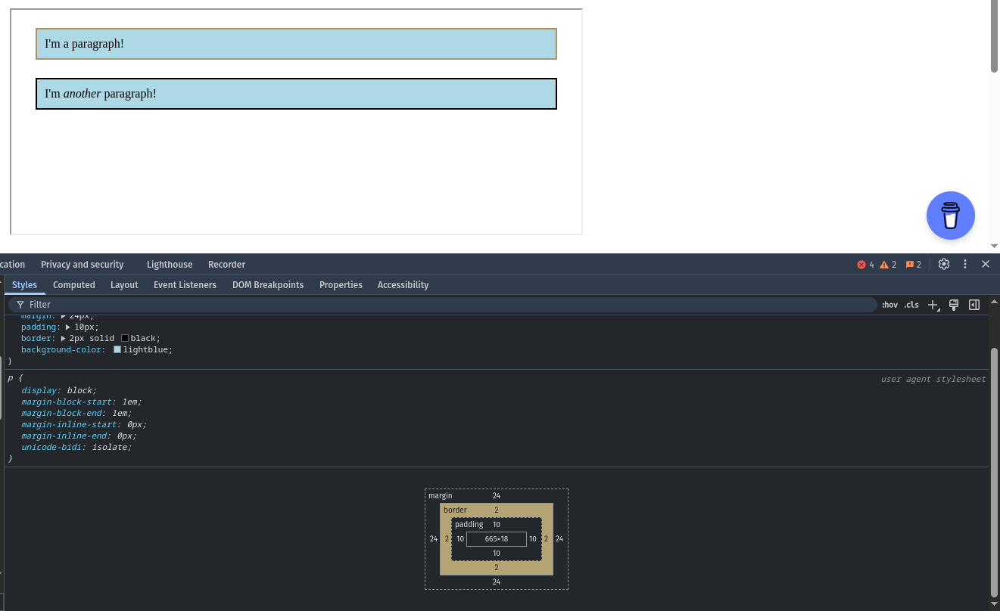{:class="centered-img"}

Cuối cùng là margin, 24px. Element sẽ muốn giá trị này là khoảng cách nhỏ nhất mà nó có thể có với các element khác, không có cái nào gần hơn.

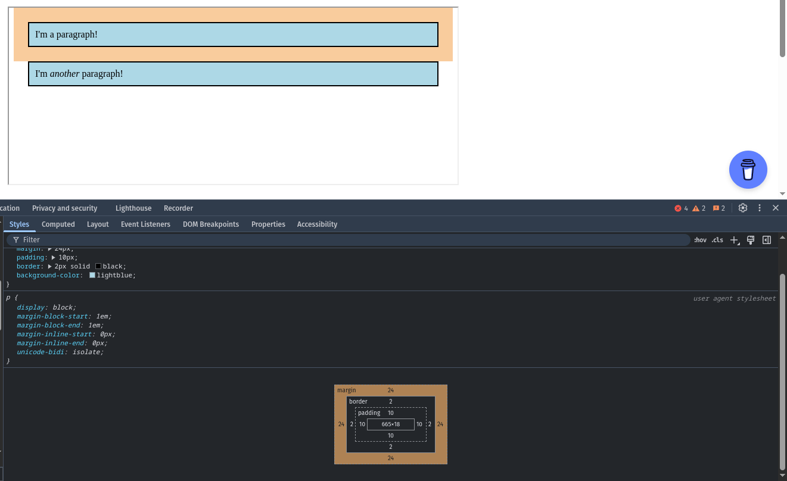{:class="centered-img"}

Bạn có thể thấy rằng dù được set cùng margin 24px, khoảng cách giữa 2 paragraph này vẫn là 24px, không phải 48px. Hai margin sẽ không được cộng lại với nhau. Đây được gọi là collapsing margin. Với chiều dọc, margin của 2 element sẽ được so sánh, và margin lớn nhất sẽ được chọn. Với chiều ngang, margin sẽ không collapsing mà sẽ được cộng lại với nhau, nghĩa là nếu hai element được xếp ngang nhau, margin của chúng sẽ được cộng lại với nhau.

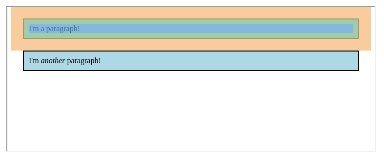{:class="centered-img"}

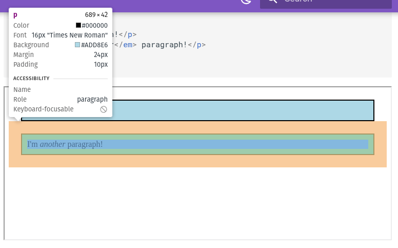{:class="centered-img"}

Tiếp theo, ta thấy margin là 24px và nó là 24px theo 4 hướng (trên, dưới, trái, phải). Mở margin trong inspector ra và ta sẽ thấy các giá trị 4 hướng của nó.

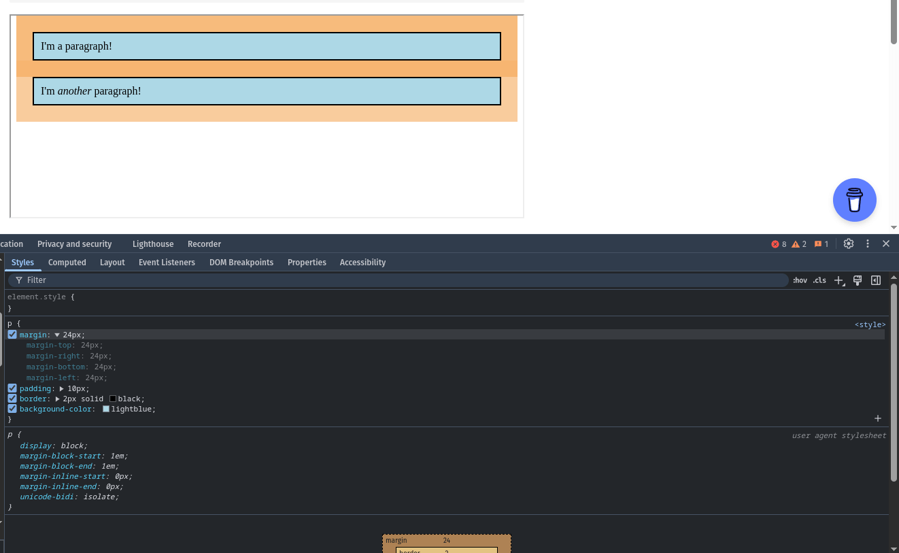{:class="centered-img"}

Thử disable margin và ta sẽ thấy 2 paragraph gần nhau hơn, vẫn cách nhau nhưng là do mặc định của browser là `1em` (trong phần user agent stylesheet).

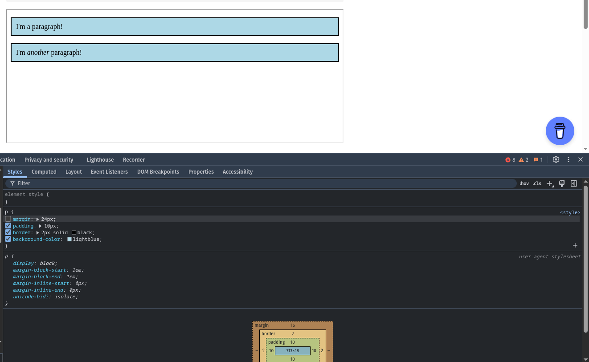{:class="centered-img"}

Ta có thể thử `margin-bottom: 48px` và ta sẽ thấy khoảng cách giữa 2 paragraph tăng lên.

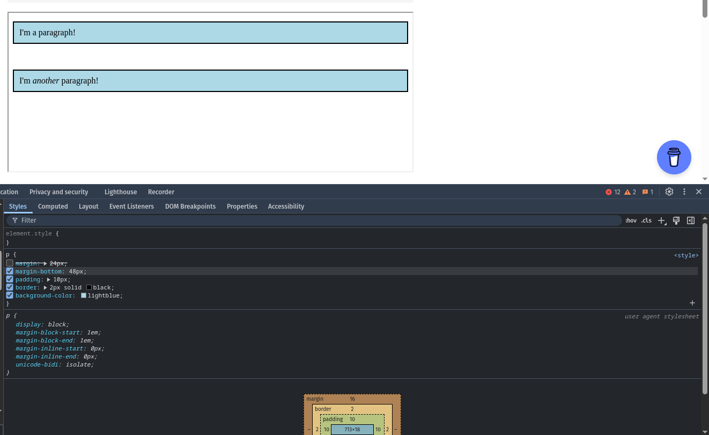{:class="centered-img"}

Ta có thể set 4 chiều khác nhau một lần, thứ tự là trên, phải, dưới, trái, theo chiều kim đồng hồ.

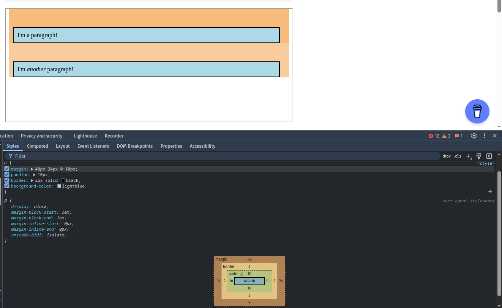{:class="centered-img"}

Hoặc có thể set 2 hướng, thứ tự là dọc và ngang.

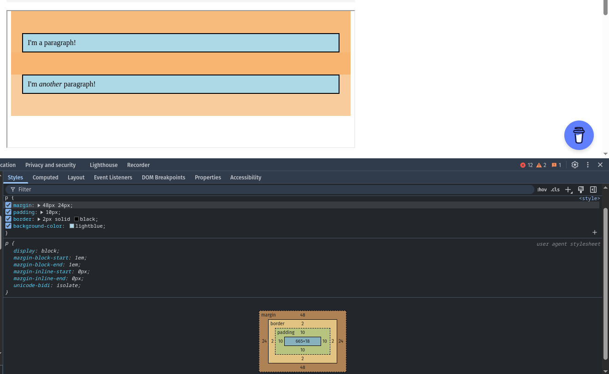{:class="centered-img"}

Cuối cùng, ta có thể dùng `margin: auto`, cho phép trình duyệt tự chọn. Hầu hết trường hợp thì trình duyệt sẽ set về 0, làm cho 2 paragraph dính liền nhau. 

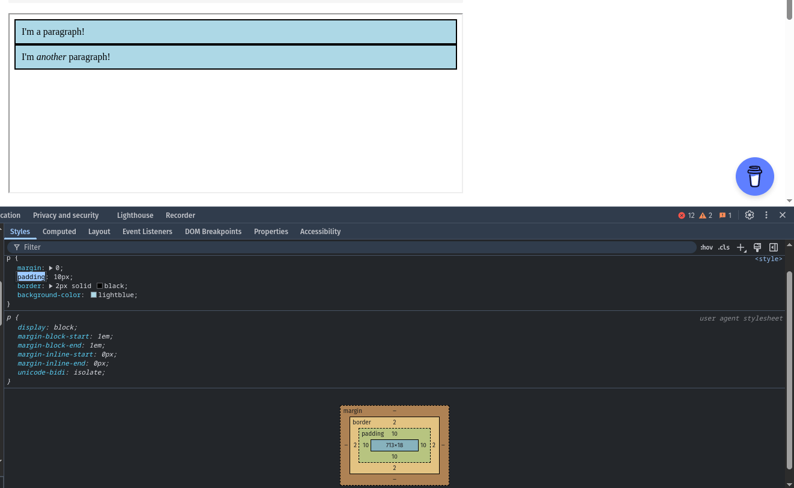{:class="centered-img"}

Người ta thường dùng `margin: auto` để căn giữa một element, ví dụ ta set chiều rộng là 40% và margin là auto, element sẽ được căn giữa.

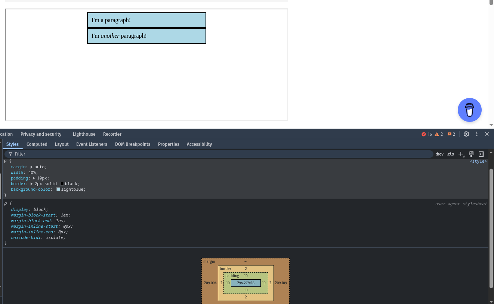{:class="centered-img"}

Có một trường hợp nữa là bạn có thể dùng giá trị âm. Ví dụ ta set `margin-left: -10px`, element sẽ bị dịch chuyển sang trái 10px. Như vậy trong khi margin dương đẩy element ra xa, margin âm sẽ kéo element lại gần hướng chỉ định. Thường bạn sẽ không muốn dùng margin âm quá nhiều vì có nguy cơ tạo ra các vấn đề về layout.

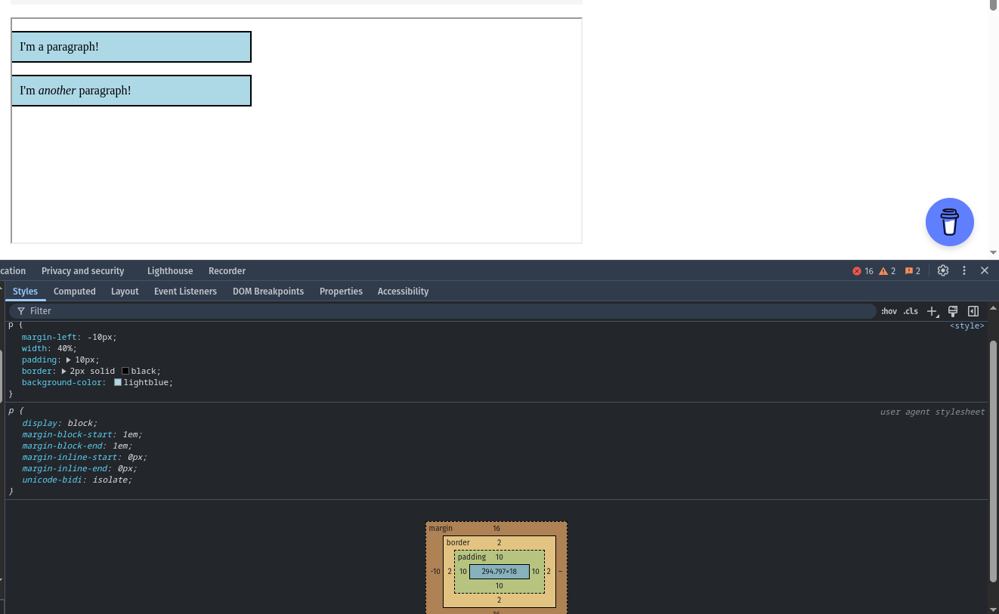{:class="centered-img"}

Ta chưa đụng vào thẻ `<em>`, một inline element, cùng nghịch nó một tí nhé.

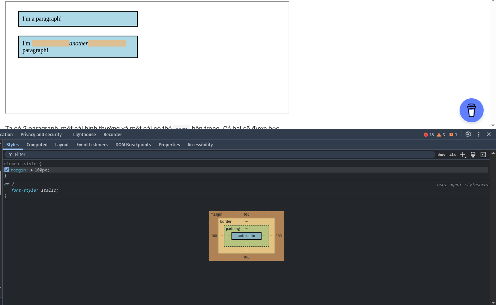{:class="centered-img"}

Ta set margin cho nó là 100px, làm cho paragraph này có 2 dòng. Nhưng ta lại không thấy margin dọc nào. Margin ngang thì lại đúng. Lý do là vì margin dọc không có tác dụng với inline element, padding dọc cũng không có tác dụng.

Nhân nói về padding, nó cũng kiểu như margin, nhưng padding tạo khoảng trống từ border về nội dung, chứ không phải từ border đi ra như margin. Như vậy mục đích của padding không phải đẩy các element khác ra xa, mà là đẩy border ra xa hay gần lại với nội dung. Padding cũng theo 4 chiều tương tự margin. Nhưng không phải cái gì cũng giống, ví dụ, **padding không nhận giá trị âm**.

Còn border thì sao. Border cũng có thể được set 4 chiều như margin và padding. Ngoài ra ta còn có `border-radius` để bo tròn các góc của border.

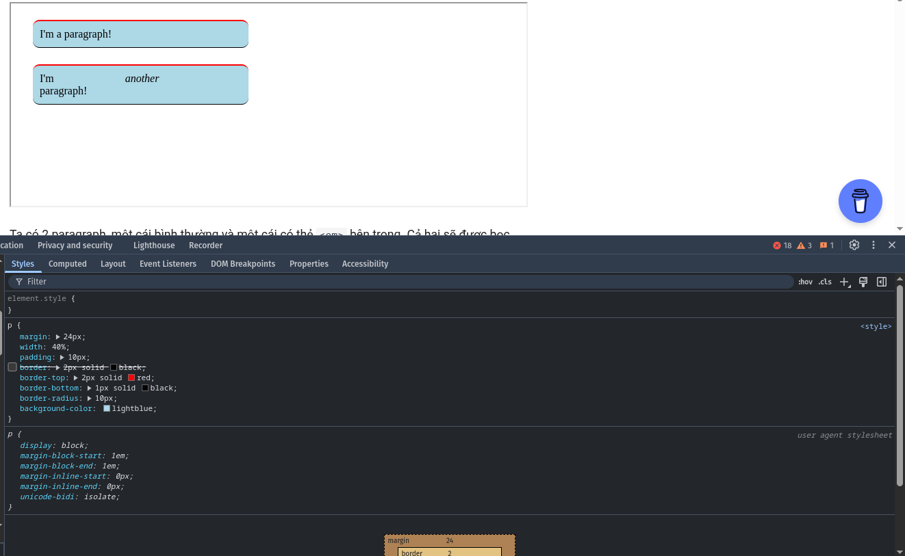{:class="centered-img"}

Ngoài ra, `border-radius` còn nhận giá trị phần trăm. Ví dụ, `border-radius: 50%` sẽ là nửa chiều rộng và nửa chiều cao của element, tạo ra một hình elip. Nếu chiều rộng và chiều cao bằng nhau, ta sẽ có một hình tròn.

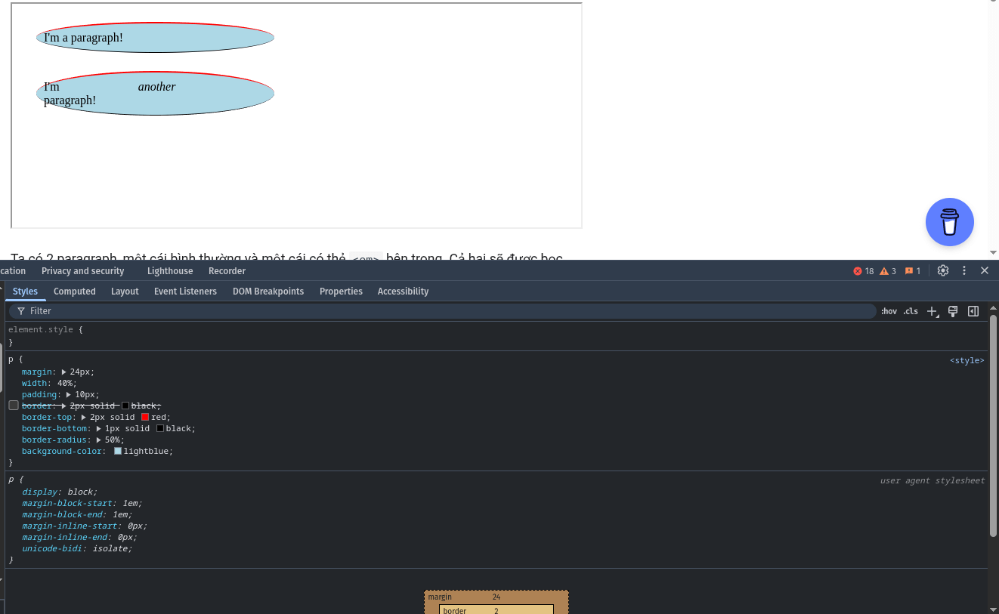{:class="centered-img"}

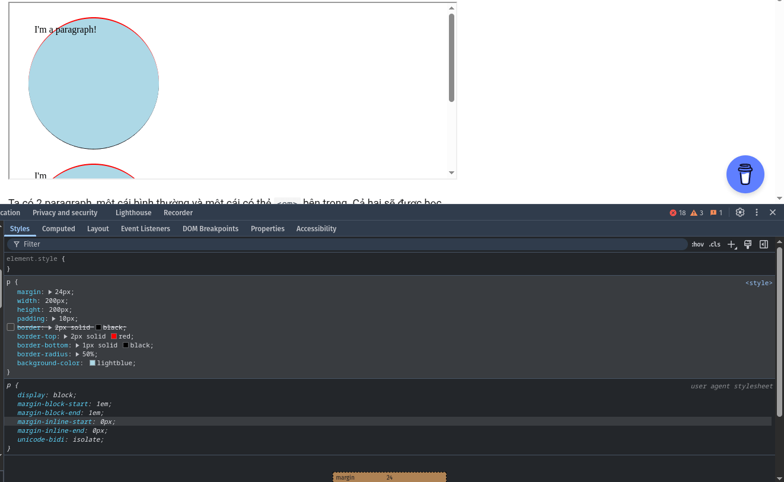{:class="centered-img"}

Ta thấy rằng chứ lại không nằm trong hình tròn, lý do là vì đây vẫn là box model, chỉ là border là hình tròn thôi.

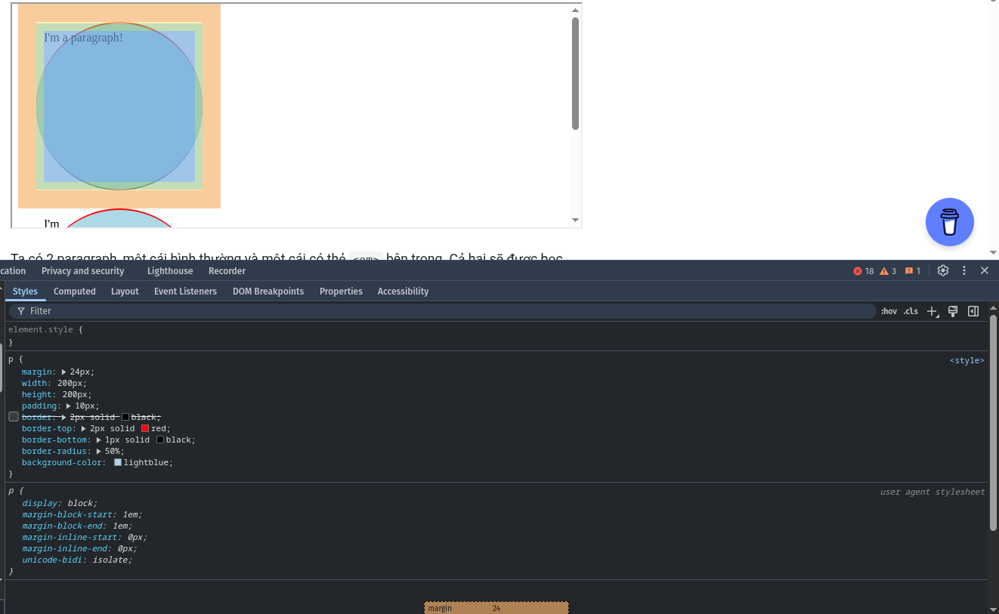{:class="centered-img"}

Ở trên mình đã để Try the Code để bạn thử nghiệm, hãy thử thay đổi các giá trị margin, padding, border, border-radius và xem kết quả nhé.