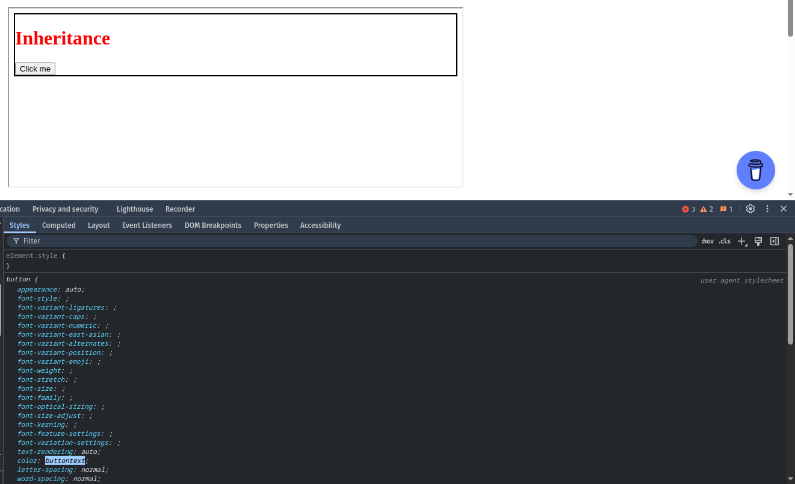
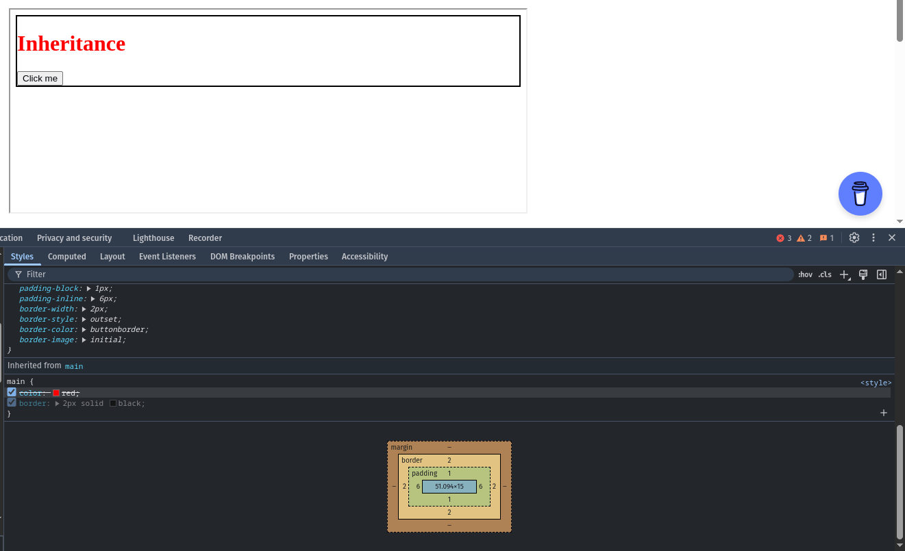

# Kế thừa trong CSS

Ta có ví dụ sau:

```html
<!DOCTYPE html>
<html lang="en">
<head>
    <title>Document</title>
    <style>
        main {
            color: red;
            border: 2px solid black;
        }
    </style>
</head>
<body>
    <main>
        <h1>Inheritance</h1>
        <button>Click me</button>
    </main>
</body>
</html>
```
<apprun-play style="height:300px" hide_button="true"></apprun-play>

Ta có một thẻ main, bên trong chứa một thẻ h1 và một thẻ button. Thẻ main có màu chữ và viền màu đen. Tuy nhiên trong trang web, ta thấy chữ của h1 lại thành đỏ, nhưng nó lại không có viền nào, viền lại vẫn nằm ở thẻ main, button thì không có thay đổi gì. Có sự kế thừa ở đây nhưng khi nào thì có sự kế thừa, khi nào thì không?

Trong CSS, các thuộc tính sẽ được chia làm 2 loại: kế thừa (inherited) và không kế thừa (non-inherited). Với các thuộc tính kế thừa, nếu không được set trong thẻ con thì nó sẽ kế thừa từ thẻ cha. Do tính kế thừa, nó sẽ đi lên dần trên cây DOM để tìm kiếm cho đến khi nó tìm thấy giá trị của thuộc tính đó được set. Ngược lại, với các thuộc tính không kế thừa, nếu không được set trong thẻ con thì nó sẽ không kế thừa từ thẻ cha.

Như vậy, `color` là một thuộc tính kế thừa, còn `border` thì không. Đó là lý do tại sao chữ của h1 lại có màu đỏ, nhưng viền của nó lại không có màu đen. Cũng hợp lý, vì ta muốn màu được kế thừa, còn viền thì ta không muốn lúc nào nó cũng có.

Nhưng việc này cũng dẫn đến một câu hỏi, vì sao button không đổi thành đỏ? Đó là vì trình duyệt đã quy định màu cho button trước, nên nó sẽ không kế thừa màu từ thẻ cha. Ta có thể thấy trong inspector.

{:class="centered-img"}

Và thấy màu đỏ đã bị gạch đi, và nếu để ý, cả thuộc tính `border` cũng bị làm mờ đi cho thấy rằng nó không được kế thừa từ thẻ cha.

{:class="centered-img"}

Ta hoàn toàn có thể thay đổi việc này. Ví dụ, ta có thể set `color: inherit` cho button, và nó sẽ kế thừa màu từ thẻ cha.

```html
<!DOCTYPE html>
<html lang="en">
<head>
    <title>Document</title>
    <style>
        main {
            color: red;
            border: 2px solid black;
        }
        button {
            color: inherit;
        }
    </style>
</head>
<body>
    <main>
        <h1>Inheritance</h1>
        <button>Click me</button>
    </main>
</body>
</html>
```
<apprun-play style="height:300px" hide_button="true"></apprun-play>

`color` là thuộc tính kế thừa, nhưng trình duyệt đã set màu sẵn cho button rồi mà, nó sẽ bỏ qua màu kế thừa chứ? Không, vì CSS của người dùng có độ ưu tiên cao hơn, nên nó sẽ được áp dụng trước.

Ta cũng có thể dùng `inherit` cho các thuộc tính không kế thừa, như `border`.

```html
<!DOCTYPE html>
<html lang="en">
<head>
    <title>Document</title>
    <style>
        main {
            color: red;
            border: 2px solid black;
        }
        button {
            color: inherit;
            border: inherit;
        }
    </style>
</head>
<body>
    <main>
        <h1>Inheritance</h1>
        <button>Click me</button>
    </main>
</body>
</html>
```
<apprun-play style="height:300px" hide_button="true"></apprun-play>

Ngoài giá trị `inherit`, ta cũng có thể thử với `initial`, nghĩa là không quan tâm đến CSS của trình duyệt, mà cũng không quan tâm đến kế thừa luôn mà chỉ quan tâm đến giá trị mặc định của thuộc tính đó.

```html
<!DOCTYPE html>
<html lang="en">
<head>
    <title>Document</title>
    <style>
        main {
            color: red;
            border: 2px solid black;
        }
        button {
            color: initial;
        }
    </style>
</head>
<body>
    <main>
        <h1>Inheritance</h1>
        <button>Click me</button>
    </main>
</body>
</html>
```
<apprun-play style="height:300px" hide_button="true"></apprun-play>

Ta cũng có giá trị `unset`. Nghĩa là nếu đây là thuộc tính kế thừa, nó sẽ kế thừa. Nếu không phải thuộc tính kế thừa, nó sẽ hoạt động như `initial`. Đây là cách hiệu quả để tránh sử dụng giá trị từ trình duyệt.

```html
<!DOCTYPE html>
<html lang="en">
<head>
    <title>Document</title>
    <style>
        main {
            color: red;
            border: 2px solid black;
        }
        button {
            color: unset;
        }
    </style>
</head>
<body>
    <main>
        <h1>Inheritance</h1>
        <button>Click me</button>
    </main>
</body>
</html>
```
<apprun-play style="height:300px" hide_button="true"></apprun-play>

Ta có thể thử với `border`. Vì nó không phải thuộc tính kế thừa, nó sẽ lấy giá trị mặc định, ở đây sẽ là không có viền.

```html
<!DOCTYPE html>
<html lang="en">
<head>
    <title>Document</title>
    <style>
        main {
            color: red;
            border: 2px solid black;
        }
        button {
            color: unset;
            border: unset;
        }
    </style>
</head>
<body>
    <main>
        <h1>Inheritance</h1>
        <button>Click me</button>
    </main>
</body>
</html>
```
<apprun-play style="height:300px" hide_button="true"></apprun-play>

Giá trị cuối cùng ta cần bàn là `revert`. Cơ bản là nó sẽ quay về stylesheet có độ ưu tiên thấp hơn để tìm. Do đây là author stylesheet, nó sẽ quay về user stylesheet, rồi quay về user-agent stylesheet. Ở đây viền sẽ giống như trong user-agent stylesheet.

```html
<!DOCTYPE html>
<html lang="en">
<head>
    <title>Document</title>
    <style>
        main {
            color: red;
            border: 2px solid black;
        }
        button {
            color: unset;
            border: revert;
        }
    </style>
</head>
<body>
    <main>
        <h1>Inheritance</h1>
        <button>Click me</button>
    </main>
</body>
</html>
```
<apprun-play style="height:300px" hide_button="true"></apprun-play>

Ngoài ra, ta có thể dùng thuộc tính `all` để set tất cả các thuộc tính trong element. Ví dụ:

```html
<!DOCTYPE html>
<html lang="en">
<head>
    <title>Document</title>
    <style>
        main {
            color: red;
            border: 2px solid black;
        }
        button {
            all: unset;
            color: unset;
            border: revert;
        }
    </style>
</head>
<body>
    <main>
        <h1>Inheritance</h1>
        <button>Click me</button>
    </main>
</body>
</html>
```
<apprun-play style="height:300px" hide_button="true"></apprun-play>

Ta thấy tất cả đều không dùng user-agent stylesheet nữa, trừ viền vì nó đã được set `revert`.