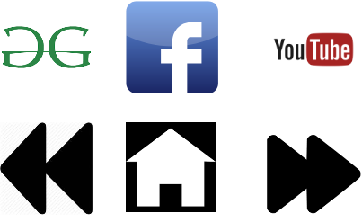

# Làm việc với hình ảnh trong CSS

## background-image

Trong bài này, ta sẽ đi tìm hiểu về cách làm việc với hình ảnh trong CSS, khi nào ta nên dùng nó trong CSS thay vì trong HTML, và trả lời câu hỏi quan trọng nhất, hình ảnh là nội dung hay là style? Vì ta đều biết là ta có thể dùng hình ảnh trong cả CSS và HTML. Nếu hình ảnh là nội dung, chúng nên nằm trong HTML, nhưng nếu là style, chúng nên nằm trong CSS.

Hình ảnh trong HTML nên được xem là nội dung. Nếu việc xóa đi hình ảnh làm thay đổi ý nghĩa nội dung, hình ảnh đó nên nằm trong tag hình ảnh của HTML. Tuy nhiên, nếu việc xóa đi hình ảnh không làm thay đổi ý nghĩa nội dung, hình ảnh đó nên nằm trong CSS.

Tuy nhiên, đây không phải là các quy tắc cứng nhắc mà bạn phải tuân thủ, hãy dùng trực giác để xác đinh. Giờ làm cách nào để chèn hình ảnh bằng CSS? Cách chính ở đây là dùng thuộc tính `background-image` với hàm `url()`. Hàm này nhận vào một đường dẫn đến hình ảnh, có thể là đường dẫn trực tiếp hoặc gián tiếp. `background-image` sẽ chèn hình ảnh vào phần nền của element, nên nó sẽ nằm phía sau nội dung (nếu có) của element đó.

```css
.element {
    background-image: url('path/to/image.jpg');
}
```

Ngoài ra hình nền còn bị ảnh hưởng bởi một số thuộc tính. Thứ nhất là `background-clip`. Nó định nghĩa phần nào của hình ảnh sẽ bị cắt dựa trên box model. Ví dụ, khi dùng `background-clip: padding-box`, hình ảnh sẽ lan rộng ra phần padding nhưng không đến rìa của viền. Tương tự, `background-clip: border-box` sẽ làm hình rộng ra đến ngoài viền, và `background-clip: content-box` sẽ làm hình chiếm phần nội dung của element. Bạn có thể dùng `background-clip: text` để làm hình ảnh chiếm phần nội dung của element, nhưng chỉ khi element đó chứa text, nhưng ta sẽ không dùng cái này nhiều lắm. `background-clip` cũng hoạt động cùng với màu nền nếu ta muốn hình lan rộng ra các phần khác nhau của box model.

Tương tự như vậy, ta có `background-origin` để xác định hình ảnh sẽ bắt đầu từ đâu. Nếu ta dùng `background-origin: padding-box`, góc trái trên của hình ảnh sẽ ứng với góc trái trên của phần padding. Thông thường, ta sẽ cho `background-origin` cùng giá trị với `background-clip`.

Tiếp theo, `background-repeat` xác định xem hình nền có lặp lại nếu element to hơn hình hay không. Và cuối cùng, `background-size` xác định kích thước của hình ảnh, nó bao gồm 2 giá trị, chiều rộng và chiều cao, ngăn cách nhau bởi khoảng trống. Ta cũng có thể dùng `auto` cho chiều nào đó của `background-size` để giữ nguyên tỉ lệ của hình ảnh. Ngoài ra ta có thể sử dụng các giá trị `cover` và `contain` để tự động thay đổi kích thước hình ảnh. `cover` sẽ làm hình ảnh lan rộng ra phủ toàn bộ phần nền, trong khi `contain` sẽ làm hình ảnh lan rộng ra phủ toàn bộ phần nền nhưng không bị cắt.

```css
.element {
    background-image: url('path/to/image.jpg');
    background-clip: padding-box;
    background-origin: padding-box;
    background-repeat: no-repeat;
    background-size: 50% auto;
}
```

## Image Spriting

Đây là việc cho nhiều hình ảnh vào một file duy nhất, sau đó chia nhỏ file ra ở phía client trước khi hiển thị. Việc này giúp giảm số lần request tới server, giúp tăng tốc độ tải trang, nhưng bù lại, nó lại làm code khó đọc hơn. Khi muốn dùng hình đã tải về, ta dùng `background-position` để xác định vị trí của hình ảnh trong file. Thuộc tính này làm cho nền di chuyển trong image container, giúp ta dùng một phần nào đó của hình ảnh.

## Ví dụ

Ta có code như sau:

```html
<!DOCTYPE html>
<html lang="en">
<head>
    <title>Document</title>
    <style>
        #my-image {
            width: 300px;
            height: 200px;
            border: 10px dashed blue;
            padding: 10px;
            background-image: url('../../../assets/frontend/css/working-with-images/ico-sysdesign.png');
        }
    </style>
</head>
<body>
    <h1>Images</h1>
    <div id="my-image"></div>
</body>
</html>
```
<apprun-play style="height:600px" hide_button="true"></apprun-play>

Ta có một h1 với nội dung là "Images", và một div hình chữ nhật chứa một hình ảnh, nhưng hình to hơn div. Hình ảnh đã bị cắt mất một phần để nằm được bên trong div, ta chỉ thấy phần trái trên của hình.

Ta có thể dùng `background-size` để sửa, có thể set chiều rộng và chiều cao của hình là `100px 100px`.

```html
<!DOCTYPE html>
<html lang="en">
<head>
    <title>Document</title>
    <style>
        #my-image {
            width: 300px;
            height: 200px;
            border: 10px dashed blue;
            padding: 10px;
            background-image: url('../../../assets/frontend/css/working-with-images/ico-sysdesign.png');
            background-size: 100px 100px;
        }
    </style>
</head>
<body>
    <h1>Images</h1>
    <div id="my-image"></div>
</body>
</html>
```
<apprun-play style="height:600px" hide_button="true"></apprun-play>

Ta thấy một đống hình nhỏ nhỏ thay vì một hình, vì mặc định nó sẽ lặp lại (repeat) để chứa hết trong div. Ta có thể thử `background-image: contain`.

```html
<!DOCTYPE html>
<html lang="en">
<head>
    <title>Document</title>
    <style>
        #my-image {
            width: 300px;
            height: 200px;
            border: 10px dashed blue;
            padding: 10px;
            background-image: url('../../../assets/frontend/css/working-with-images/ico-sysdesign.png');
            background-size: contain;
        }
    </style>
</head>
<body>
    <h1>Images</h1>
    <div id="my-image"></div>
</body>
</html>
```
<apprun-play style="height:600px" hide_button="true"></apprun-play>

Nó sẽ phóng to hình càng lớn càng tốt mà không cần phải cắt hay thay đổi tỷ lệ hình ảnh. Ở đây nó tầm 200x200, rồi lặp lại để chứa hết trong div. Ta có thể thử `cover` để xem kết quả.

```html
<!DOCTYPE html>
<html lang="en">
<head>
    <title>Document</title>
    <style>
        #my-image {
            width: 300px;
            height: 200px;
            border: 10px dashed blue;
            padding: 10px;
            background-image: url('../../../assets/frontend/css/working-with-images/ico-sysdesign.png');
            background-size: cover;
        }
    </style>
</head>
<body>
    <h1>Images</h1>
    <div id="my-image"></div>
</body>
</html>
```
<apprun-play style="height:600px" hide_button="true"></apprun-play>

Nó sẽ cố gắng fill hết container trong một chiều nào đó của hình ảnh, ở đây là chiều rộng. Nếu chiều cao của hình ảnh lớn hơn chiều cao của container, nó sẽ bị cắt. Trở lại với `contain`, ta có thể set `background-repeat: no-repeat` để không lặp lại hình ảnh.

```html
<!DOCTYPE html>
<html lang="en">
<head>
    <title>Document</title>
    <style>
        #my-image {
            width: 300px;
            height: 200px;
            border: 10px dashed blue;
            padding: 10px;
            background-image: url('../../../assets/frontend/css/working-with-images/ico-sysdesign.png');
            background-size: contain;
            background-repeat: no-repeat;
        }
    </style>
</head>
<body>
    <h1>Images</h1>
    <div id="my-image"></div>
</body>
</html>
```
<apprun-play style="height:600px" hide_button="true"></apprun-play>

Giờ ta muốn hình bắt đầu từ phần viền, ta có thể set `background-origin: border-box`.

```html
<!DOCTYPE html>
<html lang="en">
<head>
    <title>Document</title>
    <style>
        #my-image {
            width: 300px;
            height: 200px;
            border: 10px dashed blue;
            padding: 10px;
            background-image: url('../../../assets/frontend/css/working-with-images/ico-sysdesign.png');
            background-size: contain;
            background-repeat: no-repeat;
            background-origin: border-box;
        }
    </style>
</head>
<body>
    <h1>Images</h1>
    <div id="my-image"></div>
</body>
</html>
```
<apprun-play style="height:600px" hide_button="true"></apprun-play>

Ta muốn cắt hình ở phần nội dung, ta có thể set `background-clip: content-box`.

```html
<!DOCTYPE html>
<html lang="en">
<head>
    <title>Document</title>
    <style>
        #my-image {
            width: 300px;
            height: 200px;
            border: 10px dashed blue;
            padding: 10px;
            background-image: url('../../../assets/frontend/css/working-with-images/ico-sysdesign.png');
            background-size: contain;
            background-repeat: no-repeat;
            background-origin: border-box;
            background-clip: content-box;
        }
    </style>
</head>
<body>
    <h1>Images</h1>
    <div id="my-image"></div>
</body>
</html>
```
<apprun-play style="height:600px" hide_button="true"></apprun-play>

Việc này nghĩa là với hình chưa cắt, nó sẽ cắt phần phía trong nội dung ra để giữ lại, còn lại xóa hết. Đây là lý do vì sao hai giá trị `background-origin` và `background-clip` thường giống nhau. Ta có thể thử với `padding-box`.

```html
<!DOCTYPE html>
<html lang="en">
<head>
    <title>Document</title>
    <style>
        #my-image {
            width: 300px;
            height: 200px;
            border: 10px dashed blue;
            padding: 10px;
            background-image: url('../../../assets/frontend/css/working-with-images/ico-sysdesign.png');
            background-size: contain;
            background-repeat: no-repeat;
            background-origin: padding-box;
            background-clip: padding-box;
        }
    </style>
</head>
<body>
    <h1>Images</h1>
    <div id="my-image"></div>
</body>
</html>
```
<apprun-play style="height:600px" hide_button="true"></apprun-play>

Rồi, vậy còn spriting thì sao? Ta sẽ thêm vài phần vào body để thử nghiệm nhé.

```html
<!DOCTYPE html>
<html lang="en">
<head>
    <title>Document</title>
    <style>
        #my-image {
            width: 300px;
            height: 200px;
            border: 10px dashed blue;
            padding: 10px;
            background-image: url('../../../assets/frontend/css/working-with-images/ico-sysdesign.png');
            background-size: contain;
            background-repeat: no-repeat;
            background-origin: padding-box;
            background-clip: padding-box;
        }
    </style>
</head>
<body>
    <h1>Images</h1>
    <div id="my-image"></div>

    

    <section>
        <h2>YouTube</h2>
        <div id="youtube"></div>
    </section>
    <section>
        <h2>Facebook</h2>
        <div id="facebook"></div>
    </section>
</body>
</html>
```
<apprun-play style="height:1000px" hide_button="true"></apprun-play>

Ta có một hình lớn chứa 6 hình nhỏ, và ta có 2 section, mỗi section chứa header và div riêng, ta muốn đưa logo YouTube từ hình lớn vào div YouTube, và logo Facebook vào div Facebook.

Đầu tiên với YouTube, ta sẽ set `width` và `height` cho nó, sau đó dùng `background-image` để chọn hình lớn, và `background-position` để chọn vị trí của hình nhỏ trong hình lớn. Ta cần góc trên trái của hình logo YouTube ứng với góc trên trái của div YouTube, nên ta sẽ phải đẩy hình lớn qua trái một chút, đẩy qua 300px đi, nghĩa là `background-position: -300px 0`.

```html
<!DOCTYPE html>
<html lang="en">
<head>
    <title>Document</title>
    <style>
        #my-image {
            width: 300px;
            height: 200px;
            border: 10px dashed blue;
            padding: 10px;
            background-image: url('../../../assets/frontend/css/working-with-images/ico-sysdesign.png');
            background-size: contain;
            background-repeat: no-repeat;
            background-origin: padding-box;
            background-clip: padding-box;
        }
        #youtube {
            width: 100px;
            height: 100px;
            background-image: url('../../../assets/frontend/css/working-with-images/icon.png');
            background-position: -300px 0;
        }
    </style>
</head>
<body>
    <h1>Images</h1>
    <div id="my-image"></div>

    

    <section>
        <h2>YouTube</h2>
        <div id="youtube"></div>
    </section>
    <section>
        <h2>Facebook</h2>
        <div id="facebook"></div>
    </section>
</body>
</html>
```
<apprun-play style="height:1000px" hide_button="true"></apprun-play>

Tương tự với Facebook, ta cần đẩy hình qua trái 200px, nghĩa là `background-position: -150px 0`.

```html
<!DOCTYPE html>
<html lang="en">
<head>
    <title>Document</title>
    <style>
        #my-image {
            width: 300px;
            height: 200px;
            border: 10px dashed blue;
            padding: 10px;
            background-image: url('../../../assets/frontend/css/working-with-images/ico-sysdesign.png');
            background-size: contain;
            background-repeat: no-repeat;
            background-origin: padding-box;
            background-clip: padding-box;
        }
        #youtube {
            width: 100px;
            height: 100px;
            background-image: url('../../../assets/frontend/css/working-with-images/icon.png');
            background-position: -300px 0;
        }
        #facebook {
            width: 110px;
            height: 110px;
            background-image: url('../../../assets/frontend/css/working-with-images/icon.png');
            background-position: -140px 0;
        }
    </style>
</head>
<body>
    <h1>Images</h1>
    <div id="my-image"></div>

    

    <section>
        <h2>YouTube</h2>
        <div id="youtube"></div>
    </section>
    <section>
        <h2>Facebook</h2>
        <div id="facebook"></div>
    </section>
</body>
</html>
```
<apprun-play style="height:1000px" hide_button="true"></apprun-play>

Ta đã dùng hình lớn để tạo ra 2 hình nhỏ. Ta có thể xóa hình lớn đi, vì nó không cần thiết để hiển thị nữa. Cuối cùng, nhìn vào các div thì ta sẽ không hiểu nó chứa gì, ta có thể thêm các aria-label để làm rõ hơn.

```html
<!DOCTYPE html>
<html lang="en">
<head>
    <title>Document</title>
    <style>
        #my-image {
            width: 300px;
            height: 200px;
            border: 10px dashed blue;
            padding: 10px;
            background-image: url('../../../assets/frontend/css/working-with-images/ico-sysdesign.png');
            background-size: contain;
            background-repeat: no-repeat;
            background-origin: padding-box;
            background-clip: padding-box;
        }
        #youtube {
            width: 100px;
            height: 100px;
            background-image: url('../../../assets/frontend/css/working-with-images/icon.png');
            background-position: -300px 0;
        }
        #facebook {
            width: 110px;
            height: 110px;
            background-image: url('../../../assets/frontend/css/working-with-images/icon.png');
            background-position: -140px 0;
        }
    </style>
</head>
<body>
    <h1>Images</h1>
    <div id="my-image"></div>

    

    <section>
        <h2>YouTube</h2>
        <div id="youtube" role="img" aria-label="YouTube Logo"></div>
    </section>
    <section>
        <h2>Facebook</h2>
        <div id="facebook" role="img" aria-label="Facebook Logo"></div>
    </section>
</body>
</html>
```
<apprun-play style="height:1000px" hide_button="true"></apprun-play>
