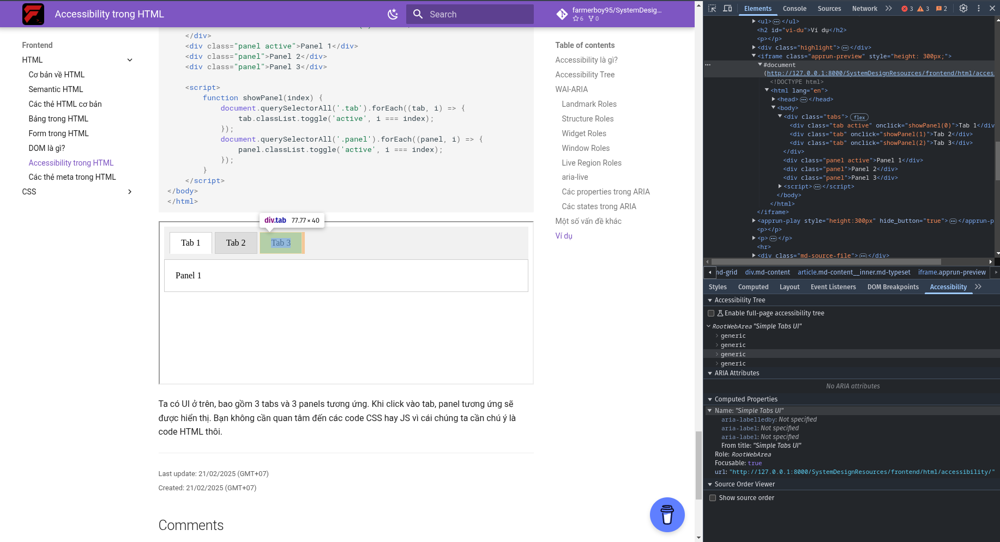
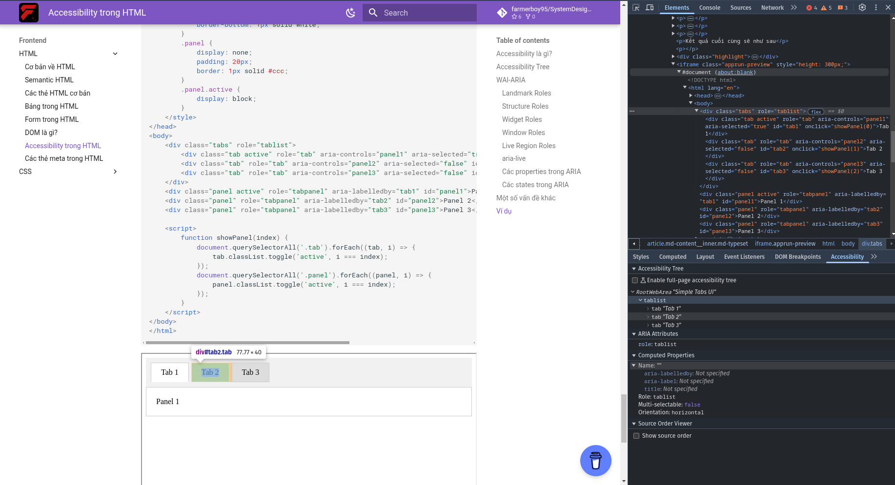

# Accessibility trong HTML

## Accessibility là gì?

Accessibility (khả năng tiếp cận) là khả năng truy cập và sử dụng các trang web, ứng dụng web, và các công nghệ khác một cách dễ dàng cho tất cả mọi người, bao gồm cả những người có khuyết tật. Về mặt lý tưởng, ta sẽ muốn tất cả mọi người đều có thể truy cập và sử dụng các ứng dụng web một cách dễ dàng, không gặp bất kỳ rào cản nào. Ví dụ, có người duyệt web với bàn phím và chuột, cũng có người chỉ có thể duyệt web với bàn phím, có một số người khác thì không thể nhìn thấy được màn hình mà chỉ có thể sử dụng trình đọc màn hình để biết nội dung trên trang web. Ta sẽ phải đảm bảo rằng các trường hợp này (và nhiều trường hợp khác nữa) đều có thể truy cập và sử dụng ứng dụng web một cách dễ dàng.

## Accessibility Tree

Trong phần lớn trường hợp, người dùng sẽ sử dụng các công cụ hỗ trợ như trình đọc màn hình để tương tác với trang web. Nhưng các công cụ này không tương tác trực tiếp với cây DOM, mà chúng tương tác với một cây khác, gọi là Accessibility Tree. Accessibility Tree là một biểu diễn của cây DOM, nhưng được tối ưu hóa cho việc truy cập và sử dụng cho những trường hợp đặc biệt mà ta đã đề cập.

Mỗi node trên cây này bao gồm 4 thành phần chính:

1. **name**: Tên của node, thường đồng nghĩa với nội dung của node.
2. **description**: Mô tả cho node, thường được sử dụng để cung cấp thông tin bổ sung cho người dùng.
3. **role**: Giải thích vai trò của node, giúp người dùng hiểu được node đó đang làm gì. Ví dụ, một checkbox sẽ có role là `checkbox`.
4. **state**: Trạng thái của node, giúp người dùng hiểu được node đó đang ở trạng thái nào. Ví dụ, một checkbox có thể ở trạng thái `checked` hoặc `unchecked`. Những role khác nhau sẽ có những option khác nhau cho trạng thái.

Vậy Accessibility Tree được mang tới cho người dùng như thế nào? Trong bài về DOM, ta có biểu đồ sau

```
HTML -> DOM -> UI -> User
```

Trong trường hợp của Accessibility Tree, biểu đồ của chúng ta sẽ như sau:

```
HTML -> DOM -------------> UI -------------> User
         |                                    ^
         v                                    |
  Accessibility Tree ------------------- Công cụ hỗ trợ
```

Như vậy cây DOM ngoài việc được chuyển đổi thành giao diện người dùng trên màn hình thì còn được chuyển đổi thành Accessibility Tree, sau đó được các công cụ hỗ trợ sử dụng để tương tác với người dùng. Nghĩa là khi viết HTML để hỗ trợ accessibility, ta sẽ viết HTML sao cho Accessibility Tree được tạo ra từ cây DOM là tốt nhất. Có một vài cách để đạt được điều này

1. Viết nội dung, label và các thuộc tính `alt` một cách chi tiết.
2. Sử dụng semantic HTML. Khi đó, accessibility tree sẽ được tạo ra một cách tự nhiên với các phần tử mà ta chọn.
3. Hỗ trợ khả năng tương tác với bàn phím, nghĩa là giúp người dùng duyệt và tương tác được với toàn bộ các phần quan trọng của trang web chỉ với bàn phím.

## WAI-ARIA

Trong phần lớn trường hợp, ta chỉ cần viết semantic HTML là đủ để hỗ trợ accessibility. Tuy nhiên, đôi khi ta cần viết ứng dụng web phức tạp hơn và điều này sẽ làm cho ta khó giữ được semantic HTML. Từ đó, WAI-ARIA ra đời. WAI-ARIA (Web Accessibility Initiative - Accessible Rich Internet Applications, gọi tắt là ARIA) là một tập hợp các thuộc tính và giá trị được thêm vào các phần tử HTML để giúp tạo ra một Accessibility Tree tốt hơn. Nó bao gồm các thành phần sau:

1. **roles**: Định nghĩa vai trò của phần tử trong Accessibility Tree.
2. **properties**: Định nghĩa các thuộc tính của phần tử, như label chẳng hạn.
3. **states**: Định nghĩa trạng thái của phần tử, như `disabled`.

Các role trong ARIA được chia thành các nhóm sau:

### Landmark Roles

Landmark Roles được dùng để định nghĩa các phần quan trọng của trang web. Thông thường, đây sẽ là nơi mà người dùng sẽ tìm kiếm đầu tiên khi truy cập trang web với các công cụ hỗ trợ. Các ví dụ sẽ bao gồm phần banner, nội dung chính, hay phần điều hướng trang. Bạn có thể thấy rằng nó khá giống với các thẻ nhóm ngữ nghĩa (semantic grouping tags) và thực tế các thẻ này luôn có một landmark role tương ứng. Đó là lý do vì sao ta nên sử dụng các thẻ nhóm ngữ nghĩa thay vì tự set landmark role.

```html
<div role="banner">
    <h1>My website</h1>
</div>
```

### Structure Roles

Structure Roles được dùng để định nghĩa cấu trúc của trang, giải thích phần được đánh dấu của trang web có chức năng gì. Structure Roles có vai trò ít quan trọng hơn Landmark Roles trên cây Accessibility Tree. Nó sẽ được dùng cho các phần tử ít quan trọng hơn như tooltip, list hay table.

```html
<section role="list">
    <div role="listitem">Item 1</div>
    <div role="listitem">Item 2</div>
</section>
```

### Widget Roles

Widget Roles được dùng để định nghĩa các phần tử tương tác trên trang web. Đây là những phần tử mà người dùng có thể tương tác được, như button, checkbox, hay slider. Ví dụ như khi dùng một thẻ chung chung như `<div>` và ta muốn người dùng biết được mình có thể tương tác với nó, ta sẽ set role là `button`.

```html
<div role="button">Click me</div>
```

Bạn có thể thấy rằng các phần tử được nêu ra đều có các thẻ riêng trong HTML. Vì vậy, bạn nên sử dụng các thẻ đó hơn là tự set role. Tuy nhiên cũng có một số widget role không có thẻ tương ứng.

### Window Roles

Window Roles được dùng để định nghĩa các cửa sổ trên trang web. Đây là những phần tử mà người dùng có thể mở ra và đóng lại, như dialog hay alert.

```html
<div role="dialog">
    <h2>Are you sure?</h2>
    <button>Yes</button>
    <button>No</button>
</div>
```

### Live Region Roles

Live Region Roles được dùng để định nghĩa các phần tử mà nội dung của chúng thường xuyên thay đổi. Các công cụ hỗ trợ sẽ theo dõi các phần tử này và thông báo cho người dùng khi nội dung thay đổi. Role mà bạn dùng sẽ quyết định cách mà công cụ hỗ trợ thông báo cho người dùng, có thể là kiểm tra phần tử ngay lập tức hoặc sau một khoảng thời gian. Các ví dụ bao gồm `alert`, `timer`, hay `log`.

```html
<ol role="log">
    <li>Item 1</li>
    <li>Item 2</li>
</ol>
```

### `aria-live`

`aria-live` là một thuộc tính được dùng để định nghĩa các nội dung thường xuyên thay đổi và tầm quan trọng của chúng. Mỗi Live Region Role đều có một giá trị tương ứng cho `aria-live`, nhưng ta luôn có thể set giá trị này với thuộc tính `aria-live`. Ta cũng có thể set thuộc tính này vào các phần tử không có Live Region Role để định nghĩa chúng là live region. Các giá trị bao gồm:

- `off`: Các công cụ hỗ trợ sẽ không thông báo cho người dùng khi nội dung thay đổi.
- `polite`: Các công cụ hỗ trợ sẽ thông báo cho người dùng khi nó ở trong trạng thái không hoạt động.
- `assertive`: Các công cụ hỗ trợ sẽ thông báo cho người dùng ngay lập tức khi nội dung thay đổi.

```html
<div aria-live="polite">
    <p>Item 1</p>
    <p>Item 2</p>
</div>
```

### Các properties trong ARIA

- `aria-label`: Định nghĩa một label cho phần tử, nhưng không hiển thị nó trên trang web (thông qua giao diện người dùng).

```html
<div role="button" aria-label="Click me to submit the form">Button</div>
```

- `aria-labelledby`: Định nghĩa một phần tử khác làm label cho phần tử hiện tại.

```html
<div role="dialog" aria-labelledby="dialog-title">
    <h2 id="dialog-title">Are you sure?</h2>
    <button>Yes</button>
    <button>No</button>
</div>
```

- `aria-description`: Định nghĩa mô tả cho phần tử, thông thường được sử dụng để cung cấp thông tin bổ sung cho người dùng.

```html
<div role="button" aria-description="Click me to submit the form">Submit</div>
```

- `aria-describedby`: Định nghĩa một phần tử khác làm mô tả cho phần tử hiện tại.

### Các states trong ARIA

Các trạng thái này thường được sử dụng cho các phần tử tương tác như input hay button.

- `aria-checked`: Định nghĩa trạng thái của phần tử có thể được chọn hay không.

```html
<div role="checkbox" aria-checked="true">Checked</div>
```

- `aria-disabled`: Định nghĩa trạng thái của phần tử có thể tương tác hay không.

```html
<div role="button" aria-disabled="true">Disabled</div>
```

- `aria-expanded`: Định nghĩa trạng thái của phần tử có thể mở rộng hay không.

```html
<div role="button" aria-expanded="true">Expand</div>
```

- `aria-selected`: Định nghĩa trạng thái của phần tử đã được chọn hay không.

```html
<div role="tab" aria-selected="true">Tab 1</div>
```

- `aria-pressed`: Định nghĩa trạng thái của phần tử đã được nhấn hay không.

```html
<div role="button" aria-pressed="true">Pressed</div>
```

- `aria-hidden`: Định nghĩa trạng thái của phần tử đã được ẩn hay không.

```html
<div role="button" aria-hidden="true">Hidden</div>
```

## Một số vấn đề khác

- Khả năng hỗ trợ của trình duyệt: Mặc dù các công cụ hỗ trợ có thể tương tác với Accessibility Tree, nhưng trình duyệt cũng phải hỗ trợ các thuộc tính và giá trị của ARIA. Nếu trình duyệt không hỗ trợ, người dùng sẽ không thể tương tác với trang web một cách dễ dàng.
- Khả năng hỗ trợ của CSS: Sử dụng font dễ đọc, màu sắc dễ nhìn, và kích thước phù hợp để giúp người dùng dễ đọc nội dung.
- Hỗ trợ internationalization (i18n): Hỗ trợ nhiều ngôn ngữ khác nhau, test với những kiểu ngôn ngữ khác nhau, ví dụ như chữ latin, chữ tượng hình, chữ Ả rập, v.v.

## Ví dụ

```html
<!DOCTYPE html>
<html lang="en">
<head>
    <meta charset="UTF-8">
    <meta name="viewport" content="width=device-width, initial-scale=1.0">
    <title>Simple Tabs UI</title>
    <style>
        .tabs {
            display: flex;
            cursor: pointer;
            padding: 10px;
            background: #f1f1f1;
        }
        .tab {
            padding: 10px 20px;
            border: 1px solid #ccc;
            margin-right: 5px;
            background: #ddd;
        }
        .tab.active {
            background: white;
            border-bottom: 1px solid white;
        }
        .panel {
            display: none;
            padding: 20px;
            border: 1px solid #ccc;
        }
        .panel.active {
            display: block;
        }
    </style>
</head>
<body>
    <div class="tabs">
        <div class="tab active" onclick="showPanel(0)">Tab 1</div>
        <div class="tab" onclick="showPanel(1)">Tab 2</div>
        <div class="tab" onclick="showPanel(2)">Tab 3</div>
    </div>
    <div class="panel active">Panel 1</div>
    <div class="panel">Panel 2</div>
    <div class="panel">Panel 3</div>

    <script>
        function showPanel(index) {
            document.querySelectorAll('.tab').forEach((tab, i) => {
                tab.classList.toggle('active', i === index);
            });
            document.querySelectorAll('.panel').forEach((panel, i) => {
                panel.classList.toggle('active', i === index);
            });
        }
    </script>
</body>
</html>
```
<apprun-play style="height:300px" hide_button="true"></apprun-play>

Ta có UI ở trên, bao gồm 3 tabs và 3 panels tương ứng. Khi click vào tab, panel tương ứng sẽ được hiển thị. Bạn không cần quan tâm đến các code CSS hay JS vì cái chúng ta cần chú ý là code HTML thôi.

Với người bình thường thì UI này không có vấn đề gì, thậm chí còn rất tốt. Tuy nhiên với người phải sử dụng trình đọc màn hình, họ có hiểu được UI này có gì hay không, câu trả lời là không.

Ta dùng "Kiểm tra phần tử " hay "Inspect element". Trong "Elements", ta có thể vào Accessibility để xem Accessibility Tree như hình dưới

{:class="centered-img"}

Ta có thể thấy là các phần tử này toàn là generic, không có role, không có label, không có description, không có state. Điều này làm cho người dùng không thể hiểu được UI này làm gì, và cách tương tác với nó như thế nào. Ta sẽ đi sửa cái UI này với ARIA.

Đầu tiên ta cần các role, với tab bọc ngoài ta sẽ set role là `tablist`, với các tab bên trong ta sẽ set role là `tab`, với các panel ta sẽ set role là `tabpanel`.

Do Tab 1 điều khiển Panel 1, Tab 2 điều khiển Panel 2, v.v. nên ta sẽ set `aria-controls` cho các tab. Ví dụ, Tab 1 sẽ điều khiển Panel 1, ta sẽ set `aria-controls="panel1"` cho Tab 1, sau đó ta sẽ set `id="panel1"` cho Panel 1.

Vì Tab 1 luôn được chọn mặc định, ta sẽ set `aria-selected="true"` cho Tab 1, và các tab còn lại sẽ set `aria-selected="false"`.

Với các panel, ta sẽ set `aria-labelledby` cho panel, và set `id` cho tab tương ứng. Ví dụ, Panel 1 sẽ được điều khiển bởi Tab 1, ta sẽ set `aria-labelledby="tab1"` cho Panel 1, và set `id="tab1"` cho Tab 1.

Kết quả cuối cùng sẽ như sau

```html
<!DOCTYPE html>
<html lang="en">
<head>
    <meta charset="UTF-8">
    <meta name="viewport" content="width=device-width, initial-scale=1.0">
    <title>Simple Tabs UI</title>
    <style>
        .tabs {
            display: flex;
            cursor: pointer;
            padding: 10px;
            background: #f1f1f1;
        }
        .tab {
            padding: 10px 20px;
            border: 1px solid #ccc;
            margin-right: 5px;
            background: #ddd;
        }
        .tab.active {
            background: white;
            border-bottom: 1px solid white;
        }
        .panel {
            display: none;
            padding: 20px;
            border: 1px solid #ccc;
        }
        .panel.active {
            display: block;
        }
    </style>
</head>
<body>
    <div class="tabs" role="tablist">
        <div class="tab active" role="tab" aria-controls="panel1" aria-selected="true" id="tab1" onclick="showPanel(0)">Tab 1</div>
        <div class="tab" role="tab" aria-controls="panel2" aria-selected="false" id="tab2" onclick="showPanel(1)">Tab 2</div>
        <div class="tab" role="tab" aria-controls="panel3" aria-selected="false" id="tab3" onclick="showPanel(2)">Tab 3</div>
    </div>
    <div class="panel active" role="tabpanel" aria-labelledby="tab1" id="panel1">Panel 1</div>
    <div class="panel" role="tabpanel" aria-labelledby="tab2" id="panel2">Panel 2</div>
    <div class="panel" role="tabpanel" aria-labelledby="tab3" id="panel3">Panel 3</div>

    <script>
        function showPanel(index) {
            document.querySelectorAll('.tab').forEach((tab, i) => {
                tab.classList.toggle('active', i === index);
            });
            document.querySelectorAll('.panel').forEach((panel, i) => {
                panel.classList.toggle('active', i === index);
            });
        }
    </script>
</body>
</html>
```
<apprun-play style="height:300px" hide_button="true"></apprun-play>

{:class="centered-img"}

Ở trên, Accessibility Tree đã biết được có một tablist, trong đó có 3 tab: Tab 1, Tab 2, Tab 3, và 1 Panel. Mỗi tab có role là `tab`, và có `aria-controls` tương ứng với panel mà nó điều khiển. Mỗi panel có role là `tabpanel`, và có `aria-labelledby` tương ứng với tab mà nó điều khiển. Các tab và panel đều có `id` để dễ dàng tìm kiếm.
