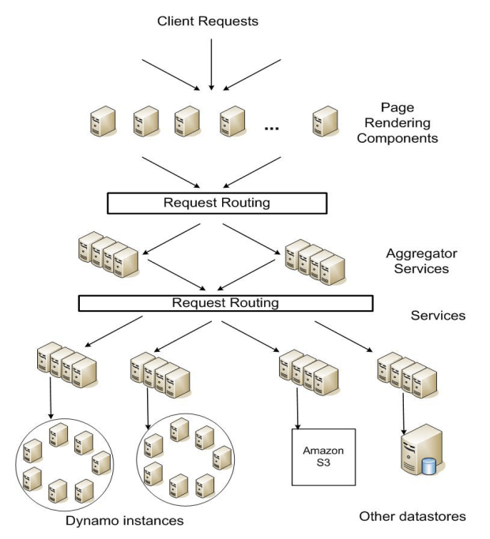
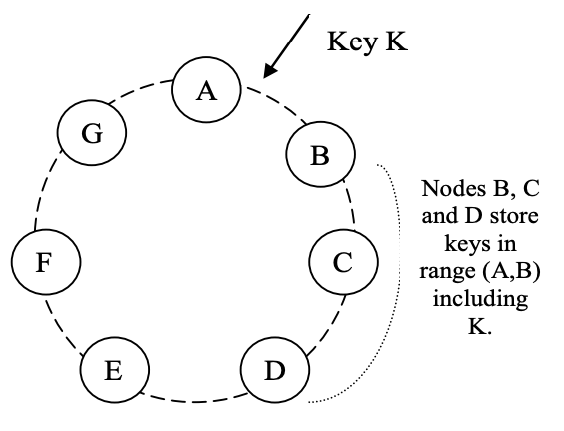
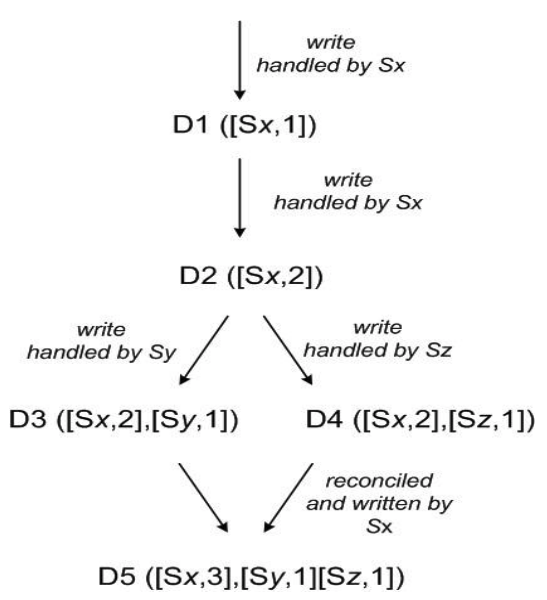

# Amazon Dynamo

## Nguồn

[Dynamo: Amazon’s Highly Available Key-value Store](https://www.allthingsdistributed.com/files/amazon-dynamo-sosp2007.pdf)

Các tác giả:

- Giuseppe DeCandia
- Deniz Hastorun
- Madan Jampani
- Gunavardhan Kakulapati
- Avinash Lakshman
- Alex Pilchin
- Swaminathan Sivasubramanian
- Peter Vosshall
- Werner Vogels

## Tóm tắt

Độ tin cậy (Reliability) ở quy mô lớn là một trong những thách thức mà chúng tôi gặp phải tại Amazon.com, một trong những tập đoàn thương mại điện tử lớn nhất thế giới; chỉ cần vài giây gián đoạn cũng gây ra hậu quả tài chính to lớn và ảnh hưởng đến lòng tin của người dùng. Nền tảng Amazon.com, nơi cung cấp dịch vụ (service) cho rất nhiều website toàn cầu, được xây dựng trên một hạ tầng bao gồm hàng chục nghìn máy chủ (server) và thành phần mạng được đặt ở rất nhiều trung tâm dữ liệu (data center) trên thế giới. Ở quy mô này, các thành phần nhỏ và lớn có thể liên tục gặp sự cố và cách để quản lý trạng thái liên tục khi đối mặt với những lỗi này giúp thúc đẩy độ tin cậy và tính mở rộng (scalability) của hệ thống phần mềm.

Bài báo này giới thiệu thiết kế và cài đặt của Dynamo, một hệ thống lưu trữ khóa-giá trị (key-value) có tính khả dụng cao (highly available) được sử dụng bởi một số hệ thống quan trọng của Amazon để cung cấp một trải nghiệm không gián đoạn cho người dùng. Để đạt được mục tiêu này, Dynamo hi sinh tính nhất quán (consistency) trong một số trường hợp cụ thể. Dynamo còn sử dụng nhiều kỹ thuật như phiên bản hóa (versioning) và giải quyết xung đột (conflict resolution) với sự giúp sức của tầng ứng dụng theo cách cung cấp một giao diện mới mẻ cho nhà phát triển.

## 1. Giới thiệu

Amazon vận hành một nền tảng thương mại điện tử toàn cầu phục vụ hàng chục triệu khách hàng trong giờ cao điểm với hàng chục nghìn server ở nhiều data center trên thế giới. Có nhiều yêu cầu hoạt động nghiêm ngặt trên nền tảng Amazon về hiệu suất, độ tin cậy và độ hiệu quả. Độ tin cậy là một trong các yêu cầu quan trọng nhất vì một vài giây gián đoạn có thể gây ra hậu quả tài chính to lớn và ảnh hưởng đến lòng tin của người dùng. Thêm nữa, để đáp ứng nhu cầu tăng trưởng liên tục, nền tảng cần có tính mở rộng cao để có thể dễ dàng mở rộng hệ thống khi cần thiết.

Một trong những bài học mà tổ chức của chúng tôi đã học được khi vận hành nền tảng của Amazon là độ tin cậy và tính mở rộng của một hệ thống phụ thuộc vào cách trạng thái ứng dụng được quản lý. Amazon sử dụng một kiến trúc hướng service có tính phi tập trung cao (highly decentralized), liên kết lỏng lẻo (loosely coupled), bao gồm hàng trăm service. Trong môi trường này, sẽ có nhu cầu đặc biệt về các công nghệ lưu trữ có tính khả dụng cao. Ví dụ, khách hàng có thể xem và thêm các mặt hàng vào giỏ hàng của mình ngay cả khi ổ đĩa bị lỗi, các tuyến mạng bị lỗi hoặc các data center bị tàn phá bởi thiên tai. Do đó, service chịu trách nhiệm quản lý giỏ hàng yêu cầu rằng nó luôn có thể ghi và đọc từ data store của mình và data của nó cần phải khả dụng (available) trên nhiều data center.

Xử lý vấn đề trong một hạ tầng gồm hàng triệu thành phần là việc thường xuyên của chúng tôi; luôn có một lượng nhỏ nhưng đáng kể các server và thành phần mạng có thể bị lỗi ở bất kỳ lúc nào. Như vậy các hệ thống phần mềm của Amazon cần phải được xây dựng theo cách mà chúng xem việc xử lý lỗi như chuyện thường ngày ở huyện mà không ảnh hưởng đến tính khả dụng hoặc hiệu suất.

Để đáp ứng các như cầu về độ tin cậy và tính mở rộng, Amazon đã phát triển nhiều công nghệ lưu trữ, trong đó Amazon Simple Storage Service (cũng đã ra mắt công chúng và được biết đến với cái tên Amazon S3) là nổi tiếng nhất. Bài báo này này trình bày thiết kế và cài đặt Dynamo, một data store phân tán có tính khả dụng và tính mở rộng cao khác, được xây dựng cho nền tảng của Amazon. Dynamo được sử dụng để quản lý trạng thái của các service có nhiều yêu cầu về độ tin cậy vào cùng với việc kiểm soát chặt chẽ những sự cân bằng về tính khả dụng, tính nhất quán, hiệu quả chi phí và hiệu suất. Nền tảng của Amazon có một tập rất đa dạng các ứng dụng với nhiều yêu cầu lưu trữ khác nhau. Một tập các ứng dụng như thế yêu cầu một công nghệ lưu trữ đủ linh hoạt để cho phép các nhà thiết kế ứng dụng cấu hình data store một cách thích hợp, dựa trên những sự cân bằng ở trên để đạt được tính khả dụng cao và đảm bảo hiệu quả với chi phí hợp lý nhất.

Có rất nhiều service trên nền tảng của Amazon mà chỉ cần truy cập bằng khóa chính để lấy dữ liệu. Với nhiều service, như danh sách các nhà bán hàng tốt nhất, giỏ hàng, sở thích khách hàng, quản lý session, thứ hạng bán hàng và danh mục sản phẩm, mô hình chung của việc sử dụng cơ sở dữ liệu quan hệ (relational database) sẽ dẫn đến sự kém hiệu quả và hạn chế quy mô và tính khả dụng. Dynamo cung cấp một giao diện chỉ có khóa chính đơn giản để đáp ứng yêu cầu của các ứng dụng này.

Dynamo sử dụng kết hợp các ký thuật phổ biến để đạt được tính khả dụng và tính mở rộng. Data được phân vùng (partition) và sao chép (replicate) bằng cách sử dụng hàm băm nhất quán (consistent hashing) [10], và tính nhất quán được hỗ trợ bằng cách phiên bản hóa đối tượng (object versioning) [12]. Tính nhất quán giữa các bản sao dữ liệu (replica) trong quá trình cập nhật được duy trì bằng một kỹ thuật kiểu quorum và một giao thức đồng bộ hóa bản sao phi tập trung (decentralized replica synchronization protocol). Dynamo sử dụng một giao thức thành viên và phát hiện lỗi phân tán dựa trên gossip. Dynamo là một hệ thống hoàn toàn phi tập trung với việc quản trị thủ công giảm đến mức tối thiểu. Các node lưu trữ có thể được thêm vào và bớt khỏi Dynamo mà không yêu cầu bất kỳ việc phân vùng và tái phân phối thủ công nào.

Trong năm qua, Dynamo là công nghệ lưu trữ đằng sau một cơ số các service cốt lõi trong nền tảng thương mại điện tử của Amazon. Nó có thể tăng quy mô lên mức cực đại một cách hiệu quả mà không có thời gian chết trong mùa mua sắm. Ví dụ, service quản lý giỏ hàng phục vụ hàng chục triệu yêu cầu đã mang lại hơn 3 triệu lượt thanh toán trong một ngày và service quản lý session đã xử lý hàng trăm nghìn session hoạt động đồng thời.

Đóng góp chính của công việc này cho cộng đồng nghiên cứu là việc đánh giá làm thế nào các kỹ thuật khác nhau có thể được kết hợp để tạo ra một hệ thống có tính khả dụng cao. Nó chứng tỏ rằng một hệ thống lưu trữ eventually-consistent có thể được dùng trong các ứng dụng có nhu cầu. Nó cũng cung cấp cái nhìn sâu sắc về việc điều chỉnh các kỹ thuật này để đáp ứng các nhu cầu của hệ thống thực với rất nhiều yêu cầu về hiệu suất khắt khe.

Bài báo này được trình bày như sau. Phần 2 giới thiệu bối cảnh và Phần 3 trình bày các công việc liên quan. Phần 4 trình bày thiết kế hệ thống và Phần 5 mô tả cài đặt. Phần 6 trình bày chi tiết những kinh nghiệm và hiểu biết của chúng tôi khi vận hành Dynamo trong thực tế và Phần 7 kết luận bài báo. Có một số  chỗ trong bài viết này cần thêm một số thông tin hay ho nữa nhưng việc bảo vệ lợi ích kinh doanh của Amazon yêu cầu chúng tôi phải giảm các chi tiết này đi. Vì lý do này, phần về độ trễ trong và giữa các data center trong phần 6, tỉ lệ request tuyệt đối trong phần 6.2, thời gian ngừng hoạt động và khối lượng công việc trong phần 6.3 được cung cấp thông qua các chỉ số tổng hợp thay vì các chi tiết cụ thể.

## 2. Bối cảnh

Nền tảng thương mại điện tử của Amazon được kết hợp bởi hàng trăm service hoạt động phối hợp với nhau để cung cấp các chức năng khác nhau từ đề xuất, thực hiện đơn hàng đến phát hiện gian lận. Mỗi service được thể hiện thông qua một giao diện được xác định rõ ràng và có thể truy cập qua mạng. Các service này được host trên một hạ tầng bao gồm hàng chục nghìn server được đặt ở nhiều trung tâm dữ liệu trên thế giới. Một số service trong này thì stateless (ví dụ như các service tổng hợp phản hồi từ các service khác), và một số thì stateful (ví dụ như service tạo ra phản hồi bằng cách thực thi các logic nghiệp vụ dựa trên trạng thái được lưu trữ trong persistent store).

Các hệ thống truyền thống lưu trạng thái của chúng trong các database quan hệ. Tuy nhiên, đối với nhiều mô hình sử đụng trạng thái bền vững, database quan hệ không phải là một lựa chọn tốt. Hầu hết các service này chỉ lưu trữ và truy xuất dữ liệu bằng khóa chính và không yêu cầu chức năng quản lý và truy vấn phức tập do database quan hệ cung cấp. Các chức năng dư thừa đòi hỏi phần cứng đắt tiền và nhân viên có tay nghề cao để vận hành, khiến nó trở thành một giải pháp rất kém hiệu quả. Ngoài ra, các công nghệ replicate dữ liệu hiện thời còn hạn chế và thường chọn tính nhất quán hơn là tính khả dụng. Mặc dù đã có nhiều tiến bộ đạt được trong những năm qua, ta vẫn không dễ để mở rộng các database hoặc dùng phân vùng thông minh để cân bằng tải.

Bài báo này mô tả Dynamo, một công nghệ lưu trữ dữ liệu có tính khả dụng cao, giúp giải quyết nhu cầu về lớp service này. Dynamo có giao diện key-value đơn giản, và có tính khả dụng cao với vùng nhất quán rõ ràng, hiệu quả trong việc sử dụng tài nguyên và có thể mở rộng một cách đơn giản để giải quyết sự tăng trưởng về kích thước tập dữ liệu hoặc tốc độ yêu cầu. Mỗi service sử dụng Dynamo đều chạy các phiên bản Dynamo của riêng nó.

### 2.1. Các yêu cầu và giả định cho hệ thống

Hệ thống lưu trữ cho các kiểu service này có các yêu cầu sau:

*Mô hình truy vấn:* Các thao tác đọc và ghi đơn giản vào một data item được xác định duy nhất bởi một khóa. Trạng thái được lưu trữ dưới dạng binary object (như blob) được xác định bởi các khóa duy nhất. Không có thao tác nào liên quan đến nhiều bản ghi và không cần có sơ đồ quan hệ. Yêu cầu này dựa trên một nhận xét rằng phần lớn các service của Amazon có thể hoạt động chỉ với mô hình truy vấn này và không cần bất kỳ sơ đồ quan hệ nào. Dynamo nhắm vào các ứng dụng cần lưu các đối tượng có kích thước nhỏ (thường nhỏ hơn 1 MB).

*Tính chất ACID:* ACID (Atomicity - Tính nguyên tử, Consistency - Tính nhất quán, Isolation - Tính độc lập, Durability - Tính bền vững) là một tập các tính chất được đưa ra để đảm bảo các transaction trong database được thực thi một cách đáng tin cậy. Trong hoàn cảnh của các database, một thao tác logic đơn trên dữ liệu được gọi là một transaction. Kinh nghiệm ở Amazon cho thấy rằng các data store với tính chất ACID thường có tính khả dụng khá tệ. Điều này đã được kiểm nghiệm bởi cả những công trình nghiên cứu và thực tế [5]. Dynamo tập trung vào các ứng dụng vận hành với tính nhất quán ít hơn (chữ "C" trong ACID ấy) nếu điều này hỗ trợ tính khả dụng cao hơn. Dynamo không cung cấp sự đảm bảo tính độc lập (isolation guarantee) và chỉ cho phép cập nhật một khóa duy nhất.

*Độ hiệu quả*: Hệ thống cần được hoạt động trên một hạ tầng phần cứng thương mại. Trên nền tảng của Amazon, các service có những yêu cầu nghiêm ngặt về độ trễ, thường được đo ở phân vị 99.9 (99.9th percentile) trong hệ thống phân tán. Do quyền truy cập trạng thái đóng một vai trò quan trọng trong hoạt động service nên hệ thống lưu trữ phải có khả năng đáp ứng các SLA nghiêm ngặt như vậy (xem phần 2.2 ở dưới). Các service phải có khả năng định cấu hình Dynamo sao cho chúng luôn đạt được các yêu cầu về độ trễ (latency) và thông lượng (throughput). Đánh đổi nằm ở hiệu suất, hiệu quả chi phí, tính khả dụng và đảm bảo tính bền vững.

Các giả định khác: Dynamo chỉ được sử dụng bởi các service nội bộ của Amazon. Môi trường hoạt động của nó được coi là không thù địch và không có các yêu cầu liên quan đến bảo mật như xác thực và ủy quyền. Hơn nữa, vì mỗi service sử dụng phiên bản Dynamo riêng biệt nên thiết kế ban đầu của nó hướng tới quy mô lên đến hàng trăm máy chủ lưu trữ. Chúng ta sẽ thảo luận về các hạn chế về khả năng mở rộng của Dynamo và các tiện ích mở rộng có thể có liên quan đến khả năng mở rộng trong các phần sau.

### 2.2. Thỏa thuận mức dịch vụ (Service Level Agreements - SLA)

Để đảm bảo rằng ứng dụng có thể cung cấp các tính năng trong thời gian cho phép, mỗi và mọi thành phần của nền tảng cần phải cung cấp các tính năng của chúng trong thời gian thậm chí còn ngắn hơn. Khách hàng và service sẽ có một thỏa thuận mức dịch vụ (Service Level Agreement - SLA). Đó là một hợp đồng thương lượng chính thức giữa khách hàng và service về một số đăc điểm liên quan đến hệ thống, trong đó nổi bật nhất là phân bổ tỉ lệ request dự kiến của khách hàng cho một API cụ thể và độ trễ service dự kiến dưới những điều kiện đó. Một ví dụ về SLA đơn giản là một service đảm bảo rằng nó sẽ trả về response trong vòng 300ms với 99.9% request khi tải lớn nhất là 500 request trên giây.

<figure markdown>
{:class="centered-img"}
<figcaption>Hình 1: Kiến trúc hướng dịch vụ của nền tảng Amazon</figcaption>
</figure>

Trên hạ tầng hướng dịch vụ phi tập trung của Amazon, các SLA đóng vai trò rất quan trong. Ví dụ, một request đến một trong các site thương mại điện tử thường cần công cụ kết xuất (rendering engine) trang phải tạo ra response bằng cách gửi các request nhỏ đến hơn 150 service khác. Các service này thường phụ thuộc vào một số thành phần khác, thường là các service khác nữa, và cũng không có gì lạ khi phải gọi request qua nhiều service khác nhau. Để đảm bảo rằng rendering engine của trang có thể duy trì một giới hạn phân phối trang rõ ràng, mỗi service trong chuỗi các service này phải tuân theo hợp đồng hiệu suất của nó.

Hình 1 ở trên cho ta một cái nhìn toàn cảnh về kiến trúc của nền tảng Amazon, nơi nội dung web động được tạo ra bằng các thành phần kết xuất, các thành phần này lại gọi nhiều service khác nhau nữa. Một service có thể dùng nhiều data store khác nhau để quản lý trạng thái của chính nó, và các data store này chỉ có thể được truy cập trong ranh giới service của service đó. Một số service hoạt động như một bộ tổng hợp (aggregator) bằng cách sử dụng một số service khác để tạo ra response tổng hợp. Thông thường, các dịch vụ tổng hợp (aggregator service) đi theo hướng stateless, mặc dù chúng dùng caching rất nhiều.

Một phương pháp phổ biến để tạo một SLA hướng hiệu suất là mô tả nó với các biến thể trung bình (average), trung vị (median) và kì vọng (expected). Ở Amazon, chúng tôi nhận thấy rằng các chỉ số này không phản ánh đầy đủ trong trường hợp mục tiêu là tạo ra một hệ thống nơi **tất cả** các khách hàng đều có trải nghiệm tốt, hơn là chỉ đa số. Ví dụ, nếu sử dụng các kỹ thuật cá nhân hoá rộng rãi thì các khách hàng lâu dài sẽ yêu cầu xử lý nhiều hơn, điều này sẽ ảnh hưởng đến hiệu suất ở phân khúc cao cấp. Một SLA dưới dạng thời gian response trung bình hoặc trung vị sẽ không giải quyết được vấn đề hiệu suất của phân khúc khách hàng quan trọng này. Để giải quyết vấn đề này, các SLA ở Amazon được thể hiện và đo lường ở phân vị thứ 99.9 của mức phân phối. Lựa chọn 99.9% so với tỉ lệ phần trăm thậm chí còn cao hơn đã được thực hiện dựa trên phân tích chi phí - lợi ích cho thấy rằng chi phí đã tăng đáng kể để cải thiện hiệu suất đến mức đó. Kinh nghiệm với các hệ thống live của Amazon đã chỉ ra rằng cách tiếp cận này mang lại trải nghiệm tổng thể tốt hơn so với những hệ thống đáp ứng SLA được xác định dựa trên các chỉ số trung bình.

Trong bài báo này có nhiều tài liệu tham khảo về phân vị phân phối thứ 99.9 này, điều này phản ánh sự tập trung không ngừng nghỉ của các kỹ sư Amazon vào hiệu suất từ góc độ trải nghiệm của khách hàng. Nhiều bài báo khác báo cáo mức trung bình, nên chúng được đưa vào khi có ý nghĩa cho việc so sánh. Tuy nhiên, nỗ lực tối ưu hoá và kỹ thuật của Amazon không tập trung vào các giá trị trung bình. Một số kỹ thuật, chẳng hạn như lựa chọn cân bằng tải của các write coordinator, hoàn toàn nhằm mục đích kiểm soát hiệu suất ở phân vị thứ 99.9.

Các hệ thống lưu trữ thường đóng vai trò quan trọng trong việc thiết lập SLA của service, đặc biệt nếu logic nghiệp vụ tương đối nhẹ, như trường hợp của nhiều service của Amazon. Quản lý trạng thái sau đó trở thành thành phần chính của SLA của service. Một trong những thứ cần cân nhắc trong thiết kế chính của Dynamo là việc cung cấp cho các service quyền kiểm soát các thuộc tính hệ thống của chúng, như tính bền vững hoặc tính nhất quán, đồng thời cho phép các service tự cân bằng giữa chức năng, hiệu suất và hiệu quả chi phí.

### 2.3. Các cân nhắc về thiết kế

Các thuật toán replicate dữ liệu được sử dụng trong các hệ thống thương mại thường thực hiện sao chép đồng bộ (synchronous replica coordination) để cung cấp giao diện truy cập dữ liệu nhất quán mạnh (strong consistency). Để đạt được mức độ nhất quán này, các thuật toán như vậy buộc phải đánh đổi tính khả dụng của dữ liệu trong các tính huống lỗi nhất định. Ví dụ, thay vì giải quyết sự không chắc chắn về tính chính xác của response, dữ liệu sẽ từ chối trả về cho đến khi nó chắc chắn đúng. Từ những hệ thống database hỗ trợ replication đầu tiên, người ta biết rằng khi xử lý khả năng xảy ra lỗi mạng, không thể đạt được đồng thời tính nhất quán mạnh và tính khả dụng dữ liệu cao [2, 11], vì các hệ thống và ứng dụng như vậy cần phải biết rằng các đặc tính nào có thể đạt được và đạt được trong các điều kiện nào.

Với các hệ thống dễ xảy ra lỗi server hoặc mạng, có thể tăng tính khả dụng bằng cách sử dụng các kỹ thuật sao chép lạc quan (optimistic replication technique), trong đó các thay đổi được phép truyền tới các replica ở background và những việc đồng thời, không liên quan đến nhau được chấp nhận. Thách thức ở đây là nó có thể dẫn tới những thay đổi xung đột với nhau, chúng cần phải được phát hiện và giải quyết. Quá trình giải quyết xung đột dữ liệu có hai vấn đề: khi nào giải quyết và ai giải quyết. Dynamo được thiết kế để trở thành một data store nhất quán đến cùng (eventual consistency); nghĩa là tất cả các cập nhật đến cuối cùng cũng sẽ đến tất cả các replica.

Một điều quan trọng cần cân nhắc trong thiết kế là quyết định thời điểm thực hiện quy trình giải quyết xung đột trong cập nhât dữ liệu, tức là liệu xung đột có nên được giải quyết trong quá trình đọc hoặc ghi dữ liệu hay không. Nhiều data store truyền thống giải quyết xung đột trong quá trình ghi và giữ cho việc đọc đơn giản hơn [7]. Trong các hệ thống như vậy, việc ghi có thể bị từ chối nếu data store không thể kết nối đến tất cả (hoặc phần lớn) các bản sao tại một thời điểm nhất định. Mặt khác, Dynamo nhắm đến không gian thiết kế của một data store "luôn ghi được" (tức là một cái data store mà việc ghi dữ liệu không bao giờ bị từ chối). Đối với một số service của Amazon, việc từ chối việc ghi dữ liệu của khách có thể dẫn đến trải nghiệm khách hàng kém. Ví dụ, service giỏ hàng phải cho phép khách hàng thêm và xóa các mặt hàng khỏi giỏ hàng của họ ngay cả khi mạng và máy chủ bị lỗi, yêu cầu này buộc chúng tôi phải đẩy sự phức tạp của việc giải quyết xung đột sang các lần đọc để đảm bảo rằng việc ghi không bao giờ bị từ chối.

Lựa chọn thiết kế tiếp theo là ai sẽ thực hiện giải quyết xung đột dữ liệu. Điều này có thể được thực hiện bởi chính ứng dụng hoặc data store. Nếu việc giải quyết xung đột được thực hiện bởi data store thì các lựa chọn của nó sẽ khá hạn chế. Trong các trường hợp như vậy, data store chỉ có thể dùng một số cách đơn giản, như "lần ghi cuối thắng" (last write wins) [22] để giải quyết xung đột cập nhật. Mặt khác, vì ứng dụng nhận thức được lược đồ dữ liệu nên nó có thể quyết định phương pháp giải quyết xung đột phù hợp nhất với trải nghiệm của khách hàng. Ví dụ, ứng dụng quản lý giỏ hàng của khách hàng có thể chọn "hợp nhất" các phiên bản (version) xung đột và trả về một giỏ hàng thống nhất. Bất chấp tính linh hoạt này, một số nhà phát triển ứng dụng có thể không muốn viết cơ chế giải quyết xung đột của riêng họ và chọn đẩy nó xuống data store, do đó, data store sẽ chọn một cách đơn giản như "last write wins".

Một số nguyên tắc khác được áp dụng trong thiết kế là:

- *Khả năng mở rộng tăng dần (Incremental scalability)*: Dynamo nên có khả năng mở rộng quy mô một máy chủ lưu trữ (node) tại một thời điểm, với tác động tối thiểu đến người vận hành hệ thống và chính hệ thống.
- *Tính đối xứng (Symmetry)*: Mọi node trong Dynamo phải có cùng vai trò và chịu trách nhiệm tương tự nhau. Không có node nào có vai trò đặc biệt trong việc xử lý các request của khách hàng. Theo kinh nghiệm của chúng tôi, tính đối xứng giúp đơn giản hóa quá trình vận hành và bảo trì hệ thống.
- *Tính phi tập trung (Decentralization)*: Mở rộng của tính đối xứng, thiết kế nên ưu tiên các kỹ thuật ngang hàng phi tập trung hơn là kiểm soát tập trung. Trước đây, việc kiểm soát tập trung đã dẫn đến tình trạng ngừng hoạt động dịch vụ và mục tiêu là tránh nó xảy ra. Điều này dẫn đến một hệ thống đơn giản hơn, có khả năng mở rộng hơn và khả dụng hơn.
- *Tính không đồng nhất (Heterogeneity)*: Hệ thống cần có khả năng khai thác tính không đồng nhất trong cơ sở hạ tầng mà nó chạy trên đó. Ví dụ, việc phân bổ công việc phải tỷ lệ thuận với khả năng của từng máy chủ. Điều này rất cần thiết trong việc thêm các node mới có sức mạnh tốt hơn mà không cần phải nâng cấp tất cả các máy chủ cùng một lúc.

## 3. Các công việc liên quan

### 3.1. Các hệ thống ngang hàng (Peer-to-peer systems)

Có một số hệ thống ngang hàng (peer-to-peer - P2P) đã xem xét vấn đề lưu trữ và phân phối dữ liệu. Thế hệ hệ thống P2P đầu tiên, như [Freenet](http://freenetproject.org/) và [Gnutella](http://www.gnutella.org/), chủ yếu được sử dụng làm hệ thống chia sẻ file. Đây là những ví dụ về mạng P2P không có cấu trúc trong đó các liên kết lớp phủ giữa các mạng ngang hàng được thiết lập tùy ý. Trong các mạng này, một truy vấn tìm kiếm thường đi khắp mạng để tìm càng nhiều máy chủ ngang hàng chia sẻ dữ liệu càng tốt. Các hệ thống P2P đã phát triển sang thế hệ tiếp theo, trở thành cái được gọi là mạng P2P có cấu trúc. Các mạng này sử dụng giao thức nhất quán toàn cầu để đảm bảo rằng bất kỳ node nào cũng có thể định tuyến truy vấn tìm kiếm đến một số thiết bị ngang hàng có dữ liệu mong muốn một cách hiệu quả. Các hệ thống như Pastry [16] và Chord [20] sử dụng cơ chế định tuyến để đảm bảo rằng các truy vấn có thể được trả lời trong một số bước nhảy giới hạn. Để giảm độ trễ bổ sung do định tuyến nhiều bước tạo ra, một số hệ thống P2P (ví dụ như [14]) sử dụng định tuyến O(1) trong đó mỗi thiết bị ngang hàng duy trì đủ thông tin định tuyến cục bộ để nó có thể định tuyến các yêu cầu (để truy cập một dữ liệu nào đó) tới thiết bị ngang hàng thích hợp trong một số bước nhảy cố định.

Nhiều hệ thống lưu trữ như Oceanstore [9] và PAST [17] được xây dựng dựa trên các lớp phủ định tuyến này. Oceanstore cung cấp dịch vụ lưu trữ liên tục, mang tính giao dịch, toàn cầu, hỗ trợ cập nhật tuần tự trên dữ liệu được replicate rộng rãi. Để cho phép cập nhật đồng thời trong khi tránh được nhiều vấn đề cố hữu với khóa diện rộng, nó sử dụng mô hình cập nhật dựa trên giải quyết xung đột. Việc giải quyết xung đột đã được nói đến trong [21] để giảm số lượng transaction bị hủy bỏ. Oceanstore giải quyết xung đột bằng cách xử lý một loạt các cập nhật, chọn tổng thứ tự (total order) trong số chúng và sau đó áp dụng chúng một cách nguyên tử (atomically) theo thứ tự đó. Nó được xây dựng cho môi trường nơi dữ liệu được sao chép trên cơ sở hạ tầng không đáng tin cậy. Để so sánh, PAST cung cấp một lớp trừu tượng đơn giản trên Pastry cho các object bền vững và không thể thay đổi. Nó giả định rằng ứng dụng có thể xây dựng ngữ nghĩa lưu trữ cần thiết (chẳng hạn như các file có thể thay đổi) trên đó.

### 3.2. Các database và hệ thống file phân tán

Phân phối dữ liệu hướng tới hiệu suất, tính khả dụng và độ bền đã được nghiên cứu rộng rãi trong cộng đồng hệ thống file và hệ thống database. So với các hệ thống lưu trữ P2P chỉ hỗ trợ các namespace phẳng, các hệ thống file phân tán thường hỗ trợ các namespace phân cấp. Các hệ thống như Ficus [15] và Coda [19] sao chép các file để có tính khả dụng cao nhưng phải đánh đổi bằng tính nhất quán. Xung đột cập nhật thường được quản lý bằng các hàm giải quyết xung đột chuyên biệt. Hệ thống Farsite [1] là một hệ thống file phân tán không sử dụng bất kỳ máy chủ tập trung nào như NFS (Network File System). Farsite đạt được tính khả dụng cao và khả năng mở rộng bằng replication. Google File System (GFS) [6] là một hệ thống file phân tán khác được xây dựng để lưu trữ trạng thái các ứng dụng nội bộ của Google. GFS sử dụng thiết kế đơn giản với một server chính duy nhất để lưu trữ toàn bộ metadata và nơi dữ liệu được chia thành các chunk (phần) và được lưu trữ trong các chunkserver. Bayou là một hệ thống database quan hệ phân tán có các thao tác khi bị ngắt kết nối và cung cấp tính nhất quán đến cùng của dữ liệu [21].

Trong số các hệ thống này, Bayou, Coda và Ficus có các thao tác khi bị ngắt kết nối và có khả năng phục hồi trước các sự cố như phân vùng mạng và mất điện. Các hệ thống này khác nhau về thủ tục giải quyết xung đột. Chẳng hạn, Coda và Ficus thực hiện giải quyết xung đột ở cấp hệ thống và Bayou cho phép giải quyết ở cấp ứng dụng. Tuy nhiên, tất cả chúng đều đảm bảo eventual consistency. Tương tự như các hệ thống này, Dynamo cho phép tiếp tục đọc và ghi ngay cả khi phân vùng mạng và giải quyết các xung đột bằng các cơ chế giải quyết xung đột khác nhau. Các hệ thống lưu trữ khối phân tán như FAB [18] chia các object có kích thước lớn thành các block nhỏ hơn và lưu trữ từng block theo cách có tính khả dụng cao. So với các hệ thống này, kho lưu trữ key-value phù hợp hơn trong trường hợp này vì: (a) nó nhằm mục đích lưu trữ các object tương đối nhỏ (kích thước < 1MB) và (b) kho lưu trữ key-value dễ dàng định cấu hình hơn trên mỗi hệ thống. Antiquity là một hệ thống lưu trữ phân tán diện rộng được thiết kế để xử lý nhiều lỗi server [23]. Nó sử dụng secure log để bảo toàn tính toàn vẹn của dữ liệu, replicate từng log trên nhiều server để đảm bảo độ bền và sử dụng các giao thức chịu lỗi Byzantine để đảm bảo tính nhất quán của dữ liệu. Ngược lại với Antiquity, Dynamo không tập trung vào vấn đề toàn vẹn và bảo mật dữ liệu mà được xây dựng cho một môi trường đáng tin cậy. Bigtable là một hệ thống lưu trữ phân tán để quản lý dữ liệu có cấu trúc. Nó duy trì một map thưa, được sắp xếp, đa chiều và cho phép các ứng dụng truy cập dữ liệu của chúng bằng nhiều thuộc tính [2]. So với Bigtable, Dynamo nhắm đến các ứng dụng chỉ yêu cầu quyền truy cập key-value với trọng tâm chính là tính khả dụng cao, nơi các bản cập nhật không bị từ chối ngay cả khi có phân vùng mạng hoặc lỗi server.

<figure markdown>
{:class="centered-img"}
<figcaption>Hình 2: Phân vùng và sao chép khoá trên vòng Dynamo</figcaption>
</figure>

Các hệ thống database quan hệ truyền thống sử dụng sao chép thì tập trung vào vấn đề đảm bảo tính nhất quán mạnh cho dữ liệu được sao chép. Mặc dù tính nhất quán mạnh cung cấp cho người viết ứng dụng một mô hình lập trình thuận tiện, nhưng các hệ thống này bị hạn chế về khả năng mở rộng và tính khả dụng [7]. Các hệ thống này không có khả năng xử lý các phân vùng mạng vì chúng thường cung cấp sự đảm bảo tính nhất quán mạnh.

### 3.3. Thảo luận

Dynamo khác với các hệ thống lưu trữ phi tập trung nói trên về các yêu cầu của nó. Đầu tiên, Dynamo chủ yếu nhắm mục tiêu vào các ứng dụng cần data store “luôn ghi được”, nơi không có bản cập nhật nào bị từ chối do lỗi hoặc ghi đồng thời. Đây là một yêu cầu quan trọng đối với nhiều ứng dụng của Amazon. Thứ hai, như đã nhắc trước đó, Dynamo được xây dựng cho cơ sở hạ tầng trong một domain quản trị duy nhất, nơi tất cả các node được coi là đáng tin cậy. Thứ ba, các ứng dụng sử dụng Dynamo không yêu cầu hỗ trợ namespace phân cấp (chuẩn mực trong nhiều hệ thống file) hoặc lược đồ quan hệ phức tạp (được database truyền thống hỗ trợ). Thứ tư, Dynamo được xây dựng cho các ứng dụng nhạy cảm với độ trễ, yêu cầu thực hiện ít nhất 99,9% thao tác đọc và ghi trong vòng vài trăm mili giây. Để đáp ứng các yêu cầu nghiêm ngặt về độ trễ này, chúng tôi bắt buộc phải tránh định tuyến các request qua nhiều node (đây là thiết kế điển hình được một số hệ thống hash table phân tán như Chord và Pastry áp dụng). Điều này là do định tuyến nhiều bước làm tăng sự thay đổi về thời gian response, do đó làm tăng độ trễ ở phân vị cao hơn. Dynamo có thể được mô tả như một DHT (Distributed hash table - bảng băm phân tán) zero-hop, trong đó mỗi node duy trì đủ thông tin định tuyến cục bộ để định tuyến trực tiếp request đến node thích hợp.

## 4. Kiến trúc hệ thống

Kiến trúc của một hệ thống lưu trữ hoạt động trong một môi trường thực tế khá phức tạp. Ngoài thành phần lưu trữ dữ liệu thực tế, hệ thống cần có các giải pháp mạnh mẽ và có thể mở rộng để cân bằng tải, phát hiện và khắc phục lỗi, xử lý quá tải, đồng bộ hoá các replica, chuyển trạng thái, lập lịch công việc, sắp xếp và định tuyến request, cảnh báo và giám sát hệ thống, quản lý cấu hình. Chúng ta sẽ không đi vào mô tả chi tiết từng giải pháp, mà chỉ tập trung vào các kỹ thuật hệ thống phân tán cốt lõi được sử dụng trong Dynamo: phân vùng (partitioning), sao chép (replication), phiên bản hóa dữ liệu (data versioning), giao thức thành viên (membership) xử lý lỗi (failure handling) và mở rộng quy mô (scaling).

| Vấn đề | Kỹ thuật | Lợi thế |
| :---: | :---: | :---: |
| Partitioning | Consistent hashing | Khả năng mở rộng gia tăng |
| Khả năng ghi dữ liệu có tính khả dụng cao | Vector clocks có đối chiếu trong quá trình đọc | Kích thước version độc lập với tốc độ update |
| Xử lý lỗi tạm thời | Sloppy Quorum và Hinted handoff | Bảo đảm tính khả dụng và độ bền cao khi một số replica bị chết |
| Hồi phục sau các lỗi dai dẳng | Anti-entropy dùng Merkle tree | Đồng bộ các replica phân kỳ ở background |
| Giao thức thành viên và phát hiện lỗi | Giao thức thành viên và phát hiện lỗi dựa trên gossip | Bảo đảm tính đối xứng và tránh có node đặc biệt để lưu membership và thông tin trạng thái các node khác |

Bảng 1 trên đây giới thiệu tóm tắt danh sách các kỹ thuật mà Dynamo sử dụng cùng lợi thế tương ứng của mỗi kỹ thuật.

### 4.1. Giao diện hệ thống

Dynamo lưu trữ các object (đối tượng) liên kết với một key (khoá) thông qua một giao diện đơn giản; nó gồm hai thao tác: `get()` và `put()`. Thao tác `get(key)` định vị các replica chứa object liên kết với key trong hệ thống lưu trữ và trả về một object duy nhất hoặc mảng các object với version xung đột cùng với một `context`. Thao tác `put(key, context, object)` sẽ xác định các replica nơi mà object nên được cho vào dựa trên key liên kết, và ghi các object vào các replica đó trên đĩa. `context` sẽ mã hoá metadata hệ thống về object mà không tiết lộ với caller và nó chứa một số thông tin khác như version của object. Thông tin trong `context` được lưu cùng với object nên nó có thể được hệ thống sử dụng để kiểm tra tính đúng đắn của object trong put request.

Dynamo coi key và object trong put request là một mảng bytes thông thường. Nó sẽ dùng MD5 hash lên key để tạo ra một identifier 128 bit, identifier này sẽ được dùng để xác định node chịu trách nhiệm lưu dữ liệu dựa trên key này.

### 4.2. Thuật toán phân vùng

Một trong những yêu cầu chính trong thiết kế của Dynamo là nó phải có khả năng mở rộng gia tăng. Điều này yêu cầu một cơ chế phân vùng data tự động trên một tập các node (máy chủ lưu trữ) trong hệ thống. Lược đồ phân vùng của Dynamo dựa trên consistent hashing để phân phối tải trên nhiều máy chủ lưu trữ. Trong consistent hashing [10], phạm vi output của hàm hash được xem là một không gian vòng cố định hay ngắn gọn là "vòng" (nghĩa là xếp các giá trị hash trên một hình tròn, giá trị hash lớn nhất và nhỏ nhất liền kề với nhau). Mỗi node trong hệ thống được gán một giá trị ngẫu nhiên trong không gian này, được gọi là "vị trí" trên vòng. Mỗi data item (được xác định bởi một key) được gán cho một node bằng cách hash key của data item đó để cho ra vị trí trên vòng, sau đó đi theo chiều kim đồng hồ để tìm node đầu tiên với vị trí lớn hơn vị trí của item. Vì thế, mỗi node sẽ chịu trách nhiệm cho một vùng trên vòng giữa node đó và node ngay trước nó trên vòng. Lợi thế cơ bản của consistent hashing là khi thêm một node mới vào, nó chỉ ảnh hưởng đến các node liền kề với nó trên vòng, mà không ảnh hưởng đến các node còn lại.

Thuật toán consistent hashing cơ bản có một số vấn đề. Thứ nhất, việc gán ngẫu nhiên vị trí của mỗi node trên vòng sẽ dẫn đến phân bố data và tải không đồng đều. Thứ hai, thuật toán cơ bản này không tính đến tính không đồng nhất về hiệu suất của các node. Để giải quyết những vấn đề này, Dynamo sử dụng một biến thể của consistent hashing (tương tự biến thể trong [10, 20]): thay vì map một node đến một điểm trên hình tròn, mỗi node sẽ được gán vào nhiều điểm. Để làm được điều này, Dynamo sử dụng khái niệm "node ảo" (virtual node). Node ảo sẽ giống như node duy nhất trong hệ thống, nhưng mỗi node sẽ chịu trách nhiệm cho nhiều node ảo. Thực tế, khi một node mới được thêm vào hệ thống, nó được gán nhiều vị trí (sau này được gọi là các "token") trên vòng. Quá trình tinh chỉnh lược đồ phân vùng của Dynamo sẽ được nói đến trong phần 6.

Dùng các node ảo sẽ có những ích lợi như sau:

- Nếu một node bị chết (do lỗi hoặc bảo trì), tải của node này sẽ được chia đều cho các node còn lại.
- Khi một node sống lại, hoặc node mới được thêm vào, node này sẽ được chia một phần tương đương tải từ các node khác.
- Số node ảo mà một node thật chịu trách nhiệm có thể được xác định dựa trên hiệu suất của nó, dựa vào tính không đồng nhất trong cơ sở hạ tầng vật lý.

### 4.3. Sao chép (Replication)

Để có tính khả dụng và độ bền cao, Dynamo replicate data trên nhiều máy chủ khác nhau. Mỗi data item sẽ được replicate lên N máy chủ khác, trong đó N là tham số được cấu hình trên mỗi instance của Dynamo. Mỗi khoá *k* được gán vào mỗi coordinator node (đã nói ở phần trước). Coordinator này sẽ chịu trách nhiệm replicate các data item trong đoạn mà nó quản lý. Ngoài việc lưu trữ các key trong đoạn mà nó kiểm soát, coordinator sẽ replicate các key này lên N-1 node tiếp theo (theo chiều kim đồng hồ) trên vòng. Điều này sẽ khiến hệ thống trở thành nơi mỗi node sẽ chịu trách nhiệm cho phần trên vòng giữa nó và node thứ N trước nó (kể cả đoạn mà node thứ N trước nó quản lý). Trong hình 2, node B replicate khoá k đến node C và D cùng với việc lưu trữ khoá k trên chính node B. Node D sẽ lưu các khoá trong các đoạn `(A, B]`, `(B, C]`, `(C, D]`.

Danh sách các node chịu trách nhiệm lưu một khoá nào đó được gọi là danh sách ưu tiên (preference list). Hệ thống được thiết kế (như được giải thích trong phần 4.8) sao cho mọi node trong hệ thống có thể xác định node nào sẽ nào trong danh sách này cho bất kỳ khoá nào. Để giải quyết lỗi node, danh sách ưu tiên sẽ chứa nhiều hơn N node. Lưu ý rằng với việc sử dụng các node ảo, có thể N node tiếp theo cho một khoá có thể là của ít hơn N node thật (ví dụ như một node thật có nhiều hơn một node ảo trong N node tiếp theo). Để giải quyết vấn đề này, danh sách ưu tiên của một khoá sẽ được xây dựng bằng cách bỏ qua một số vị trí trong vòng để đảm bảo rằng danh sách chỉ chứa các node thật riêng biệt nhau.

### 4.4. Phiên bản hóa dữ liệu (Data Versioning)

Dynamo cung cấp tính nhất quán đến cùng, nghĩa là cho phép các cập nhật đến cuối cùng sẽ được phân bố đến tất cả các replica. Một lời gọi hàm `put()` sẽ trả về cho người gọi trước khi các cập nhật đến được các replica. Điều này có thể dẫn đến trường hợp gọi hàm `get()` ngay sau đó sẽ trả về một object không chứa cập nhật mới nhất. Nếu không có lỗi xảy ra thì thời gian phân bố sẽ nằm trong một khoảng nào đó. Tuy nhiên, trong trường hợp lỗi (ví dụ như server sập hoặc phân vùng mạng), các cập nhật có thể sẽ không đến tất cả các replica trong một khoảng thời gian khá lớn.

Có một lớp các ứng dụng trong nền tảng Amazon có thể chịu được những sự thiếu nhất quán như vậy và có thể được xây dựng để hoạt động trong các điều kiện như thế. Ví dụ, ứng dụng giỏ hàng yêu cầu rằng thao tác "Thêm hàng vào giỏ hàng" không bao giờ được bỏ qua hoặc từ chối. Nếu trạng thái mới nhất của giỏ hàng không khả dụng, và người dùng thực hiện thay đổi cho một version cũ hơn của giỏ hàng thì thay đổi đó vẫn có thể được giữ lại. Nhưng đồng thời, nó không được thay thế trạng hái hiện tại của giỏ hàng, trạng thái này có thể chứa những thay đổi quan trọng. Lưu ý rằng cả hai thao tác "thêm vào giỏ hàng" và "bỏ khỏi giỏ hàng" đều được chuyển thành các `put()` request đến Dynamo. Khi khách muốn thêm một mặt hàng vào (hoặc xoá khỏi) giỏ hàng, và version mới nhất của giỏ hàng không khả dụng, mặt hàng đó sẽ được thêm vào (hoặc xoá khỏi) version cũ hơn và các version khác nhau sẽ được đối chiếu sau.

Để đảm bảo được điều này, Dynamo coi kết quả của mỗi thay đổi là một version mới và không chỉnh sửa được của dữ liệu. Nó cho phép nhiều version của một object xuất hiện trong hệ thống ở cùng một thời điểm. Trong hầu hết các trường hợp, version mới sẽ bao gồm (các) version trước đó, và bản thân hệ thống có thể xác định version chính thức (đối chiếu cú pháp). Tuy nhiên, việc phân nhánh version có thể xảy ra khi có lỗi, cùng với các cập nhật cùng thời điểm, dẫn tới các version xung đột của cùng một object. Trong những trường hợp này, hệ thống không thể đối chiếu nhiều version của cùng object và khách hàng phải thực hiện đối chiếu để thu gọn nhiều nhánh của dữ liệu thành một (đối chiếu ngữ nghĩa). Một ví dụ của thao tác thu gọn là "hợp nhất" các version khác nhau của giỏ hàng. Với cơ chế đối chiếu này, thao tác "thêm vào giỏ hàng" sẽ không bao giờ mất. Tuy nhiên, những mặt hàng đã xoá có thể xuất hiện lại.

Điều quan trọng là phải hiểu rằng một số loại lỗi nhất định có thể dẫn đến việc hệ thống không chỉ có hai mà có nhiều version của cùng một dữ liệu. Các bản cập nhật khi có phân vùng mạng và lỗi node có thể dẫn đến một object có lịch sử version khác nhau mà hệ thống sẽ cần phải điều chỉnh trong tương lai. Điều này đòi hỏi chúng tôi phải thiết kế ứng dụng xác nhận rõ ràng khả năng có nhiều version của cùng một dữ liệu (để không mất bất kỳ cập nhật nào).

Dynamo sử dụng vector clock [12] để nắm bắt quan hệ nhân quả giữa các version khác nhau của cùng một object. Một vector clock là một danh sách các cặp (node, bộ đếm). Một vector clock được liên kết với một version của mọi object. Ta có thể xác định hai version của một object nằm trên các nhánh song song hay có thứ tự nhân quả bằng cách kiểm tra các vector clock của chúng. Nếu bộ đếm trên clock của object đầu tiên nhỏ hơn hoặc bằng tất cả các node trong clock thứ hai thì cái đầu tiên sẽ xảy ra trước cái thứ hai và có thể bỏ đi. Ngược lại, hai thay đổi này được coi là có xung đột và cần phải điều chỉnh.

Trong Dynamo, khi một khách hàng muốn cập nhật một object, cần phải xác định version nào sẽ được cập nhật. Điều này được thực hiện bằng việc nhận context truyền bởi khách hàng từ thao tác đọc trước đó, trong đó sẽ bao gồm thông tin vector clock. Khi xử lý request đọc, nếu Dynamo có quyền truy cập vào nhiều nhánh không thể đối chiếu về mặt cú pháp, nó sẽ trả về tất cả các object ở các node lá, với thông tin version tương ứng trong context. Một cập nhật dùng context này được coi là đã đối chiếu các version khác nhau và các nhánh sẽ thu gọn lại thành một version mới duy nhất.

<figure markdown>
{:class="centered-img"}
<figcaption>Hình 3: Sự tiến hoá các version của một object theo thời gian</figcaption>
</figure>

Để minh hoạ việc sử dụng vector clock, ta hãy cùng xem xét ví dụ trong hình 3. Một client ghi một object mới. Node (gọi là `Sx` đi) xử lý việc ghi key này sẽ tăng số thứ tự của nó lên và dùng số này để tạo vector clock của dữ liệu. Hệ thống bây giờ sẽ có object `D1` và clock của nó là `[(Sx, 1)]`. Client sau đó cập nhật object này. Giả sử cùng node đó xử lý request này. Hệ thống giờ sẽ có object `D2` và clock là `[(Sx, 2)]`. `D2` theo sau `D1` và do đó ghi đè lên `D1`, tuy nhiên có thể có các replica của `D1` tồn tại ở các node mạng khác chưa nhìn thấy `D2`. Giả sử rằng cùng một client cập nhật object lần nữa và một server khác (gọi là `Sy` đi) xử lý request. Hệ thống giờ sẽ có data `D3` và clock là `[(Sx, 2), (Sy, 1)]`.

Tiếp theo, giả sử một client khác đọc `D2` và cập nhật nó, và một node khác (gọi là `Sz` đi) thực hiện việc ghi. Hệ thống giờ sẽ có `D4` (con của `D2`) với vector clock là `[(Sx, 2), (Sz, 1)]`. Một node nhận biết `D1` hoặc `D2` có thể xác định, khi nhận `D4` và clock của nó, rằng `D1` và `D2` bị ghi đè bởi dữ liệu mới và có thể được dọn đi. Node nhận biết `D3` và nhận `D4` sẽ thấy rằng không có quan hệ nhân quả giữa chúng. Nói cách khác, có các thay đổi trong `D3` và `D4` không phản ánh lẫn nhau. Cả hai version này phải được lưu lại và trình bày cho client (khi đọc) để đối chiếu ngữ nghĩa.

Giờ giả sử client nào đó đọc cả `D3` và `D4` (context sẽ phản ánh rằng cả hai giá trị được trả về khi đọc). Context của thao tác đọc là một bản tóm tắt của các clock `D3` và `D4`, cụ thể là `[(Sx, 2), (Sy, 1), (Sz, 1)]`. Nếu client thực hiện đối chiếu và node Sx điều phối việc ghi, Sx sẽ cập nhật số thứ tự của nó trong clock. Dữ liệu mới D5 sẽ có clock như sau: `[(Sx, 3), (Sy, 1), (Sz, 1)]`.

Một vấn đề có thể xảy ra với vector clock là kích thước của nó có thể tăng lên nhiều nếu nhiều server phối hợp ghi vào một object. Trong thực tế, điều này khó xảy ra vì việc ghi thường xuyên được xử lý bởi một trong N node trong danh sách ưu tiên. Trong trường hợp phân vùng mạng hoặc server chết, request ghi có thể được xử lý bởi các node không nằm trong top N node được ưu tiên, khiến kích thước vector clock tăng lên. Trong các trường hợp như vậy, ta nên giới hạng kích thước của vector clock. Dynamo sử dụng lược đồ cắt ngắn clock như sau: Cùng với mỗi cặp (node, bộ đếm), Dynamo lưu timestamp cho biết lần cuối cùng cập nhật data item. Khi số cặp (node, bộ đếm) trong vector clock đạt ngưỡng (ví dụ như 10 chẳng hạn), cặp cũ nhất sẽ bị xoá khỏi clock. Rõ ràng là việc cắt ngắn này có thể dẫn đến sự thiếu hiệu quả trong việc điều chỉnh vì các mối quan hệ nhân quả không thể được suy ra một cách chính xác. Tuy nhiên, vấn đề này chưa xuất hiện trong thực tế nên nó chưa được điều tra kỹ lưỡng.

### 4.5. Thực thi các thao tác get() và put()

### 4.6. Xử lý lỗi: Hinted Handoff

### 4.7. Xử lý lỗi dai dẳng: Đồng bộ replica

### 4.8. Phát hiện thành viên và lỗi

#### 4.8.1. Vòng thành viên

#### 4.8.2. External Discovery

#### 4.8.3. Phát hiện lỗi

### 4.9. Thêm / bớt node lưu trữ

## 5. Cài đặt

## 6. Kinh nghiệm và bài học

### 6.1. Cân bằng hiệu suất và độ bền

### 6.2. Đảm bảo phân phối tải đều

### 6.3. Các version khác nhau: Khi nào và bao nhiêu?

### 6.4. Phối hợp theo hướng client hay hướng server

### 6.5. Cân bằng tác vụ background và foreground

### 6.6. Thảo luận

## 7. Kết luận

Bài báo này mô tả Dynamo, một data store có tính khả dụng và tính mở rộng cao, được dùng để lưu trạng thái của nhiều service cốt lõi của nền tảng thương mại điện tử Amazon.com. Dynamo cung cấp một mức độ khả dụng và hiệu suất mong muốn và đã thành công trong việc xử lý lỗi của các server, các trung tâm dữ liệu và phân vùng mạng. Dynamo có thể mở rộng quy mô và cho phép người quản trị service mở rộng hay thu hẹp quy mô dựa trên nhu cầu. Dynamo cho phép người quản trị tùy chỉnh hệ thống lưu trữ đáp ứng các yêu cầu về hiệu suất, tính bền vững và nhất quán thông qua SLA bằng cách cho phép chúng điều chỉnh các tham số N, R và W.

Việc sử dụng Dynamo trong thực tế những năm qua chứng tỏ rằng các kỹ thuật phi tập trung có thể được kết hợp để tạo ra một hệ thống duy nhất có tính khả dụng cao. Thành công của nó trong một trong những môi trường ứng dụng khắc nghiệt nhất cho thấy rằng một hệ thống lưu trữ eventual-consistent có thể là một phần quan trọng cho các ứng dụng có tính khả dụng cao.

## Lời cảm ơn

Các tác giả xin cảm ơn Pat Helland vì những đóng góp của ông cho thiết kế ban đầu của Dynamo. Chúng tôi cũng xin cảm ơn những nhận xét của Marvin Theimer và Robert van Renesse. Cuối cùng, chúng tôi muốn cảm ơn người hướng dẫn của chúng tôi, Jeff Mogul, vì những nhận xét và thông tin đầu vào chi tiết của anh ấy trong khi chuẩn bị bản cuối của bài báo này, giúp cải thiện đáng kể chất lượng của bài.

## Tham khảo

[1] Adya, A., Bolosky, W. J., Castro, M., Cermak, G., Chaiken, R., Douceur, J. R., Howell, J., Lorch, J. R., Theimer, M., and Wattenhofer, R. P. 2002. Farsite: federated, available, and reliable storage for an incompletely trusted environment. SIGOPS Oper. Syst. Rev. 36, SI (Dec. 2002), 1-14.

[2] Bernstein, P.A., and Goodman, N. An algorithm for concurrency control and recovery in replicated distributed databases. ACM Trans. on Database Systems, 9(4):596-615, December 1984

[3] Chang, F., Dean, J., Ghemawat, S., Hsieh, W. C., Wallach, D. A., Burrows, M., Chandra, T., Fikes, A., and Gruber, R. E. 2006. Bigtable: a distributed storage system for structured data. In Proceedings of the 7th Conference on USENIX Symposium on Operating Systems Design and Implementation - Volume 7 (Seattle, WA, November 06 - 08, 2006). USENIX Association, Berkeley, CA, 15-15.

[4] Douceur, J. R. and Bolosky, W. J. 2000. Process-based regulation of low-importance processes. SIGOPS Oper. Syst. Rev. 34, 2 (Apr. 2000), 26-27.

[5] Fox, A., Gribble, S. D., Chawathe, Y., Brewer, E. A., and Gauthier, P. 1997. Cluster-based scalable network services. In Proceedings of the Sixteenth ACM Symposium on Operating Systems Principles (Saint Malo, France, October 05 - 08, 1997). W. M. Waite, Ed. SOSP '97. ACM Press, New York, NY, 78-91.

[6] Ghemawat, S., Gobioff, H., and Leung, S. 2003. The Google file system. In Proceedings of the Nineteenth ACM Symposium on Operating Systems Principles (Bolton Landing, NY, USA, October 19 - 22, 2003). SOSP '03. ACM Press, New York, NY, 29-43.

[7] Gray, J., Helland, P., O'Neil, P., and Shasha, D. 1996. The dangers of replication and a solution. In Proceedings of the 1996 ACM SIGMOD international Conference on Management of Data (Montreal, Quebec, Canada, June 04 - 06, 1996). J. Widom, Ed. SIGMOD '96. ACM Press, New York, NY, 173-182.

[8] Gupta, I., Chandra, T. D., and Goldszmidt, G. S. 2001. On scalable and efficient distributed failure detectors. In Proceedings of the Twentieth Annual ACM Symposium on Principles of Distributed Computing (Newport, Rhode Island, United States). PODC '01. ACM Press, New York, NY, 170-179. 

[9] Kubiatowicz, J., Bindel, D., Chen, Y., Czerwinski, S., Eaton, P., Geels, D., Gummadi, R., Rhea, S., Weatherspoon, H., Wells, C., and Zhao, B. 2000. OceanStore: an architecture for global-scale persistent storage. SIGARCH Comput. Archit. News 28, 5 (Dec. 2000), 190-201.

[10] Karger, D., Lehman, E., Leighton, T., Panigrahy, R., Levine, M., and Lewin, D. 1997. Consistent hashing and random trees: distributed caching protocols for relieving hot spots on the World Wide Web. In Proceedings of the Twenty-Ninth Annual ACM Symposium on theory of Computing (El Paso, Texas, United States, May 04 - 06, 1997). STOC '97. ACM Press, New York, NY, 654-663.

[11] Lindsay, B.G., et. al., “Notes on Distributed Databases”, Research Report RJ2571(33471), IBM Research, July 1979

[12] Lamport, L. Time, clocks, and the ordering of events in a distributed system. ACM Communications, 21(7), pp. 558-565, 1978.

[13] Merkle, R. A digital signature based on a conventional encryption function. Proceedings of CRYPTO, pages 369–378. Springer-Verlag, 1988.

[14] Ramasubramanian, V., and Sirer, E. G. Beehive: O(1) lookup performance for power-law query distributions in peer-topeer overlays. In Proceedings of the 1st Conference on Symposium on Networked Systems Design and Implementation, San Francisco, CA, March 29 - 31, 2004.

[15] Reiher, P., Heidemann, J., Ratner, D., Skinner, G., and Popek, G. 1994. Resolving file conflicts in the Ficus file system. In Proceedings of the USENIX Summer 1994 Technical Conference on USENIX Summer 1994 Technical Conference - Volume 1 (Boston, Massachusetts, June 06 - 10, 1994). USENIX Association, Berkeley, CA, 12-12.

[16] Rowstron, A., and Druschel, P. Pastry: Scalable, decentralized object location and routing for large-scale peerto-peer systems. Proceedings of Middleware, pages 329-350, November, 2001.

[17] Rowstron, A., and Druschel, P. Storage management and caching in PAST, a large-scale, persistent peer-to-peer storage utility. Proceedings of Symposium on Operating Systems Principles, October 2001.

[18] Saito, Y., Frølund, S., Veitch, A., Merchant, A., and Spence, S. 2004. FAB: building distributed enterprise disk arrays from commodity components. SIGOPS Oper. Syst. Rev. 38, 5 (Dec. 2004), 48-58.

[19] Satyanarayanan, M., Kistler, J.J., Siegel, E.H. Coda: A Resilient Distributed File System. IEEE Workshop on Workstation Operating Systems, Nov. 1987.

[20] Stoica, I., Morris, R., Karger, D., Kaashoek, M. F., and Balakrishnan, H. 2001. Chord: A scalable peer-to-peer lookup service for internet applications. In Proceedings of the 2001 Conference on Applications, Technologies, Architectures, and Protocols For Computer Communications (San Diego, California, United States). SIGCOMM '01. ACM Press, New York, NY, 149-160. 

[21] Terry, D. B., Theimer, M. M., Petersen, K., Demers, A. J., Spreitzer, M. J., and Hauser, C. H. 1995. Managing update conflicts in Bayou, a weakly connected replicated storage system. In Proceedings of the Fifteenth ACM Symposium on Operating Systems Principles (Copper Mountain, Colorado, United States, December 03 - 06, 1995). M. B. Jones, Ed. SOSP '95. ACM Press, New York, NY, 172-182.

[22] Thomas, R. H. A majority consensus approach to concurrency control for multiple copy databases. ACM Transactions on Database Systems 4 (2): 180-209, 1979.

[23] Weatherspoon, H., Eaton, P., Chun, B., and Kubiatowicz, J. 2007. Antiquity: exploiting a secure log for wide-area distributed storage. SIGOPS Oper. Syst. Rev. 41, 3 (Jun. 2007), 371-384.

[24] Welsh, M., Culler, D., and Brewer, E. 2001. SEDA: an architecture for well-conditioned, scalable internet services. In Proceedings of the Eighteenth ACM Symposium on Operating Systems Principles (Banff, Alberta, Canada, October 21 - 24, 2001). SOSP '01. ACM Press, New York, NY, 230-243. 