# 7 cách mà lập trình viên tận dụng ChatGPT

## Nguồn

 [Top 7 ChatGPT Developer Hacks](https://www.youtube.com/watch?v=9W_U1y7RYuE)

## Mở đầu

ChatGPT đang cách mạng hoá cách thức làm việc của dev và nếu bạn chưa tham gia, bạn đang bỏ lỡ một lợi thế cạnh tranh rất lớn. Trong bài này, ta sẽ cùng tìm hiểu ChatGPT và cho thấy cách nó có thể tăng tốc công việc hàng ngày và nâng cao hiệu suất của bạn.

Đừng để bị bỏ lại phía sau - hãy khám phá cách khai thác sức mạnh của ChatGPT và đi đầu trong thế giới đang phát triển rất nhanh chóng này.

## Giải thích code

Một trong những cách thông dụng mà dev hay dùng với ChatGPT là nhờ nó giải thích những đoạn code khó hiểu. ChatGPT biết rất nhiều về các ngôn ngữ lập trình và có thể giải thích các phần code hoạt động như thế nào theo một cách đơn giản.

Ví dụ, giả sử ta có một đoạn code Python dùng một số tính năng nâng cao như list comprehension hay lambda function như sau:

{ style="display: block; margin: 0 auto" }

Nếu ta không hiểu hoặc cảm thấy code khó hiểu, ta có thể dùng ChatGPT để nó giải thích code. 

{ style="display: block; margin: 0 auto" }

Với sự trợ giúp của ChatGPT, ta có thể hiểu rõ hơn về code mà ta đang dùng và cảm thấy tự tin hơn với những đoạn code phức tạp.

## Tìm lỗi và review code

Một cách khác để dùng ChatGPT là tìm lỗi và review code. ChatGPT có thể giúp ta tìm lỗi trong code và đề xuất những cải tiến cho code. Khi ta đang làm trong một dự án, thường thì sẽ có lúc một số thứ không hoạt động như cách ta mong muốn. ChatGPT có thể đọc code và chỉ ra các lỗi hoặc phần code nào cần được sửa. Nó cũng có thể đưa ra các đề xuất làm sao cho code của ta ngon hơn.

Ta cùng xem xét một ví dụ với ngôn ngữ C với một hàm đảo ngược xâu tại chỗ. Đây là code có bug:

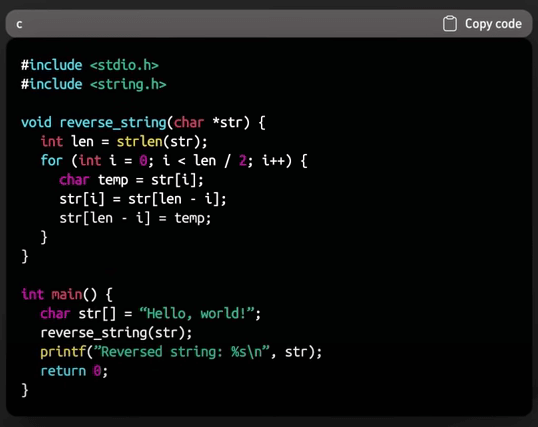{ style="display: block; margin: 0 auto" }

Ta có thể dùng ChatGPT để xác định và sửa lỗi trong code này. Nó cho ta biết rằng có một lỗi nhỏ (cụ thể là vị trí nên là `len-i-1` chứ không phải `len-i`, trong hình dưới thì lỗi trong code vẫn ở đó, rất xin lỗi các bạn) nằm trong hàm `reverse_string` khi hoán đổi các ký tự. Thậm chí nó còn sinh code chính xác cho chúng ta.

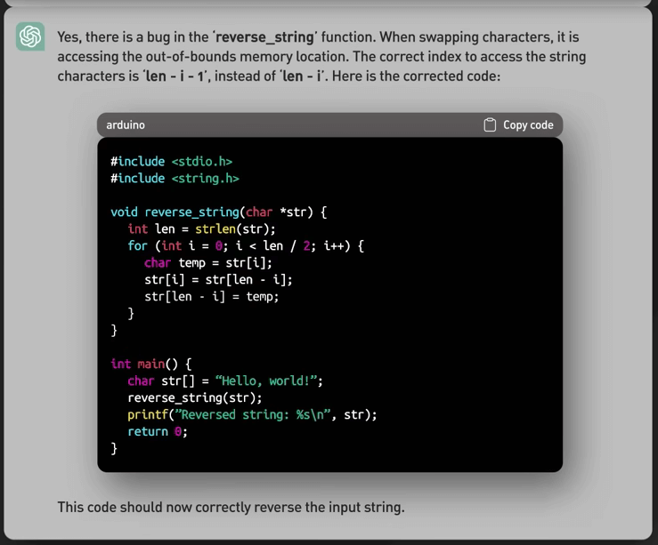{ style="display: block; margin: 0 auto" }

## Chuyển code từ ngôn ngữ này sang ngôn ngữ khác

Ta cũng có thể dùng ChatGPT để chuyển code từ ngôn ngữ này sang ngôn ngữ khác. Điều này thực sự có ích khi ta có code ở ngôn ngữ A, nhưng ta đang làm việc với ngôn ngữ B. ChatGPT biết nhiều ngôn ngữ lập trình, nên nó có thể chuyển đổi code.

Ví dụ, ta có code Python giúp sửa một lỗi bảo mât, nhưng project của chúng ta đang dùng Rust. Ta cần chuyển code Python thành Rust và ChatGPT có thể làm được điều đó. Đây là code mẫu bên Python:

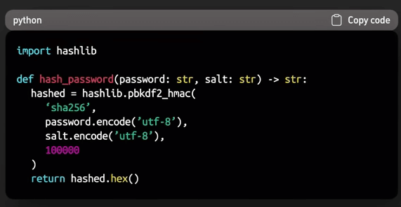{ style="display: block; margin: 0 auto" }

Ta có thể nhờ ChatGPT giúp viết lại code theo ngôn ngữ Rust, có thể như sau:

{ style="display: block; margin: 0 auto" }

Với sự trợ giúp của ChatGPT, ta có thể chuyển code từ ngôn ngữ này sang ngôn ngữ khác một cách dễ dàng, giúp ta tiết kiệm thời gian, tránh lỗi khi thực hiện thủ công và dạy ta thêm về các ngôn ngữ lập trình khác nhau.

## Học ngôn ngữ mới

Ta cũng có thể học ngôn ngữ lập trình mới với sự giúp đỡ của ChatGPT. 

Một ví dụ thực tế là chúng tôi cần phải xong một project với Rust, mà chúng tôi không biết Rust nhiều lắm. Chúng tôi cần đọc một object từ Google Cloud Storage bucket theo đoạn để làm nó hiệu quả hơn. Vì vậy, chúng tôi nhờ ChatGPT cách để làm.

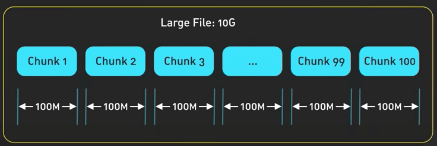{ style="display: block; margin: 0 auto" }

ChatGPT có thể cung cấp cho chúng ta những hướng dẫn, ví dụ và thậm chí cả code để giúp ta thực hiện công việc của mình. Bằng cách đặt câu hỏi cụ thể hoặc lấy ví dụ, ta có thể học cách sử dụng các thư viện, chức năng mới, hoặc các tính năng ngôn ngữ mà chúng ta không quen dùng.

Chẳng hạn, trong trường hợp này, ChatGPT cho chúng tôi ví dụ về cách đọc một đối tượng từ nhóm GCS theo từng đoạn bằng cách sử dụng Rust, gồm cả các đề xuất về thư viện và code mẫu để thực hiện yêu cầu của chúng tôi.

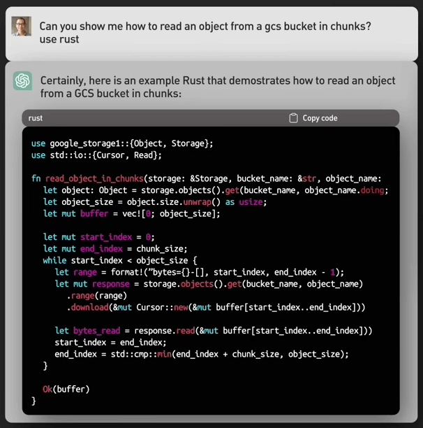{ style="display: block; margin: 0 auto" }

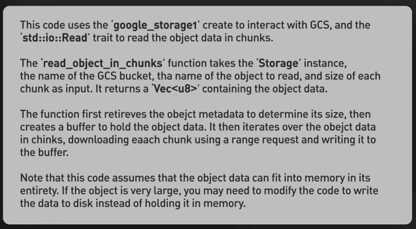{ style="display: block; margin: 0 auto" }

Bằng cách làm theo hướng dẫn do ChatGPT cung cấp, chúng tôi đã nhanh chóng hiểu rõ hơn về Rust và hoàn thành project của mình một cách hiệu quả.

Bằng cách dựa vào ChatGPT khi học một ngôn ngữ lập trình mới, ta có thể tiết kiệm thời gian và rút ngắn thời gian học tập, giúp dễ dàng thích nghi với ngôn ngữ mới và dần dần thành thạo ngôn ngữ đó.

## Viết unit test

ChatGPT cũng có thể viết unit test cho code. Unit test rất quan trọng vì nó giúp đảm bảo code chạy đúng và những thay đổi về sau không phá vỡ chức năng hiện có. Viết tốt unit test là việc không dễ dàng, đôi khi rất là chán, nhưng ChatGPT có thể làm được điều này.

Xét một ví dụ thực tế khi ta có một hàm TypeScript nhận một xâu và tránh các ký tự đặc biệt để dùng trong HTML. Hàm như sau:

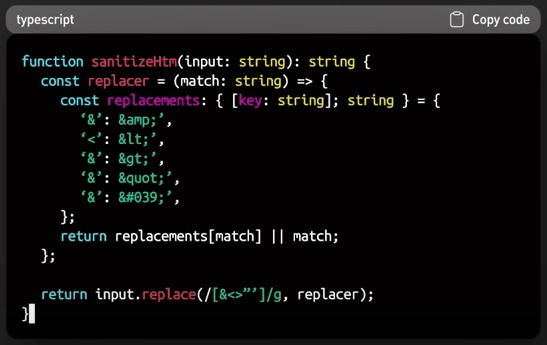{ style="display: block; margin: 0 auto" }

Ta có thể dùng ChatGPT để tạo các test case để xác thực tính chính xác của hàm `sanitizeHtml`.

Nó cho ta một số test case khá tốt, và cũng có thể viết test case nữa:

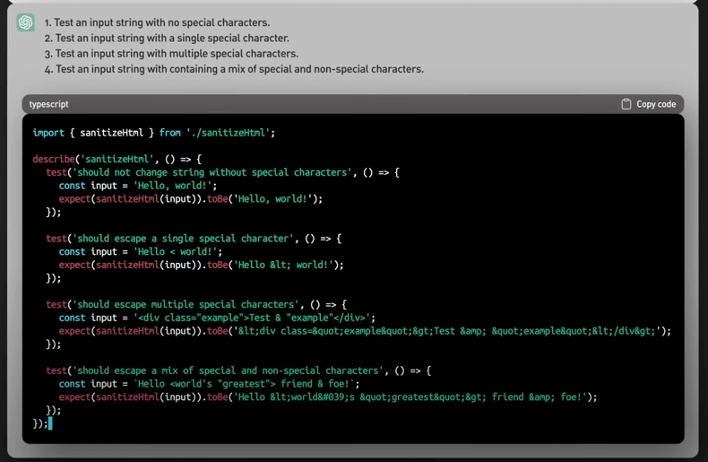{ style="display: block; margin: 0 auto" }

Nhờ ChatGPT, ta có thể tạo các test case cho code, đảm bảo code hoạt động chính xác và duy trì chất lượng phần mềm ở mức cao.

## Thêm tính năng cho code

Bạn có thể dùng ChatGPT để thêm tính năng cho code hiện tại. Với sự hiểu biết về ngôn ngữ lập trình và các khái niệm về công nghệ phần mềm, nó có thể giúp ta nâng cấp code bằng cách đề xuất các thay đổi và các code snippet mới.

Thử lấy một ví dụ thực tế trong đó ta có một hàm TypeScript lọc các phần tử từ một mảng dựa trên một hàm vị từ. Đây là hàm ban đầu:

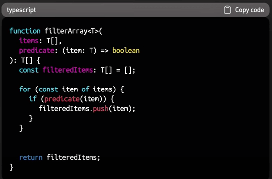{ style="display: block; margin: 0 auto" }

Giả sử ta muốn sửa hàm này để có thêm một tính năng: một tham số tuỳ chọn cho phép ta giới hạn số lượng phần tử trả về sau khi lọc. Ta có thể nhờ ChatGPT giúp trong việc thêm tính năng này. ChatGPT có thể đề xuất thêm tham số này và cập nhật điều kiện vòng lặp để dừng sau khi đạt đến số phần tử cần lọc.

Đây là hàm sau khi sửa:

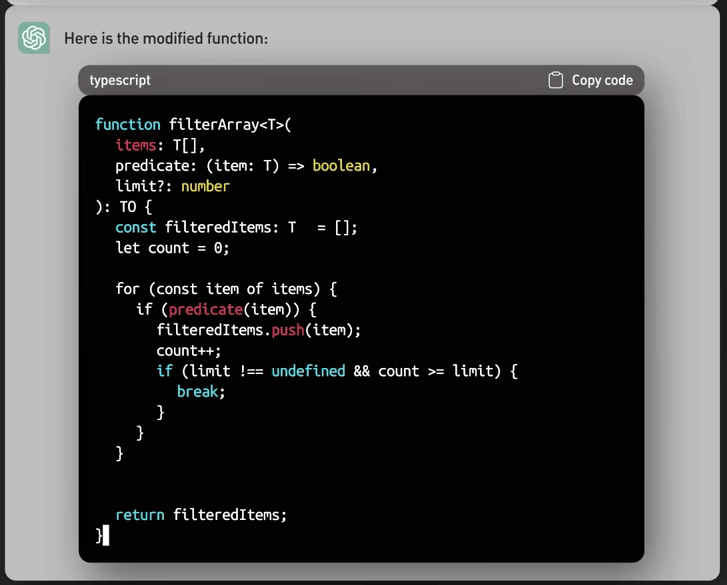{ style="display: block; margin: 0 auto" }

Bằng cách sử dụng ChatGPT để sửa code và thêm tính năng, ta có thể tiết kiệm thời gian, đảm bảo rằng các thay đổi được cài đặt chính xác, và học thêm nhiều kỹ thuật để cải tiến code.

## Viết docs và comment cho code

Cuối cùng, ta có thể dùng ChatGPT để viết docs và comment cho code. Tài liệu và comment được viết tốt là rất quan trọng để duy trì khả năng bảo trì codebase của chúng ta.

ChatGPT có thể giúp viết các comment và tài liệu rõ ràng, ngắn gọn và đầy đủ thông tin, ngay cả với các code phức tạp trong thế giới thực.

Ví dụ như ta có một hàm TypeScript tìm kiếm một pattern nào đó trong một đoạn văn bản và trả về tất cả các nơi nó xuất hiện trong văn bản.

Đây là hàm đó:

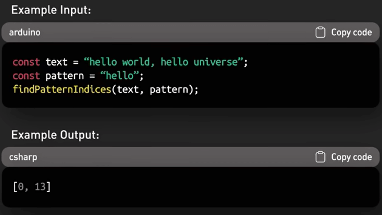{ style="display: block; margin: 0 auto" }

Ta có thể yêu cầu ChatGPT giúp viết docs và comment cho hàm này, giải thích mục đích, thông số và giá trị trả về của nó.

Đây là những gì ChatGPT có thể đề xuất:

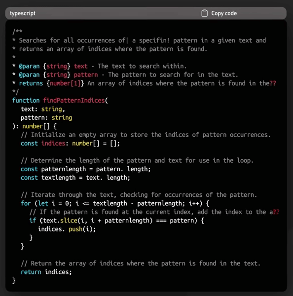{ style="display: block; margin: 0 auto" }

Bằng cách dùng ChatGPT để viết docs và comment, ta có thể đảm bảo rằng code dễ hiểu và dễ bảo trì, giúp các dev khác dễ tiếp cận code hơn.

## Lưu ý

Cần nhớ là ChatGPT cũng có những hạn chế và không nên dựa vào một cách mù quáng. Đôi khi nó có thể đưa ra câu trả lời không tối ưu hoặc sai, nên ta cần suy nghĩ chín chắn và đặt câu hỏi đúng. Ví dụ, nếu ta kiểm tra ví dụ Rust được tạo trước đó để đọc một object từ một GCS bucket theo đoạn, ta sẽ thấy rằng nó không lý tưởng cho các object rất lớn vì nó đọc toàn bộ object vào bộ nhớ.

Là dev, ta phải chịu trách nhiệm về code và giải pháp của chính chúng ta. Sử dụng ChatGPT chỉ nên dừng ở mức trợ giúp, hãy đảm bảo kiểm tra kỹ các đề xuất của nó và duy trì quyền kiểm soát công việc của bản thân.

## Tổng kết

ChatGPT là một công cụ thay đổi cuộc chơi dành cho các dev. Nó giúp ta giải quyết các bài toán phức tạp, hiểu ngôn ngữ mới và cải thiện code của chúng ta một cách hiệu quả.

Bằng cách sử dụng ChatGPT, ta có thể trở thành dev giỏi hơn và làm cho công việc của mình trở nên thú vị hơn.
