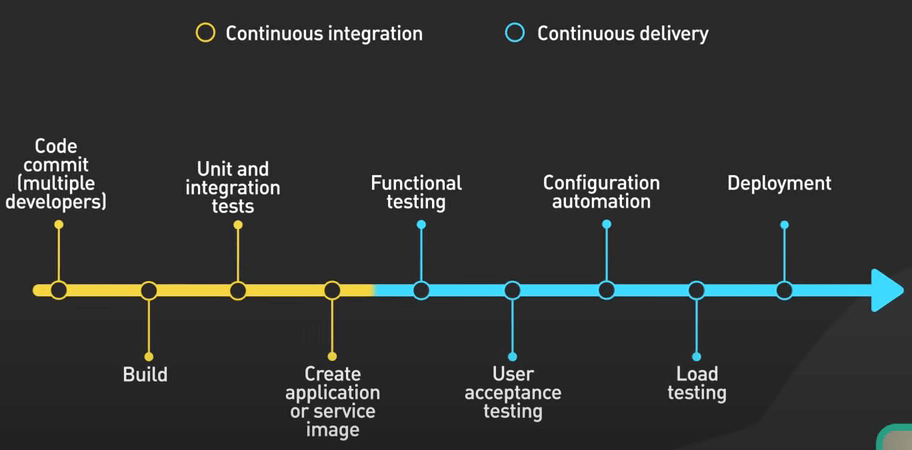
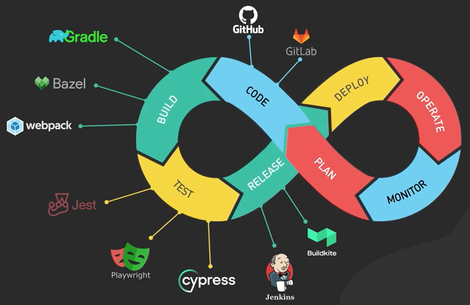
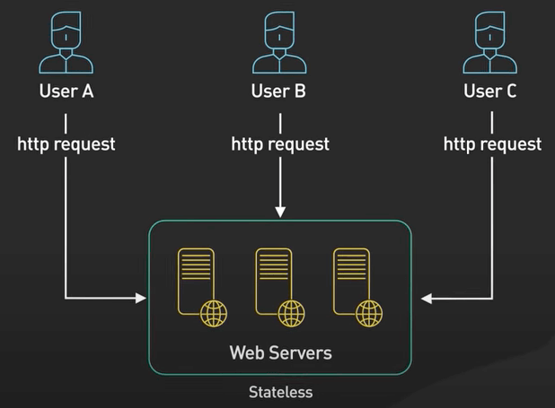
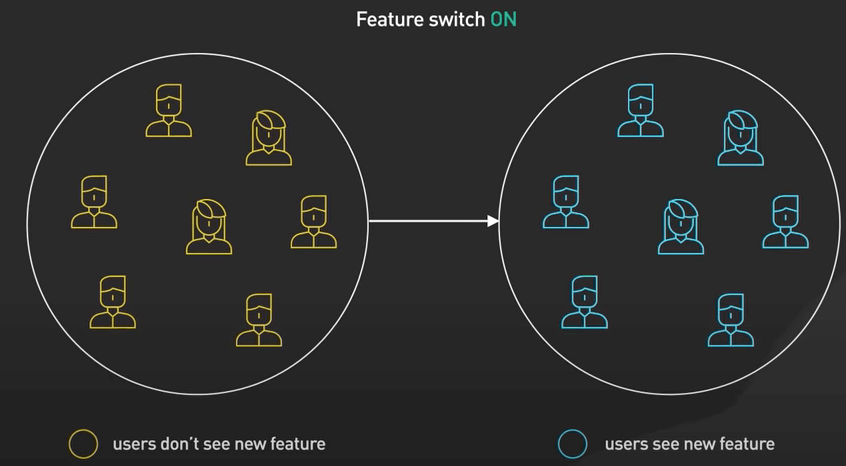
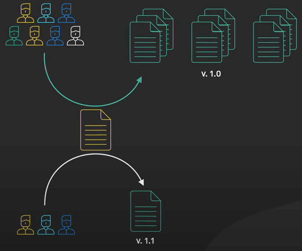
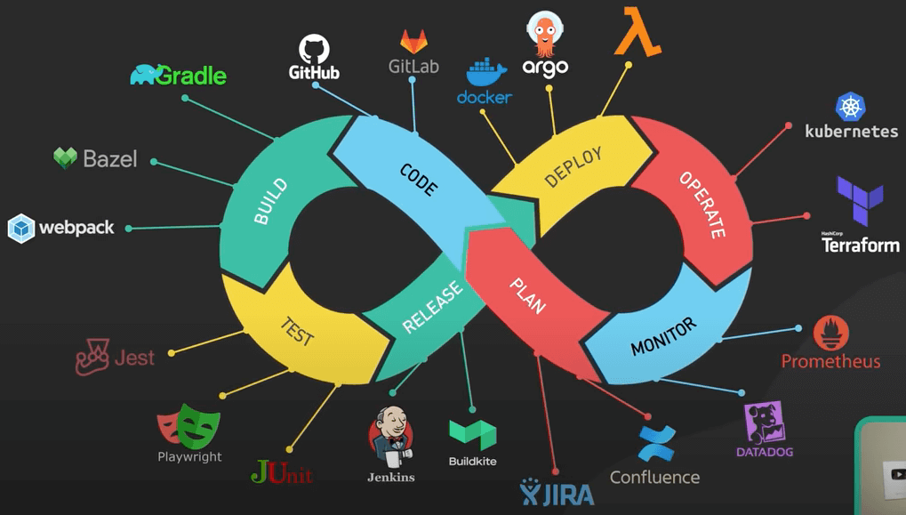

# CI/CD là gì?

## Nguồn

 [CI/CD In 5 Minutes | Is It Worth The Hassle: Crash Course System Design #2](https://www.youtube.com/watch?v=42UP1fxi2SY)

## Tổng quan về CI/CD

**CI/CD (Continuous Integration / Continuous Delivery, lược dịch là Tích hợp Liên tục / Phân phối Liên tục)** tự động hoá quy trình phát triển phần mềm từ code ban đầu cho đến khi deploy (triển khai). Nó loại bỏ phần lớn sự can thiệp thủ công của con người để đưa code mới lên môi trường live.

{ style="display: block; margin: 0 auto" }

CI/CD đảm nhiệm việc build, test và deploy code mới vào môi trường live. Về mặt lý thuyết thì nó cho phép các nhóm dev deploy phần mềm nhanh hơn. Nghe có vẻ hay nhưng có thực sự là như vậy không?

Câu trả lời là **còn tuỳ**. Cùng xem xét từng phần của CI/CD nhé.

## CI

CI ít gây tranh cãi hơn và nó cũng phổ biến hơn CD. Sơ sơ thì nó là cách sử dụng tự dộng hoá để cho phép các team hợp nhất thay đổi về code vào repository (kho lưu trữ) sớm hơn và thường xuyên hơn. Mỗi commit sẽ kích hoạt một quy trình làm việc tự động trên một máy chủ CI, máy chủ này sau đó chạy một loạt các tác vụ để đảm bảo rằng commit đủ an toàn để merge vào main branch.

{ style="display: block; margin: 0 auto" }

Một quy trình CI tốt dựa trên một tập các test ngon lành. Sẽ không dễ để duy trì một tập các test như vậy với phạm vi bao phủ (coverage) đầy đủ. Phạm vi test cao thường mất nhiều thời gian hơn để chạy. Điều này ảnh hưởng đến năng suất phát triển phần mềm. Khá khó để cân bằng việc này nhưng cũng đáng để làm cho tốt.

Các công cụ phổ biến trong CI bao gồm những gì? Một hệ thống quản lý mã nguồn tốt sẽ là nền tảng phát triển. GitHub là một ví dụ rất nổi tiếng. Nó chứ mọi thứ cần để xây dựng phần mềm. Nó bao gồm mã nguồn, tập lệnh test, và các tập lệnh để build các ứng dụng phần mềm.

{ style="display: block; margin: 0 auto" }

Có nhiều công cụ để quản lý quy trình CI. GitHub Actions và Buildkite là một số ví dụ. Jenkins, CircleCI và TravisCI cũng ngon. Các công cụ này quản lý build và các tác vụ test trong CI. 

Có nhiều công cụ test để viết và chạy test. Các công cụ này thường thiên về một ngôn ngữ và hệ sinh thái cụ thể nào đó. Ví dụ, với JS, Jest là một ví dụ về framework unit test, trong khi đó, playwright và cypress là các framework integration test cho ứng dụng web. 

Các công cụ build còn đa dạng hơn và thiên về một hệ sinh thái cụ thể. Gradle là một công cụ build mạnh mẽ cho Java. Hệ sinh thái build cho JavaScript bị phân mảnh và khó theo dõi. Webpack là tiêu chuẩn, nhưng nhiều công cụ build mới lại cho là mình nhanh hơn, nhưng chưa thể có tính mở rộng cao như Webpack.

{ style="display: block; margin: 0 auto" }

## CD

Thực ra, đạt được CD thực sự rất là khó. Có tồn tại chuyện đó, nhưng thực tế không phổ biến như CI.

{ style="display: block; margin: 0 auto" }

Nhiều team chỉ thực hành CD trong những loại hệ thống cơ bản nhất. Các hệ thông này thường stateless, như API server hoặc web server. Với việc giám sát tốt trên live, các hệ thống này có thể được triển khai liên tục với rủi ro tối thiểu. Chúng stateless, và rollback cũng nhanh và ít ảnh hưởng.

{ style="display: block; margin: 0 auto" }

Việc đặt cờ để bật tắt tính năng mới cũng phổ biến, nó giúp tách bạch việc phát triển và kích hoạt tính năng. Điều này cho phép ta có thể nhanh chóng tắt tính năng mới nếu có vấn đề mà không cần phải rollback. 

{ style="display: block; margin: 0 auto" }

Triển khai Canary cũng là một việc phổ biến cho những sản phẩm với hàng trăm triệu người dùng. Nó triển khai code mới cho một nhóm nhỏ người dùng thành thạo và các nhân viên - những người đánh giá cao các tính năng mới và sẵn sàng chấp nhận rủi ro để giúp phát hiện các sự cố trước khi code mới được đưa vào sử dụng rộng rãi. Điều này cho phép team có thể test code mới trong thế giới thực, đồng thời hạn chế thiệt hại khi có vấn đề phát sinh. Những kỹ thuật này hoạt động tốt cho các hệ thống stateless đơn giản.

{ style="display: block; margin: 0 auto" }

Mặt khác, rất ít team có tài nguyên hoặc niềm tin để dùng CD trong các hệ thống stateful phức tạp như cụm database backend hoặc cụm websocket. Thay vào đó, các hệ thống này thường có quy trình triển khai ổn định, thủ công, rủi ro và tốn thời gian. Cần một team chuyên biệt để lo việc này. Rất hiếm khi thấy các hệ thống triển khai liên tục và tự động.

{ style="display: block; margin: 0 auto" }

Có nhiều công cụ dùng cho CD. Các công cụ ở trên như GitHub Actions, Buildkite và Jenkins được sử dụng nhiều cho các tác vụ CD. Ngoài ra còn có các công cụ dành riêng cho cơ sở hạ tầng để giúp CD dễ bảo trì hơn. Ví dụ, trên Kubenetes, ArgoCD rất hay được dùng.

{ style="display: block; margin: 0 auto" }

Tóm lại, CI/CD là một phương pháp phát triển phần mềm mạnh mẽ có thể giúp các team phát triển phần mềm nhanh và có chất lượng tốt hơn. Tuy nhiên, đây không phải là giải pháp cho mọi vấn đề và việc triển khai giải pháp này có thể khác nhau tuỳ vào mức độ phức tạp của hệ thống.
