# Consistent Hashing là gì?

## Nguồn

 [Consistent Hashing | Algorithms You Should Know #1](https://www.youtube.com/watch?v=UF9Iqmg94tk)

## Giới thiệu

Trong một hệ thống phân tán quy mô lớn, dữ liệu thường không nằm hoàn toàn trong một server riêng lẻ. Thay vào đó, chúng được phân tán trên nhiều server. Điều này được gọi là **horizontal scaling** hay mở rộng quy mô theo chiều ngang. Để xây dựng một hệ thống như vậy với hiệu suất được kiểm soát tốt, việc phân phối dữ liệu đều trên các server là rất quan trọng.

## Simple hashing

Một cách phổ biến để phân phối dữ liệu đều trên các server là **simple hashing** hay hash đơn giản. Nguyên lý của nó như sau.

Đầu tiên, với mỗi object, ta hash khóa của nó với một hàm hash như **MD5** hoặc **MurmurHash**. Ta sẽ ánh xạ khoá của object thành một phạm vi các giá trị số đã biết. Một hàm hash tốt sẽ phân phối các hash đều trên toàn bộ phạm vi.

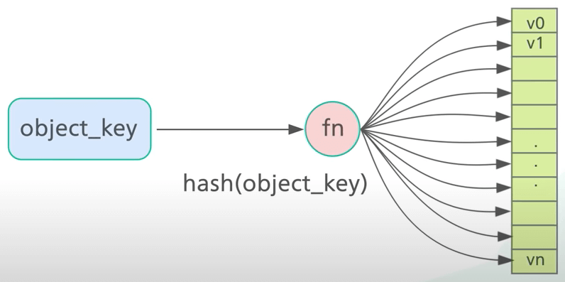{ style="display: block; margin: 0 auto" }

Thứ hai, ta thực hiện phép chia lấy dư trên hash với số lượng server. Điều này giúp xác định object thuộc về server nào. Miễn là số lượng server không thay đổi, một khóa object sẽ luôn ánh xạ vào cùng một server. 

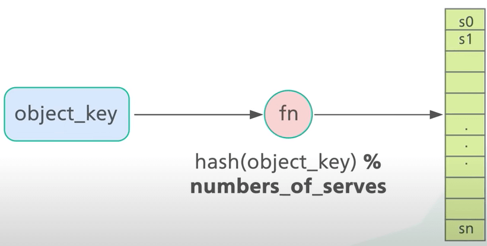{ style="display: block; margin: 0 auto" }

Ví dụ, ta có 4 server và 8 khóa (là các xâu). Với simple hashing, đây là cách ta phân phối tám khóa chuỗi trên bốn server.

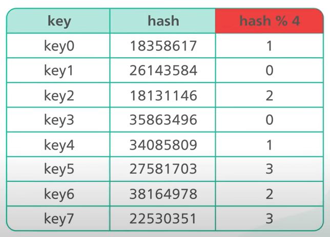{ style="display: block; margin: 0 auto" }

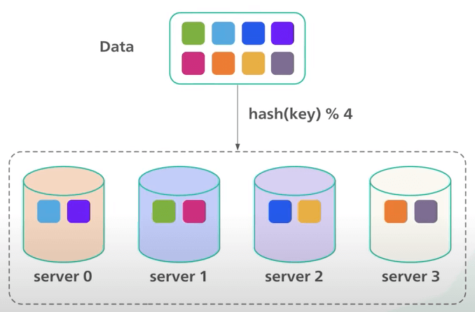{ style="display: block; margin: 0 auto" }

Phương pháp này hoạt động tốt khi số server là cố định và phân phối dữ liệu đều. Nhưng nếu có server mới được thêm vào để đáp ứng nhu cầu mới hoặc một số server hiện tại bị xóa đi thì sao?

Quay trở lại ví dụ của chúng ta. Nếu server s1 bị ngừng hoạt động, số lượng server giảm xuống còn 3. Mặc dù hash của các khóa object vẫn giữ nguyên, ta lại thực hiện phép chia lấy dư trên một tập N khác. Trong trường hợp này, N là 3. Tác động là khá nghiêm trọng do hầu hết các khóa bị phân phối lại. Điều này ảnh hưởng đến hầu hết các object chứ không chỉ ảnh hưởng mỗi các object được lưu trữ trên server ngừng hoạt động. Nó còn gây ra nhiều cache miss và nhiều object phải được phân phối lại. Với các tình huống mà server liên tục được thêm vào và bị xóa đi, thiết kế này đơn giản là không ổn.

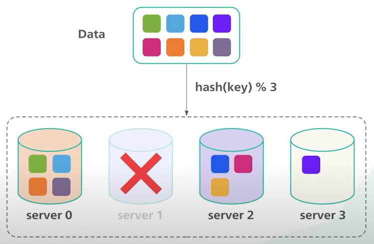{ style="display: block; margin: 0 auto" }

## Consistent hashing

**Consistent hashing** là một kỹ thuật hiệu quả để giải quyết vấn đề này. Mục tiêu của consistent hashing như sau.

Ta muốn hầu hết các object không thay dổi server ngay cả khi số lượng server thay đổi. Để làm được điều này, ta cần một hàm hash phân phối các object đều trên các server. Đây là ý tưởng cốt lõi của consistent hashing. **Ngoài việc hash khóa object như trước, ta còn hash tên server**. Cả object và server đều được hash với cùng một hàm hash vào cùng một phạm vi giá trị.

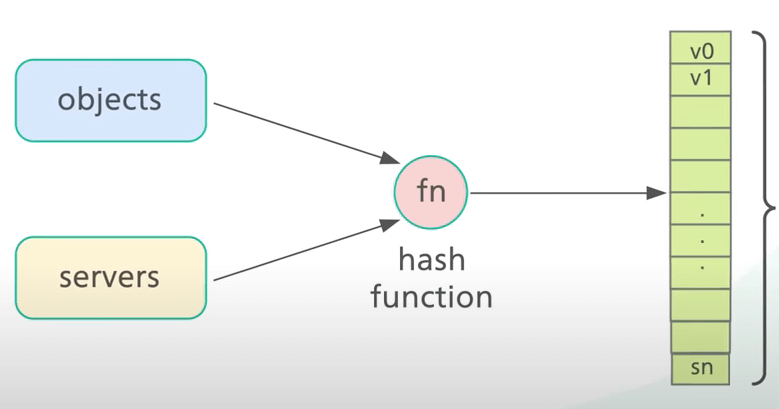{ style="display: block; margin: 0 auto" }

Trong ví dụ của chúng ta, ta có một phạm vi từ x_0 đến x_n. Phạm vi này được gọi là **hash space**. 

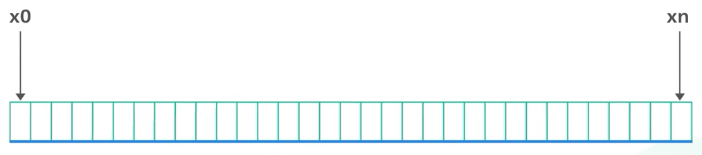{ style="display: block; margin: 0 auto" }

Tiếp theo, ta nối hai đầu của hash space lại với nhau để tạo thành một vòng tròn. Đây là một **hash ring**. 

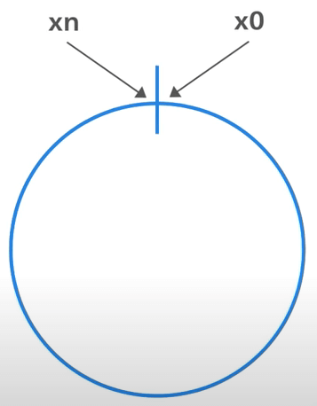{ style="display: block; margin: 0 auto" }

Sử dụng một hàm hash, ta hash mỗi server bằng tên hoặc địa chỉ IP của nó, và đặt server lên vòng tròn. Ta đặt bốn server của chúng ta lên vòng tròn. Tiếp theo, ta hash mỗi object bằng khóa của nó với cùng một hàm hash. Khác với simple hashing, ở đây ta không thực hiện phép chia lấy dư trên hash, mà ta sử dụng hash trực tiếp để ánh xạ khóa object vào vòng tròn. Trông nó sẽ như thế này.

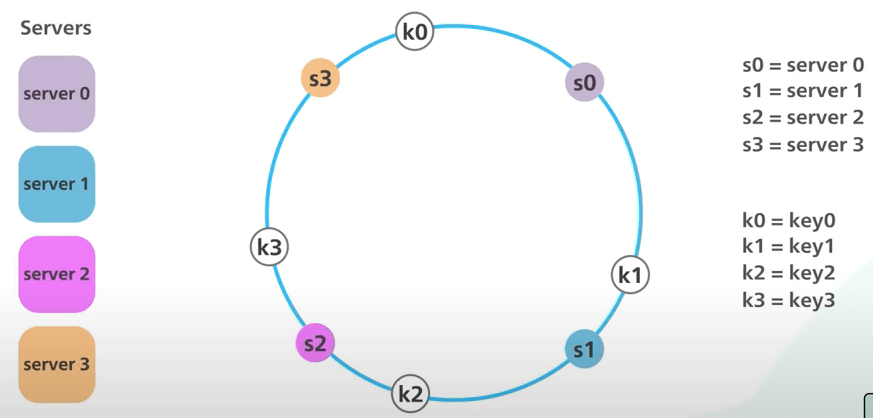{ style="display: block; margin: 0 auto" }

Để xác định server cho một object, ta đi theo chiều kim đồng hồ từ vị trí của khóa object trên vòng tròn cho đến khi gặp một server. Tiếp tục với ví dụ nêu trên, khoá k0 sẽ nằm trong server s0, và khoá k1 sẽ nằm trong server s1.

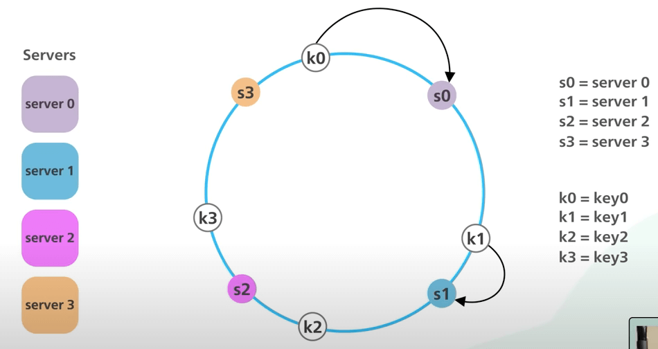{ style="display: block; margin: 0 auto" }

Bây giờ, ta sẽ xem xét xem điều gì sẽ xảy ra khi ta thêm một server vào hệ thống. Ta thêm một server mới s4 vào bên trái của s0 trên vòng tròn. Lưu ý rằng chỉ có khoá k0 cần được di chuyển từ s0 sang s4, vì s4 là server đầu tiên mà khoá k0 gặp khi đi theo chiều kim đồng hồ từ vị trí của nó trên vòng tròn. Các khoá k1, k2 và k3 không bị ảnh hưởng. Với simple hashing, khi thêm một server mới, hầu hết các khoá phải được phân phối lại. Với consistent hashing, khi thêm một server mới, chỉ một phần nhỏ các khoá cần được phân phối lại. Ta có thể thấy rằng consistent hashing giúp giảm thiểu số lượng khoá cần phân phối lại khi thêm một server mới.

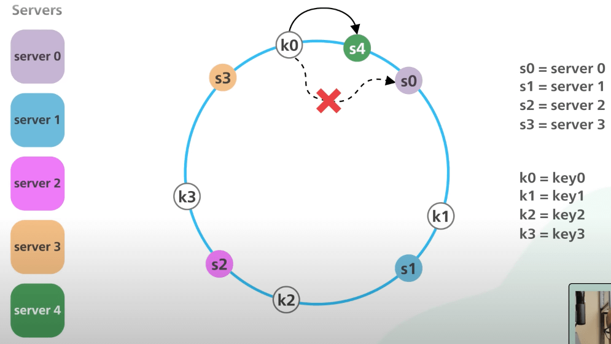{ style="display: block; margin: 0 auto" }

Rồi còn khi tắt một server thì sao. Khi s1 bị tắt, chỉ có k1 cần được chuyển sang s2. Các khoá khác không bị ảnh hưởng.

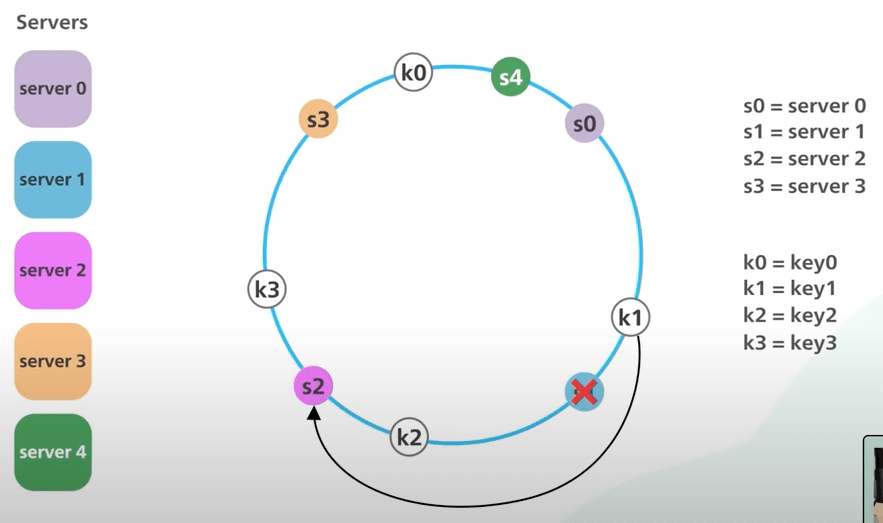{ style="display: block; margin: 0 auto" }

Tóm tắt lại nhé.

1. Ta ánh xạ cả server và object vào cùng một phạm vi giá trị.
2. Để xác định một server cho object, ta đi theo chiều kim đồng hồ từ vị trí của object trên vòng tròn cho đến khi gặp một server.

Giờ ta hãy xem thử cái thiết kế này có những vấn đề gì. Việc phân phối các object vào các server trên vòng tròn khả năng là sẽ không đều. Về mặt khái niện, khi ta chọn N điểm ngẫu nhiêu trên vòng tròn, sẽ rất khó để chia vòng tròn ra thành các phần bằng nhau. Ví dụ, nếu các server được ánh xạ vào vòng tròn như thế này, phần lớn các object sẽ được lưu trên s2, trong khi s1 và s3 bị ế. 

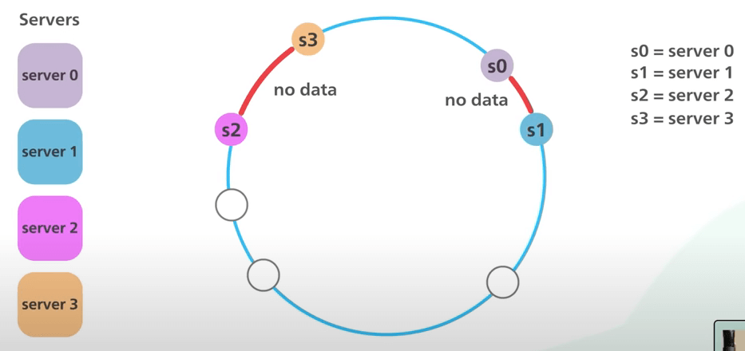{ style="display: block; margin: 0 auto" }

Vấn đề này càng trở nên nghiêm trọng hơn nếu các server được thêm vào và bị xóa đi thường xuyên. Trong ví dụ của chúng ta, ngay cả khi các server được chia đều nhau, nếu s1 bị xóa đi, đoạn cho s2 sẽ gấp đôi các đoạn cho s0 và s3.

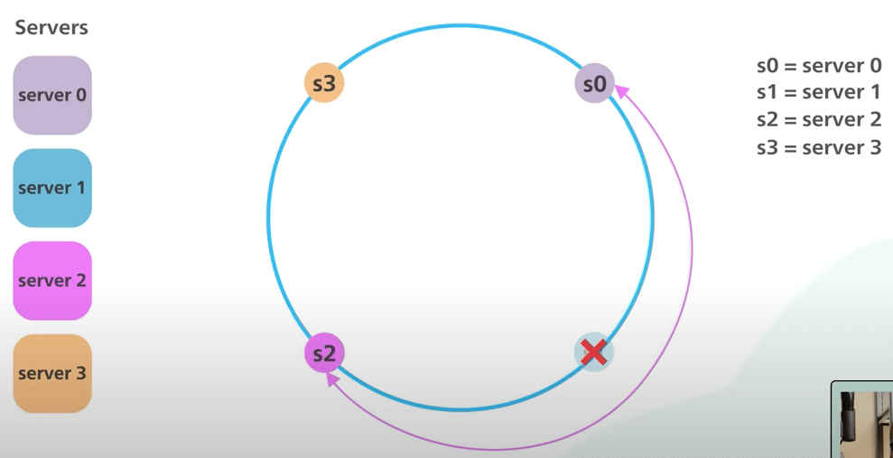{ style="display: block; margin: 0 auto" }

**Virtual node** được dùng để giải quyết vấn đề này. Ý tưởng là mỗi server sẽ được quản lý nhiều đỉnh trên vòng tròn. Mỗi đỉnh là một virtual node đại diện cho một server. Trên vòng tròn này, ta có 2 server, mỗi cái có 3 virtual node. Thay vì có s0 và s1, giờ ta có s0_0, s0_1 và s0_2 để đại diện cho server s0, và s1_0, s1_1 và s1_2 để đại diện cho server s1. Với virtual node, mỗi server quản lý nhiều đoạn trên vòng tròn. Trong ví dụ của chúng ta, các đoạn được gán nhãn s0 được quản lý bởi server s0, và các đoạn được gán nhãn s1 được quản lý bởi server s1. 

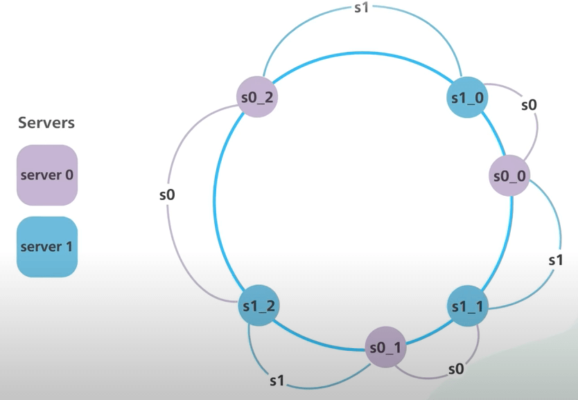{ style="display: block; margin: 0 auto" }

Trong thực tế, số lượng virtual node lớn hơn nhiều so với 3. Khi số lượng virtual node tăng lên, việc phân phối các object trở nên cân bằng hơn. Có nhiều virtual node hơn có nghĩa là ta cần nhiều không gian hơn để lưu trữ các metadata của virtual node. Đây là một sự đánh đổi, và ta có thể điều chỉnh số lượng các virtual node để đáp ứng nhu cầu riêng của mỗi trường hợp.

Hãy xem thử consistent hashing được sử dụng trong thế giới thực như thế nào. 

- Một số database NoSQL phổ biến như Amazon DynamoDB và Apache Cassandra sử dụng consistent hashing, trong đó nó được dùng để phân phối dữ liệu. Nó giúp các cơ sở dữ liệu này giảm thiểu việc di chuyển dữ liệu khi cân bằng lại. 
- Các CDN như Akamai sử dụng consistent hashing để phân phối nội dung web đều đặn giữa các edge server. 
- Các Load balancer như Google Load Balancer dùng consistent hashing để phân phối các kết nối liên tục đều đặn giữa các backend server. Điều này giới hạn số lượng kết nối cần được thiết lập lại khi một backend server bị ngừng hoạt động.
