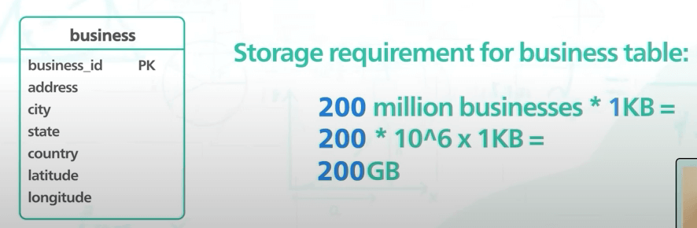
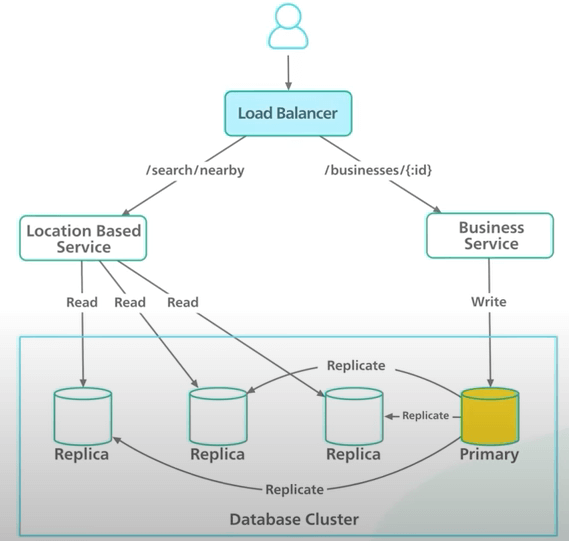
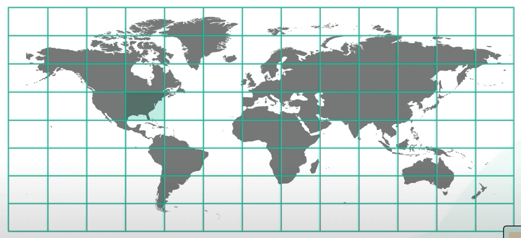
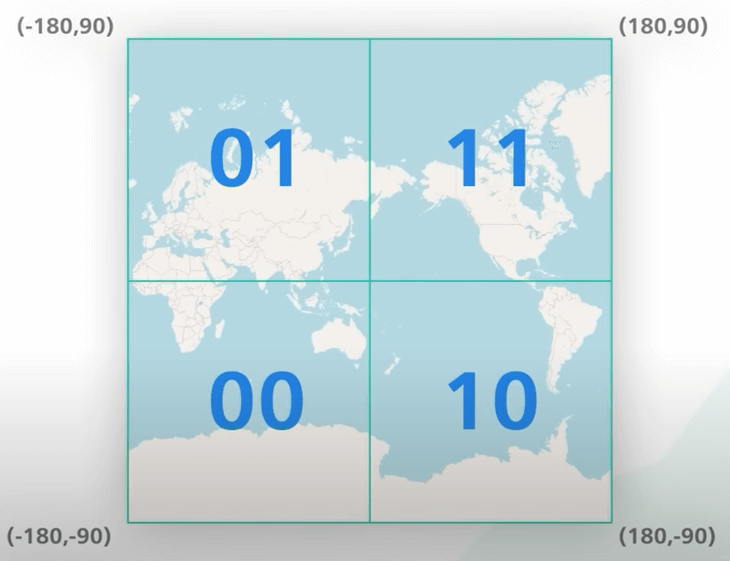
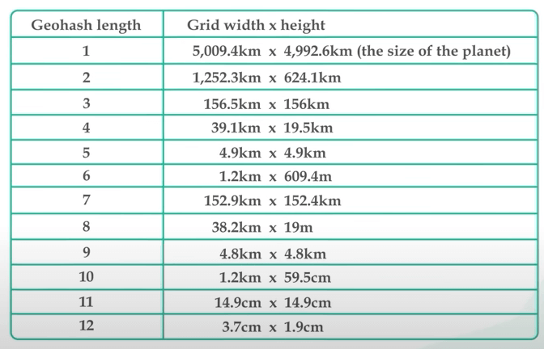
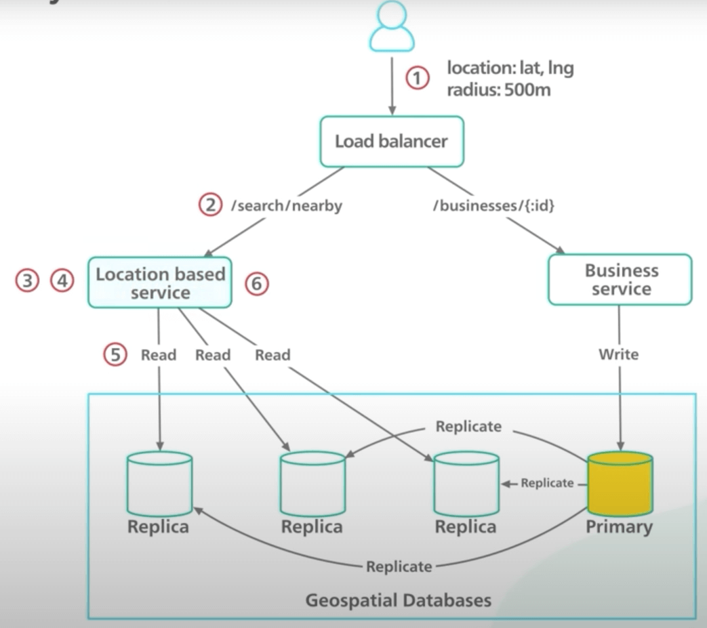

# Thiết kế hệ thống: Thiết kế Location Based Service

## Nguồn

 [FAANG System Design Interview: Design A Location Based Service (Yelp, Google Places)](https://www.youtube.com/watch?v=M4lR_Va97cQ)

## Định nghĩa và yêu cầu

Dịch vụ lân cận (proximity service) là gì? Đây là một service thường được thấy trong các thành phần backend của một ứng dụng như Yelp để tìm nhà hàng xịn nhất ở gần vị trí của bạn, hoặc trong ứng dụng bản đồ để tìm trạm xăng gần nhất.

### Functional requirements

Đầu tiên ta hãy đi vào việc hiểu bài toán và thiết lập phạm vi thiết kế ứng dụng. Các ứng dụng khác nhau sẽ có các yêu cầu khác nhau với proximity service. Ta sẽ chỉ xem xét các functional requirement (yêu cầu chức năng) cơ bản nhất.

1. Cho vị trí của người dùng và bán kính, trả về tất cả các doanh nghiệp hoạt động trong vòng bán kính đó.
2. Người quản lý doanh nghiệp có thể thêm, xoá hoặc sửa thông tin doanh nghiệp của mình. Những thay đổi này không nhất thiết phải xuất hiện trong thời gian thực, có thể ngày hôm sau xuất hiện cũng được.
3. Người dùng ứng dụng có thể xem thông tin chi tiết về một doanh nghiệp nào đó.

### Non-functional requirements

Tiếp đến là các non-functional requirement (yêu cầu phi chức năng). Các non-functional requirement đặt ra các ràng buộc khác nhau đối với thiết kế. Những yêu cầu này làm cho việc thiết kế trở nên thú vị và có tính thử thách cao. Giả sử ứng dụng đánh giá này có 100 triệu người dùng hằng ngày (DAU - Daily Active Users) và 200 triệu doanh nghiệp. Ta sẽ có những non-functional requirement sau:

1. Độ trễ phải thấp (low latency). Người dùng có thể tìm thấy các doanh nghiệp lân cận một cách nhanh chóng.
2. Service phải có tính sẵn sàng cao (high availability). Nó có thể xử lý lưu lượng truy cập tăng đột biến trong giờ cao điểm.

## Tính toán

Giờ ta sẽ thực hiện một số tính toán tổng quan dựa trên các requirement ở trên. Nó sẽ cho ta những ý tưởng sơ bộ về những thách thức mà ta có thể gặp và những sự đánh đổi ta có thể làm. Trong này ta có thể đưa ra một số giả định hợp lý để dễ tính toán hơn.

Giả sử, với một người dùng hàng ngày, trung bình người đó có thể thực hiện 5 truy vấn tìm kiếm. Với 100 triệu người dùng hàng ngày và 5 truy vấn cho một người / ngày, sẽ có tầm 5000 truy vấn một giây. Ta cũng cần biết dung lượng lưu trữ cần để lưu 200 triệu doanh nghiệp. Ta sẽ dừng ở đây một tí để xem ta sẽ lưu data như thế nào đã.

## Thiết kế

### API design

Giờ ta hãy xem thiết kế API như thế nào nhé. Ở đây ta sẽ dùng quy ước RESTful API cho đơn giản. Dựa vào functional requirement ở trên, ta sẽ có hai loại API. Loại 1 sẽ là để tìm doanh nghiệp lân cận. Đây là một GET request nhận vào kinh độ và vĩ độ của vị trí người dùng, và một tuỳ chọn bán kính. API này trả về các doanh nghiệp trong một mảng đối tượng doanh nghiệp, cùng tổng số doanh nghiệp trả về. Có hai điểm cần lưu ý:

- Ta sẽ đơn giản hoá API ở đây bằng cách bỏ qua phân trang. Tuy nhiên, trong thực tế, ta nên đưa phân trang vào API
- Các đối tượng doanh nghiệp trong API response chỉ chứa vừa đủ thông tin để cho ra kết quả tìm kiếm. Nó không chứa thông tin để tạo ra được trang chi tiết của doanh nghiệp. Để render trang chi tiết, ta cần một API khác.

{ style="display: block; margin: 0 auto" }

Loại API thứ hai quản lý các đối tượng doanh nghiệp. Nó bao gồm các CRUD endpoint để thêm, đọc, sửa và xoá một doanh nghiệp. Ta không đi vào chi tiết phần này vì nó khá đơn giản.

{ style="display: block; margin: 0 auto" }

### Data schema

Có hai bảng chính ở đây. Đầu tiên là bảng doanh nghiệp, chứa thông tin doanh nghiệp. Khoá chính là business ID. Bảng này hỗ trợ các thao tác CRUD cho API ta vừa nói ở trên.

Bảng thứ hai thú vị hơn. Nó được dùng bởi API tìm kiếm doanh nghiệp để trả về doanh nghiệp nhanh chóng. Bảng này tối thiểu phải có business ID và vị trí doanh nghiệp. Các vị trí này phải được index theo một cách nào đó để giúp trả về kết quả nhanh chóng. Việc chọn bảng và cơ sở dữ liệu đòi hỏi một số kiến thức về tìm kiếm không gian địa lý (geospatial search).

{ style="display: block; margin: 0 auto" }

Ta có schema rồi, giờ ta có thể tính toán không gian lưu trữ. Có 200 triệu doanh nghiệp. Với bảng doanh nghiệp này, ta ước tính rằng thông tin một doanh nghiệp sẽ chiếm không quá 10 kilobyte, thực ra trung bình sẽ là tầm 1 kilobyte. Vì vậy nên bảng này sẽ chiếm tầm dưới 1 terabyte gì đấy.

{ style="display: block; margin: 0 auto" }

Còn bảng tìm kiếm vị trí thì sao? Bảng này sẽ lưu business ID, kinh độ vĩ độ của mỗi doanh nghiệp. Mỗi thứ sẽ tầm 8 byte, nghĩa là khoảng 200 triệu lần 24 byte, là khoảng 5 gigabyte. Điều này cho thấy tập dữ liệu tìm kiếm vị trí này rất nhỏ. Khi tập dữ liệu nhỏ như vậy, ta có rất nhiều lựa chọn thiết kế, kể cả những lựa chọn nằm hoàn toàn trong bộ nhớ.

### High-level design

Giờ ta đã biết đủ nhiều để có một sơ đồ thiết kế tổng quát. Trong hệ thống này, ta có 2 phần. Mỗi cái thì ánh xạ tới một danh mục API đã nói ở trên. Ta gọi phần đầu tiên là "service dựa trên vị trí" (Location-Based Service - LBS), và phần hai là "service doanh nghiệp" (business service). Ta sẽ xem xét từng thành phần trong thiết kế tổng quát này.

{ style="display: block; margin: 0 auto" }

Đầu tiên là load balancer. Trong thiết kế, load balancer sẽ phân phối lưu lượng truy cập đến hai service trên, dựa vào các tuyến API. Các service này đều là stateless (không trạng thái). Việc triển khai các service phi trạng thái sau load balancer khá là phổ biến và ta sẽ không đi sâu hơn ở đây. Lưu ý rằng trong thực tế, ta có thể có những thiết lập khác để phân phối truy cập đến các service (như API Gateway trên AWS hay envoy trên cụm Kubenetes).

Sau load balancer, ta có hai service nói trên. LBS là phần cốt lõi của hệ thống. Nó tìm các doanh nghiệp lân cận dựa vào bán kính và vị trí một cách nhanh chóng. LBS có vài điểm thú vị. 

1. Ta sẽ đọc dữ liệu nhiều hơn ghi dữ liệu rất nhiều. 
2. QPS cao, khoảng 5000 QPS. 
3. Service này là stateless. Nó có thể dễ dàng được mở rộng theo chiều ngang.

Tiếp theo là service doanh nghiệp. Service này xử lý các request CRUD để quản lý các đối tượng doanh nghiệp. QPS cho việc tạo, sửa và xoá ở đây không cao. Và dựa vào functional requirement, các thay đổi không cần phải ngay lập tức. Điều này cho ta nhiều sự linh hoạt trong thiết kế. Tuy nhiên, với thao tác đọc, QPS có thể cao trong giờ cao điểm. Vì dữ liệu này không thay đổi thường xuyên nên nó là một ứng viên tiềm năng để cache nếu cần.

Tiếp theo là cụm database. Ta chưa nói về loại database nào ta sẽ dùng, nhưng sẽ đi sâu vào sau. Tuy nhiên, dựa trên các pattern truy cập và lưu lượng đọc / ghi, ta đã biết đủ nhiều để quyết định dùng database nào. 

Cơ bản thì ta đã biết rằng: 

- Service nặng về đọc dữ liệu. 
- QPS đọc sẽ lớn hơn nhiều so với QPS ghi. 
- Việc ghi dữ liệu không cần phải ngay lập tức. 

Tập dữ liệu tìm kiếm không lớn lắm. Tập dữ liệu doanh nghiệp to hơn một chút và ta có thể cần phải tối ưu nó. Dựa vào các yếu tố này, việc sử dụng cụm database với primary-secondary setup có thể là một nước đi hay.

Với setup này, database chính sẽ xử lý tất cả các yêu cầu ghi, và các bản sao sẽ chỉ cho các yêu cầu đọc. Dữ liệu được lưu vào database chính trước và sau đó được sao chép qua các bản sao. Sẽ có một số dữ liệu bị trễ khi đọc do có độ trễ khi sao chép, nhưng cũng không quan trọng lắm vì ta biết rằng thay đổi không cần xuất hiện ngay lập tức.

## Thiết kế chuyên sâu

### Database không gian địa lý

Đến đây ta đã có nhiều ý hay về việc hệ thống ban đầu sẽ trông như thế nào. Giờ hãy đi sâu vào một số chi tiết thú vị. Ta hãy cùng xem database nào có thể được dùng để tìm vị trí nhanh. Có một lớp database được gọi là geospatial database (cơ sở dữ liệu về không gian địa lý), nó được tối ưu để lưu và truy vấn data trong không gian hình học như dữ liệu vị trí. Một số ví dụ là Redis GEOHASH và PostgreSQL với PostGIS extension.

Để hiểu sơ bộ về cách thức hoạt động của các database này, ta sẽ nói về các thuật toán để index không gian địa lý của chúng. Kiến thức này có thể giúp ta chọn đúng thứ ta cần để triển khai.

#### Ý tưởng trâu bò

Cách đơn giản nhất nhưng cũng kém hiệu quả nhất là vẽ một hình tròn và tìm tất cả doanh nghiệp trong hình tròn đó. Mã SQL giả này cho thấy cách ta có thể cài trong điều kiện WHERE. 

{ style="display: block; margin: 0 auto" }

Điều kiện trong WHERE hơi phúc tạp, nhưng về cơ bản, nó tìm tất cả các doạnh nghiệp trong giới hạn của điều kiện đó. Rõ ràng là nó trông không hiệu quả lắm. Truy vấn này cần phải quét bảng. Với 200 triệu doanh nghiệp, quét bảng thực sự rất chậm. 

Vậy ta cải tiến nó như nào? Ý tưởng sẽ là tạo index cho cột kinh độ và vĩ độ. Nhưng chừng đó cũng không cải thiện nhiều độ hiệu quả. Ở đây ta có dữ liệu hai chiều. Tập dữ liệu được trả về cho mỗi chiều là rất lớn. Ta có thể lấy được tất cả doanh nghiệp trong khoảng vĩ độ hoặc khoảng kinh độ. Nhưng để lấy được data trong bán kính, ta cần giao hai khoảng đó lại. Mỗi khoảng không gian lại có rất nhiều data nên điều này thực sự không hiệu quả. Nói cách khác, vấn đề cốt lõi với cách tiếp cận này là index chỉ có thể cải thiện tốc độ truy vấn trên một chiều thôi. 

{ style="display: block; margin: 0 auto" }

Như vậy, câu hỏi tiếp theo sẽ là: Ta có thể làm sao để biến không gian hai chiều thành một chiều, từ đó xây dựng index trên một chiều đó được không? Câu trả lời là **CÓ**.

Có hai cách tiếp cận khi dùng index không gian địa lý. Cách đầu tiên là dựa vào hash. Một số ví dụ ở đây là Even Grid và Geohash. Cách thứ hai là dựa trên cây, bao gồm Quadtree, Google S2 và RTree. Mặc dù cách triển khai cơ bản của hai cách tiếp cận này là khác nhau, nhưng ý tưởng sơ bộ là như nhau. Nó sẽ chia bản đồ thành các khu vực nhỏ hơn và tạo index để tìm nhanh.

#### Index dựa trên hash

Ta đi vào cách tiếp cận dựa trên hash trước. Ta sẽ chia thế giới thành các ô bằng nhau. Một ô có thể có nhiều doanh nghiệp, và một doanh nghiệp nằm trong một ô. 

{ style="display: block; margin: 0 auto" }

Cách này có một điểm yếu lớn. Phân bố doanh nghiệp sẽ không đều. Sẽ có nhiều doanh nghiệp ở khu downtown New York, nhưng sẽ có ít ở vùng nông thôn, ví dụ thế. 

{ style="display: block; margin: 0 auto" }

Lý tưởng nhất là ta muốn sử dụng các ô nhỏ hơn cho các khu vực dày đặc và các ô lớn hơn cho các khu vực thưa thớt. 

{ style="display: block; margin: 0 auto" }

Geohash là một cải tiến với ô chia đều. Cơ chế của Geohash sẽ là biến thông tin địa điểm hai chiều thành một chiều dưới dạng xâu chứa các chữ cái và chữ số. Thế nghĩa là sao? 

Đầu tiên, nó chia thế giới thành 4 góc phần tư dọc theo kinh tuyến gốc và đường xích đạo. Bốn góc phần tư này được biểu diễn bằng hai bit. Với bit đầu tiên, nửa bên trái bằng 0 và nủa bên phải bằng 1. Với bit thứ hai, nửa trên bằng 1 và nửa dưới bằng 0. 

{ style="display: block; margin: 0 auto" }

Tiếp theo, nó chia mỗi ô thành 4 ô nhỏ hơn. Mỗi ô nhỏ hơn lại được biểu diễn bằng hai bit khác. Các bit cho các ô con được thêm vào các bit hiện có. Ta lặp lại phần chia nhỏ này và tiếp tục thêm nhiều bit hơn vào geohash. Ta dừng chia khi ô đạt được kích thước mong muốn.

{ style="display: block; margin: 0 auto" }

Ở đây ta có một ví dụ về ô chứa trụ sở chính của Google. Kích thước ô ở đây sẽ là 1200m x 600m. Thay vì dùng xâu dài gồm 0 và 1 để biểu thị geohash, nó được mã hoá dưới dạng xâu base32. Ở đây, số nhị phân dài đó được chuyển thành xâu base32 có 6 chữ cái. 

{ style="display: block; margin: 0 auto" }

Nói cách khác, độ dài xâu được mã hoá base32 sẽ xác dịnh kích thước ô. Chúng được gọi là độ chính xác hay level. Có 12 level như vậy. Đối với LBS, ta chỉ cần quan tâm đến độ dài 4 đến 6. Ô lớn hơn 6 sẽ quá nhỏ, còn ô nhỏ hơn 4 sẽ quá to. Lưu ý là bảng ở dưới có vài sai sót về mặt đơn vị.

{ style="display: block; margin: 0 auto" }

Giờ làm sao để chọn level phù hợp với bán kính đây? Ta muốn tìm độ dài geohash tối thiểu để nó bao phủ toàn bộ vòng tròng. Ví dụ, nếu bán kính là 2km, thì độ dài geohash phải là 5. Một cái hay khác của geohash là nó chỉ là một xâu. Tìm tất cả doanh nghiệp trong một geohash rất đơn giản. Nghĩa là dùng database nào cũng ổn. Ta không cần phải sử dụng một database không gian địa lý nào đặc biệt cả. 

Geohash hoạt động tốt trong phần lớn thời gian, nhưng có một vài trường hợp mà ta cần chú ý. Các trường hợp này liên quan đến việc xử lý phần biên của geohash. Nếu hai geohash có cùng tiền tố, ta biết chúng gần nhau. Ví dụ, đây là một số ô có cùng prefix `9q8zn`. 

{ style="display: block; margin: 0 auto" }

Tuy nhiên, điều ngược lại không đúng. Hai ô có thể nằm cạnh nhau nhưng lại không có tiền tố chung. Đó là vì các ô nằm hai bên đường xích đạo hoặc kinh tuyến gốc nằm ở hai nửa khác nhau của thế giới. Ví dụ, hai thành phố Pháp này chỉ cách nhau 30km, nhưng geohash của chúng lại không có tiền tố chung. Một vấn đề khác là hai địa điểm có thể có chung một tiền tố dài, nhưng lại nằm trong các geohash khác nhau. Trong ví dụ này, hai chấm xanh và đỏ có tiền tố chung độ dài 5, nhưng chúng lại nằm trong hai ô khác nhau. 

{ style="display: block; margin: 0 auto" }

Một giải pháp để giải quyết cả hai vấn đề này là tìm kết quả không chỉ trong ô hiện tại, mà còn trong 8 ô gần kề nữa. Tìm các geohash lân cận không khó, có nhiều thư viện hỗ trợ tính toán trong thời gian hằng số.

#### Index dựa trên cây

Thế còn cách tiếp cận dựa trên cây thì sao? Ta sẽ không đi sâu vào cài đặt nhưng biết thêm nó hoạt động sương sương ra sao cũng rất tốt. Cách này bao gồm Quadtree và Google S2. Một quadtree là một cấu trúc dữ liệu chia không gian hai chiều bằng chia nó thành 4 góc phần tư. 

{ style="display: block; margin: 0 auto" }

Việc chia kết thúc khi ô đáp ứng những tiêu chí nhất định. Trong trường hợp của chúng ta, tiêu chí có thể là chia cho đến khi số doanh nghiệp trong ô không lớn hơn số nào đó, chẳng hạn như 100. 

{ style="display: block; margin: 0 auto" }

Mấu chốt của quadtree - hay bất kỳ cách dựa trên cây nào - là nó là một cấu trúc dữ liệu in-memory. Nó không phải là giải pháp với database. Nó có nghĩa là index được tạo ra bởi code của chúng ta và chạy trên các server. Đây là cách tiếp cận rất rất khác với tập triển khai và vận hành cũng rất khác. Với thiết kế của chúng ta, ta sẽ chỉ tập trung vào geohash thôi.

### Thêm geohash vào thiết kế

Ok, quay lại geohash. Ta muốn dùng geohash để index không gian địa lý để tăng tốc tìm kiếm. Ta cấu trúc bảng như thế nào? Về cơ bản, bảng chỉ cần 2 cột - geohash và business ID. 

{ style="display: block; margin: 0 auto" }

Bất kỳ database quan hệ nào cũng có thể xử lý geohash. Ta không cần database gì đặc biệt cả. Cột geohash chứa geohash ở level thích hợp cho mỗi doanh nghiệp. Chuyển đổi một toạ độ thành geohash khá đơn giản, có nhiều thư viện làm được điều đó. 

Có hai điều cần chú ý ở đây. 

- Nhiều doanh nghiệp có thể nằm trong cùng geohash. Nghĩa là các business ID khác nhau trong một geohash được lưu trên nhiều hàng khác nhau trong database. Và các cột geohash và business ID sẽ tạo ra một khoá ghép. Với khoá ghép này, việc xoá doanh nghiệp khỏi bảng rất dễ dàng. 
- Như đã nói ở trên, ta quan tâm đến geohash level 4 đến 6. Chúng tương ứng với bán kính tìm kiếm từ 0.5 km đến 20 km. Cột geohash trong bảng sẽ lưu geohash level 6. Ta sẽ dùng toán tử LIKE trong SQL để tìm geohash level ngắn hơn. Đây là một ví dụ. Với truy vấn này, ta sẽ tìm tất cả doanh nghiệp trong vòng geohash `9q8zn`.

{ style="display: block; margin: 0 auto" }

### Scale bảng tìm kiếm

Tiếp theo, cùng đi vào làm sao để scale cái bảng này. Ta có thực sự cần scale lên hơn 1 database không? Tính nhanh nhé, mỗi geohash dài 6 ký tự, giả sử business ID dài 64 bit, nghĩa là 8 byte đó. Ngoài ra, ta cũng muốn lưu kinh độ vĩ độ cho mỗi doanh nghiệp để tính khoảng cách từ người dùng đến doanh nghiệp, thêm 16 byte vô. Vây mỗi hàng sẽ tốn 30 byte. Với 200 triệu doanh nghiệp, kích thước bảng là khoảng 6GB, khá nhỏ so với phần cứng bây giờ. 

{ style="display: block; margin: 0 auto" }

Toàn bộ dataset có thể nằm trong một server database. Tuy nhiên, QPS đọc khá cao, khoảng 5000. Trong giờ cao điểm, một database có lẽ là không đủ. Có hai cách giải quyết, một là thêm bản sao để phục vụ việc đọc, hoặc hai là shard database. Shard khá là phức tạp. Nó cần sharding logic trong code. Thực sự ta không có lý do đủ thuyết phục gì để shard, vì dataset có thể nằm trong một máy. Ta sẽ chọn có một đống bản sao database để phục vụ request đọc, cách này dễ hơn.

### Caching

Điểm cuối cùng là caching. Ta có cần caching không? Thiết kế nặng về đọc, và dataset cũng nhỏ. Như đã nói, ta cần scale việc đọc data, và đã thêm bản sao database. Tuy nhiên có một dataset khác nữa, là bảng doanh nghiệp. Bảng này nằm trong phạm vi terabyte, không lớn lắm. Kích thước dataset nằm trên ranh giới mà ta có thể cân nhắc sharding. Vì ta không update cái bảng này nhiều lắm, và nó nặng về đọc, ta có thể tránh sharding nếu ta dùng cache. Nó sẽ chịu nhiều request đọc và cho ta không gian để scale bảng doanh nghiệp. Ta có nhiều lựa chọn cho bảng này, nhưng ta sẽ giữ nó ở 1 database thôi. Ta sẽ thêm monitoring để shard, thêm bản sao hay thêm cache vào sau.

{ style="display: block; margin: 0 auto" }

{ style="display: block; margin: 0 auto" }

## Tổng kết

Cuối cùng, ta tóm tắt vòng đời của một request tìm kiếm. 

(1) Bob thử tìm một nhà hàng trong bán kính 500m. Client gửi vị trí và bán kính đến load balancer. 

(2) Load balancer chuyển tiếp request đến LBS. 

(3) Dựa vào thông tin từ request, service tìm geohash level ứng với request tìm kiếm, đó là level 6. 

(4) Service tính toán các geohash lân cận. Sẽ có 9 geohash để truy vấn. 

(5) Service gửi truy vấn đến database để tìm các business ID và kinh độ vĩ độ tương ứng trong các geohash đó. 

(6) Service dùng kinh độ vĩ độ để tính khoảng cách từ người dùng đến các nhà hàng, xếp hạng chúng, và gửi trả kết quả lại client.

{ style="display: block; margin: 0 auto" }
