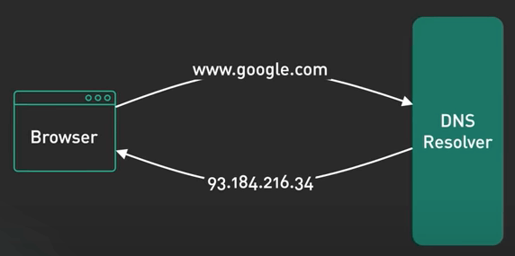
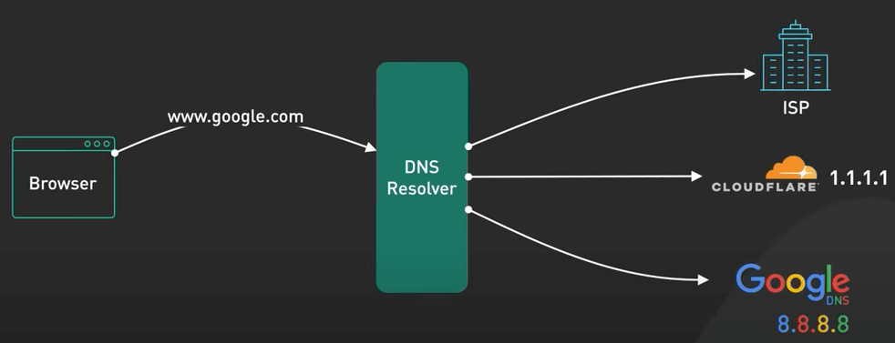
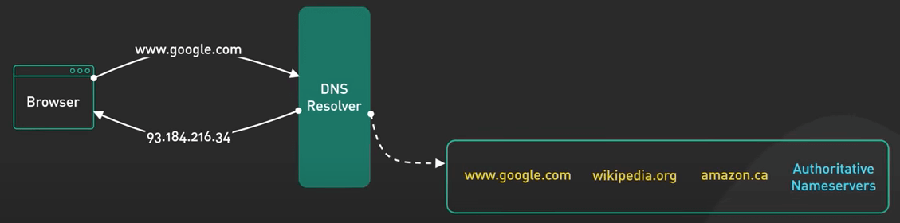
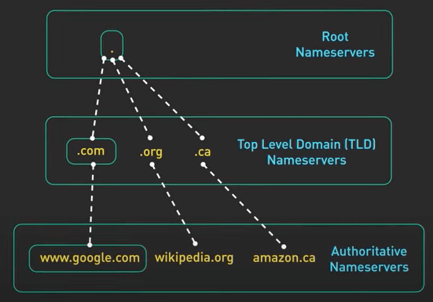
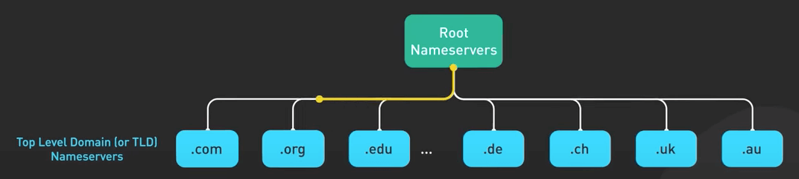
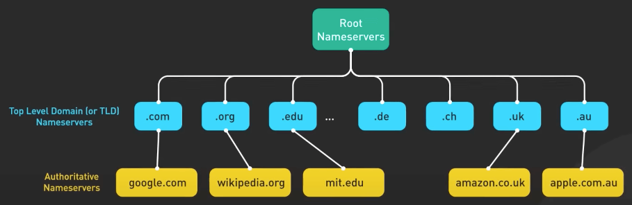
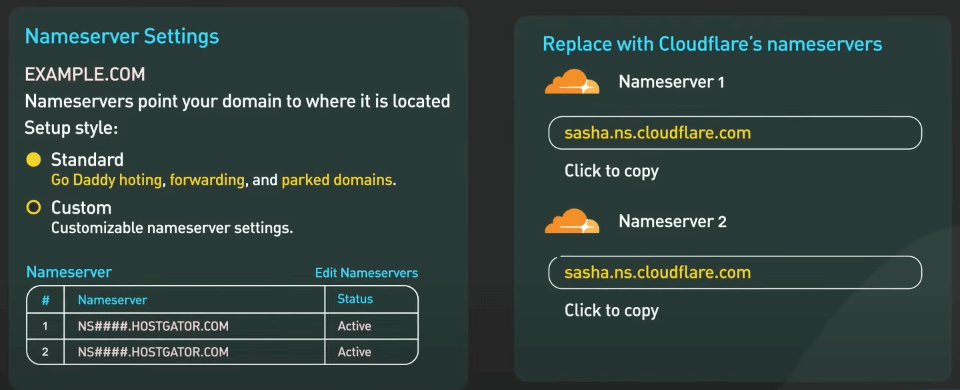
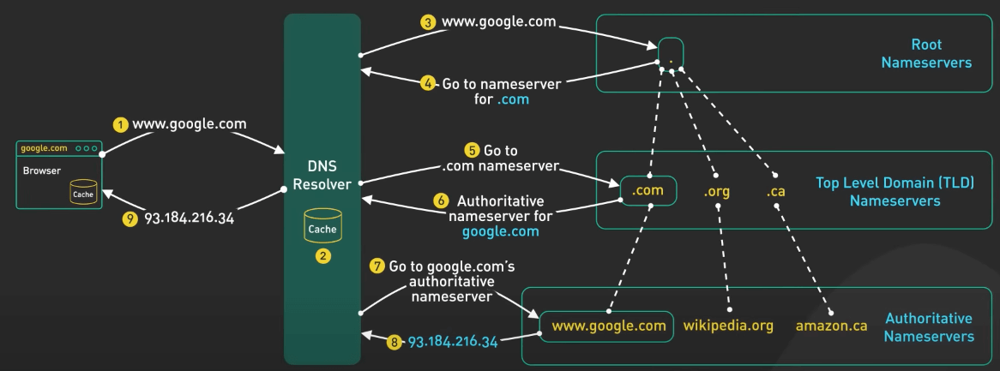

# Những thứ bạn cần biết về DNS

## Nguồn

 [Everything You Need to Know About DNS (Domain Name System)](https://www.youtube.com/watch?v=27r4Bzuj5NQ)

## Khái niệm

**DNS (Domain Name System - hệ thống tên miền)** là một cuốn danh bạ của Internet. Nó dịch các tên miền mà con người có thể đọc được, như `google.com` thành các địa chỉ IP mà máy có thể đọc được. DNS có phần hơi khó hiểu vì có những loại DNS server khác nhau trong hệ thống phân cấp DNS, mỗi loại phục vụ cho một mục đích khác nhau.

{ style="display: block; margin: 0 auto" }

Khi trình duyệt thực hiện truy vấn DNS, trình duyệt đó đang hỏi một **DNS resolver** (trình phân giải DNS). DNS resolver có thể đến từ ISP hoặc từ các nhà cung cấp DNS nổi tiếng như 1.1.1.1 của Cloudflare hay 8.8.8.8 của Google. 

{ style="display: block; margin: 0 auto" }

Nếu DNS resolver không có câu trả lời trong cache của nó, nó sẽ tìm và hỏi đúng authoritative nameserver (máy chủ định danh có thẩm quyền). Authoritative nameserver là máy chủ chứa câu trả lời. Khi cập nhật bản ghi DNS của tên miền, ta đang cập nhật authoritative nameserver của nó.

{ style="display: block; margin: 0 auto" }

Làm sao để DNS resolver tìm ra được authoritative nameserver? Có ba cấp độ chính của authoritative DNS server, bao gồm root name servers (máy chủ định danh gốc), top level domain (TLD) nameservers (máy chủ định danh miền cấp cao nhất) và authoritative nameservers cho các miền (máy chủ định danh có thẩm quyền).

{ style="display: block; margin: 0 auto" }

Root name servers lưu trữ địa chỉ IP của TLD nameserver. Có 13 logical root name servers. Mỗi root name server có một địa chỉ IP được gán cho nó.

{ style="display: block; margin: 0 auto" }

Trên thực tế, có nhiều máy chủ vật lý đằng sau mỗi địa chỉ IP. Thông qua anycast, ta được định tuyến đến máy chủ gần nhất.

Máy chủ định danh TLD lưu địa chỉ IP của các authoritative nameserver cho tất cả các miền trong quyền kiểm soát của chúng. Có nhiều loại tên TLD như `.com`, `.org`, `.edu`. Ngoài ra còn có các mã TLD quốc gia như `.de` và `.uk`.

{ style="display: block; margin: 0 auto" }

Các authoritative nameserver cho tên miền cung cấp các câu trả lời đáng tin cậy và chính xác cho các truy vấn DNS. Khi ta đăng ký một tên miền, nhà đăng ký tên miền sẽ chạy các authoritative nameserver nhưng ta có thể đổi chúng thành các server khác. Các nhà cung cấp đám mây như AWS và Cloudflare có các authoritative nameserver mạnh mẽ. Thiết kế phân cấp này làm cho DNS có độ phân cấp cao và cực kỳ mạnh mẽ.

{ style="display: block; margin: 0 auto" }

## Truy vấn DNS

(1) Người dùng gõ `google.com` vào trình duyệt. Trình duyệt kiểm tra cache của nó. Nếu không có câu trả lời thì trình duyệt sẽ gọi system call để lấy IP. System call cũng có cache riêng. Nếu vẫn không có IP thì nó sẽ hỏi DNS resolver. 

(2) DNS resolver cũng sẽ kiểm tra cache của nó. 

(3) Nếu vẫn không có câu trả lời hoặc câu trả lời hết hạn thì nó sẽ hỏi root name server. Root name server trả lời với danh sách TLD nameserver `.com`.

(4) Lưu ý rằng vì `.com` là một TLD phổ biến nên resolver rất có thể đã cache địa chỉ IP vào những TLD nameserver `.com` đó. 

(5) Sau đó, DNS resolver sẽ hỏi TLD nameserver `.com`

(6) TLD nameserver `.com` trả về các authoritative nameserver của `google.com`. 

(7) + (8) Cuối cùng, DNS resolver hỏi authoritative nameserver của `google.com` và nó trả về địa chỉ IP của `google.com`.

(9) DNS resolver trả địa chỉ IP về cho hệ điều hành, hệ điều hành trả lại địa chỉ đó cho trình duyệt.

{ style="display: block; margin: 0 auto" }

## Cập nhật bản ghi DNS

Quá trình truyền DNS chậm vì có một TTL (thời gian sống - Time-To-Live) trên mỗi bản ghi DNS. Và một số TTL mặc định khá là dài. Ngoài ra, không phải tất cả DNS resolver đều tốt. Có một số không coi trọng TTL. Để giảm rủi ro, có hai bước cần thực hiện.

Đầu tiên, giảm TTL cho bản ghi thành một khoảng thời gian rất ngắn, tầm 1 phút, trước khi quá trình cập nhật xảy ra. Điều này mang lại thời gian để tất cả các máy chủ DNS nhận TTL mới này, và sẽ cho phép bản cập nhật thực tế có hiệu lực dựa trên TTL đó.

Thứ hai, để máy chủ chạy trên địa chỉ IP cũ trong một thời gian. Chỉ ngừng hoạt động máy chủ khi lưu lượng truy cập giảm xuống mức chấp nhận được. Vì một số DNS resolver không coi trọng TTL nên việc này có thể mất chút thời gian.