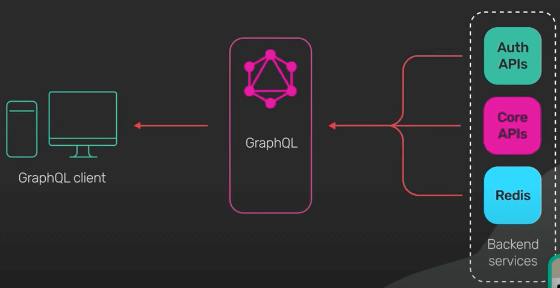
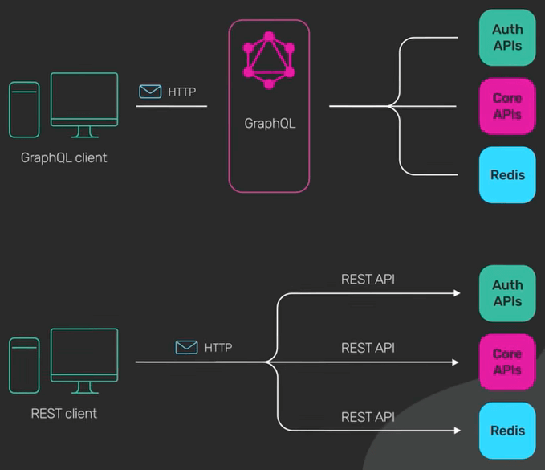
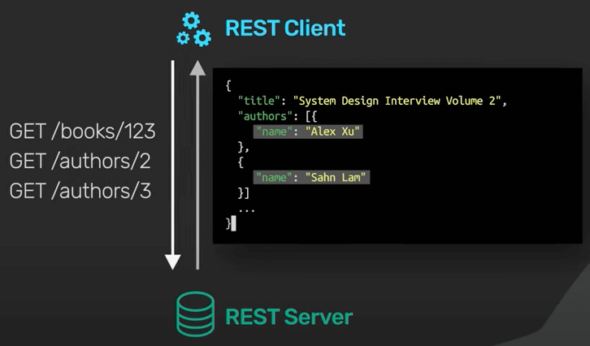
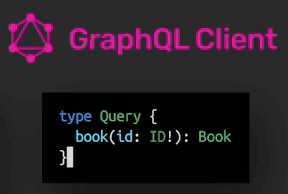
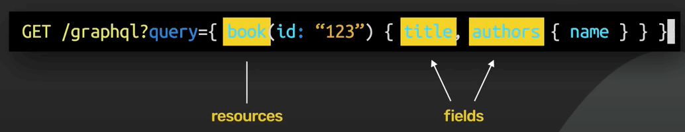

# GraphQL là gì?

## Nguồn

 [What Is GraphQL? REST vs. GraphQL](https://www.youtube.com/watch?v=yWzKJPw_VzM)

## Định nghĩa

**GraphQL** là ngôn ngữ truy vấn dành cho API do Meta phát triển. Nó cung cấp một data schema trong API và cung cấp cho client quyền yêu cầu chính xác những gì client cần.

{ style="display: block; margin: 0 auto" }

GraphQL nằm giữa client và backend service. Nó có thể tổng hợp nhiều yêu cầu tài nguyên vào một truy vấn duy nhất. Nó cũng hỗ trợ mutation và subscription.

**Mutation** là cách GraphQL áp dụng các sửa đổi data cho tài nguyên.

{ style="display: block; margin: 0 auto" }

**Subscription** là cách GraphQL cho client nhận thông báo về các thay đổi trong dữ liệu.

{ style="display: block; margin: 0 auto" }

## So sánh với REST

Trong thực tế, cả GraphQL và REST đều gửi HTTP request và nhận HTTP response.

{ style="display: block; margin: 0 auto" }

Ta sẽ so sánh các thao tác REST và GraphQL đơn giản trông như thế nào.

REST xoay quanh các tài nguyên. Mỗi tài nguyên được xác định bằng một URL. Để lấy thông tin của một cuốn sách từ API của nhà sách, nó có thể giống như thế này. Lưu ý trường tác giả tuỳ vào việc cài đặt. Một số triển khai REST API có thể chia chúng thành các lời gọi REST riêng biệt.

{ style="display: block; margin: 0 auto" }

Tuy nhiên, điều này sẽ khác với GraphQL. Đầu tiên ta xác định các type (loại). Trong ví dụ này ta có các type là Book và Author. Các type này mô tả các loại dữ liệu có sẵn.

{ style="display: block; margin: 0 auto" }

Chúng không chỉ định cách truy xuất dữ liệu qua GraphQL. Để làm được điều đó, ta cần định nghĩa một truy vấn, như sau.

{ style="display: block; margin: 0 auto" }

Giờ ta cần gửi một request đến GraphQL endpoint để lấy data.

{ style="display: block; margin: 0 auto" }

{ style="display: block; margin: 0 auto" }

Như ta thấy thì cả REST và GraphQL đều dùng HTTP. Cả hai đều gửi request qua một URL, và chúng đều có thể trả về một JSON response như nhau. Nhưng đây là sự khác biệt: Với GraphQL, ta chỉ định chính xác các tài nguyên mà ta muốn, và cả những trường mà ta muốn.

{ style="display: block; margin: 0 auto" }

Trong ví dụ về REST, trường Author có sẵn trong response. Nhưng với GraphQL, client quyết định những gì có trong response.

{ style="display: block; margin: 0 auto" }

Điều này mang đến một trong những lợi ích chính của GraphQL. GraphQL không sử dụng URL để chỉ định tài nguyên có sẵn trong API. Thay vào đó nó sử dụng GraphQL schema. Ta có thể gửi một truy vấn phức tạp để lấy data bổ sung theo các quan hệ được xác định trong schema. 

{ style="display: block; margin: 0 auto" }

Điều này sẽ phức tạp hơn nếu ta muốn làm trong REST. Ta sẽ phải thực hiện điều đó ở client với nhiều request. Đây là vấn đề phổ biến dẫn đến N+1 truy vấn.

{ style="display: block; margin: 0 auto" }

## Nhược điểm

Cái hay của REST là ta không cần các thư viện đặc biệt để sử dụng API của người khác. Request có thể được gửi đơn giản bằng cách sử dụng các công cụ phổ biến như cURL hay trình duyệt web.

Ngược lại, GraphQL yêu cầu công cụ hỗ trợ nặng hơn, cả ở phía client và server. Điều này đòi hỏi một khoản đầu tư trước khá lớn. Chi phí này có thể không đáng, đặc biệt là với các API CRUD đơn giản.

Một nhược điểm nữa của GraphQL là nó khó lưu vào cache hơn. REST dùng HTTP GET để lấy data, và HTTP GET thường cache response nhờ có sự giúp đỡ của trình duyệt, CDN, proxy và web server. GraphQL chỉ có một đầu vào duy nhất và dùng HTTP POST theo mặc định. Điều này không tận dụng hết HTTP caching. Nếu cẩn thận, GraphQL có thể được cấu hình để tận dụng tốt hơn HTTP caching, tuy nhiên đây là công việc không hề đơn giản.

Nhược điểm cuối cùng của GraphQL là dù nó cho phép client truy vấn những gì client cần, đây cũng là một mối nguy lớn. Tưởng tượng rằng một app di dộng có một tính năng mới vô tính scan một table quan trọng ở backend service. Điều này có thể khiến DB ngưng hoạt động ngay khi tính năng được cho ra mắt. Tất nhiên ta có cách xử lý rồi, nhưng việc triển khai GraphQL sẽ trở nên khó khăn hơn. Chi phí để phòng ngừa những rủi ro như thế này cần phải được tính đến khi xem xét dùng GraphQL.

Vậy ta có nên dùng GraphQL không? Nói về công nghệ phần mềm là nói về sự đánh đổi, chỉ có phù hợp hay không chứ thực sự không có câu trả lời chính xác.
