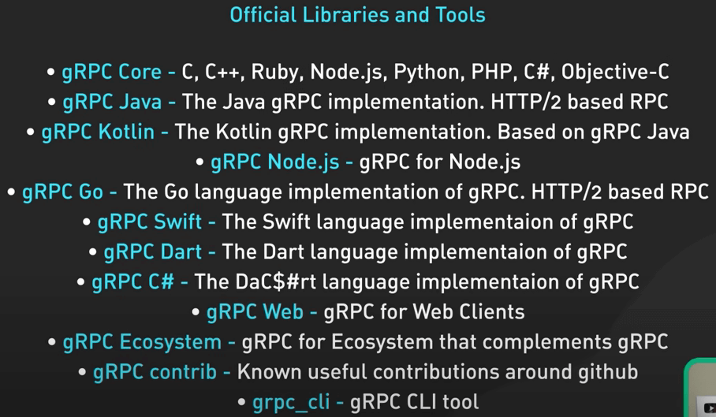
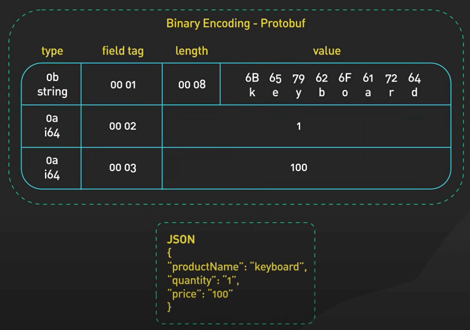
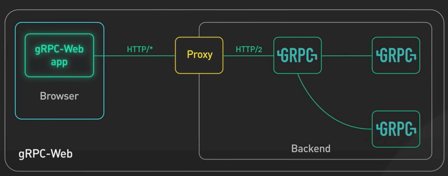

# gRPC là gì?

## Nguồn

 [What is RPC? gRPC Introduction.](https://www.youtube.com/watch?v=gnchfOojMk4)

## Định nghĩa

**gRPC** là một framework lệnh gọi thủ tục từ xa (Remote Procedure Call - RPC) mã nguồn mở do Google tạo ra năm 2016. Đây là bản làm lại của cơ sở hạ tầng RPC nội bộ mà Google đã dùng trong nhiều năm.

Nhưng mà RPC là gì?

Một lệnh gọi thủ tục cục bộ (local procedure call) là lệnh gọi hàm trong một process để thực thi một số code gì đó.

Một lệnh gọi thủ tục từ xa (remote proceduree call) cho phép một máy gọi một số code trên máy khác như thể đó là lệnh gọi hàm cục bộ từ góc nhìn của người dùng.

{ style="display: block; margin: 0 auto" }

gRPC là một triển khai phổ biến của RPC.

Nhiều tổ chức đã sử dụng gRPC làm cơ chế RPC ưu tiên để kết nối một số lượng lớn microservice đang chạy trong và giữa các data center. Tuy nhiên, làm sao gRPC lại phổ biến như vậy?

## Sự phổ biến

### Hệ sinh thái dev mạnh

Đầu tiên, gPRC có một hệ sinh thái dev rất mạnh. Điều này giúp dễ dàng phát triển các API chất lượng cao và có thể mở rộng quy mô tốt. Cốt lõi của hệ sinh thái này là việc sử dụng Protocol Buffers (hay protobuf) làm định dạng trao đổi dữ liệu.

Protocol Buffers là một cơ chế không phụ thuộc vào ngôn ngữ và nền tảng để mã hoá dữ liệu có cấu trúc. gRPC sử dụng Protocol Buffers để mã hoá và gửi dữ liệu qua dây dẫn như bình thường. 

{ style="display: block; margin: 0 auto" }

Mặc dù gRPC có thể hỗ trợ các định dạng mã hoá khác như JSON, Protocol Buffers lại cung cấp một số lợi thế khiến nó trở thành định dạng mã hoá được lựa chọn cho gRPC.

Protocol Buffers hỗ trợ các định nghĩa schema strongly-typed (nghĩa là đi theo kiểu dữ liệu rõ ràng với mỗi trường, ví dụ như string hay integer). Cấu trúc data được xác định trong một file proto.

Protocol Buffers cung cấp nhiều công cụ hỗ trợ để chuyển schema được định nghĩa trong file proto thành các lớp truy cập dữ liệu cho tất cả các ngôn ngữ lập trình phổ biến.

{ style="display: block; margin: 0 auto" }

Một gRPC service cũng được định nghĩa trong file proto bằng cách chỉ định các tham số và kiểu trả về của phương thức gRPC. Công cụ tương tự cũng được sử dụng để sinh code client và server từ file proto. 

{ style="display: block; margin: 0 auto" }

Dev sẽ sử dụng các lớp được sinh ra này trong client để thực hiện các lệnh gọi RPC, và trong server để phục vụ các request RPC.

{ style="display: block; margin: 0 auto" }

Bằng cách hỗ trợ nhiều ngôn ngữ lập trình, client và server có thể độc lập chọn ngôn ngữ lập trình và hệ sinh thái phù hợp nhất cho các use case cụ thể. Thông thường thì điều này không khả thi với hầu hết các RPC framework khác.

{ style="display: block; margin: 0 auto" }

### Hiệu suất cao

Lý do thứ hai khiến gRPC trở nên phổ biến là vì nó có hiệu suất cao ngay từ đầu. Có hai yếu tố góp phần vào hiệu suất của nó.

Thứ nhất, Protocol Buffers là một định dạng mã hoá nhị phân rất hiệu quả. Nó nhanh hơn nhiều so với JSON.

{ style="display: block; margin: 0 auto" }

Thứ hai, gRPC được xây dựng dựa trên HTTP/2 để cung cấp nền tảng hiệu suất cao trên quy mô lớn. Việc sử dụng HTTP/2 mang lại nhiều lợi ích, có một bài viết về các phiên bản HTTP, trong đó có HTTP/2, bạn có thể đọc bài đó.

{ style="display: block; margin: 0 auto" }

gRPC sử dụng các stream trong HTTP/2. Nó cho phép nhiều stream gói tin thông qua một kết nối TCP tồn tại lâu. Điều này cho phép gRPC framework xử lý nhiều lời gọi RPC đồng thời qua một số lượng nhỏ kết nối TCP giữa client và server. Để hiểu cách gRPC hoạt động, ta cùng xem qua một flow từ gRPC client đến gRPC server.

### Ví dụ

Trong ví dụ này, Order Service là gRPC client, và Payment Service là gRPC server. 

(1) Khi Order Service gọi gRPC request đến Payment Service, nó sẽ gọi client code được sinh ra bởi công gcụ gRPC tại thời điểm build.  Client code được sinh ra này được gọi là một client stub.

(2) gRPC mã hóa dữ liệu được truyền cho client stub vào Protocol Buffers và gửi dữ liệu đó đến tầng giao vận.

(3) gRPC gửi dữ liệu qua mạng dưới dạng một luồng HTTP/2 data frame. Nhờ mã hóa nhị phân và tối ưu hóa mạng, gRPC được cho là nhanh hơn 5 lần so với JSON.

(4), (5), (6) Payment Service nhận các gói tin từ mạng, giải mã chúng và gọi server app.

(7), (8), (9) Kết quả trả về từ server app được mã hóa vào Protocol Buffer và gửi đến tầng giao vận.

(10), (11), (12), (13) Order Service nhận các gói tin, giải mã chúng và gửi kết quả đến client app.

{ style="display: block; margin: 0 auto" }

## Hạn chế

Từ ví dụ trên, ta thấy gRPC rất dễ triển khai. Nếu dễ dàng như vậy, sao chúng ta không thấy gRPC được sử dụng nhiều giữa web client và web server?

Nguyên nhân là gRPC dựa vào quyền truy cập cấp thấp hơn vào nguyên mẫu HTTP/2. Hiện không có trình duyệt nào cung cấp mức độ kiểm soát cần thiết đối với các web request để hỗ trợ client gRPC.

Có thể thực hiện lệnh gọi gRPC từ trình duyệt với sự trợ giúp của proxy. Công nghệ này được gọi là gRPC-Web.

Tuy nhiên, tính năng này không hoàn toàn tương thích với gRPC và mức độ sử dụng của nó vẫn thấp so với gRPC.

{ style="display: block; margin: 0 auto" }

## Khi nào sử dụng

gRPC là cơ chế giao tiếp liên dịch vụ được lựa chọn giữa các microservice trong data center.

{ style="display: block; margin: 0 auto" }

Khả năng hỗ trợ lớn của nó đối với nhiều ngôn ngữ lập trình cho phép các dịch vụ chọn ngôn ngữ riêng và hệ sinh thái dev phù hợp với use case của người dùng. Ta cũng có thể thấy việc sử dụng gRPC ngày càng tăng trong các ứng dụng di động.

Tính hiệu quả và hiệu suất của nó có vai trò lớn trong các môi trường bị hạn chế về hiệu năng và băng thông như các thiết bị di động.
