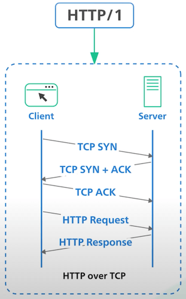
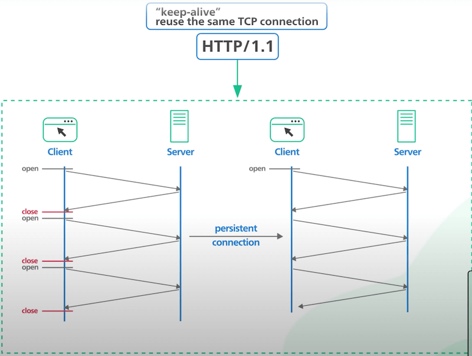
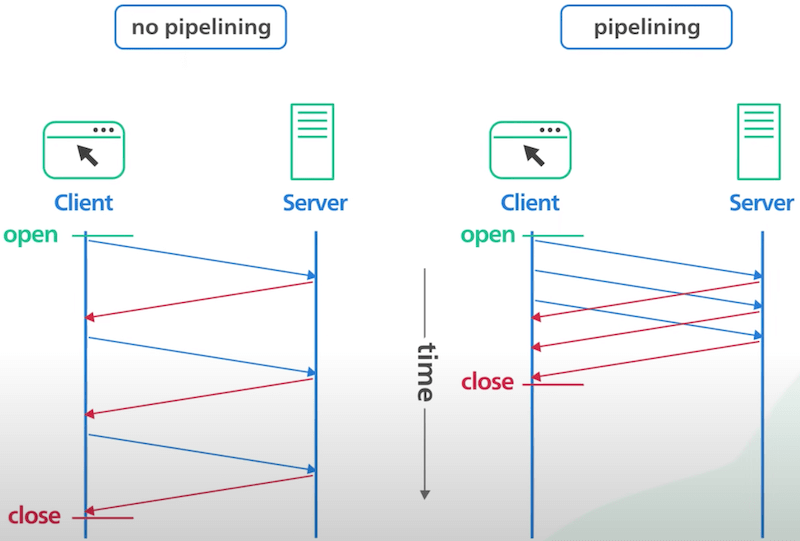
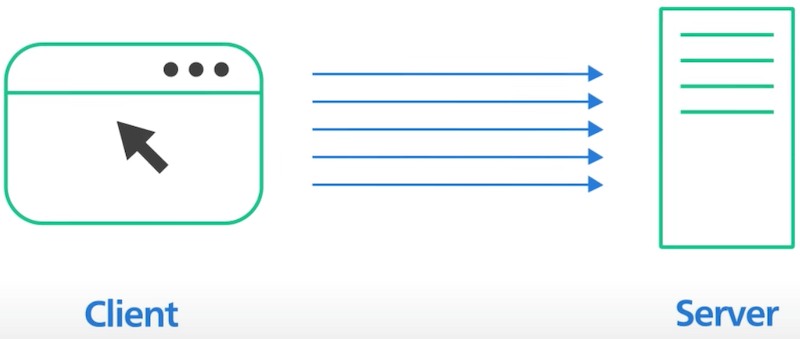
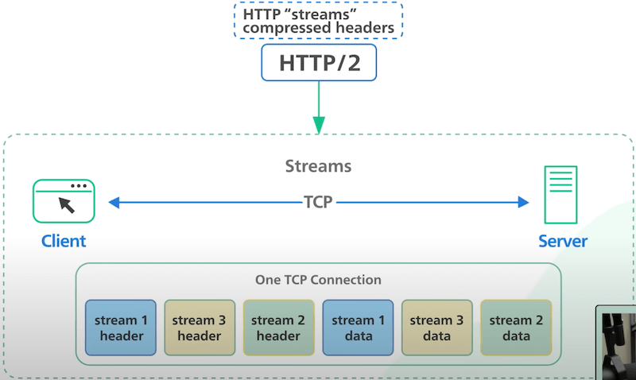
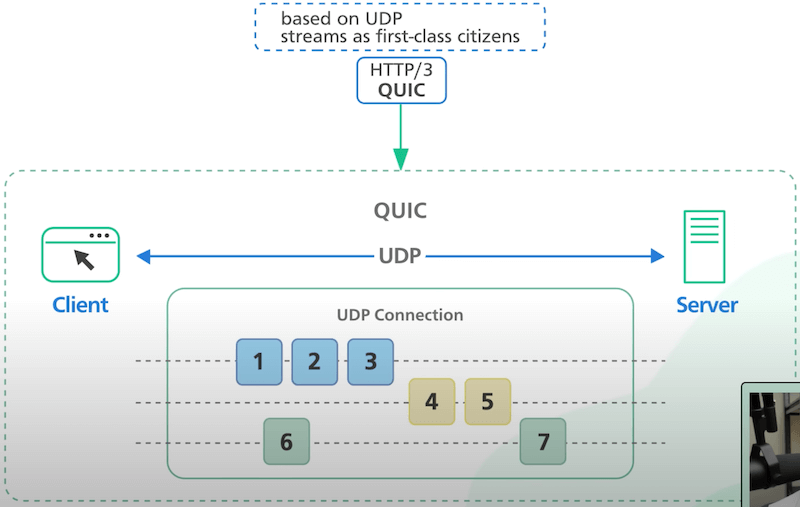
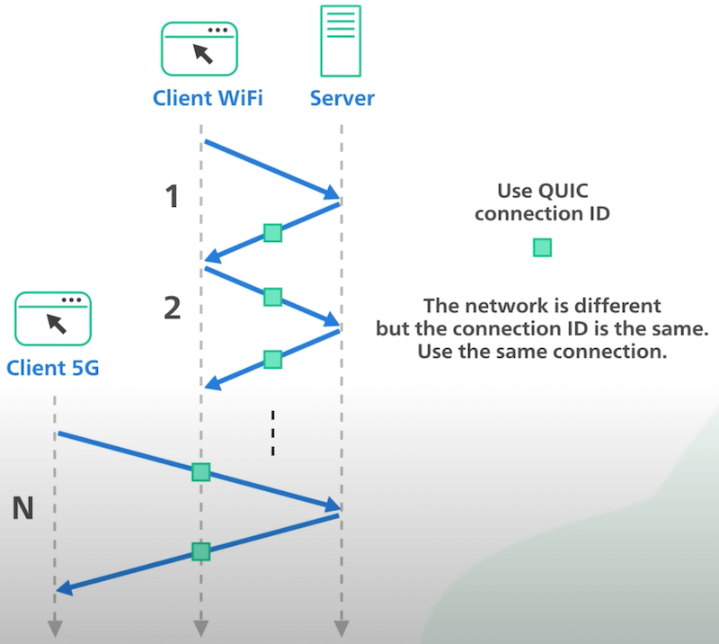

# HTTP/1 đến HTTP/2 đến HTTP/3

## Nguồn

 [HTTP/1 to HTTP/2 to HTTP/3](https://www.youtube.com/watch?v=a-sBfyiXysI)

## HTTP/1

HTTP/1 ra mắt vào năm 1996, được xây dựng dựa trên TCP. Mỗi request đến cùng một server cần một TCP connection riêng.

{ style="display: block; margin: 0 auto; height: 500px" }

## HTTP/1.1

HTTP/1.1 ra mắt sau HTTP/1 một năm, vào năm 1997. Nó giới thiệu cơ chế **keep-alive** nhằm giúp cho một connection có thể được sử dụng lại cho nhiều request. Duy trì kết nối (persistent connection) sẽ giúp giảm độ trễ khi request vì client sẽ không cần phải khởi tạo lại connection cho các request sau đó (bắt tay 3 bước TCP).

{ style="display: block; margin: 0 auto; height: 500px" }

Một chi tiết đáng chú ý nữa của HTTP/1.1 là chức năng **HTTP pipelining**. Về mặt lý thuyết, chức năng này cho phép client gửi nhiều request lên server trước khi đợi mỗi response. Các response phải được nhận theo thứ tự được request để đảm bảo tính chính xác.

Lưu ý là HTTP pipelining khá khó để cài đặt và nhiều proxy server ở giữa không thể nào xử lý pipelining chính xác được. Chức năng này vì thế không còn được hỗ trợ bởi nhiều trình duyệt ngày nay.

{ style="display: block; margin: 0 auto; height: 500px" }

HTTP/1.1 với pipelining còn có một vấn đề nữa được gọi là **head-of-line blocking** (HOL blocking). Đại khái thì với cùng một connection, các request sau sẽ phải đợi request trước đó xong (nghĩa là request đã được gửi lên server). Nếu một request bị chặn vì một số lý do như mất gói tin (packet loss), các request sau nó trên cùng một connection cũng bị ảnh hưởng.

{ style="display: block; margin: 0 auto; height: 500px" }

Để giữ cho kết nối có tốc độ ở mức chấp nhận được, trình duyệt thường giữ nhiều TCP connection đến cùng một server và gửi các request song song với nhau đến server.

{ style="display: block; margin: 0 auto" }

## HTTP/2

HTTP/2 ra đời năm 2015, giới thiệu HTTP streams, giúp ta có thể gửi nhiều stream request đến cùng một server trên chỉ một TCP connection. Khác với HTTP/1.1 pipelining, các stream này độc lập với nhau và không cần phải gửi hay nhận theo bất cứ thứ tự nào. 

HTTP/2 giải quyết được head-of-line blocking của HTTP/1.1 trên tầng ứng dụng nhưng không giải quyết được trên tầng giao vận với TCP.

{ style="display: block; margin: 0 auto" }

Một chi tiết đáng lưu ý của HTTP/2 là khả năng push, giúp cho server có thể gửi nội dung mới cho client khi có thể, mà không cần client phải gửi request để poll.

## HTTP/3

HTTP/3 ra mắt bản thử nghiệm vào năm 2020 và được ra mắt chính thức vào tháng 6 năm 2022. Nó sử dụng một giao thức tên là **QUIC** thay vì dùng TCP. QUIC dựa trên UDP. Nó giới thiệu các stream đóng vai trò quan trọng trên tầng giao vận. Các QUIC stream dùng chung một connection nhanh nên không cần phải bắt tay để tạo connection mới. Trong hầu hết các trường hợp, mất gói tin ảnh hưởng đến một stream sẽ không ảnh hưởng đến các stream khác, nên nó giải quyết được tình trạng head-of-line blocking trên tầng giao vận.

{ style="display: block; margin: 0 auto" }

QUIC được thiết kế cho việc sử dụng nhiều internet trên điện thoại. Người ta thường chuyển mạng trên điện thoại nhiều lần (như từ WiFi sang 4G và ngược lại). Với TCP, việc chuyển mạng này khá là khó chịu và chậm chạp.

QUIC sử dụng một concept gọi là **connection ID**, giúp cho connection có thể di chuyển giữa các địa chỉ IP và giao diện mạng dễ dàng, nhanh chóng và đáng tin cậy.

{ style="display: block; margin: 0 auto; height: 500px" }

Dù HTTP/3 mới chỉ được chuẩn hoá, nó đã được dùng bởi 25% số website và được hỗ trợ bởi nhiều trình duyệt trên thị trường.
